# 保序回归

## 1 保序回归

&emsp;&emsp;保序回归解决了下面的问题：给定包含`n`个数据点的序列 `y_1,y_2,...,y_n` , 怎样通过一个单调的序列 `beta_1,beta_2,...,beta_n` 来归纳这个问题。形式上，这个问题就是为了找到

<div  align="center">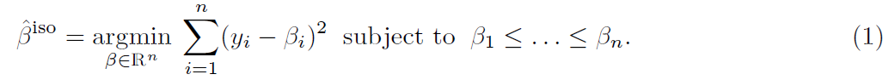</div><br>

&emsp;&emsp;大部分时候，我们会在括号前加上权重`w_i`。解决这个问题的一个方法就是 `pool adjacent violators algorithm(PAVA)` 算法。粗略的讲，`PAVA`算法的过程描述如下：

&emsp;&emsp;我们从左边的`y_1`开始，右移`y_1`直到我们遇到第一个违例(`violation`)即`y_i < y_i+1`，然后，我们用违例之前的所有`y`的平方替换这些`y`，以满足单调性。我们继续这个过程，直到我们最后到达`y_n`。

## 2 近似保序

&emsp;&emsp;给定一个序列`y_1,y_2,...,y_n`，我们寻找一个近似单调估计，考虑下面的问题

<div  align="center">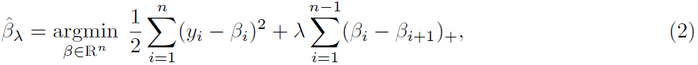</div><br>

&emsp;&emsp;在上式中，`X_+`表示正数部分，即`X_+ = X.1 (x>0)`。这是一个凸优化问题，处罚项处罚违反单调性（即`beta_i > beta_i+1`）的邻近对。

&emsp;&emsp;在公式（2）中，隐含着一个假设，即使用等距的网格测量数据点。如果情况不是这样，那么可以修改惩罚项为下面的形式

<div  align="center">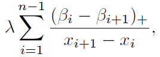</div><br>

&emsp;&emsp;`x_i`表示`y_i`测量得到的值。

## 3 近似保序算法流程

&emsp;&emsp;这个算法是标准`PAVA`算法的修改版本，它并不从数据的左端开始，而是在需要时连接相邻的点，以产生近似保序最优的顺序。相比一下，`PAVA`对中间的序列并不特别感兴趣，只关心最后的序列。

&emsp;&emsp;有下面一个引理成立。

<div  align="center">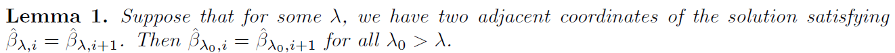</div><br>

&emsp;&emsp;这个引理证明的事实极大地简化了近似保序解路径（`solution path`）的构造。假设在参数值为`lambda`的情况下，有`K_lambda`个连接块，我们用`A_1,A_2,..,A_K_lambda`表示。这样我们可以重写（2）为如下（3）的形式。

<div  align="center">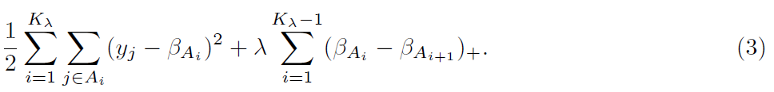</div><br>

&emsp;&emsp;上面的公式，对`beta`求偏导，可以得到下面的次梯度公式。通过这个公式即可以求得`beta`。

<div  align="center">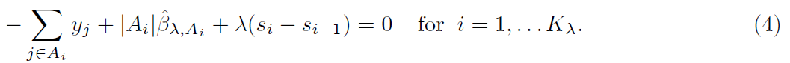</div><br>

&emsp;&emsp;为了符合方便，令`s_0 = s_K_lambda = 0`。并且，

<div  align="center">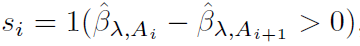</div><br>

&emsp;&emsp;现在假设，当`lambda`在一个区间内增长时，组`A_1,A_2,...,A_K_lambda`不会改变。我们可以通过相应的`lambda`区分（4）。

<div  align="center">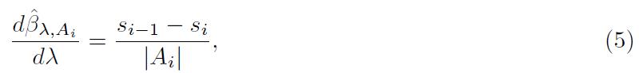</div><br>

&emsp;&emsp;这个公式的值本身是一个常量，它意味着上式的`beta`是`lambda`的线性函数。

&emsp;&emsp;随着`lambda`的增长，方程（5）将连续的给出解决方案的斜率直到组`A_1,A_2,...,A_K_lambda`改变。更加引理1，只有两个组合并时，这才会发生。`m_i`表示斜率，那么对于每一个`i=1,...,K_lambda - 1`，`A_i`和`A_i+1`合并之后得到的公式如下

<div  align="center">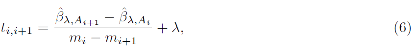</div><br>

&emsp;&emsp;因此我们可以一直移动，直到`lambda` “下一个”值的到来

<div  align="center">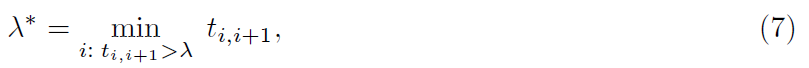</div><br>

&emsp;&emsp;并且合并`A_i^star`和`A_i^star+1`,其中

<div  align="center">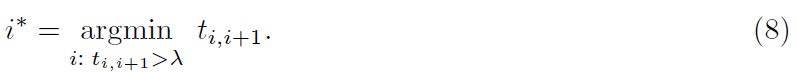</div><br>

&emsp;&emsp;注意，可能有超过一对组别到达了这个最小值，在这种情况下，会组合所有满足条件的组别。公式（7）和（8）成立的条件是`t_i,i+1`大于`lambda`，如果没有`t_i,i+1`大于`lambda`，说明没有组别可以合并，算法将会终止。

&emsp;&emsp;**算法的流程如下**：

- 初始时，`lambda=0`，`K_lambda=n`,`A_i={i},i=1,2,...,n`。对于每个i，解是`beta_lambda,i = y_i`

- 重复下面过程

&emsp;&emsp;**1、**通过公式（5）计算每个组的斜率`m_i`

&emsp;&emsp;**2、**通过公式（6）计算没对相邻组的碰撞次数`t_i,i+1`

&emsp;&emsp;**3、**如果`t_i,i+1 < lambda`，终止

&emsp;&emsp;**4、**计算公式（7）中的临界点`lambda^star`,并根据斜率更新解

<div  align="center">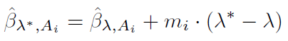</div><br>

&emsp;&emsp;对于每个`i`，根据公式（8）合并合适的组别（所以`K_lambda^star = K_lambda - 1`），并设置`lambda = lambda^star`。

## 4 源码分析

&emsp;&emsp;在`1.6.x`版本中，并没有实现近似保序回归，后续会实现。现在我们只介绍一般的保序回归算法实现。

### 4.1 实例

```scala
import org.apache.spark.mllib.regression.{IsotonicRegression, IsotonicRegressionModel}
val data = sc.textFile("data/mllib/sample_isotonic_regression_data.txt")
// 创建（label, feature, weight） tuples ，权重默认设置为1.0
val parsedData = data.map { line =>
  val parts = line.split(',').map(_.toDouble)
  (parts(0), parts(1), 1.0)
}
// Split data into training (60%) and test (40%) sets.
val splits = parsedData.randomSplit(Array(0.6, 0.4), seed = 11L)
val training = splits(0)
val test = splits(1)
// Create isotonic regression model from training data.
// Isotonic parameter defaults to true so it is only shown for demonstration
val model = new IsotonicRegression().setIsotonic(true).run(training)
// Create tuples of predicted and real labels.
val predictionAndLabel = test.map { point =>
  val predictedLabel = model.predict(point._2)
  (predictedLabel, point._1)
}
// Calculate mean squared error between predicted and real labels.
val meanSquaredError = predictionAndLabel.map { case (p, l) => math.pow((p - l), 2) }.mean()
println("Mean Squared Error = " + meanSquaredError)
```

### 4.2 训练过程分析

&emsp;&emsp;`parallelPoolAdjacentViolators`方法用于实现保序回归的训练。`parallelPoolAdjacentViolators`方法的代码如下：

```scala
private def parallelPoolAdjacentViolators(
      input: RDD[(Double, Double, Double)]): Array[(Double, Double, Double)] = {
    val parallelStepResult = input
      //以（feature，label）为key进行排序
      .sortBy(x => (x._2, x._1))
      .glom()//合并不同分区的数据为一个数组
      .flatMap(poolAdjacentViolators)
      .collect()
      .sortBy(x => (x._2, x._1)) // Sort again because collect() doesn't promise ordering.
    poolAdjacentViolators(parallelStepResult)
  }
```
&emsp;&emsp;`parallelPoolAdjacentViolators`方法的主要实现是`poolAdjacentViolators`方法，该方法主要的实现过程如下：

```scala
var i = 0
val len = input.length
while (i < len) {
     var j = i
     //找到破坏单调性的元祖的index
     while (j < len - 1 && input(j)._1 > input(j + 1)._1) {
       j = j + 1
     }
     // 如果没有找到违规点，移动到下一个数据点
     if (i == j) {
       i = i + 1
     } else {
       // 否则用pool方法处理违规的节点
       // 并且检查pool之后，之前处理过的节点是否违反了单调性约束
       while (i >= 0 && input(i)._1 > input(i + 1)._1) {
          pool(input, i, j)
          i = i - 1
       }
       i = j
     }
}
```

&emsp;&emsp;`pool`方法的实现如下所示。

```scala
def pool(input: Array[(Double, Double, Double)], start: Int, end: Int): Unit = {
      //取得i到j之间的元组组成的子序列
      val poolSubArray = input.slice(start, end + 1)
      //求子序列sum（label * w）之和
      val weightedSum = poolSubArray.map(lp => lp._1 * lp._3).sum
      //求权重之和
      val weight = poolSubArray.map(_._3).sum
      var i = start
      //子区间的所有元组标签相同，即拥有相同的预测
      while (i <= end) {
        //修改标签值为两者之商
        input(i) = (weightedSum / weight, input(i)._2, input(i)._3)
        i = i + 1
      }
}
```
&emsp;&emsp;经过上文的处理之后，`input`根据中的`label`和`feature`均是按升序排列。对于拥有相同预测的点，我们只保留两个特征边界点。

```scala
val compressed = ArrayBuffer.empty[(Double, Double, Double)]
var (curLabel, curFeature, curWeight) = input.head
var rightBound = curFeature
def merge(): Unit = {
    compressed += ((curLabel, curFeature, curWeight))
    if (rightBound > curFeature) {
        compressed += ((curLabel, rightBound, 0.0))
    }
}
i = 1
while (i < input.length) {
    val (label, feature, weight) = input(i)
    if (label == curLabel) {
       //权重叠加
       curWeight += weight
       rightBound = feature
    } else {//如果标签不同，合并
       merge()
       curLabel = label
       curFeature = feature
       curWeight = weight
       rightBound = curFeature
    }
    i += 1
}
merge()
```

&emsp;&emsp;最后将训练的结果保存为模型。

```scala
//标签集
val predictions = if (isotonic) pooled.map(_._1) else pooled.map(-_._1)
//特征集
val boundaries = pooled.map(_._2)
new IsotonicRegressionModel(boundaries, predictions, isotonic)
```

### 4.3 预测过程分析

```scala
def predict(testData: Double): Double = {
    def linearInterpolation(x1: Double, y1: Double, x2: Double, y2: Double, x: Double): Double = {
      y1 + (y2 - y1) * (x - x1) / (x2 - x1)
    }
    //二分查找index
    val foundIndex = binarySearch(boundaries, testData)
    val insertIndex = -foundIndex - 1
    // Find if the index was lower than all values,
    // higher than all values, in between two values or exact match.
    if (insertIndex == 0) {
      predictions.head
    } else if (insertIndex == boundaries.length){
      predictions.last
    } else if (foundIndex < 0) {
      linearInterpolation(
        boundaries(insertIndex - 1),
        predictions(insertIndex - 1),
        boundaries(insertIndex),
        predictions(insertIndex),
        testData)
    } else {
      predictions(foundIndex)
    }
  }
```
&emsp;&emsp;当测试数据精确匹配一个边界，那么返回相应的特征。如果测试数据比所有边界都大或者小，那么分别返回第一个和最后一个特征。当测试数据位于两个边界之间，使用`linearInterpolation`方法计算特征。
这个方法是线性内插法。


