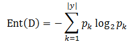
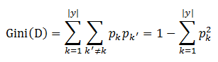
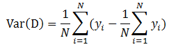
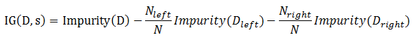

# 决策树

## 1 决策树理论

### 1.1 什么是决策树

&emsp;&emsp;所谓决策树，顾名思义，是一种树，一种依托于策略抉择而建立起来的树。机器学习中，决策树是一个预测模型；他代表的是对象属性与对象值之间的一种映射关系。
树中每个节点表示某个对象，而每个分叉路径则代表的某个可能的属性值，从根节点到叶节点所经历的路径对应一个判定测试序列。决策树仅有单一输出，若欲有复数输出，可以建立独立的决策树以处理不同输出。

### 1.2 决策树学习流程

&emsp;&emsp;决策树学习的主要目的是为了产生一棵泛化能力强的决策树。其基本流程遵循简单而直接的“分而治之”的策略。它的流程实现如下所示：

```
输入：训练集 D={(x_1,y_1),(x_2,y_2),...,(x_m,y_m)};
      属性集 A={a_1,a_2,...,a_d}
过程：函数GenerateTree(D,A)
1: 生成节点node；
2: if D中样本全属于同一类别C then
3:    将node标记为C类叶节点，并返回
4: end if
5: if A为空 OR D中样本在A上取值相同 then
6:    将node标记为叶节点，其类别标记为D中样本数量最多的类，并返回
7: end if
8: 从A中选择最优划分属性 a*；    //每个属性包含若干取值，这里假设有v个取值
9: for a* 的每个值a*_v do
10:    为node生成一个分支，令D_v表示D中在a*上取值为a*_v的样本子集；
11:    if D_v 为空 then
12:       将分支节点标记为叶节点，其类别标记为D中样本最多的类，并返回
13:    else
14:       以GenerateTree(D_v,A\{a*})为分支节点
15:    end if
16: end for
```
&emsp;&emsp;决策树的生成是一个递归的过程。有三种情况会导致递归的返回：（1）当前节点包含的样本全属于同一个类别。（2）当前属性值为空，或者所有样本在所有属性上取相同的值。
（3）当前节点包含的样本集合为空。

&emsp;&emsp;在第（2）中情形下，我们把当前节点标记为叶节点，并将其类别设定为该节点所含样本最多的类别；在第（3）中情形下，同样把当前节点标记为叶节点，
但是将其类别设定为其父节点所含样本最多的类别。这两种处理实质不同，前者利用当前节点的后验分布，后者则把父节点的样本分布作为当前节点的先验分布。

### 1.3 决策树的构造

&emsp;&emsp;构造决策树的关键步骤是分裂属性（即确定属性的不同取值，对应上面流程中的`a_v`）。所谓分裂属性就是在某个节点处按照某一属性的不同划分构造不同的分支，其目标是让各个分裂子集尽可能地“纯”。
尽可能“纯”就是尽量让一个分裂子集中待分类项属于同一类别。分裂属性分为三种不同的情况：

- 1、属性是离散值且不要求生成二叉决策树。此时用属性的每一个划分作为一个分支。

- 2、属性是离散值且要求生成二叉决策树。此时使用属性划分的一个子集进行测试，按照“属于此子集”和“不属于此子集”分成两个分支。

- 3、属性是连续值。此时确定一个值作为分裂点`split_point`，按照`>split_point`和`<=split_point`生成两个分支。

### 1.4 划分选择

&emsp;&emsp;在决策树算法中，如何选择最优划分属性是最关键的一步。一般而言，随着划分过程的不断进行，我们希望决策树的分支节点所包含的样本尽可能属于同一类别，即节点的“纯度(purity)”越来越高。
有几种度量样本集合纯度的指标。在`MLlib`中，信息熵和基尼指数用于决策树分类，方差用于决策树回归。

#### 1.4.1 信息熵

&emsp;&emsp;信息熵是度量样本集合纯度最常用的一种指标，假设当前样本集合`D`中第`k`类样本所占的比例为`p_k`，则`D`的信息熵定义为：

<div  align="center"></div>

&emsp;&emsp;`Ent(D)`的值越小，则`D`的纯度越高。

#### 1.4.2 基尼系数

&emsp;&emsp;采用和上式相同的符号，基尼系数可以用来度量数据集`D`的纯度。

<div  align="center"></div>

&emsp;&emsp;直观来说，`Gini(D)`反映了从数据集`D`中随机取样两个样本，其类别标记不一致的概率。因此，`Gini(D)`越小，则数据集`D`的纯度越高。

#### 1.4.3 方差

&emsp;&emsp;`MLlib`中使用方差来度量纯度。如下所示

<div  align="center"></div>

#### 1.4.4 信息增益

&emsp;&emsp;假设切分大小为`N`的数据集`D`为两个数据集`D_left`和`D_right`，那么信息增益可以表示为如下的形式。

<div  align="center"></div>

&emsp;&emsp;一般情况下，信息增益越大，则意味着使用属性`a`来进行划分所获得的纯度提升越大。因此我们可以用信息增益来进行决策树的划分属性选择。即流程中的第8步。

### 1.5 决策树的优缺点

**决策树的优点：**

- 1 决策树易于理解和解释；
- 2 能够同时处理数据型和类别型属性；
- 3 决策树是一个白盒模型，给定一个观察模型，很容易推出相应的逻辑表达式；
- 4 在相对较短的时间内能够对大型数据作出效果良好的结果；
- 5 比较适合处理有缺失属性值的样本。

**决策树的缺点：**

- 1 对那些各类别数据量不一致的数据，在决策树种，信息增益的结果偏向那些具有更多数值的特征；
- 2 容易过拟合；
- 3 忽略了数据集中属性之间的相关性。


## 2 实例与源码分析

### 2.1 实例

&emsp;&emsp;下面的例子用于分类。

```scala
import org.apache.spark.mllib.tree.DecisionTree
import org.apache.spark.mllib.tree.model.DecisionTreeModel
import org.apache.spark.mllib.util.MLUtils
// Load and parse the data file.
val data = MLUtils.loadLibSVMFile(sc, "data/mllib/sample_libsvm_data.txt")
// Split the data into training and test sets (30% held out for testing)
val splits = data.randomSplit(Array(0.7, 0.3))
val (trainingData, testData) = (splits(0), splits(1))
// Train a DecisionTree model.
//  Empty categoricalFeaturesInfo indicates all features are continuous.
val numClasses = 2
val categoricalFeaturesInfo = Map[Int, Int]()
val impurity = "gini"
val maxDepth = 5
val maxBins = 32
val model = DecisionTree.trainClassifier(trainingData, numClasses, categoricalFeaturesInfo,
  impurity, maxDepth, maxBins)
// Evaluate model on test instances and compute test error
val labelAndPreds = testData.map { point =>
  val prediction = model.predict(point.features)
  (point.label, prediction)
}
val testErr = labelAndPreds.filter(r => r._1 != r._2).count().toDouble / testData.count()
println("Test Error = " + testErr)
println("Learned classification tree model:\n" + model.toDebugString)
```

&emsp;&emsp;下面的例子用于回归。

```scala
import org.apache.spark.mllib.tree.DecisionTree
import org.apache.spark.mllib.tree.model.DecisionTreeModel
import org.apache.spark.mllib.util.MLUtils
// Load and parse the data file.
val data = MLUtils.loadLibSVMFile(sc, "data/mllib/sample_libsvm_data.txt")
// Split the data into training and test sets (30% held out for testing)
val splits = data.randomSplit(Array(0.7, 0.3))
val (trainingData, testData) = (splits(0), splits(1))
// Train a DecisionTree model.
//  Empty categoricalFeaturesInfo indicates all features are continuous.
val categoricalFeaturesInfo = Map[Int, Int]()
val impurity = "variance"
val maxDepth = 5
val maxBins = 32
val model = DecisionTree.trainRegressor(trainingData, categoricalFeaturesInfo, impurity,
  maxDepth, maxBins)
// Evaluate model on test instances and compute test error
val labelsAndPredictions = testData.map { point =>
  val prediction = model.predict(point.features)
  (point.label, prediction)
}
val testMSE = labelsAndPredictions.map{ case (v, p) => math.pow(v - p, 2) }.mean()
println("Test Mean Squared Error = " + testMSE)
println("Learned regression tree model:\n" + model.toDebugString)
```

### 2.2 源码分析

&emsp;&emsp;在`MLlib`中，决策树的实现和随机森林的实现是在一起的。随机森林实现中，当树的个数为1时，它的实现即为决策树的实现。

```scala
def run(input: RDD[LabeledPoint]): DecisionTreeModel = {
    //树个数为1
    val rf = new RandomForest(strategy, numTrees = 1, featureSubsetStrategy = "all", seed = 0)
    val rfModel = rf.run(input)
    rfModel.trees(0)
  }
```

&emsp;&emsp;这里的`strategy`是`Strategy`的实例，它包含如下信息：

```scala
/**
 * Stores all the configuration options for tree construction
 * @param algo  Learning goal.  Supported:
 *              [[org.apache.spark.mllib.tree.configuration.Algo.Classification]],
 *              [[org.apache.spark.mllib.tree.configuration.Algo.Regression]]
 * @param impurity Criterion used for information gain calculation.
 *                 Supported for Classification: [[org.apache.spark.mllib.tree.impurity.Gini]],
 *                  [[org.apache.spark.mllib.tree.impurity.Entropy]].
 *                 Supported for Regression: [[org.apache.spark.mllib.tree.impurity.Variance]].
 * @param maxDepth Maximum depth of the tree.
 *                 E.g., depth 0 means 1 leaf node; depth 1 means 1 internal node + 2 leaf nodes.
 * @param numClasses Number of classes for classification.
 *                                    (Ignored for regression.)
 *                                    Default value is 2 (binary classification).
 * @param maxBins Maximum number of bins used for discretizing continuous features and
 *                for choosing how to split on features at each node.
 *                More bins give higher granularity.
 * @param quantileCalculationStrategy Algorithm for calculating quantiles.  Supported:
 *                             [[org.apache.spark.mllib.tree.configuration.QuantileStrategy.Sort]]
 * @param categoricalFeaturesInfo A map storing information about the categorical variables and the
 *                                number of discrete values they take. For example, an entry (n ->
 *                                k) implies the feature n is categorical with k categories 0,
 *                                1, 2, ... , k-1. It's important to note that features are
 *                                zero-indexed.
 * @param minInstancesPerNode Minimum number of instances each child must have after split.
 *                            Default value is 1. If a split cause left or right child
 *                            to have less than minInstancesPerNode,
 *                            this split will not be considered as a valid split.
 * @param minInfoGain Minimum information gain a split must get. Default value is 0.0.
 *                    If a split has less information gain than minInfoGain,
 *                    this split will not be considered as a valid split.
 * @param maxMemoryInMB Maximum memory in MB allocated to histogram aggregation. Default value is
 *                      256 MB.
 * @param subsamplingRate Fraction of the training data used for learning decision tree.
 * @param useNodeIdCache If this is true, instead of passing trees to executors, the algorithm will
 *                      maintain a separate RDD of node Id cache for each row.
 * @param checkpointInterval How often to checkpoint when the node Id cache gets updated.
 *                           E.g. 10 means that the cache will get checkpointed every 10 updates. If
 *                           the checkpoint directory is not set in
 *                           [[org.apache.spark.SparkContext]], this setting is ignored.
 */
class Strategy @Since("1.3.0") (
    @Since("1.0.0") @BeanProperty var algo: Algo,//选择的算法，有分类和回归两种选择
    @Since("1.0.0") @BeanProperty var impurity: Impurity,//纯度有熵、基尼系数、方差三种选择
    @Since("1.0.0") @BeanProperty var maxDepth: Int,//树的最大深度
    @Since("1.2.0") @BeanProperty var numClasses: Int = 2,//分类数
    @Since("1.0.0") @BeanProperty var maxBins: Int = 32,//最大子树个数
    @Since("1.0.0") @BeanProperty var quantileCalculationStrategy: QuantileStrategy = Sort,
    //保存类别变量以及相应的离散值。一个entry (n ->k) 表示特征n属于k个类别，分别是0,1,...,k-1
    @Since("1.0.0") @BeanProperty var categoricalFeaturesInfo: Map[Int, Int] = Map[Int, Int](),
    @Since("1.2.0") @BeanProperty var minInstancesPerNode: Int = 1,
    @Since("1.2.0") @BeanProperty var minInfoGain: Double = 0.0,
    @Since("1.0.0") @BeanProperty var maxMemoryInMB: Int = 256,
    @Since("1.2.0") @BeanProperty var subsamplingRate: Double = 1,
    @Since("1.2.0") @BeanProperty var useNodeIdCache: Boolean = false,
    @Since("1.2.0") @BeanProperty var checkpointInterval: Int = 10) extends Serializable
```

&emsp;&emsp;决策树的实现我们在[随机森林](../组合树/随机森林/random-forests.md)专题介绍。这里我们只需要知道，当随机森林的树个数为1时，它即为决策树，
并且此时，树的训练所用的特征是全部特征，而不是随机选择的部分特征。即`featureSubsetStrategy = "all"`。


