# 朴素贝叶斯

## 1 介绍

&emsp;&emsp;朴素贝叶斯是一种构建分类器的简单方法。该分类器模型会给问题实例分配用特征值表示的类标签，类标签取自有限集合。它不是训练这种分类器的单一算法，而是一系列基于相同原理的算法：**所有朴素贝叶斯分类器都假定样本每个特征与其他特征都不相关**。
举个例子，如果一种水果其具有红，圆，直径大概3英寸等特征，该水果可以被判定为是苹果。尽管这些特征相互依赖或者有些特征由其他特征决定，然而朴素贝叶斯分类器认为这些属性在判定该水果是否为苹果的概率分布上独立的。

&emsp;&emsp;对于某些类型的概率模型，在有监督学习的样本集中能获取得非常好的分类效果。在许多实际应用中，朴素贝叶斯模型参数估计使用最大似然估计方法；换言之，在不用贝叶斯概率或者任何贝叶斯模型的情况下，朴素贝叶斯模型也能奏效。

&emsp;&emsp;尽管是带着这些朴素思想和过于简单化的假设，但朴素贝叶斯分类器在很多复杂的现实情形中仍能够取得相当好的效果。尽管如此，有论文证明更新的方法（如提升树和随机森林）的性能超过了贝叶斯分类器。

&emsp;&emsp;朴素贝叶斯分类器的一个优势在于只需要根据少量的训练数据估计出必要的参数（变量的均值和方差）。由于变量独立假设，只需要估计各个变量，而不需要确定整个协方差矩阵。

### 1.1 朴素贝叶斯的优缺点

- 优点：学习和预测的效率高，且易于实现；在数据较少的情况下仍然有效，可以处理多分类问题。

- 缺点：分类效果不一定很高，特征独立性假设会是朴素贝叶斯变得简单，但是会牺牲一定的分类准确率。

## 2 朴素贝叶斯概率模型

&emsp;&emsp;理论上，概率模型分类器是一个条件概率模型。

<div  align="center">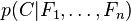</div>

&emsp;&emsp;独立的类别变量`C`有若干类别，条件依赖于若干特征变量`F_1,F_2,...,F_n`。但问题在于如果特征数量`n`较大或者每个特征能取大量值时，基于概率模型列出概率表变得不现实。所以我们修改这个模型使之变得可行。 贝叶斯定理有以下式子：

<div  align="center">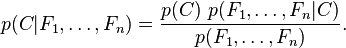</div>

&emsp;&emsp;实际中，我们只关心分式中的分子部分，因为分母不依赖于`C`而且特征`F_i`的值是给定的，于是分母可以认为是一个常数。这样分子就等价于联合分布模型。
重复使用链式法则，可将该式写成条件概率的形式，如下所示：

<div  align="center">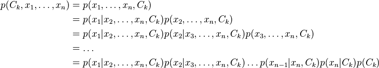</div>

&emsp;&emsp;现在“朴素”的条件独立假设开始发挥作用:假设每个特征`F_i`对于其他特征`F_j`是条件独立的。这就意味着

<div  align="center">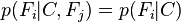</div>

&emsp;&emsp;所以联合分布模型可以表达为

<div  align="center">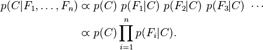</div>

&emsp;&emsp;这意味着上述假设下，类变量`C`的条件分布可以表达为：

<div  align="center">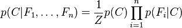</div>

&emsp;&emsp;其中`Z`是一个只依赖与`F_1,...,F_n`等的缩放因子，当特征变量的值已知时是一个常数。

### 从概率模型中构造分类器

&emsp;&emsp;讨论至此为止我们导出了独立分布特征模型，也就是朴素贝叶斯概率模型。朴素贝叶斯分类器包括了这种模型和相应的决策规则。一个普通的规则就是选出最有可能的那个：这就是大家熟知的最大后验概率（`MAP`）决策准则。相应的分类器便是如下定义的公式：

<div  align="center">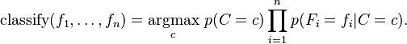</div>

## 3 参数估计

&emsp;&emsp;所有的模型参数都可以通过训练集的相关频率来估计。常用方法是概率的最大似然估计。类的先验概率`P(C)`可以通过假设各类等概率来计算`（先验概率 = 1 / (类的数量)）`，或者通过训练集的各类样本出现的次数来估计`（A类先验概率=（A类样本的数量）/(样本总数)）`。

&emsp;&emsp;对于类条件概率`P(X|c)`来说，直接根据样本出现的频率来估计会很困难。在现实应用中样本空间的取值往往远远大于训练样本数，也就是说，很多样本取值在训练集中根本没有出现，直接使用频率来估计`P(x|c)`不可行，因为"未被观察到"和"出现概率为零"是不同的。
为了估计特征的分布参数，我们要先假设训练集数据满足某种分布或者非参数模型。

&emsp;&emsp;这种假设称为朴素贝叶斯分类器的事件模型（`event model`）。对于离散的特征数据（例如文本分类中使用的特征），多元分布和伯努利分布比较流行。

### 3.1 高斯朴素贝叶斯

&emsp;&emsp;如果要处理的是连续数据，一种通常的假设是这些连续数值服从高斯分布。例如，假设训练集中有一个连续属性`x`。我们首先对数据根据类别分类，然后计算每个类别中`x`的均值和方差。令`mu_c`表示为`x`在`c`类上的均值，令`sigma^2_c`为`x`在`c`类上的方差。在给定类中某个值的概率
`P(x=v|c)`，可以通过将`v`表示为均值为`mu_c`，方差为`sigma^2_c`的正态分布计算出来。

<div  align="center">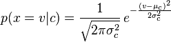</div>

&emsp;&emsp;处理连续数值问题的另一种常用的技术是通过离散化连续数值的方法。通常，当训练样本数量较少或者是精确的分布已知时，通过概率分布的方法是一种更好的选择。
在大量样本的情形下离散化的方法表现更优，因为大量的样本可以学习到数据的分布。由于朴素贝叶斯是一种典型的用到大量样本的方法（越大计算量的模型可以产生越高的分类精确度），所以朴素贝叶斯方法都用到离散化方法，而不是概率分布估计的方法。

### 3.2 多元朴素贝叶斯

&emsp;&emsp;在多元事件模型中，样本（特征向量）表示特定事件发生的次数。用`p_i`表示事件`i`发生的概率。特征向量`X=(x_1,x_2,...,x_n)`是一个`histogram`，其中`x_i`表示事件`i`在特定的对象中被观察到的次数。事件模型通常用于文本分类。相应的`x_i`表示词`i`在单个文档中出现的次数。
`X`的似然函数如下所示：

<div  align="center">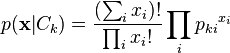</div>

&emsp;&emsp;当用对数空间表达时，多元朴素贝叶斯分类器变成了线性分类器。

<div  align="center">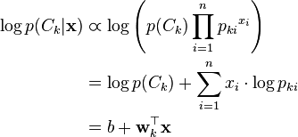</div>

&emsp;&emsp;如果一个给定的类和特征值在训练集中没有一起出现过，那么基于频率的估计下该概率将为0。这将是一个问题。因为与其他概率相乘时将会把其他概率的信息统统去除。所以常常要求要对每个小类样本的概率估计进行修正，以保证不会出现有为0的概率出现。常用到的平滑就是加1平滑（也称拉普拉斯平滑）。

&emsp;&emsp;根据参考文献【2】，我们以文本分类的训练和测试为例子来介绍多元朴素贝叶斯的训练和测试过程。如下图所示。

<div  align="center"></div>

&emsp;&emsp;这里的`CondProb[t][c]`即上文中的`P(x|C)`。`T_ct`表示类别为`c`的文档中`t`出现的次数。`+1`就是平滑手段。


### 3.3 伯努利朴素贝叶斯

&emsp;&emsp;在多变量伯努利事件模型中，特征是独立的二值变量。和多元模型一样，这个模型在文本分类中也非常流行。它的似然函数如下所示。

<div  align="center">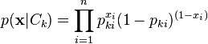</div>

&emsp;&emsp;其中`p_ki`表示类别`C_k`生成`term` `w_i`的概率。这个模型通常用于短文本分类。

&emsp;&emsp;根据参考文献【2】，我们以文本分类的训练和测试为例子来介绍多元朴素贝叶斯的训练和测试过程。如下图所示。

<div  align="center"></div>


## 4 源码分析

&emsp;&emsp;`MLlib`中实现了多元朴素贝叶斯和伯努利朴素贝叶斯。下面先看看朴素贝叶斯的使用实例。

### 4.1 实例

```scala
import org.apache.spark.mllib.classification.{NaiveBayes, NaiveBayesModel}
import org.apache.spark.mllib.linalg.Vectors
import org.apache.spark.mllib.regression.LabeledPoint
//读取并处理数据
val data = sc.textFile("data/mllib/sample_naive_bayes_data.txt")
val parsedData = data.map { line =>
  val parts = line.split(',')
  LabeledPoint(parts(0).toDouble, Vectors.dense(parts(1).split(' ').map(_.toDouble)))
}
// 切分数据为训练数据和测试数据
val splits = parsedData.randomSplit(Array(0.6, 0.4), seed = 11L)
val training = splits(0)
val test = splits(1)
//训练模型
val model = NaiveBayes.train(training, lambda = 1.0, modelType = "multinomial")
//测试数据
val predictionAndLabel = test.map(p => (model.predict(p.features), p.label))
val accuracy = 1.0 * predictionAndLabel.filter(x => x._1 == x._2).count() / test.count()
```

### 4.2 训练模型

&emsp;&emsp;从上文的原理分析我们可以知道，朴素贝叶斯模型的训练过程就是获取概率`p(C)`和`p(F|C)`的过程。根据`MLlib`的源码，我们可以将训练过程分为两步。
第一步是聚合计算每个标签对应的`term`的频率，第二步是迭代计算`p(C)`和`p(F|C)`。

- **1** 计算每个标签对应的`term`的频率

```scala
val aggregated = data.map(p => (p.label, p.features)).combineByKey[(Long, DenseVector)](
      createCombiner = (v: Vector) => {
        if (modelType == Bernoulli) {
          requireZeroOneBernoulliValues(v)
        } else {
          requireNonnegativeValues(v)
        }
        (1L, v.copy.toDense)
      },
      mergeValue = (c: (Long, DenseVector), v: Vector) => {
        requireNonnegativeValues(v)
        //c._2 = v*1 + c._2
        BLAS.axpy(1.0, v, c._2)
        (c._1 + 1L, c._2)
      },
      mergeCombiners = (c1: (Long, DenseVector), c2: (Long, DenseVector)) => {
        BLAS.axpy(1.0, c2._2, c1._2)
        (c1._1 + c2._1, c1._2)
      }
    //根据标签进行排序
    ).collect().sortBy(_._1)
```

&emsp;&emsp;这里我们需要先了解`createCombiner`函数的作用。`createCombiner`的作用是将原`RDD`中的`Vector`类型转换为`(long,Vector)`类型。

&emsp;&emsp;如果`modelType`为`Bernoulli`，那么`v`中包含的值只能为0或者1。如果`modelType`为`multinomial`，那么`v`中包含的值必须大于0。

```scala
//值非负
val requireNonnegativeValues: Vector => Unit = (v: Vector) => {
      val values = v match {
        case sv: SparseVector => sv.values
        case dv: DenseVector => dv.values
      }
      if (!values.forall(_ >= 0.0)) {
        throw new SparkException(s"Naive Bayes requires nonnegative feature values but found $v.")
      }
}
//值为0或者1
val requireZeroOneBernoulliValues: Vector => Unit = (v: Vector) => {
      val values = v match {
        case sv: SparseVector => sv.values
        case dv: DenseVector => dv.values
      }
      if (!values.forall(v => v == 0.0 || v == 1.0)) {
        throw new SparkException(
          s"Bernoulli naive Bayes requires 0 or 1 feature values but found $v.")
      }
}
```
&emsp;&emsp;`mergeValue`函数的作用是将新来的`Vector`累加到已有向量中，并更新词率。`mergeCombiners`则是合并不同分区的`(long,Vector)`数据。
通过这个函数，我们就找到了每个标签对应的词频率，并得到了标签对应的所有文档的累加向量。

- **2** 迭代计算`p(C)`和`p(F|C)`

```scala
//标签数
val numLabels = aggregated.length
//文档数
var numDocuments = 0L
aggregated.foreach { case (_, (n, _)) =>
  numDocuments += n
}
//特征维数
val numFeatures = aggregated.head match { case (_, (_, v)) => v.size }
val labels = new Array[Double](numLabels)
//表示logP(C)
val pi = new Array[Double](numLabels)
//表示logP(F|C)
val theta = Array.fill(numLabels)(new Array[Double](numFeatures))
val piLogDenom = math.log(numDocuments + numLabels * lambda)
var i = 0
aggregated.foreach { case (label, (n, sumTermFreqs)) =>
      labels(i) = label
      //训练步骤的第5步
      pi(i) = math.log(n + lambda) - piLogDenom
      val thetaLogDenom = modelType match {
        case Multinomial => math.log(sumTermFreqs.values.sum + numFeatures * lambda)
        case Bernoulli => math.log(n + 2.0 * lambda)
        case _ =>
          // This should never happen.
          throw new UnknownError(s"Invalid modelType: $modelType.")
      }
      //训练步骤的第6步
      var j = 0
      while (j < numFeatures) {
        theta(i)(j) = math.log(sumTermFreqs(j) + lambda) - thetaLogDenom
        j += 1
      }
      i += 1
    }
```
&emsp;&emsp;这段代码计算上文提到的`p(C)`和`p(F|C)`。这里的`lambda`表示平滑因子，一般情况下，我们将它设置为1。代码中，`p(c_i)=log (n+lambda)/(numDocs+numLabels*lambda)`，这对应上文训练过程的第5步`prior(c)=N_c/N`。

&emsp;&emsp;根据`modelType`类型的不同，`p(F|C)`的实现则不同。当`modelType`为`Multinomial`时，`P(F|C)=T_ct/sum(T_ct)`，这里`sum(T_ct)=sumTermFreqs.values.sum + numFeatures * lambda`。这对应多元朴素贝叶斯训练过程的第10步。
当`modelType`为`Bernoulli`时，`P(F|C)=(N_ct+lambda)/(N_c+2*lambda)`。这对应伯努利贝叶斯训练算法的第8行。

&emsp;&emsp;需要注意的是，代码中的所有计算都是取对数计算的。

## 4.3 预测数据

```scala
override def predict(testData: Vector): Double = {
    modelType match {
      case Multinomial =>
        labels(multinomialCalculation(testData).argmax)
      case Bernoulli =>
        labels(bernoulliCalculation(testData).argmax)
    }
}
```

&emsp;&emsp;预测也是根据`modelType`的不同作不同的处理。当`modelType`为`Multinomial`时，调用`multinomialCalculation`函数。

```scala
private def multinomialCalculation(testData: Vector) = {
    val prob = thetaMatrix.multiply(testData)
    BLAS.axpy(1.0, piVector, prob)
    prob
  }
```
&emsp;&emsp;这里的`thetaMatrix`和`piVector`即上文中训练得到的`P(F|C)`和`P(C)`，根据`P(C|F)=P(F|C)*P(C)`即可以得到预测数据归属于某类别的概率。
注意，这些概率都是基于对数结果计算的。

&emsp;&emsp;当`modelType`为`Bernoulli`时，实现代码略有不同。

```scala
private def bernoulliCalculation(testData: Vector) = {
    testData.foreachActive((_, value) =>
      if (value != 0.0 && value != 1.0) {
        throw new SparkException(
          s"Bernoulli naive Bayes requires 0 or 1 feature values but found $testData.")
      }
    )
    val prob = thetaMinusNegTheta.get.multiply(testData)
    BLAS.axpy(1.0, piVector, prob)
    BLAS.axpy(1.0, negThetaSum.get, prob)
    prob
  }
```

&emsp;&emsp;当词在训练数据中出现与否处理的过程不同。伯努利模型测试过程中，如果词存在，需要计算`log(condprob)`，否在需要计算`log(1-condprob)`，`condprob`为`P(f|c)=exp(theta)`。所以预先计算`log(1-exp(theta))`以及它的和可以应用到预测过程。这里`thetaMatrix`表示`logP(F|C)`，`negTheta`代表`log(1-exp(theta))=log(1-condprob)`，`thetaMinusNegTheta`代表`log(theta - log(1-exp(theta)))`。

```scala
 private val (thetaMinusNegTheta, negThetaSum) = modelType match {
    case Multinomial => (None, None)
    case Bernoulli =>
      val negTheta = thetaMatrix.map(value => math.log(1.0 - math.exp(value)))
      val ones = new DenseVector(Array.fill(thetaMatrix.numCols){1.0})
      val thetaMinusNegTheta = thetaMatrix.map { value =>
        value - math.log(1.0 - math.exp(value))
      }
      (Option(thetaMinusNegTheta), Option(negTheta.multiply(ones)))
    case _ =>
      // This should never happen.
      throw new UnknownError(s"Invalid modelType: $modelType.")
  }
```

&emsp;&emsp;这里`math.exp(value)`将对数概率恢复成真实的概率。

# 参考文献

【1】[朴素贝叶斯分类器](https://zh.wikipedia.org/wiki/%E6%9C%B4%E7%B4%A0%E8%B4%9D%E5%8F%B6%E6%96%AF%E5%88%86%E7%B1%BB%E5%99%A8)

【2】[Naive Bayes text classification](http://nlp.stanford.edu/IR-book/html/htmledition/naive-bayes-text-classification-1.html)

【3】[The Bernoulli model](http://nlp.stanford.edu/IR-book/html/htmledition/the-bernoulli-model-1.html)
