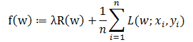
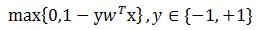
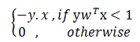
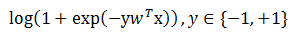
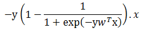
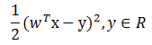
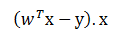
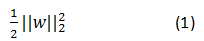
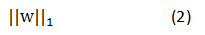

# 线性模型

# 1 数学描述

&emsp;&emsp;许多标准的机器学习算法可以归结为凸优化问题。例如，找到凸函数`f`的一个极小值的任务，这个凸函数依赖于可变向量`w`（在`spark`源码中，一般表示为`weights`）。
形式上，我们可以将其当作一个凸优化问题${min}_{w}f(w)$。它的目标函数可以表示为如下公式 **(1)**：

 

&emsp;&emsp;在上式中，向量`x`表示训练数据集，`y`表示它相应的标签，也是我们想预测的值。如果`L(w;x,y)`可以表示为${w}^{T}x$和`y`的函数，
我们称这个方法为线性的。`spark.mllib`中的几种分类算法和回归算法可以归为这一类。

&emsp;&emsp;目标函数`f`包含两部分：正则化(`regularizer `)，用于控制模型的复杂度；损失函数，用于度量模型的误差。损失函数`L(w;.)`是一个典型的基于`w`的凸函数。固定的正则化参数`gamma`定义了两种目标的权衡（`trade-off`）,
这两个目标分别是最小化损失(训练误差)以及最小化模型复杂度(为了避免过拟合)。

## 1.1 损失函数

&emsp;&emsp;下面介绍`spark.mllib`中提供的几种损失函数以及它们的梯度或子梯度(`sub-gradient`)。

- **hinge loss**

&emsp;&emsp;`hinge`损失的损失函数`L(w;x,y)`以及梯度分别是：

 

 

- **logistic  loss**

&emsp;&emsp;`logistic`损失的损失函数`L(w;x,y)`以及梯度分别是：

 

 

- **squared   loss**

&emsp;&emsp;`squared`损失的损失函数`L(w;x,y)`以及梯度分别是：

 

 

## 1.2 正则化

&emsp;&emsp;正则化的目的是为了简化模型及防止过拟合。`spark.mllib`中提供了下面的正则化方法。

| 问题       | 规则化函数R(w)   | 梯度 |
| ------------- |:-------------:|:-------------:|
| Zero       | 0 | 0 |
| L2         | 如下公式(1) | w |
| L1         | 如下公式(2) | sign(w) |
| elastic net | alpha * L1 +(1-alpha) * L2 | alpha * sign(w) + (1-alpha) * w |

 

 

&emsp;&emsp;在上面的表格中，`sign(w)`是一个向量，它由`w`中的所有实体的信号量`(+1,-1)`组成。`L2`问题往往比`L1`问题更容易解决，那是因为`L2`是平滑的。然而，`L1`可以使权重矩阵更稀疏，
从而构建更小以及更可判断的模型，模型的可判断性在特征选择中很有用。

# 2 分类

&emsp;&emsp;分类的目的就是将数据切分为不同的类别。最一般的分类类型是二分类，即有两个类别，通常称为正和负。如果类别数超过两个，我们称之为多分类。`spark.ml`提供了两种线性方法用于分类：线性支持向量机以及逻辑回归。
线性支持向量机仅仅支持二分类，逻辑回归既支持二分类也支持多分类。对所有的方法，`spark.ml`支持`L1`和`L2`正则化。分类算法的详细介绍见下面的链接。

* [SVMs(支持向量机)](支持向量机/lsvm.md)
* [逻辑回归](逻辑回归/logic-regression.md)
* [线性回归](回归/regression.md)

