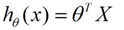
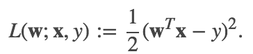

# 线性回归

&emsp;&emsp;回归问题的条件或者说前提是
- 1） 收集的数据
- 2） 假设的模型，即一个函数，这个函数里含有未知的参数，通过学习，可以估计出参数。然后利用这个模型去预测/分类新的数据。

## 1 线性回归的概念

&emsp;&emsp;线性回归假设特征和结果都满足线性。即不大于一次方。收集的数据中，每一个分量，就可以看做一个特征数据。每个特征至少对应一个未知的参数。这样就形成了一个线性模型函数，向量表示形式：

<div  align="center"></div>

&emsp;&emsp;这个就是一个组合问题，已知一些数据，如何求里面的未知参数，给出一个最优解。 一个线性矩阵方程，直接求解，很可能无法直接求解。有唯一解的数据集，微乎其微。

&emsp;&emsp;基本上都是解不存在的超定方程组。因此，需要退一步，将参数求解问题，转化为求最小误差问题，求出一个最接近的解，这就是一个松弛求解。

&emsp;&emsp;在回归问题中，线性最小二乘是最普遍的求最小误差的形式。它的损失函数就是二乘损失。如下公式**（1）**所示：

<div  align="center"></div>

&emsp;&emsp;根据使用的正则化类型的不同，回归算法也会有不同。普通最小二乘和线性最小二乘回归不使用正则化方法。`ridge`回归使用`L2`正则化，`lasso`回归使用`L1`正则化。

## 2 线性回归源码分析

### 2.1 实例

```scala
import org.apache.spark.ml.regression.LinearRegression

// 加载数据
val training = spark.read.format("libsvm")
  .load("data/mllib/sample_linear_regression_data.txt")

val lr = new LinearRegression()
  .setMaxIter(10)
  .setRegParam(0.3)
  .setElasticNetParam(0.8)

// 训练模型
val lrModel = lr.fit(training)

// 打印线性回归的系数和截距
println(s"Coefficients: ${lrModel.coefficients} Intercept: ${lrModel.intercept}")

// 打印统计信息
val trainingSummary = lrModel.summary
println(s"numIterations: ${trainingSummary.totalIterations}")
println(s"objectiveHistory: [${trainingSummary.objectiveHistory.mkString(",")}]")
trainingSummary.residuals.show()
println(s"RMSE: ${trainingSummary.rootMeanSquaredError}")
println(s"r2: ${trainingSummary.r2}")
```

### 2.2 代码实现

#### 2.2.1 参数配置

&emsp;&emsp;根据上面的例子，我们先看看线性回归可以配置的参数。

```scala
// 正则化参数，默认为0，对应于优化算法中的lambda
def setRegParam(value: Double): this.type = set(regParam, value)
setDefault(regParam -> 0.0)

// 是否使用截距，默认使用
def setFitIntercept(value: Boolean): this.type = set(fitIntercept, value)
setDefault(fitIntercept -> true)

// 在训练模型前，是否对训练特征进行标准化。默认使用。
// 模型的相关系数总是会返回原来的空间（不是标准化后的标准空间），所以这个过程对用户透明
def setStandardization(value: Boolean): this.type = set(standardization, value)
setDefault(standardization -> true)

// ElasticNet混合参数
// 当改值为0时，使用L2惩罚；当该值为1时，使用L1惩罚；当值在(0,1)之间时，使用L1惩罚和L2惩罚的组合
def setElasticNetParam(value: Double): this.type = set(elasticNetParam, value)
setDefault(elasticNetParam -> 0.0)

// 最大迭代次数，默认是100
def setMaxIter(value: Int): this.type = set(maxIter, value)
setDefault(maxIter -> 100)

// 收敛阈值
def setTol(value: Double): this.type = set(tol, value)
setDefault(tol -> 1E-6)

// 样本权重列的列名。默认不设置。当不设置时，样本权重为1
def setWeightCol(value: String): this.type = set(weightCol, value)

// 最优化求解方法。实际有l-bfgs和带权最小二乘两种求解方法。
// 当特征列数量超过4096时，默认使用l-bfgs求解，否则使用带权最小二乘求解。
def setSolver(value: String): this.type = {
    require(Set("auto", "l-bfgs", "normal").contains(value),
      s"Solver $value was not supported. Supported options: auto, l-bfgs, normal")
    set(solver, value)
  }
setDefault(solver -> "auto")

// 设置treeAggregate的深度。默认情况下深度为2
// 当特征维度较大或者分区较多时，可以调大该深度
def setAggregationDepth(value: Int): this.type = set(aggregationDepth, value)
setDefault(aggregationDepth -> 2)
```
#### 2.2.2 训练模型

&emsp;&emsp;`train`方法训练模型并返回`LinearRegressionModel`。方法的开始是处理数据集，生成需要的`RDD`。

```scala
// Extract the number of features before deciding optimization solver.
val numFeatures = dataset.select(col($(featuresCol))).first().getAs[Vector](0).size
val w = if (!isDefined(weightCol) || $(weightCol).isEmpty) lit(1.0) else col($(weightCol))

val instances: RDD[Instance] = dataset.select(
    col($(labelCol)), w, col($(featuresCol))).rdd.map {
    case Row(label: Double, weight: Double, features: Vector) =>
        Instance(label, weight, features)  // 标签，权重，特征向量
}
```

##### 2.2.2.1 带权最小二乘

&emsp;&emsp;当样本的特征维度小于4096并且`solver`为`auto`或者`solver`为`normal`时，用`WeightedLeastSquares`求解，这是因为`WeightedLeastSquares`只需要处理一次数据，
求解效率更高。`WeightedLeastSquares`的介绍见[带权最小二乘](../../../最优化算法/WeightsLeastSquares.md)。

```scala
if (($(solver) == "auto" &&
    numFeatures <= WeightedLeastSquares.MAX_NUM_FEATURES) || $(solver) == "normal") {
    
    val optimizer = new WeightedLeastSquares($(fitIntercept), $(regParam),
        elasticNetParam = $(elasticNetParam), $(standardization), true,
        solverType = WeightedLeastSquares.Auto, maxIter = $(maxIter), tol = $(tol))
    val model = optimizer.fit(instances)
    // When it is trained by WeightedLeastSquares, training summary does not
    // attach returned model.
    val lrModel = copyValues(new LinearRegressionModel(uid, model.coefficients, model.intercept))
    val (summaryModel, predictionColName) = lrModel.findSummaryModelAndPredictionCol()
    val trainingSummary = new LinearRegressionTrainingSummary(
        summaryModel.transform(dataset),
        predictionColName,
        $(labelCol),
        $(featuresCol),
        summaryModel,
        model.diagInvAtWA.toArray,
        model.objectiveHistory)

    return lrModel.setSummary(Some(trainingSummary))
}
```

##### 2.2.2.2 拟牛顿法

- <b>1 统计样本指标</b>

&emsp;&emsp;当样本的特征维度大于4096并且`solver`为`auto`或者`solver`为`l-bfgs`时，使用拟牛顿法求解最优解。使用拟牛顿法求解之前我们
需要先统计特征和标签的相关信息。

```scala
val (featuresSummarizer, ySummarizer) = {
      val seqOp = (c: (MultivariateOnlineSummarizer, MultivariateOnlineSummarizer),
        instance: Instance) =>
          (c._1.add(instance.features, instance.weight),
            c._2.add(Vectors.dense(instance.label), instance.weight))

      val combOp = (c1: (MultivariateOnlineSummarizer, MultivariateOnlineSummarizer),
        c2: (MultivariateOnlineSummarizer, MultivariateOnlineSummarizer)) =>
          (c1._1.merge(c2._1), c1._2.merge(c2._2))

      instances.treeAggregate(
        new MultivariateOnlineSummarizer, new MultivariateOnlineSummarizer
      )(seqOp, combOp, $(aggregationDepth))
}
```

&emsp;&emsp;这里`MultivariateOnlineSummarizer`继承自`MultivariateStatisticalSummary`，它使用在线（`online`）的方式统计样本的均值、方差、最小值、最大值等指标。
具体的实现见`MultivariateOnlineSummarizer`。统计好指标之后，根据指标的不同选择不同的处理方式。

&emsp;&emsp; 如果标签的方差为0，并且不管我们是否选择使用偏置，系数均为0，此时并不需要训练模型。

```scala
 val coefficients = Vectors.sparse(numFeatures, Seq())  // 系数为空
 val intercept = yMean
 val model = copyValues(new LinearRegressionModel(uid, coefficients, intercept))
```

&emsp;&emsp;获取标签方差，特征均值、特征方差以及正则化项。

```scala
 // if y is constant (rawYStd is zero), then y cannot be scaled. In this case
 // setting yStd=abs(yMean) ensures that y is not scaled anymore in l-bfgs algorithm.
 val yStd = if (rawYStd > 0) rawYStd else math.abs(yMean)
 val featuresMean = featuresSummarizer.mean.toArray
 val featuresStd = featuresSummarizer.variance.toArray.map(math.sqrt)
 val bcFeaturesMean = instances.context.broadcast(featuresMean)
 val bcFeaturesStd = instances.context.broadcast(featuresStd)
 
 val effectiveRegParam = $(regParam) / yStd
 val effectiveL1RegParam = $(elasticNetParam) * effectiveRegParam
 val effectiveL2RegParam = (1.0 - $(elasticNetParam)) * effectiveRegParam
```

- <b>2 定义损失函数</b>

```scala
val costFun = new LeastSquaresCostFun(instances, yStd, yMean, $(fitIntercept),
      $(standardization), bcFeaturesStd, bcFeaturesMean, effectiveL2RegParam, $(aggregationDepth))
```
&emsp;&emsp;损失函数`LeastSquaresCostFun`继承自`DiffFunction[T]`，用于表示最小二乘损失。它返回一个点L2正则化后的损失和梯度。
它使用方法`def calculate(coefficients: BDV[Double]): (Double, BDV[Double])`计算损失和梯度。这里`coefficients`表示一个特定的点。

```scala
override def calculate(coefficients: BDV[Double]): (Double, BDV[Double]) = {
    val coeffs = Vectors.fromBreeze(coefficients)
    val bcCoeffs = instances.context.broadcast(coeffs)
    val localFeaturesStd = bcFeaturesStd.value

    val leastSquaresAggregator = {
      val seqOp = (c: LeastSquaresAggregator, instance: Instance) => c.add(instance)
      val combOp = (c1: LeastSquaresAggregator, c2: LeastSquaresAggregator) => c1.merge(c2)

      instances.treeAggregate(
        new LeastSquaresAggregator(bcCoeffs, labelStd, labelMean, fitIntercept, bcFeaturesStd,
          bcFeaturesMean))(seqOp, combOp, aggregationDepth)
    }

    val totalGradientArray = leastSquaresAggregator.gradient.toArray //梯度
    bcCoeffs.destroy(blocking = false)

    val regVal = if (effectiveL2regParam == 0.0) {
      0.0
    } else {
      var sum = 0.0
      coeffs.foreachActive { (index, value) =>
        // 下面的代码计算正则化项的损失和梯度，并将梯度添加到totalGradientArray中
        sum += {
          if (standardization) {
            totalGradientArray(index) += effectiveL2regParam * value
            value * value
          } else {
            if (localFeaturesStd(index) != 0.0) {
              // 如果`standardization`为false，我们仍然标准化数据加快收敛速度。获得的结果，我们需要执行反标准化
              // ，来得到正确的目标函数
              val temp = value / (localFeaturesStd(index) * localFeaturesStd(index))
              totalGradientArray(index) += effectiveL2regParam * temp
              value * temp
            } else {
              0.0
            }
          }
        }
      }
      0.5 * effectiveL2regParam * sum
    }

    (leastSquaresAggregator.loss + regVal, new BDV(totalGradientArray))
  }
```

&emsp;&emsp;这里`LeastSquaresAggregator`用来计算最小二乘损失函数的梯度和损失。为了在优化过程中提高收敛速度，防止大方差
的特征在训练时产生过大的影响，将特征缩放到单元方差并且减去均值，可以减少条件数。当使用截距进行训练时，处在缩放后空间的目标函数
如下：

<blockquote>
$$
\begin{align}
L &= 1/2N ||\sum_i w_i(x_i - \bar{x_i}) / \hat{x_i} - (y - \bar{y}) / \hat{y}||^2
\end{align}
$$

</blockquote>

&emsp;&emsp;在这个公式中，$\bar{x_i}$是$x_i$的均值，$\hat{x_i}$是$x_i$的标准差，$\bar{y}$是标签的均值，$\hat{y}$ 是标签的标准差。

&emsp;&emsp;如果不使用截距，我们可以使用同样的公式。不同的是$\bar{y}$和$\bar{x_i}$分别用0代替。这个公式可以重写为如下的形式。
<blockquote>
$$
\begin{align}
L &= 1/2N ||\sum_i (w_i/\hat{x_i})x_i - \sum_i (w_i/\hat{x_i})\bar{x_i} - y / \hat{y} + \bar{y} / \hat{y}||^2  \\
    &= 1/2N ||\sum_i w_i^\prime x_i - y / \hat{y} + offset||^2 = 1/2N diff^2
\end{align}
$$
</blockquote>   
        
&emsp;&emsp;在这个公式中，$w_i^\prime$是有效的相关系数，通过$w_i/\hat{x_i}$计算。`offset`是$- \sum_i (w_i/\hat{x_i})\bar{x_i} + \bar{y} / \hat{y}$，
而`diff`是$\sum_i w_i^\prime x_i - y / \hat{y} + offset$。

&emsp;&emsp;注意，相关系数和`offset`不依赖于训练数据集，所以它们可以提前计算。

&emsp;&emsp;现在，目标函数的一阶导数如下所示：

<blockquote>
$$
\begin{align}
\frac{\partial L}{\partial w_i} &= diff/N (x_i - \bar{x_i}) / \hat{x_i}
\end{align}
$$
</blockquote>

&emsp;&emsp;然而，$(x_i - \bar{x_i})$是一个密集的计算，当训练数据集是稀疏的格式时，这不是一个理想的公式。通过添加一个稠密项 $\bar{x_i} / \hat{x_i}$到
公式的末尾可以解决这个问题。目标函数的一阶导数如下所示：

<blockquote>
$$
\begin{align}
\frac{\partial L}{\partial w_i} &=1/N \sum_j diff_j (x_{ij} - \bar{x_i}) / \hat{x_i} \\
         &= 1/N ((\sum_j diff_j x_{ij} / \hat{x_i}) - diffSum \bar{x_i} / \hat{x_i}) \\
         &= 1/N ((\sum_j diff_j x_{ij} / \hat{x_i}) + correction_i)
\end{align}
$$
</blockquote>

&emsp;&emsp;这里，$correction_i = - diffSum \bar{x_i} / \hat{x_i}$。通过一个简单的数学推导，我们就可以知道`diffSum`实际上为0。

<blockquote>
    $$
    \begin{align}
       diffSum &= \sum_j (\sum_i w_i(x_{ij} - \bar{x_i})
                    / \hat{x_i} - (y_j - \bar{y}) / \hat{y}) \\
         &= N * (\sum_i w_i(\bar{x_i} - \bar{x_i}) / \hat{x_i} - (\bar{y} - \bar{y}) / \hat{y}) \\
         &= 0
    \end{align}
    $$
</blockquote>

&emsp;&emsp;所以，目标函数的一阶导数仅仅依赖于训练数据集，我们可以简单的通过分布式的方式来计算，并且对稀疏格式也很友好。

<blockquote>
    $$
    \begin{align}
    \frac{\partial L}{\partial w_i} &= 1/N ((\sum_j diff_j x_{ij} / \hat{x_i})
    \end{align}
    $$
</blockquote>

&emsp;&emsp;我们首先看有效系数$w_i/\hat{x_i}$和`offset`的实现。

```scala
@transient private lazy val effectiveCoefAndOffset = {
    val coefficientsArray = bcCoefficients.value.toArray.clone() //系数，表示公式中的w
    val featuresMean = bcFeaturesMean.value
    var sum = 0.0
    var i = 0
    val len = coefficientsArray.length
    while (i < len) {
      if (featuresStd(i) != 0.0) {
        coefficientsArray(i) /=  featuresStd(i)
        sum += coefficientsArray(i) * featuresMean(i)
      } else {
        coefficientsArray(i) = 0.0
      }
      i += 1
    }
    val offset = if (fitIntercept) labelMean / labelStd - sum else 0.0
    (Vectors.dense(coefficientsArray), offset)
  }
```

&emsp;&emsp;我们再来看看`add`方法和`merge`方法的实现。当添加一个样本后，需要更新相应的损失值和梯度值。

```scala
def add(instance: Instance): this.type = {
  instance match { case Instance(label, weight, features) =>
  if (weight == 0.0) return this
  // 计算diff
  val diff = dot(features, effectiveCoefficientsVector) - label / labelStd + offset
  if (diff != 0) {
      val localGradientSumArray = gradientSumArray
      val localFeaturesStd = featuresStd
      features.foreachActive { (index, value) =>
         if (localFeaturesStd(index) != 0.0 && value != 0.0) {
           localGradientSumArray(index) += weight * diff * value / localFeaturesStd(index) // 见公式(11)
         }
      }
      lossSum += weight * diff * diff / 2.0   //见公式(3)
  }
  totalCnt += 1
  weightSum += weight
  this
}

def merge(other: LeastSquaresAggregator): this.type = {
    if (other.weightSum != 0) {
      totalCnt += other.totalCnt
      weightSum += other.weightSum
      lossSum += other.lossSum

      var i = 0
      val localThisGradientSumArray = this.gradientSumArray
      val localOtherGradientSumArray = other.gradientSumArray
      while (i < dim) {
        localThisGradientSumArray(i) += localOtherGradientSumArray(i)
        i += 1
      }
    }
    this
  }
```
&emsp;&emsp;最后，根据下面的公式分别获取损失和梯度。

```scala
  def loss: Double = {
    lossSum / weightSum
  }

  def gradient: Vector = {
    val result = Vectors.dense(gradientSumArray.clone())
    scal(1.0 / weightSum, result)
    result
  }
```

- <b>3 选择最优化方法</b>

```scala
    val optimizer = if ($(elasticNetParam) == 0.0 || effectiveRegParam == 0.0) {
      new BreezeLBFGS[BDV[Double]]($(maxIter), 10, $(tol))
    } else {
      val standardizationParam = $(standardization)
      def effectiveL1RegFun = (index: Int) => {
        if (standardizationParam) {
          effectiveL1RegParam
        } else {
          // If `standardization` is false, we still standardize the data
          // to improve the rate of convergence; as a result, we have to
          // perform this reverse standardization by penalizing each component
          // differently to get effectively the same objective function when
          // the training dataset is not standardized.
          if (featuresStd(index) != 0.0) effectiveL1RegParam / featuresStd(index) else 0.0
        }
      }
      new BreezeOWLQN[Int, BDV[Double]]($(maxIter), 10, effectiveL1RegFun, $(tol))
    }
```

&emsp;&emsp;如果没有正则化项或者只有L2正则化项，使用`BreezeLBFGS`来处理最优化问题，否则使用`BreezeOWLQN`。`BreezeLBFGS`和`BreezeOWLQN`
的原理在相关章节会做具体介绍。

- <b>4 获取结果，并做相应转换</b>

```scala
val initialCoefficients = Vectors.zeros(numFeatures)
    val states = optimizer.iterations(new CachedDiffFunction(costFun),
      initialCoefficients.asBreeze.toDenseVector)

    val (coefficients, objectiveHistory) = {
      val arrayBuilder = mutable.ArrayBuilder.make[Double]
      var state: optimizer.State = null
      while (states.hasNext) {
        state = states.next()
        arrayBuilder += state.adjustedValue
      }
      
      // 从标准空间转换到原来的空间
      val rawCoefficients = state.x.toArray.clone()
      var i = 0
      val len = rawCoefficients.length
      while (i < len) {
        rawCoefficients(i) *= { if (featuresStd(i) != 0.0) yStd / featuresStd(i) else 0.0 }
        i += 1
      }

      (Vectors.dense(rawCoefficients).compressed, arrayBuilder.result())
    }

    // 系数收敛之后，intercept的计算可以通过封闭(`closed form`)的形式计算出来，详细的讨论如下：
    // http://stats.stackexchange.com/questions/13617/how-is-the-intercept-computed-in-glmnet
    val intercept = if ($(fitIntercept)) {
      yMean - dot(coefficients, Vectors.dense(featuresMean))
    } else {
      0.0
    }

```