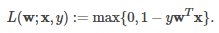

# 线性支持向量机

## 1 介绍

&emsp;&emsp;线性支持向量机是一个用于大规模分类任务的标准方法。它的目标函数[线性模型](../readme.md)中的公式（1）。它的损失函数是合页（`hinge`）损失，如下所示

<div  align="center"></div>

&emsp;&emsp;默认情况下，线性支持向量机训练时使用`L2`正则化。线性支持向量机输出一个`SVM`模型。给定一个新的数据点`x`，模型通过`w^Tx`的值预测，当这个值大于0时，输出为正，否则输出为负。

&emsp;&emsp;线性支持向量机并不需要核函数，要详细了解支持向量机，请参考文献【1】。

## 2 源码分析

### 2.1 实例

```scala
import org.apache.spark.mllib.classification.{SVMModel, SVMWithSGD}
import org.apache.spark.mllib.evaluation.BinaryClassificationMetrics
import org.apache.spark.mllib.util.MLUtils
// Load training data in LIBSVM format.
val data = MLUtils.loadLibSVMFile(sc, "data/mllib/sample_libsvm_data.txt")
// Split data into training (60%) and test (40%).
val splits = data.randomSplit(Array(0.6, 0.4), seed = 11L)
val training = splits(0).cache()
val test = splits(1)
// Run training algorithm to build the model
val numIterations = 100
val model = SVMWithSGD.train(training, numIterations)
// Clear the default threshold.
model.clearThreshold()
// Compute raw scores on the test set.
val scoreAndLabels = test.map { point =>
  val score = model.predict(point.features)
  (score, point.label)
}
// Get evaluation metrics.
val metrics = new BinaryClassificationMetrics(scoreAndLabels)
val auROC = metrics.areaUnderROC()
println("Area under ROC = " + auROC)
```

### 2.2 训练

&emsp;&emsp;和逻辑回归一样，训练过程均使用`GeneralizedLinearModel`中的`run`训练，只是训练使用的`Gradient`和`Updater`不同。在线性支持向量机中，使用`HingeGradient`计算梯度，使用`SquaredL2Updater`进行更新。
它的实现过程分为4步。参加[逻辑回归](../逻辑回归/logic-regression.md)了解这五步的详细情况。我们只需要了解`HingeGradient`和`SquaredL2Updater`的实现。

```scala
class HingeGradient extends Gradient {
  override def compute(data: Vector, label: Double, weights: Vector): (Vector, Double) = {
    val dotProduct = dot(data, weights)
    // 我们的损失函数是 max(0, 1 - (2y - 1) (f_w(x)))
    // 所以梯度是 -(2y - 1)*x
    val labelScaled = 2 * label - 1.0
    if (1.0 > labelScaled * dotProduct) {
      val gradient = data.copy
      scal(-labelScaled, gradient)
      (gradient, 1.0 - labelScaled * dotProduct)
    } else {
      (Vectors.sparse(weights.size, Array.empty, Array.empty), 0.0)
    }
  }

  override def compute(
      data: Vector,
      label: Double,
      weights: Vector,
      cumGradient: Vector): Double = {
    val dotProduct = dot(data, weights)
    // 我们的损失函数是 max(0, 1 - (2y - 1) (f_w(x)))
    // 所以梯度是 -(2y - 1)*x
    val labelScaled = 2 * label - 1.0
    if (1.0 > labelScaled * dotProduct) {
      //cumGradient -= labelScaled * data
      axpy(-labelScaled, data, cumGradient)
      //损失值
      1.0 - labelScaled * dotProduct
    } else {
      0.0
    }
  }
}
```

&emsp;&emsp;线性支持向量机的训练使用`L2`正则化方法。

```scala
class SquaredL2Updater extends Updater {
  override def compute(
      weightsOld: Vector,
      gradient: Vector,
      stepSize: Double,
      iter: Int,
      regParam: Double): (Vector, Double) = {
    // w' = w - thisIterStepSize * (gradient + regParam * w)
    // w' = (1 - thisIterStepSize * regParam) * w - thisIterStepSize * gradient
    //表示步长，即负梯度方向的大小
    val thisIterStepSize = stepSize / math.sqrt(iter)
    val brzWeights: BV[Double] = weightsOld.toBreeze.toDenseVector
    //正则化，brzWeights每行数据均乘以(1.0 - thisIterStepSize * regParam)
    brzWeights :*= (1.0 - thisIterStepSize * regParam)
    //y += x * a，即brzWeights -= gradient * thisInterStepSize
    brzAxpy(-thisIterStepSize, gradient.toBreeze, brzWeights)
    //正则化||w||_2
    val norm = brzNorm(brzWeights, 2.0)
    (Vectors.fromBreeze(brzWeights), 0.5 * regParam * norm * norm)
  }
}
```
&emsp;&emsp;该函数的实现规则是：

```scala
w' = w - thisIterStepSize * (gradient + regParam * w)
w' = (1 - thisIterStepSize * regParam) * w - thisIterStepSize * gradient
```
&emsp;&emsp;这里`thisIterStepSize`表示参数沿负梯度方向改变的速率，它随着迭代次数的增多而减小。

### 2.3 预测

```scala
override protected def predictPoint(
      dataMatrix: Vector,
      weightMatrix: Vector,
      intercept: Double) = {
    //w^Tx
    val margin = weightMatrix.toBreeze.dot(dataMatrix.toBreeze) + intercept
    threshold match {
      case Some(t) => if (margin > t) 1.0 else 0.0
      case None => margin
    }
  }
```

# 参考文献

【1】[支持向量机通俗导论（理解SVM的三层境界）](http://blog.csdn.net/macyang/article/details/38782399)


