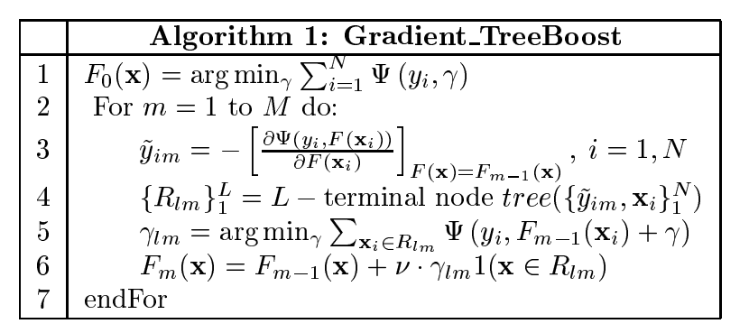
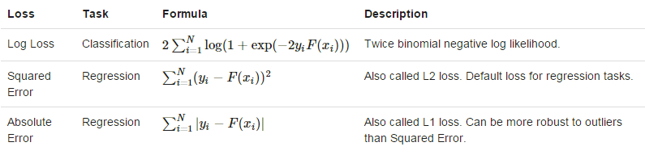
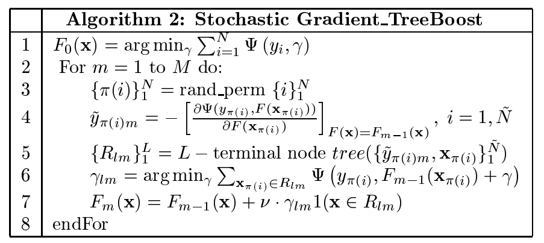

# 梯度提升树

## 1 Boosting

&emsp;&emsp;`Boosting`是一类将弱学习器提升为强学习器的算法。这类算法的工作机制类似：先从初始训练集中训练出一个基学习器，再根据基学习器的表现对训练样本分布进行调整，使得先前基学习器做错的训练样本在后续受到更多关注。
然后基于调整后的样本分布来训练下一个基学习器；如此重复进行，直至基学习器的数目达到事先指定的值`T`，最终将这`T`个基学习器进行加权结合。

&emsp;&emsp;`Boost`算法是在算法开始时，为每一个样本赋上一个相等的权重值，也就是说，最开始的时候，大家都是一样重要的。
在每一次训练中得到的模型，会使得数据点的估计有所差异，所以在每一步结束后，我们需要对权重值进行处理，而处理的方式就是通过**增加错分点的权重**，这样使得某些点如果老是被分错，那么就会被“严重关注”，也就被赋上一个很高的权重。
然后等进行了`N`次迭代，将会得到`N`个简单的基分类器（`basic learner`），最后将它们组合起来，可以对它们进行加权（错误率越大的基分类器权重值越小，错误率越小的基分类器权重值越大）、或者让它们进行投票等得到一个最终的模型。

&emsp;&emsp;梯度提升（`gradient boosting`）属于`Boost`算法的一种，也可以说是`Boost`算法的一种改进，它与传统的`Boost`有着很大的区别，它的每一次计算都是为了减少上一次的残差(`residual`)，而为了减少这些残差，可以在残差减少的梯度(`Gradient`)方向上建立一个新模型。所以说，在`Gradient Boost`中，每个新模型的建立是为了使得先前模型残差往梯度方向减少，
与传统的`Boost`算法对正确、错误的样本进行加权有着极大的区别。

&emsp;&emsp;梯度提升算法的核心在于，每棵树是从先前所有树的残差中来学习。**利用的是当前模型中损失函数的负梯度值作为提升树算法中的残差的近似值**，进而拟合一棵回归（分类）树。

## 2 梯度提升

&emsp;&emsp;根据参考文献【1】的介绍，梯度提升算法的算法流程如下所示：

<div  align="center"></div>

&emsp;&emsp;在上述的流程中，`F(x)`表示学习器，`psi`表示损失函数，第3行的`y_im`表示负梯度方向，第4行的`R_lm`表示原数据改变分布后的数据。

&emsp;&emsp;在`MLlib`中，提供的损失函数有三种。如下图所示。

<div  align="center"></div>

&emsp;&emsp;第一个对数损失用于分类，后两个平方误差和绝对误差用于回归。

## 3 随机梯度提升

&emsp;&emsp;有文献证明，注入随机性到上述的过程中可以提高函数估计的性能。受到`Breiman`的影响，将随机性作为一个考虑的因素。在每次迭代中，随机的在训练集中抽取一个子样本集，然后在后续的操作中用这个子样本集代替全体样本。
这就形成了随机梯度提升算法。它的流程如下所示：

<div  align="center"></div>

## 4 实例

&emsp;&emsp;下面的代码是分类的例子。

```scala
import org.apache.spark.mllib.tree.GradientBoostedTrees
import org.apache.spark.mllib.tree.configuration.BoostingStrategy
import org.apache.spark.mllib.tree.model.GradientBoostedTreesModel
import org.apache.spark.mllib.util.MLUtils
// 准备数据
val data = MLUtils.loadLibSVMFile(sc, "data/mllib/sample_libsvm_data.txt")
// Split the data into training and test sets (30% held out for testing)
val splits = data.randomSplit(Array(0.7, 0.3))
val (trainingData, testData) = (splits(0), splits(1))
// 训练模型
// The defaultParams for Classification use LogLoss by default.
val boostingStrategy = BoostingStrategy.defaultParams("Classification")
boostingStrategy.numIterations = 3 // Note: Use more iterations in practice.
boostingStrategy.treeStrategy.numClasses = 2
boostingStrategy.treeStrategy.maxDepth = 5
// Empty categoricalFeaturesInfo indicates all features are continuous.
boostingStrategy.treeStrategy.categoricalFeaturesInfo = Map[Int, Int]()
val model = GradientBoostedTrees.train(trainingData, boostingStrategy)
// 用测试数据评价模型
val labelAndPreds = testData.map { point =>
  val prediction = model.predict(point.features)
  (point.label, prediction)
}
val testErr = labelAndPreds.filter(r => r._1 != r._2).count.toDouble / testData.count()
println("Test Error = " + testErr)
println("Learned classification GBT model:\n" + model.toDebugString)
```
&emsp;&emsp;下面的代码是回归的例子。

```scala
import org.apache.spark.mllib.tree.GradientBoostedTrees
import org.apache.spark.mllib.tree.configuration.BoostingStrategy
import org.apache.spark.mllib.tree.model.GradientBoostedTreesModel
import org.apache.spark.mllib.util.MLUtils
// 准备数据
val data = MLUtils.loadLibSVMFile(sc, "data/mllib/sample_libsvm_data.txt")
// Split the data into training and test sets (30% held out for testing)
val splits = data.randomSplit(Array(0.7, 0.3))
val (trainingData, testData) = (splits(0), splits(1))
// 训练模型
// The defaultParams for Regression use SquaredError by default.
val boostingStrategy = BoostingStrategy.defaultParams("Regression")
boostingStrategy.numIterations = 3 // Note: Use more iterations in practice.
boostingStrategy.treeStrategy.maxDepth = 5
// Empty categoricalFeaturesInfo indicates all features are continuous.
boostingStrategy.treeStrategy.categoricalFeaturesInfo = Map[Int, Int]()
val model = GradientBoostedTrees.train(trainingData, boostingStrategy)
// 用测试数据评价模型
val labelsAndPredictions = testData.map { point =>
  val prediction = model.predict(point.features)
  (point.label, prediction)
}
val testMSE = labelsAndPredictions.map{ case(v, p) => math.pow((v - p), 2)}.mean()
println("Test Mean Squared Error = " + testMSE)
println("Learned regression GBT model:\n" + model.toDebugString)
```

## 5 源码分析

### 5.1 训练分析

&emsp;&emsp;梯度提升树的训练从`run`方法开始。

```scala
def run(input: RDD[LabeledPoint]): GradientBoostedTreesModel = {
    val algo = boostingStrategy.treeStrategy.algo
    algo match {
      case Regression =>
        GradientBoostedTrees.boost(input, input, boostingStrategy, validate = false)
      case Classification =>
        // Map labels to -1, +1 so binary classification can be treated as regression.
        val remappedInput = input.map(x => new LabeledPoint((x.label * 2) - 1, x.features))
        GradientBoostedTrees.boost(remappedInput, remappedInput, boostingStrategy, validate = false)
      case _ =>
        throw new IllegalArgumentException(s"$algo is not supported by the gradient boosting.")
    }
}
```

&emsp;&emsp;在`MLlib`中，梯度提升树只能用于二分类和回归。所以，在上面的代码中，将标签映射为`-1,+1`，那么二分类也可以被当做回归。整个训练过程在`GradientBoostedTrees.boost`中实现。
`GradientBoostedTrees.boost`的过程分为三步，第一步，初始化参数；第二步，训练第一棵树；第三步，迭代训练后续的树。下面分别介绍这三步。

- 初始化参数

```scala
// 初始化梯度提升参数
// 迭代次数，默认为100
val numIterations = boostingStrategy.numIterations
// 基学习器
val baseLearners = new Array[DecisionTreeModel](numIterations)
// 基学习器权重
val baseLearnerWeights = new Array[Double](numIterations)
// 损失函数，分类时，用对数损失，回归时，用误差平方损失
val loss = boostingStrategy.loss
val learningRate = boostingStrategy.learningRate
// Prepare strategy for individual trees, which use regression with variance impurity.
// 回归时，使用方差计算不纯度
val treeStrategy = boostingStrategy.treeStrategy.copy
val validationTol = boostingStrategy.validationTol
treeStrategy.algo = Regression
treeStrategy.impurity = Variance
// 缓存输入数据
val persistedInput = if (input.getStorageLevel == StorageLevel.NONE) {
   input.persist(StorageLevel.MEMORY_AND_DISK)
   true
} else {
   false
}
// Prepare periodic checkpointers
val predErrorCheckpointer = new PeriodicRDDCheckpointer[(Double, Double)](
    treeStrategy.getCheckpointInterval, input.sparkContext)
val validatePredErrorCheckpointer = new PeriodicRDDCheckpointer[(Double, Double)](
    treeStrategy.getCheckpointInterval, input.sparkContext)
```

- 训练第一棵树（即第一个基学习器）

```scala
//通过训练数据训练出一颗决策树，具体信息请参考随机森林的分析
val firstTreeModel = new DecisionTree(treeStrategy).run(input)
val firstTreeWeight = 1.0
baseLearners(0) = firstTreeModel
baseLearnerWeights(0) = firstTreeWeight
var predError: RDD[(Double, Double)] = GradientBoostedTreesModel.
      computeInitialPredictionAndError(input, firstTreeWeight, firstTreeModel, loss)
predErrorCheckpointer.update(predError)
```

&emsp;&emsp;这里比较关键的是通过`GradientBoostedTreesModel.computeInitialPredictionAndError`计算初始的预测和误差。

```scala
def computeInitialPredictionAndError(
      data: RDD[LabeledPoint],
      initTreeWeight: Double,
      initTree: DecisionTreeModel,
      loss: Loss): RDD[(Double, Double)] = {
    data.map { lp =>
      val pred = initTreeWeight * initTree.predict(lp.features)
      val error = loss.computeError(pred, lp.label)
      (pred, error)
    }
  }
```

&emsp;&emsp;根据选择的损失函数的不同，`computeError`的实现不同。

```scala
//对数损失的实现
override private[mllib] def computeError(prediction: Double, label: Double): Double = {
    val margin = 2.0 * label * prediction
    // The following is equivalent to 2.0 * log(1 + exp(-margin)) but more numerically stable.
    2.0 * MLUtils.log1pExp(-margin)
}
//误差平方损失
override private[mllib] def computeError(prediction: Double, label: Double): Double = {
    val err = label - prediction
    err * err
}
```

- 迭代训练后续树

```scala
var validatePredError: RDD[(Double, Double)] = GradientBoostedTreesModel.
      computeInitialPredictionAndError(validationInput, firstTreeWeight, firstTreeModel, loss)
if (validate) validatePredErrorCheckpointer.update(validatePredError)
var bestValidateError = if (validate) validatePredError.values.mean() else 0.0
var bestM = 1
var m = 1
var doneLearning = false
while (m < numIterations && !doneLearning) {
    // Update data with pseudo-residuals
    // 根据梯度调整训练数据
    val data = predError.zip(input).map { case ((pred, _), point) =>
      //标签为上一棵树预测的数据的负梯度方向
      LabeledPoint(-loss.gradient(pred, point.label), point.features)
    }
    //训练下一棵树
    val model = new DecisionTree(treeStrategy).run(data)
    // Update partial model
    baseLearners(m) = model
    // Note: The setting of baseLearnerWeights is incorrect for losses other than SquaredError.
    //       Technically, the weight should be optimized for the particular loss.
    //       However, the behavior should be reasonable, though not optimal.
    baseLearnerWeights(m) = learningRate
    //更新预测和误差
    predError = GradientBoostedTreesModel.updatePredictionError(
        input, predError, baseLearnerWeights(m), baseLearners(m), loss)
    predErrorCheckpointer.update(predError)
    //当需要验证阈值，提前终止迭代时
    if (validate) {
        // Stop training early if
        // 1. Reduction in error is less than the validationTol or
        // 2. If the error increases, that is if the model is overfit.
        // We want the model returned corresponding to the best validation error.
        validatePredError = GradientBoostedTreesModel.updatePredictionError(
          validationInput, validatePredError, baseLearnerWeights(m), baseLearners(m), loss)
        validatePredErrorCheckpointer.update(validatePredError)
        val currentValidateError = validatePredError.values.mean()
        if (bestValidateError - currentValidateError < validationTol * Math.max(
          currentValidateError, 0.01)) {
          doneLearning = true
        } else if (currentValidateError < bestValidateError) {
          bestValidateError = currentValidateError
          bestM = m + 1
        }
    }
    m += 1
}
```

&emsp;&emsp;上面代码最重要的部分是更新预测和误差的实现。通过`GradientBoostedTreesModel.updatePredictionError`实现。

```scala
 def updatePredictionError(
    data: RDD[LabeledPoint],
    predictionAndError: RDD[(Double, Double)],
    treeWeight: Double,
    tree: DecisionTreeModel,
    loss: Loss): RDD[(Double, Double)] = {
    val newPredError = data.zip(predictionAndError).mapPartitions { iter =>
      iter.map { case (lp, (pred, error)) =>
        val newPred = pred + tree.predict(lp.features) * treeWeight
        val newError = loss.computeError(newPred, lp.label)
        (newPred, newError)
      }
    }
    newPredError
  }
```

### 5.2 测试

&emsp;&emsp;利用梯度提升树进行预测时，调用的`predict`方法扩展自`TreeEnsembleModel`，它是树结构组合模型的表示，其核心代码如下所示：

```scala
//不同的策略采用不同的预测方法
def predict(features: Vector): Double = {
    (algo, combiningStrategy) match {
      case (Regression, Sum) =>
        predictBySumming(features)
      case (Regression, Average) =>
        predictBySumming(features) / sumWeights
      //用于梯度提升树，转换为1 或者 0
      case (Classification, Sum) => // binary classification
        val prediction = predictBySumming(features)
        // TODO: predicted labels are +1 or -1 for GBT. Need a better way to store this info.
        if (prediction > 0.0) 1.0 else 0.0
      case (Classification, Vote) =>
        predictByVoting(features)
      case _ =>
        throw new IllegalArgumentException()
    }
}
private def predictBySumming(features: Vector): Double = {
    val treePredictions = trees.map(_.predict(features))
    //两个向量的内集
    blas.ddot(numTrees, treePredictions, 1, treeWeights, 1)
}
```

# 参考文献

【1】[Stochastic Gradient Boost](https://statweb.stanford.edu/~jhf/ftp/stobst.pdf)

【2】[机器学习算法-梯度树提升GTB（GBRT）](http://www.07net01.com/2015/08/918187.html)
