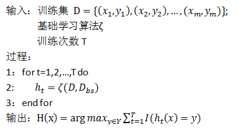
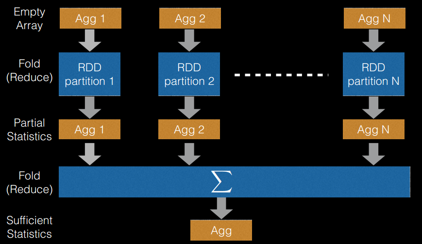
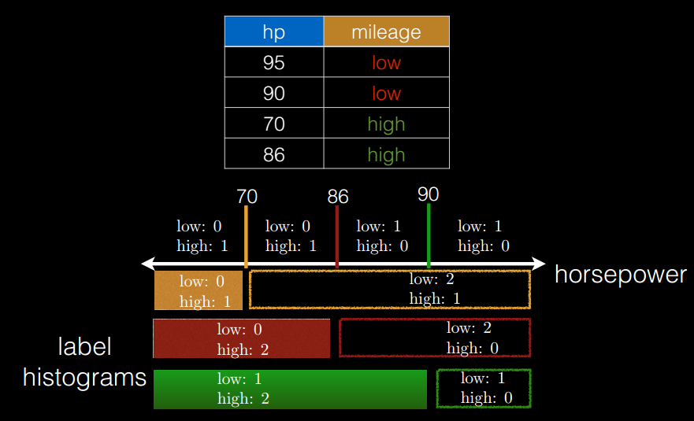
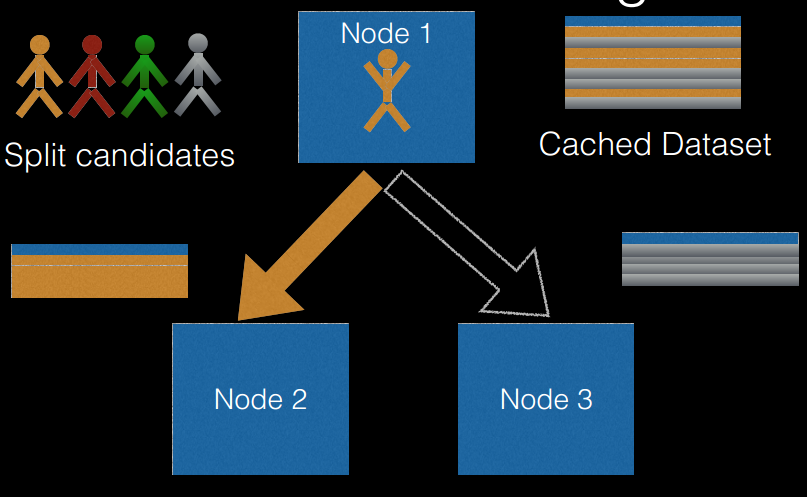

# 随机森林

## 1 Bagging

&emsp;&emsp;`Bagging`采用自助采样法(`bootstrap sampling`)采样数据。给定包含`m`个样本的数据集，我们先随机取出一个样本放入采样集中，再把该样本放回初始数据集，使得下次采样时，样本仍可能被选中，
这样，经过`m`次随机采样操作，我们得到包含`m`个样本的采样集。

&emsp;&emsp;按照此方式，我们可以采样出`T`个含`m`个训练样本的采样集，然后基于每个采样集训练出一个基本学习器，再将这些基本学习器进行结合。这就是`Bagging`的一般流程。在对预测输出进行结合时，`Bagging`通常使用简单投票法，
对回归问题使用简单平均法。若分类预测时，出现两个类收到同样票数的情形，则最简单的做法是随机选择一个，也可以进一步考察学习器投票的置信度来确定最终胜者。

&emsp;&emsp;`Bagging`的算法描述如下图所示。

<div  align="center"></div>

## 2 随机森林

&emsp;&emsp;随机森林是`Bagging`的一个扩展变体。随机森林在以决策树为基学习器构建`Bagging`集成的基础上，进一步在决策树的训练过程中引入了随机属性选择。具体来讲，传统决策树在选择划分属性时，
在当前节点的属性集合（假设有`d`个属性）中选择一个最优属性；而在随机森林中，对基决策树的每个节点，先从该节点的属性集合中随机选择一个包含`k`个属性的子集，然后再从这个子集中选择一个最优属性用于划分。
这里的参数`k`控制了随机性的引入程度。若令`k=d`，则基决策树的构建与传统决策树相同；若令`k=1`，则是随机选择一个属性用于划分。在`MLlib`中，有两种选择用于分类，即`k=log2(d)`、`k=sqrt(d)`；
一种选择用于回归，即`k=1/3d`。在源码分析中会详细介绍。

&emsp;&emsp;可以看出，随机森林对`Bagging`只做了小改动，但是与`Bagging`中基学习器的“多样性”仅仅通过样本扰动（通过对初始训练集采样）而来不同，随机森林中基学习器的多样性不仅来自样本扰动，还来自属性扰动。
这使得最终集成的泛化性能可通过个体学习器之间差异度的增加而进一步提升。

## 3 随机森林在分布式环境下的优化策略

&emsp;&emsp;随机森林算法在单机环境下很容易实现，但在分布式环境下特别是在`Spark`平台上，传统单机形式的迭代方式必须要进行相应改进才能适用于分布式环境
，这是因为在分布式环境下，数据也是分布式的，算法设计不得当会生成大量的`IO`操作，例如频繁的网络数据传输，从而影响算法效率。
因此，在`Spark`上进行随机森林算法的实现，需要进行一定的优化，`Spark`中的随机森林算法主要实现了三个优化策略：

- 切分点抽样统计，如下图所示。在单机环境下的决策树对连续变量进行切分点选择时，一般是通过对特征点进行排序，然后取相邻两个数之间的点作为切分点，这在单机环境下是可行的，但如果在分布式环境下如此操作的话，
会带来大量的网络传输操作，特别是当数据量达到`PB`级时，算法效率将极为低下。为避免该问题，`Spark`中的随机森林在构建决策树时，会对各分区采用一定的子特征策略进行抽样，然后生成各个分区的统计数据，并最终得到切分点。
(从源代码里面看，是先对样本进行抽样，然后根据抽样样本值出现的次数进行排序，然后再进行切分)。

<div  align="center"></div>

- 特征装箱（`Binning`），如下图所示。决策树的构建过程就是对特征的取值不断进行划分的过程，对于离散的特征，如果有`M`个值，最多有`2^(M-1) - 1`个划分。如果值是有序的，那么就最多`M-1`个划分。
比如年龄特征，有老，中，少3个值，如果无序有`2^2-1=3`个划分，即`老|中，少；老，中|少；老，少|中`。；如果是有序的，即按老，中，少的序，那么只有`m-1`个，即2种划分，`老|中，少；老，中|少`。
对于连续的特征，其实就是进行范围划分，而划分的点就是`split`（切分点），划分出的区间就是`bin`。对于连续特征，理论上`split`是无数的，在分布环境下不可能取出所有的值，因此它采用的是切点抽样统计方法。

<div  align="center"></div>

- 逐层训练（`level-wise training`），如下图所示。单机版本的决策树生成过程是通过递归调用（本质上是深度优先）的方式构造树，在构造树的同时，需要移动数据，将同一个子节点的数据移动到一起。
此方法在分布式数据结构上无法有效的执行，而且也无法执行，因为数据太大，无法放在一起，所以在分布式环境下采用的策略是逐层构建树节点（本质上是广度优先），这样遍历所有数据的次数等于所有树中的最大层数。
每次遍历时，只需要计算每个节点所有切分点统计参数，遍历完后，根据节点的特征划分，决定是否切分，以及如何切分。

<div  align="center"></div>

## 4 使用实例

&emsp;&emsp;下面的例子用于分类。

```scala
import org.apache.spark.mllib.tree.RandomForest
import org.apache.spark.mllib.tree.model.RandomForestModel
import org.apache.spark.mllib.util.MLUtils
// Load and parse the data file.
val data = MLUtils.loadLibSVMFile(sc, "data/mllib/sample_libsvm_data.txt")
// Split the data into training and test sets (30% held out for testing)
val splits = data.randomSplit(Array(0.7, 0.3))
val (trainingData, testData) = (splits(0), splits(1))
// Train a RandomForest model.
// 空的类别特征信息表示所有的特征都是连续的.
val numClasses = 2
val categoricalFeaturesInfo = Map[Int, Int]()
val numTrees = 3 // Use more in practice.
val featureSubsetStrategy = "auto" // Let the algorithm choose.
val impurity = "gini"
val maxDepth = 4
val maxBins = 32
val model = RandomForest.trainClassifier(trainingData, numClasses, categoricalFeaturesInfo,
  numTrees, featureSubsetStrategy, impurity, maxDepth, maxBins)
// Evaluate model on test instances and compute test error
val labelAndPreds = testData.map { point =>
  val prediction = model.predict(point.features)
  (point.label, prediction)
}
val testErr = labelAndPreds.filter(r => r._1 != r._2).count.toDouble / testData.count()
println("Test Error = " + testErr)
println("Learned classification forest model:\n" + model.toDebugString)
```

&emsp;&emsp;下面的例子用于回归。

```scala
import org.apache.spark.mllib.tree.RandomForest
import org.apache.spark.mllib.tree.model.RandomForestModel
import org.apache.spark.mllib.util.MLUtils
// Load and parse the data file.
val data = MLUtils.loadLibSVMFile(sc, "data/mllib/sample_libsvm_data.txt")
// Split the data into training and test sets (30% held out for testing)
val splits = data.randomSplit(Array(0.7, 0.3))
val (trainingData, testData) = (splits(0), splits(1))
// Train a RandomForest model.
// 空的类别特征信息表示所有的特征都是连续的
val numClasses = 2
val categoricalFeaturesInfo = Map[Int, Int]()
val numTrees = 3 // Use more in practice.
val featureSubsetStrategy = "auto" // Let the algorithm choose.
val impurity = "variance"
val maxDepth = 4
val maxBins = 32
val model = RandomForest.trainRegressor(trainingData, categoricalFeaturesInfo,
  numTrees, featureSubsetStrategy, impurity, maxDepth, maxBins)
// Evaluate model on test instances and compute test error
val labelsAndPredictions = testData.map { point =>
  val prediction = model.predict(point.features)
  (point.label, prediction)
}
val testMSE = labelsAndPredictions.map{ case(v, p) => math.pow((v - p), 2)}.mean()
println("Test Mean Squared Error = " + testMSE)
println("Learned regression forest model:\n" + model.toDebugString)
```

## 5 源码分析

### 5.1 训练分析

&emsp;&emsp;训练过程简单可以分为两步，第一步是初始化，第二步是迭代构建随机森林。这两大步还分为若干小步，下面会分别介绍这些内容。

#### 5.1.1 初始化

```scala
val retaggedInput = input.retag(classOf[LabeledPoint])
//建立决策树的元数据信息（分裂点位置、箱子数及各箱子包含特征属性的值等）
val metadata =
    DecisionTreeMetadata.buildMetadata(retaggedInput, strategy, numTrees, featureSubsetStrategy)
//找到切分点（splits）及箱子信息（Bins）
//对于连续型特征，利用切分点抽样统计简化计算
//对于离散型特征，如果是无序的，则最多有个 splits=2^(numBins-1)-1 划分
//如果是有序的，则最多有 splits=numBins-1 个划分
val (splits, bins) = DecisionTree.findSplitsBins(retaggedInput, metadata)
//转换成树形的 RDD 类型，转换后，所有样本点已经按分裂点条件分到了各自的箱子中
val treeInput = TreePoint.convertToTreeRDD(retaggedInput, bins, metadata)
val withReplacement = if (numTrees > 1) true else false
// convertToBaggedRDD 方法使得每棵树就是样本的一个子集
val baggedInput = BaggedPoint.convertToBaggedRDD(treeInput,
          strategy.subsamplingRate, numTrees,
          withReplacement, seed).persist(StorageLevel.MEMORY_AND_DISK)
//决策树的深度，最大为30
val maxDepth = strategy.maxDepth
//聚合的最大内存
val maxMemoryUsage: Long = strategy.maxMemoryInMB * 1024L * 1024L
val maxMemoryPerNode = {
    val featureSubset: Option[Array[Int]] = if (metadata.subsamplingFeatures) {
        // Find numFeaturesPerNode largest bins to get an upper bound on memory usage.
        Some(metadata.numBins.zipWithIndex.sortBy(- _._1)
          .take(metadata.numFeaturesPerNode).map(_._2))
    } else {
        None
    }
    //计算聚合操作时节点的内存
    RandomForest.aggregateSizeForNode(metadata, featureSubset) * 8L
}
```

&emsp;&emsp;初始化的第一步就是决策树元数据信息的构建。它的代码如下所示。

```scala
def buildMetadata(
      input: RDD[LabeledPoint],
      strategy: Strategy,
      numTrees: Int,
      featureSubsetStrategy: String): DecisionTreeMetadata = {
    //特征数
    val numFeatures = input.map(_.features.size).take(1).headOption.getOrElse {
      throw new IllegalArgumentException(s"DecisionTree requires size of input RDD > 0, " +
        s"but was given by empty one.")
    }
    val numExamples = input.count()
    val numClasses = strategy.algo match {
      case Classification => strategy.numClasses
      case Regression => 0
    }
    //最大可能的装箱数
    val maxPossibleBins = math.min(strategy.maxBins, numExamples).toInt
    if (maxPossibleBins < strategy.maxBins) {
      logWarning(s"DecisionTree reducing maxBins from ${strategy.maxBins} to $maxPossibleBins" +
        s" (= number of training instances)")
    }
    // We check the number of bins here against maxPossibleBins.
    // This needs to be checked here instead of in Strategy since maxPossibleBins can be modified
    // based on the number of training examples.
    //最大分类数要小于最大可能装箱数
    //这里categoricalFeaturesInfo是传入的信息，这个map保存特征的类别信息。
    //例如，(n->k)表示特征k包含的类别有（0,1,...,k-1）
    if (strategy.categoricalFeaturesInfo.nonEmpty) {
      val maxCategoriesPerFeature = strategy.categoricalFeaturesInfo.values.max
      val maxCategory =
        strategy.categoricalFeaturesInfo.find(_._2 == maxCategoriesPerFeature).get._1
      require(maxCategoriesPerFeature <= maxPossibleBins,
        s"DecisionTree requires maxBins (= $maxPossibleBins) to be at least as large as the " +
        s"number of values in each categorical feature, but categorical feature $maxCategory " +
        s"has $maxCategoriesPerFeature values. Considering remove this and other categorical " +
        "features with a large number of values, or add more training examples.")
    }
    val unorderedFeatures = new mutable.HashSet[Int]()
    val numBins = Array.fill[Int](numFeatures)(maxPossibleBins)
    if (numClasses > 2) {
      // 多分类
      val maxCategoriesForUnorderedFeature =
        ((math.log(maxPossibleBins / 2 + 1) / math.log(2.0)) + 1).floor.toInt
      strategy.categoricalFeaturesInfo.foreach { case (featureIndex, numCategories) =>
        //如果类别特征只有1个类，我们把它看成连续的特征
        if (numCategories > 1) {
          // Decide if some categorical features should be treated as unordered features,
          //  which require 2 * ((1 << numCategories - 1) - 1) bins.
          // We do this check with log values to prevent overflows in case numCategories is large.
          // The next check is equivalent to: 2 * ((1 << numCategories - 1) - 1) <= maxBins
          if (numCategories <= maxCategoriesForUnorderedFeature) {
            unorderedFeatures.add(featureIndex)
            numBins(featureIndex) = numUnorderedBins(numCategories)
          } else {
            numBins(featureIndex) = numCategories
          }
        }
      }
    } else {
      // 二分类或者回归
      strategy.categoricalFeaturesInfo.foreach { case (featureIndex, numCategories) =>
        //如果类别特征只有1个类，我们把它看成连续的特征
        if (numCategories > 1) {
          numBins(featureIndex) = numCategories
        }
      }
    }
    // 设置每个节点的特征数 (对随机森林而言).
    val _featureSubsetStrategy = featureSubsetStrategy match {
      case "auto" =>
        if (numTrees == 1) {//决策树时，使用所有特征
          "all"
        } else {
          if (strategy.algo == Classification) {//分类时，使用开平方
            "sqrt"
          } else { //回归时，使用1/3的特征
            "onethird"
          }
        }
      case _ => featureSubsetStrategy
    }
    val numFeaturesPerNode: Int = _featureSubsetStrategy match {
      case "all" => numFeatures
      case "sqrt" => math.sqrt(numFeatures).ceil.toInt
      case "log2" => math.max(1, (math.log(numFeatures) / math.log(2)).ceil.toInt)
      case "onethird" => (numFeatures / 3.0).ceil.toInt
    }
    new DecisionTreeMetadata(numFeatures, numExamples, numClasses, numBins.max,
      strategy.categoricalFeaturesInfo, unorderedFeatures.toSet, numBins,
      strategy.impurity, strategy.quantileCalculationStrategy, strategy.maxDepth,
      strategy.minInstancesPerNode, strategy.minInfoGain, numTrees, numFeaturesPerNode)
  }
```

&emsp;&emsp;初始化的第二步就是找到切分点（`splits`）及箱子信息（`Bins`）。这时，调用了`DecisionTree.findSplitsBins`方法，进入该方法了解详细信息。

```scala
/**
   * Returns splits and bins for decision tree calculation.
   * Continuous and categorical features are handled differently.
   *
   * Continuous features:
   *   For each feature, there are numBins - 1 possible splits representing the possible binary
   *   decisions at each node in the tree.
   *   This finds locations (feature values) for splits using a subsample of the data.
   *
   * Categorical features:
   *   For each feature, there is 1 bin per split.
   *   Splits and bins are handled in 2 ways:
   *   (a) "unordered features"
   *       For multiclass classification with a low-arity feature
   *       (i.e., if isMulticlass && isSpaceSufficientForAllCategoricalSplits),
   *       the feature is split based on subsets of categories.
   *   (b) "ordered features"
   *       For regression and binary classification,
   *       and for multiclass classification with a high-arity feature,
   *       there is one bin per category.
   *
   * @param input Training data: RDD of [[org.apache.spark.mllib.regression.LabeledPoint]]
   * @param metadata Learning and dataset metadata
   * @return A tuple of (splits, bins).
   *         Splits is an Array of [[org.apache.spark.mllib.tree.model.Split]]
   *          of size (numFeatures, numSplits).
   *         Bins is an Array of [[org.apache.spark.mllib.tree.model.Bin]]
   *          of size (numFeatures, numBins).
   */
  protected[tree] def findSplitsBins(
      input: RDD[LabeledPoint],
      metadata: DecisionTreeMetadata): (Array[Array[Split]], Array[Array[Bin]]) = {
    //特征数
    val numFeatures = metadata.numFeatures
    // Sample the input only if there are continuous features.
    // 判断特征中是否存在连续特征
    val continuousFeatures = Range(0, numFeatures).filter(metadata.isContinuous)
    val sampledInput = if (continuousFeatures.nonEmpty) {
      // Calculate the number of samples for approximate quantile calculation.
      //采样样本数量，最少有 10000 个
      val requiredSamples = math.max(metadata.maxBins * metadata.maxBins, 10000)
      //计算采样比例
      val fraction = if (requiredSamples < metadata.numExamples) {
        requiredSamples.toDouble / metadata.numExamples
      } else {
        1.0
      }
      //采样数据，有放回采样
      input.sample(withReplacement = false, fraction, new XORShiftRandom().nextInt())
    } else {
      input.sparkContext.emptyRDD[LabeledPoint]
    }
    //分裂点策略，目前 Spark 中只实现了一种策略：排序 Sort
    metadata.quantileStrategy match {
      case Sort =>
        findSplitsBinsBySorting(sampledInput, metadata, continuousFeatures)
      case MinMax =>
        throw new UnsupportedOperationException("minmax not supported yet.")
      case ApproxHist =>
        throw new UnsupportedOperationException("approximate histogram not supported yet.")
    }
  }
```
&emsp;&emsp;我们进入`findSplitsBinsBySorting`方法了解`Sort`分裂策略的实现。

```scala
private def findSplitsBinsBySorting(
      input: RDD[LabeledPoint],
      metadata: DecisionTreeMetadata,
      continuousFeatures: IndexedSeq[Int]): (Array[Array[Split]], Array[Array[Bin]]) = {
    def findSplits(
        featureIndex: Int,
        featureSamples: Iterable[Double]): (Int, (Array[Split], Array[Bin])) = {
      //每个特征分别对应一组切分点位置，这里splits是有序的
      val splits = {
        // findSplitsForContinuousFeature 返回连续特征的所有切分位置
        val featureSplits = findSplitsForContinuousFeature(
          featureSamples.toArray,
          metadata,
          featureIndex)
        featureSplits.map(threshold => new Split(featureIndex, threshold, Continuous, Nil))
      }
      //存放切分点位置对应的箱子信息
      val bins = {
        //采用最小阈值 Double.MinValue 作为最左边的分裂位置并进行装箱
        val lowSplit = new DummyLowSplit(featureIndex, Continuous)
        //最后一个箱子的计算采用最大阈值 Double.MaxValue 作为最右边的切分位置
        val highSplit = new DummyHighSplit(featureIndex, Continuous)
        // tack the dummy splits on either side of the computed splits
        val allSplits = lowSplit +: splits.toSeq :+ highSplit
        //将切分点两两结合成一个箱子
        allSplits.sliding(2).map {
          case Seq(left, right) => new Bin(left, right, Continuous, Double.MinValue)
        }.toArray
      }
      (featureIndex, (splits, bins))
    }
    val continuousSplits = {
      // reduce the parallelism for split computations when there are less
      // continuous features than input partitions. this prevents tasks from
      // being spun up that will definitely do no work.
      val numPartitions = math.min(continuousFeatures.length, input.partitions.length)
      input
        .flatMap(point => continuousFeatures.map(idx => (idx, point.features(idx))))
        .groupByKey(numPartitions)
        .map { case (k, v) => findSplits(k, v) }
        .collectAsMap()
    }
    val numFeatures = metadata.numFeatures
    //遍历所有特征
    val (splits, bins) = Range(0, numFeatures).unzip {
      //处理连续特征的情况
      case i if metadata.isContinuous(i) =>
        val (split, bin) = continuousSplits(i)
        metadata.setNumSplits(i, split.length)
        (split, bin)
      //处理离散特征且无序的情况
      case i if metadata.isCategorical(i) && metadata.isUnordered(i) =>
        // Unordered features
        // 2^(maxFeatureValue - 1) - 1 combinations
        val featureArity = metadata.featureArity(i)
        val split = Range(0, metadata.numSplits(i)).map { splitIndex =>
          val categories = extractMultiClassCategories(splitIndex + 1, featureArity)
          new Split(i, Double.MinValue, Categorical, categories)
        }
        // For unordered categorical features, there is no need to construct the bins.
        // since there is a one-to-one correspondence between the splits and the bins.
        (split.toArray, Array.empty[Bin])
      //处理离散特征且有序的情况
      case i if metadata.isCategorical(i) =>
        //有序特征无需处理，箱子与特征值对应
        // Ordered features
        // Bins correspond to feature values, so we do not need to compute splits or bins
        // beforehand.  Splits are constructed as needed during training.
        (Array.empty[Split], Array.empty[Bin])
    }
    (splits.toArray, bins.toArray)
  }
```

&emsp;&emsp;计算连续特征的所有切分位置需要调用方法`findSplitsForContinuousFeature`方法。

```scala
private[tree] def findSplitsForContinuousFeature(
      featureSamples: Array[Double],
      metadata: DecisionTreeMetadata,
      featureIndex: Int): Array[Double] = {
    val splits = {
      //切分数是bin的数量减1，即m-1
      val numSplits = metadata.numSplits(featureIndex)
      // （特征，特征出现的次数）
      val valueCountMap = featureSamples.foldLeft(Map.empty[Double, Int]) { (m, x) =>
        m + ((x, m.getOrElse(x, 0) + 1))
      }
      // 根据特征进行排序
      val valueCounts = valueCountMap.toSeq.sortBy(_._1).toArray
      // if possible splits is not enough or just enough, just return all possible splits
      val possibleSplits = valueCounts.length
      //如果特征数小于切分数，所有特征均作为切分点
      if (possibleSplits <= numSplits) {
        valueCounts.map(_._1)
      } else {
        // 等频切分
        // 切分点之间的步长
        val stride: Double = featureSamples.length.toDouble / (numSplits + 1)
        val splitsBuilder = Array.newBuilder[Double]
        var index = 1
        // currentCount: sum of counts of values that have been visited
        //第一个特征的出现次数
        var currentCount = valueCounts(0)._2
        // targetCount: target value for `currentCount`.
        // If `currentCount` is closest value to `targetCount`,
        // then current value is a split threshold.
        // After finding a split threshold, `targetCount` is added by stride.
        // 如果currentCount离targetCount最近，那么当前值是切分点
        var targetCount = stride
        while (index < valueCounts.length) {
          val previousCount = currentCount
          currentCount += valueCounts(index)._2
          val previousGap = math.abs(previousCount - targetCount)
          val currentGap = math.abs(currentCount - targetCount)
          // If adding count of current value to currentCount
          // makes the gap between currentCount and targetCount smaller,
          // previous value is a split threshold.
          if (previousGap < currentGap) {
            splitsBuilder += valueCounts(index - 1)._1
            targetCount += stride
          }
          index += 1
        }
        splitsBuilder.result()
      }
    }
    splits
  }
```
&emsp;&emsp; 在if判断里每步前进`stride`个样本，累加在`targetCount`中。`while`循环逐次把每个特征值的个数加到`currentCount`里，计算前一次`previousCount`和这次`currentCount`到`targetCount`的距离，有3种情况，一种是`pre`和`cur`都在`target`左边，肯定是`cur`小，继续循环，进入第二种情况；第二种一左一右，如果`pre`小，肯定是`pre`是最好的分割点，如果`cur`还是小，继续循环步进，进入第三种情况；第三种就是都在右边，显然是`pre`小。因此`if`的判断条件`pre<cur`，只要满足肯定就是`split`。整体下来的效果就能找到离`target`最近的一个特征值。 

#### 5.1.2 迭代构建随机森林

```scala
//节点是否使用缓存，节点 ID 从 1 开始，1 即为这颗树的根节点，左节点为 2，右节点为 3，依次递增下去
val nodeIdCache = if (strategy.useNodeIdCache) {
   Some(NodeIdCache.init(
        data = baggedInput,
        numTrees = numTrees,
        checkpointInterval = strategy.checkpointInterval,
        initVal = 1))
} else {
   None
}
// FIFO queue of nodes to train: (treeIndex, node)
val nodeQueue = new mutable.Queue[(Int, Node)]()
val rng = new scala.util.Random()
rng.setSeed(seed)
// Allocate and queue root nodes.
//创建树的根节点
val topNodes: Array[Node] = Array.fill[Node](numTrees)(Node.emptyNode(nodeIndex = 1))
//将（树的索引，树的根节点）入队，树索引从 0 开始，根节点从 1 开始
Range(0, numTrees).foreach(treeIndex => nodeQueue.enqueue((treeIndex, topNodes(treeIndex))))
while (nodeQueue.nonEmpty) {
    // Collect some nodes to split, and choose features for each node (if subsampling).
    // Each group of nodes may come from one or multiple trees, and at multiple levels.
    // 取得每个树所有需要切分的节点,nodesForGroup表示需要切分的节点
    val (nodesForGroup, treeToNodeToIndexInfo) =
        RandomForest.selectNodesToSplit(nodeQueue, maxMemoryUsage, metadata, rng)
    //找出最优切点
    DecisionTree.findBestSplits(baggedInput, metadata, topNodes, nodesForGroup,
        treeToNodeToIndexInfo, splits, bins, nodeQueue, timer, nodeIdCache = nodeIdCache)
}
```

&emsp;&emsp;这里有两点需要重点介绍，第一点是取得每个树所有需要切分的节点，通过`RandomForest.selectNodesToSplit`方法实现；第二点是找出最优的切分，通过`DecisionTree.findBestSplits`方法实现。下面分别介绍这两点。

- 取得每个树所有需要切分的节点

```scala
 private[tree] def selectNodesToSplit(
      nodeQueue: mutable.Queue[(Int, Node)],
      maxMemoryUsage: Long,
      metadata: DecisionTreeMetadata,
      rng: scala.util.Random): (Map[Int, Array[Node]], Map[Int, Map[Int, NodeIndexInfo]]) = {
    // nodesForGroup保存需要切分的节点，treeIndex --> nodes
    val mutableNodesForGroup = new mutable.HashMap[Int, mutable.ArrayBuffer[Node]]()
    // mutableTreeToNodeToIndexInfo保存每个节点中选中特征的索引
    // treeIndex --> (global) node index --> (node index in group, feature indices)
    //(global) node index是树中的索引，组中节点索引的范围是[0, numNodesInGroup)
    val mutableTreeToNodeToIndexInfo =
      new mutable.HashMap[Int, mutable.HashMap[Int, NodeIndexInfo]]()
    var memUsage: Long = 0L
    var numNodesInGroup = 0
    while (nodeQueue.nonEmpty && memUsage < maxMemoryUsage) {
      val (treeIndex, node) = nodeQueue.head
      // Choose subset of features for node (if subsampling).
      // 选中特征子集
      val featureSubset: Option[Array[Int]] = if (metadata.subsamplingFeatures) {
        Some(SamplingUtils.reservoirSampleAndCount(Range(0,
          metadata.numFeatures).iterator, metadata.numFeaturesPerNode, rng.nextLong)._1)
      } else {
        None
      }
      // Check if enough memory remains to add this node to the group.
      // 检查是否有足够的内存
      val nodeMemUsage = RandomForest.aggregateSizeForNode(metadata, featureSubset) * 8L
      if (memUsage + nodeMemUsage <= maxMemoryUsage) {
        nodeQueue.dequeue()
        mutableNodesForGroup.getOrElseUpdate(treeIndex, new mutable.ArrayBuffer[Node]()) += node
        mutableTreeToNodeToIndexInfo
          .getOrElseUpdate(treeIndex, new mutable.HashMap[Int, NodeIndexInfo]())(node.id)
          = new NodeIndexInfo(numNodesInGroup, featureSubset)
      }
      numNodesInGroup += 1
      memUsage += nodeMemUsage
    }
    // 将可变map转换为不可变map
    val nodesForGroup: Map[Int, Array[Node]] = mutableNodesForGroup.mapValues(_.toArray).toMap
    val treeToNodeToIndexInfo = mutableTreeToNodeToIndexInfo.mapValues(_.toMap).toMap
    (nodesForGroup, treeToNodeToIndexInfo)
  }
```

- 选中最优切分

```scala
//所有可切分的节点
val nodes = new Array[Node](numNodes)
nodesForGroup.foreach { case (treeIndex, nodesForTree) =>
   nodesForTree.foreach { node =>
     nodes(treeToNodeToIndexInfo(treeIndex)(node.id).nodeIndexInGroup) = node
   }
}
// In each partition, iterate all instances and compute aggregate stats for each node,
// yield an (nodeIndex, nodeAggregateStats) pair for each node.
// After a `reduceByKey` operation,
// stats of a node will be shuffled to a particular partition and be combined together,
// then best splits for nodes are found there.
// Finally, only best Splits for nodes are collected to driver to construct decision tree.
//获取节点对应的特征
val nodeToFeatures = getNodeToFeatures(treeToNodeToIndexInfo)
val nodeToFeaturesBc = input.sparkContext.broadcast(nodeToFeatures)
val partitionAggregates : RDD[(Int, DTStatsAggregator)] = if (nodeIdCache.nonEmpty) {
    input.zip(nodeIdCache.get.nodeIdsForInstances).mapPartitions { points =>
      // Construct a nodeStatsAggregators array to hold node aggregate stats,
      // each node will have a nodeStatsAggregator
      val nodeStatsAggregators = Array.tabulate(numNodes) { nodeIndex =>
          //节点对应的特征集
          val featuresForNode = nodeToFeaturesBc.value.flatMap { nodeToFeatures =>
            Some(nodeToFeatures(nodeIndex))
          }
          // DTStatsAggregator，其中引用了 ImpurityAggregator，给出计算不纯度 impurity 的逻辑
          new DTStatsAggregator(metadata, featuresForNode)
      }
      // 迭代当前分区的所有对象，更新聚合统计信息，统计信息即采样数据的权重值
      points.foreach(binSeqOpWithNodeIdCache(nodeStatsAggregators, _))
      // transform nodeStatsAggregators array to (nodeIndex, nodeAggregateStats) pairs,
      // which can be combined with other partition using `reduceByKey`
      nodeStatsAggregators.view.zipWithIndex.map(_.swap).iterator
    }
} else {
      input.mapPartitions { points =>
        // Construct a nodeStatsAggregators array to hold node aggregate stats,
        // each node will have a nodeStatsAggregator
        val nodeStatsAggregators = Array.tabulate(numNodes) { nodeIndex =>
          //节点对应的特征集
          val featuresForNode = nodeToFeaturesBc.value.flatMap { nodeToFeatures =>
            Some(nodeToFeatures(nodeIndex))
          }
          // DTStatsAggregator，其中引用了 ImpurityAggregator，给出计算不纯度 impurity 的逻辑
          new DTStatsAggregator(metadata, featuresForNode)
        }
        // 迭代当前分区的所有对象，更新聚合统计信息
        points.foreach(binSeqOp(nodeStatsAggregators, _))
        // transform nodeStatsAggregators array to (nodeIndex, nodeAggregateStats) pairs,
        // which can be combined with other partition using `reduceByKey`
        nodeStatsAggregators.view.zipWithIndex.map(_.swap).iterator
      }
}
val nodeToBestSplits = partitionAggregates.reduceByKey((a, b) => a.merge(b))
    .map { case (nodeIndex, aggStats) =>
          val featuresForNode = nodeToFeaturesBc.value.map { nodeToFeatures =>
            nodeToFeatures(nodeIndex)
    }
    // find best split for each node
    val (split: Split, stats: InformationGainStats, predict: Predict) =
        binsToBestSplit(aggStats, splits, featuresForNode, nodes(nodeIndex))
    (nodeIndex, (split, stats, predict))
}.collectAsMap()
```

&emsp;&emsp;该方法中的关键是对`binsToBestSplit`方法的调用，`binsToBestSplit`方法代码如下：

```scala
private def binsToBestSplit(
      binAggregates: DTStatsAggregator,
      splits: Array[Array[Split]],
      featuresForNode: Option[Array[Int]],
      node: Node): (Split, InformationGainStats, Predict) = {
    // 如果当前节点是根节点，计算预测和不纯度
    val level = Node.indexToLevel(node.id)
    var predictWithImpurity: Option[(Predict, Double)] = if (level == 0) {
      None
    } else {
      Some((node.predict, node.impurity))
    }
    // 对各特征及切分点，计算其信息增益并从中选择最优 (feature, split)
    val (bestSplit, bestSplitStats) =
      Range(0, binAggregates.metadata.numFeaturesPerNode).map { featureIndexIdx =>
      val featureIndex = if (featuresForNode.nonEmpty) {
        featuresForNode.get.apply(featureIndexIdx)
      } else {
        featureIndexIdx
      }
      val numSplits = binAggregates.metadata.numSplits(featureIndex)
       //特征为连续值的情况
      if (binAggregates.metadata.isContinuous(featureIndex)) {
        // Cumulative sum (scanLeft) of bin statistics.
        // Afterwards, binAggregates for a bin is the sum of aggregates for
        // that bin + all preceding bins.
        val nodeFeatureOffset = binAggregates.getFeatureOffset(featureIndexIdx)
        var splitIndex = 0
        while (splitIndex < numSplits) {
          binAggregates.mergeForFeature(nodeFeatureOffset, splitIndex + 1, splitIndex)
          splitIndex += 1
        }
        // Find best split.
        val (bestFeatureSplitIndex, bestFeatureGainStats) =
          Range(0, numSplits).map { case splitIdx =>
            //计算 leftChild 及 rightChild 子节点的 impurity
            val leftChildStats = binAggregates.getImpurityCalculator(nodeFeatureOffset, splitIdx)
            val rightChildStats = binAggregates.getImpurityCalculator(nodeFeatureOffset, numSplits)
            rightChildStats.subtract(leftChildStats)
            //求 impurity 的预测值，采用的是平均值计算
            predictWithImpurity = Some(predictWithImpurity.getOrElse(
              calculatePredictImpurity(leftChildStats, rightChildStats)))
            //求信息增益 information gain 值，用于评估切分点是否最优,请参考决策树中1.4.4章节的介绍
            val gainStats = calculateGainForSplit(leftChildStats,
              rightChildStats, binAggregates.metadata, predictWithImpurity.get._2)
            (splitIdx, gainStats)
          }.maxBy(_._2.gain)
        (splits(featureIndex)(bestFeatureSplitIndex), bestFeatureGainStats)
      }
      //无序离散特征时的情况
      else if (binAggregates.metadata.isUnordered(featureIndex)) {
        // Unordered categorical feature
        val (leftChildOffset, rightChildOffset) =
          binAggregates.getLeftRightFeatureOffsets(featureIndexIdx)
        val (bestFeatureSplitIndex, bestFeatureGainStats) =
          Range(0, numSplits).map { splitIndex =>
            val leftChildStats = binAggregates.getImpurityCalculator(leftChildOffset, splitIndex)
            val rightChildStats = binAggregates.getImpurityCalculator(rightChildOffset, splitIndex)
            predictWithImpurity = Some(predictWithImpurity.getOrElse(
              calculatePredictImpurity(leftChildStats, rightChildStats)))
            val gainStats = calculateGainForSplit(leftChildStats,
              rightChildStats, binAggregates.metadata, predictWithImpurity.get._2)
            (splitIndex, gainStats)
          }.maxBy(_._2.gain)
        (splits(featureIndex)(bestFeatureSplitIndex), bestFeatureGainStats)
      } else {//有序离散特征时的情况
        // Ordered categorical feature
        val nodeFeatureOffset = binAggregates.getFeatureOffset(featureIndexIdx)
        val numBins = binAggregates.metadata.numBins(featureIndex)
        /* Each bin is one category (feature value).
         * The bins are ordered based on centroidForCategories, and this ordering determines which
         * splits are considered.  (With K categories, we consider K - 1 possible splits.)
         *
         * centroidForCategories is a list: (category, centroid)
         */
        //多元分类时的情况
        val centroidForCategories = if (binAggregates.metadata.isMulticlass) {
          // For categorical variables in multiclass classification,
          // the bins are ordered by the impurity of their corresponding labels.
          Range(0, numBins).map { case featureValue =>
            val categoryStats = binAggregates.getImpurityCalculator(nodeFeatureOffset, featureValue)
            val centroid = if (categoryStats.count != 0) {
              // impurity 求的就是均方差
              categoryStats.calculate()
            } else {
              Double.MaxValue
            }
            (featureValue, centroid)
          }
        } else { // 回归或二元分类时的情况
          // For categorical variables in regression and binary classification,
          // the bins are ordered by the centroid of their corresponding labels.
          Range(0, numBins).map { case featureValue =>
            val categoryStats = binAggregates.getImpurityCalculator(nodeFeatureOffset, featureValue)
            val centroid = if (categoryStats.count != 0) {
              //求的就是平均值作为 impurity
              categoryStats.predict
            } else {
              Double.MaxValue
            }
            (featureValue, centroid)
          }
        }
        // bins sorted by centroids
        val categoriesSortedByCentroid = centroidForCategories.toList.sortBy(_._2)
        // Cumulative sum (scanLeft) of bin statistics.
        // Afterwards, binAggregates for a bin is the sum of aggregates for
        // that bin + all preceding bins.
        var splitIndex = 0
        while (splitIndex < numSplits) {
          val currentCategory = categoriesSortedByCentroid(splitIndex)._1
          val nextCategory = categoriesSortedByCentroid(splitIndex + 1)._1
          //将两个箱子的状态信息进行合并
          binAggregates.mergeForFeature(nodeFeatureOffset, nextCategory, currentCategory)
          splitIndex += 1
        }
        // lastCategory = index of bin with total aggregates for this (node, feature)
        val lastCategory = categoriesSortedByCentroid.last._1
        // Find best split.
        //通过信息增益值选择最优切分点
        val (bestFeatureSplitIndex, bestFeatureGainStats) =
          Range(0, numSplits).map { splitIndex =>
            val featureValue = categoriesSortedByCentroid(splitIndex)._1
            val leftChildStats =
              binAggregates.getImpurityCalculator(nodeFeatureOffset, featureValue)
            val rightChildStats =
              binAggregates.getImpurityCalculator(nodeFeatureOffset, lastCategory)
            rightChildStats.subtract(leftChildStats)
            predictWithImpurity = Some(predictWithImpurity.getOrElse(
              calculatePredictImpurity(leftChildStats, rightChildStats)))
            val gainStats = calculateGainForSplit(leftChildStats,
              rightChildStats, binAggregates.metadata, predictWithImpurity.get._2)
            (splitIndex, gainStats)
          }.maxBy(_._2.gain)
        val categoriesForSplit =
          categoriesSortedByCentroid.map(_._1.toDouble).slice(0, bestFeatureSplitIndex + 1)
        val bestFeatureSplit =
          new Split(featureIndex, Double.MinValue, Categorical, categoriesForSplit)
        (bestFeatureSplit, bestFeatureGainStats)
      }
    }.maxBy(_._2.gain)
    (bestSplit, bestSplitStats, predictWithImpurity.get._1)
  }
```

### 5.2 预测分析

&emsp;&emsp;在利用随机森林进行预测时，调用的`predict`方法扩展自`TreeEnsembleModel`，它是树结构组合模型的表示，其核心代码如下所示：

```scala
//不同的策略采用不同的预测方法
def predict(features: Vector): Double = {
    (algo, combiningStrategy) match {
      case (Regression, Sum) =>
        predictBySumming(features)
      case (Regression, Average) =>
        predictBySumming(features) / sumWeights
      case (Classification, Sum) => // binary classification
        val prediction = predictBySumming(features)
        // TODO: predicted labels are +1 or -1 for GBT. Need a better way to store this info.
        if (prediction > 0.0) 1.0 else 0.0
      case (Classification, Vote) =>
        predictByVoting(features)
      case _ =>
        throw new IllegalArgumentException()
    }
  }
private def predictBySumming(features: Vector): Double = {
    val treePredictions = trees.map(_.predict(features))
    //两个向量的内集
    blas.ddot(numTrees, treePredictions, 1, treeWeights, 1)
}
//通过投票选举
private def predictByVoting(features: Vector): Double = {
    val votes = mutable.Map.empty[Int, Double]
    trees.view.zip(treeWeights).foreach { case (tree, weight) =>
      val prediction = tree.predict(features).toInt
      votes(prediction) = votes.getOrElse(prediction, 0.0) + weight
    }
    votes.maxBy(_._2)._1
}
```

# 参考文献

【1】机器学习.周志华

【2】[Spark 随机森林算法原理、源码分析及案例实战](https://www.ibm.com/developerworks/cn/opensource/os-cn-spark-random-forest/)

【3】[Scalable Distributed Decision Trees in Spark MLlib](https://spark-summit.org/wp-content/uploads/2014/07/Scalable-Distributed-Decision-Trees-in-Spark-Made-Das-Sparks-Talwalkar.pdf)
