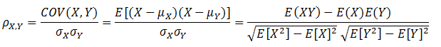
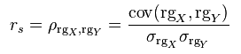
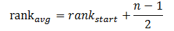

# 相关性系数

&emsp;&emsp;计算两个数据集的相关性是统计中的常用操作。在`MLlib`中提供了计算多个数据集两两相关的方法。目前支持的相关性方法有皮尔森(`Pearson`)相关和斯皮尔曼(`Spearman`)相关。

&emsp;&emsp;`Statistics`提供方法计算数据集的相关性。根据输入的类型，两个`RDD[Double]`或者一个`RDD[Vector]`，输出将会是一个`Double`值或者相关性矩阵。下面是一个应用的例子。

```scala
import org.apache.spark.SparkContext
import org.apache.spark.mllib.linalg._
import org.apache.spark.mllib.stat.Statistics
val sc: SparkContext = ...
val seriesX: RDD[Double] = ... // a series
val seriesY: RDD[Double] = ... // must have the same number of partitions and cardinality as seriesX
// compute the correlation using Pearson's method. Enter "spearman" for Spearman's method. If a 
// method is not specified, Pearson's method will be used by default. 
val correlation: Double = Statistics.corr(seriesX, seriesY, "pearson")
val data: RDD[Vector] = ... // note that each Vector is a row and not a column
// calculate the correlation matrix using Pearson's method. Use "spearman" for Spearman's method.
// If a method is not specified, Pearson's method will be used by default. 
val correlMatrix: Matrix = Statistics.corr(data, "pearson")
```
&emsp;&emsp;这个例子中我们看到，计算相关性的入口函数是`Statistics.corr`，当输入的数据集是两个`RDD[Double]`时，它的实际实现是`Correlations.corr`，当输入数据集是`RDD[Vector]`时，它的实际实现是`Correlations.corrMatrix`。
下文会分别分析这两个函数。

```scala
def corr(x: RDD[Double],
       y: RDD[Double],
       method: String = CorrelationNames.defaultCorrName): Double = {
    val correlation = getCorrelationFromName(method)
    correlation.computeCorrelation(x, y)
  }
def corrMatrix(X: RDD[Vector],
      method: String = CorrelationNames.defaultCorrName): Matrix = {
    val correlation = getCorrelationFromName(method)
    correlation.computeCorrelationMatrix(X)
  }
```
&emsp;&emsp;这两个函数的第一步就是获得对应方法名的相关性方法的实现对象。并且如果输入数据集是两个`RDD[Double]`，`MLlib`会将其统一转换为`RDD[Vector]`进行处理。

```scala
def computeCorrelationWithMatrixImpl(x: RDD[Double], y: RDD[Double]): Double = {
    val mat: RDD[Vector] = x.zip(y).map { case (xi, yi) => new DenseVector(Array(xi, yi)) }
    computeCorrelationMatrix(mat)(0, 1)
  }
```
&emsp;&emsp;不同的相关性方法，`computeCorrelationMatrix`的实现不同。下面分别介绍皮尔森相关与斯皮尔曼相关的实现。

## 1 皮尔森相关系数

&emsp;&emsp;皮尔森相关系数也叫皮尔森积差相关系数，是用来反映两个变量相似程度的统计量。或者说可以用来计算两个向量的相似度（在基于向量空间模型的文本分类、用户喜好推荐系统中都有应用）。皮尔森相关系数计算公式如下：

<div  align="center"></div>

&emsp;&emsp;当两个变量的线性关系增强时，相关系数趋于1或-1。正相关时趋于1，负相关时趋于-1。当两个变量独立时相关系统为0，但反之不成立。当`Y`和`X`服从联合正态分布时，其相互独立和不相关是等价的。
皮尔森相关系数的计算通过下面代码实现。

```scala
override def computeCorrelationMatrix(X: RDD[Vector]): Matrix = {
    val rowMatrix = new RowMatrix(X)
    //计算协方差矩阵
    val cov = rowMatrix.computeCovariance()
    computeCorrelationMatrixFromCovariance(cov)
  }
def computeCorrelationMatrixFromCovariance(covarianceMatrix: Matrix): Matrix = {
    val cov = covarianceMatrix.toBreeze.asInstanceOf[BDM[Double]]
    val n = cov.cols
    // 计算对角元素的标准差
    var i = 0
    while (i < n) {
      cov(i, i) = if (closeToZero(cov(i, i))) 0.0 else math.sqrt(cov(i, i))
      i +=1
    }
    // Loop through columns since cov is column major
    var j = 0
    var sigma = 0.0
    var containNaN = false
    while (j < n) {
      sigma = cov(j, j)
      i = 0
      while (i < j) {
        val corr = if (sigma == 0.0 || cov(i, i) == 0.0) {
          containNaN = true
          Double.NaN
        } else {
          //根据上文的公式计算，即cov(x,y)/(sigma_x * sigma_y)
          cov(i, j) / (sigma * cov(i, i))
        }
        cov(i, j) = corr
        cov(j, i) = corr
        i += 1
      }
      j += 1
    }
    // put 1.0 on the diagonals
    i = 0
    while (i < n) {
      cov(i, i) = 1.0
      i +=1
    }
    Matrices.fromBreeze(cov)
  }
```

## 2 斯皮尔曼相关系数

&emsp;&emsp;使用皮尔森线性相关系数有2个局限：首先，必须假设数据是成对地从正态分布中取得的；其次，数据至少在逻辑范围内是等距的。对不服从正态分布的资料不符合使用矩相关系数来描述关联性。
此时可采用秩相关（`rank correlation`），也称等级相关，来描述两个变量之间的关联程度与方向。斯皮尔曼秩相关系数就是其中一种。

&emsp;&emsp;斯皮尔曼秩相关系数定义为排序变量(`ranked variables`)之间的皮尔逊相关系数。对于大小为`n`的样本集，将原始的数据`X_i`和`Y_i`转换成排序变量`rgX_i`和`rgY_i`，然后按照皮尔森相关系数的计算公式进行计算。

<div  align="center"></div>

&emsp;&emsp;下面的代码将原始数据转换成了排序数据。

```scala
override def computeCorrelationMatrix(X: RDD[Vector]): Matrix = {
    // ((columnIndex, value), rowUid)
    //使用zipWithUniqueId产生的rowUid全局唯一
    val colBased = X.zipWithUniqueId().flatMap { case (vec, uid) =>
      vec.toArray.view.zipWithIndex.map { case (v, j) =>
        ((j, v), uid)
      }
    }
    // 通过(columnIndex, value)全局排序，排序的好处是使下面只需迭代一次
    val sorted = colBased.sortByKey()
    // 分配全局的ranks (using average ranks for tied values)
    val globalRanks = sorted.zipWithIndex().mapPartitions { iter =>
      var preCol = -1
      var preVal = Double.NaN
      var startRank = -1.0
      var cachedUids = ArrayBuffer.empty[Long]
      val flush: () => Iterable[(Long, (Int, Double))] = () => {
        val averageRank = startRank + (cachedUids.size - 1) / 2.0
        val output = cachedUids.map { uid =>
          (uid, (preCol, averageRank))
        }
        cachedUids.clear()
        output
      }
      iter.flatMap { case (((j, v), uid), rank) =>
        // 如果有新的值或者cachedUids过大, 调用flush
        if (j != preCol || v != preVal || cachedUids.size >= 10000000) {
          val output = flush()
          preCol = j
          preVal = v
          startRank = rank
          cachedUids += uid
          output
        } else {
          cachedUids += uid
          Iterator.empty
        }
      } ++ flush()
    } 
   //使用rank值代替原来的值
   val groupedRanks = globalRanks.groupByKey().map { case (uid, iter) =>
       // 根据列索引排序
       Vectors.dense(iter.toSeq.sortBy(_._1).map(_._2).toArray)
   }
```
&emsp;&emsp;在每个分区内部，对于列索引相同且值相同的数据对，我们为其分配平均`rank`值。平均`rank`的计算方式如下面公式所示：

<div  align="center"></div>

&emsp;&emsp;其中`rank_start`表示列索引相同且值相同的数据对在分区中第一次出现时的索引位置，`n`表示列索引相同且值相同的数据对出现的次数。

## 3 参考文献

【1】[Pearson product-moment correlation coefficient](https://en.wikipedia.org/wiki/Pearson_product-moment_correlation_coefficient)

【2】[Spearman's rank correlation coefficient](https://en.wikipedia.org/wiki/Spearman%27s_rank_correlation_coefficient)

【3】[相关性检验--Spearman秩相关系数和皮尔森相关系数](http://www.cnblogs.com/zhangchaoyang/articles/2631907.html)


