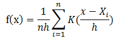
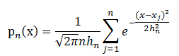

# 核密度估计

## 1 理论分析

&emsp;&emsp;核密度估计是在概率论中用来估计未知的密度函数，属于非参数检验方法之一。假设我们有`n`个数$x_{1},x_{2},...,x_{n}$，要计算某个数`X`的概率密度有多大，
可以通过下面的核密度估计方法估计。

<div  align="center"></div><br>

&emsp;&emsp;在上面的式子中，`K`为核密度函数，`h`为窗宽。核密度函数的原理比较简单，在我们知道某一事物的概率分布的情况下，如果某一个数在观察中出现了，我们可以认为这个数的概率密度很大，和这个数比较近的数的概率密度也会比较大，而那些离这个数远的数的概率密度会比较小。

&emsp;&emsp;基于这种想法，针对观察中的第一个数，我们可以用`K`去拟合我们想象中的那个远小近大概率密度。对每一个观察数拟合出的多个概率密度分布函数，取平均。如果某些数是比较重要的，则可以取加权平均。需要说明的一点是，核密度的估计并不是找到真正的分布函数。

&emsp;&emsp;在`MLlib`中，仅仅支持以高斯核做核密度估计。以高斯核做核密度估计时核密度估计公式**（1）**如下：

<div  align="center"></div><br>

## 2 例子

&emsp;&emsp;`KernelDensity`提供了方法通过样本`RDD`计算核密度估计。下面的例子给出了使用方法。

```scala
import org.apache.spark.mllib.stat.KernelDensity
import org.apache.spark.rdd.RDD
val data: RDD[Double] = ... // an RDD of sample data
// Construct the density estimator with the sample data and a standard deviation for the Gaussian
// kernels
val kd = new KernelDensity()
  .setSample(data)
  .setBandwidth(3.0)
// Find density estimates for the given values
val densities = kd.estimate(Array(-1.0, 2.0, 5.0))
```

## 3 代码实现

&emsp;&emsp;通过调用`KernelDensity.estimate`方法来实现核密度函数估计。看下面的代码。

```scala
def estimate(points: Array[Double]): Array[Double] = {
    val sample = this.sample
    val bandwidth = this.bandwidth
    val n = points.length
    // 在每个高斯密度函数计算中，这个值都需要计算，所以提前计算。
    val logStandardDeviationPlusHalfLog2Pi = math.log(bandwidth) + 0.5 * math.log(2 * math.Pi)
    val (densities, count) = sample.aggregate((new Array[Double](n), 0L))(
      (x, y) => {
        var i = 0
        while (i < n) {
          x._1(i) += normPdf(y, bandwidth, logStandardDeviationPlusHalfLog2Pi, points(i))
          i += 1
        }
        (x._1, x._2 + 1)
      },
      (x, y) => {
        //daxpy函数的作用是将一个向量加上另一个向量的值，即：dy[i]+=da*dx[i]，其中da为常数
        blas.daxpy(n, 1.0, y._1, 1, x._1, 1)
        (x._1, x._2 + y._2)
      })
    //在向量上乘一个常数
    blas.dscal(n, 1.0 / count, densities, 1)
    densities
  }
}
```
&emsp;&emsp;上述代码的`seqOp`函数中调用了`normPdf`，这个函数用于计算核函数为高斯分布的概率密度函数。参见上面的公式**(1)**。公式**(1)**的实现如下面代码。

```scala
 def normPdf(
      mean: Double,
      standardDeviation: Double,
      logStandardDeviationPlusHalfLog2Pi: Double,
      x: Double): Double = {
    val x0 = x - mean
    val x1 = x0 / standardDeviation
    val logDensity = -0.5 * x1 * x1 - logStandardDeviationPlusHalfLog2Pi
    math.exp(logDensity)
  }
```
&emsp;&emsp;该方法首先将公式**(1)**取对数，计算结果，然后再对计算结果取指数。

## 参考文献

【1】[核密度估计](http://blog.163.com/zhuandi_h/blog/static/1802702882012111092743556/)

【2】[R语言与非参数统计（核密度估计）](http://blog.sina.com.cn/s/blog_62b37bfe0101homb.html)