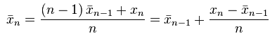
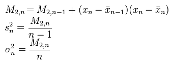
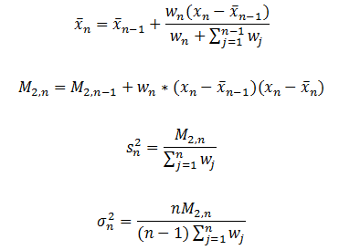
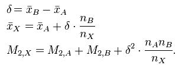
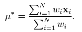
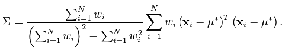

# 概括统计

&emsp;&emsp;`MLlib`支持`RDD[Vector]`列的概括统计，它通过调用`Statistics`的`colStats`方法实现。`colStats`返回一个`MultivariateStatisticalSummary`对象，这个对象包含列式的最大值、最小值、均值、方差等等。
下面是一个应用例子：

```scala
import org.apache.spark.mllib.linalg.Vector
import org.apache.spark.mllib.stat.{MultivariateStatisticalSummary, Statistics}
val observations: RDD[Vector] = ... // an RDD of Vectors
// Compute column summary statistics.
val summary: MultivariateStatisticalSummary = Statistics.colStats(observations)
println(summary.mean) // a dense vector containing the mean value for each column
println(summary.variance) // column-wise variance
println(summary.numNonzeros) // number of nonzeros in each column
```
&emsp;&emsp;下面我们具体看看`colStats`方法的实现。

```scala
def colStats(X: RDD[Vector]): MultivariateStatisticalSummary = {
    new RowMatrix(X).computeColumnSummaryStatistics()
  }
```
&emsp;&emsp;上面的代码非常明显，利用传人的`RDD`创建`RowMatrix`对象，利用方法`computeColumnSummaryStatistics`统计指标。

```scala
def computeColumnSummaryStatistics(): MultivariateStatisticalSummary = {
    val summary = rows.treeAggregate(new MultivariateOnlineSummarizer)(
      (aggregator, data) => aggregator.add(data),
      (aggregator1, aggregator2) => aggregator1.merge(aggregator2))
    updateNumRows(summary.count)
    summary
  }
```
&emsp;&emsp;上面的代码调用了`RDD`的`treeAggregate`方法，`treeAggregate`是聚合方法，它迭代处理`RDD`中的数据，其中，`(aggregator, data) => aggregator.add(data)`处理每条数据，将其添加到`MultivariateOnlineSummarizer`，
`(aggregator1, aggregator2) => aggregator1.merge(aggregator2)`将不同分区的`MultivariateOnlineSummarizer`对象汇总。所以上述代码实现的重点是`add`方法和`merge`方法。它们都定义在`MultivariateOnlineSummarizer`中。
我们先来看`add`代码。

```scala
@Since("1.1.0")
  def add(sample: Vector): this.type = add(sample, 1.0)
  private[spark] def add(instance: Vector, weight: Double): this.type = {
    if (weight == 0.0) return this
    if (n == 0) {
      n = instance.size
      currMean = Array.ofDim[Double](n)
      currM2n = Array.ofDim[Double](n)
      currM2 = Array.ofDim[Double](n)
      currL1 = Array.ofDim[Double](n)
      nnz = Array.ofDim[Double](n)
      currMax = Array.fill[Double](n)(Double.MinValue)
      currMin = Array.fill[Double](n)(Double.MaxValue)
    }
    val localCurrMean = currMean
    val localCurrM2n = currM2n
    val localCurrM2 = currM2
    val localCurrL1 = currL1
    val localNnz = nnz
    val localCurrMax = currMax
    val localCurrMin = currMin
    instance.foreachActive { (index, value) =>
      if (value != 0.0) {
        if (localCurrMax(index) < value) {
          localCurrMax(index) = value
        }
        if (localCurrMin(index) > value) {
          localCurrMin(index) = value
        }
        val prevMean = localCurrMean(index)
        val diff = value - prevMean
        localCurrMean(index) = prevMean + weight * diff / (localNnz(index) + weight)
        localCurrM2n(index) += weight * (value - localCurrMean(index)) * diff
        localCurrM2(index) += weight * value * value
        localCurrL1(index) += weight * math.abs(value)
        localNnz(index) += weight
      }
    }
    weightSum += weight
    weightSquareSum += weight * weight
    totalCnt += 1
    this
  }
```
&emsp;&emsp;这段代码使用了在线算法来计算均值和方差。根据文献【1】的介绍，计算均值和方差遵循如下的迭代公式：

<div  align="center"></div>

<div  align="center"></div>

&emsp;&emsp;在上面的公式中，`x`表示样本均值，`s`表示样本方差，`delta`表示总体方差。`MLlib`实现的是带有权重的计算，所以使用的迭代公式略有不同，参考文献【2】。

<div  align="center"></div>

&emsp;&emsp;`merge`方法相对比较简单，它只是对两个`MultivariateOnlineSummarizer`对象的指标作合并操作。

```scala
 def merge(other: MultivariateOnlineSummarizer): this.type = {
    if (this.weightSum != 0.0 && other.weightSum != 0.0) {
      totalCnt += other.totalCnt
      weightSum += other.weightSum
      weightSquareSum += other.weightSquareSum
      var i = 0
      while (i < n) {
        val thisNnz = nnz(i)
        val otherNnz = other.nnz(i)
        val totalNnz = thisNnz + otherNnz
        if (totalNnz != 0.0) {
          val deltaMean = other.currMean(i) - currMean(i)
          // merge mean together
          currMean(i) += deltaMean * otherNnz / totalNnz
          // merge m2n together，不单纯是累加
          currM2n(i) += other.currM2n(i) + deltaMean * deltaMean * thisNnz * otherNnz / totalNnz
          // merge m2 together
          currM2(i) += other.currM2(i)
          // merge l1 together
          currL1(i) += other.currL1(i)
          // merge max and min
          currMax(i) = math.max(currMax(i), other.currMax(i))
          currMin(i) = math.min(currMin(i), other.currMin(i))
        }
        nnz(i) = totalNnz
        i += 1
      }
    } else if (weightSum == 0.0 && other.weightSum != 0.0) {
      this.n = other.n
      this.currMean = other.currMean.clone()
      this.currM2n = other.currM2n.clone()
      this.currM2 = other.currM2.clone()
      this.currL1 = other.currL1.clone()
      this.totalCnt = other.totalCnt
      this.weightSum = other.weightSum
      this.weightSquareSum = other.weightSquareSum
      this.nnz = other.nnz.clone()
      this.currMax = other.currMax.clone()
      this.currMin = other.currMin.clone()
    }
    this
  }
```
&emsp;&emsp;这里需要注意的是，在线算法的并行化实现是一种特殊情况。例如样本集`X`分到两个不同的分区，分别为`X_A`和`X_B`，那么它们的合并需要满足下面的公式：

<div  align="center"></div>

&emsp;&emsp;依靠文献【3】我们可以知道，样本方差的无偏估计由下面的公式给出：

<div  align="center"></div>

<div  align="center"></div>

&emsp;&emsp;所以，真实的样本均值和样本方差通过下面的代码实现。

```scala
override def mean: Vector = {
    val realMean = Array.ofDim[Double](n)
    var i = 0
    while (i < n) {
      realMean(i) = currMean(i) * (nnz(i) / weightSum)
      i += 1
    }
    Vectors.dense(realMean)
  }
 override def variance: Vector = {
    val realVariance = Array.ofDim[Double](n)
    val denominator = weightSum - (weightSquareSum / weightSum)
    // Sample variance is computed, if the denominator is less than 0, the variance is just 0.
    if (denominator > 0.0) {
      val deltaMean = currMean
      var i = 0
      val len = currM2n.length
      while (i < len) {
        realVariance(i) = (currM2n(i) + deltaMean(i) * deltaMean(i) * nnz(i) *
          (weightSum - nnz(i)) / weightSum) / denominator
        i += 1
      }
    }
    Vectors.dense(realVariance)
  }
```

# 参考文献

【1】[Algorithms for calculating variance](https://en.wikipedia.org/wiki/Algorithms_for_calculating_variance)

【2】[Updating mean and variance estimates: an improved method](http://people.xiph.org/~tterribe/tmp/homs/West79-_Updating_Mean_and_Variance_Estimates-_An_Improved_Method.pdf)

【3】[Weighted arithmetic mean](https://en.wikipedia.org/wiki/Weighted_arithmetic_mean)
