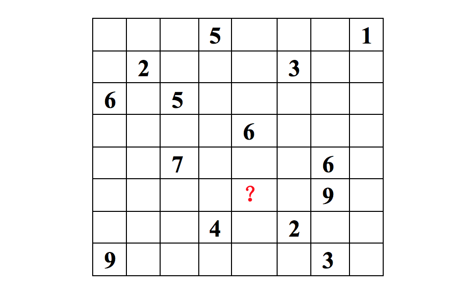
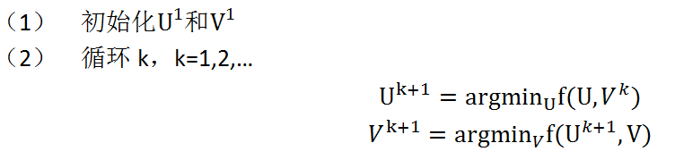
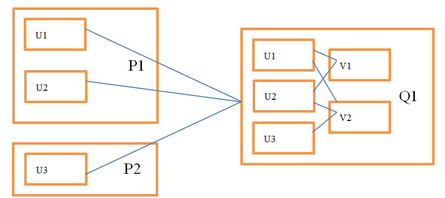

# 交换最小二乘

## 1 什么是ALS

&emsp;&emsp;`ALS`是交替最小二乘（`alternating least squares`）的简称。在机器学习中，`ALS`特指使用交替最小二乘求解的一个协同推荐算法。它通过观察到的所有用户给商品的打分，来推断每个用户的喜好并向用户推荐适合的商品。举个例子，我们看下面一个`8*8`的用户打分矩阵。

<div  align="center"></div>

&emsp;&emsp;&emsp;这个矩阵的每一行代表一个用户`（u1,u2,…,u8）`、每一列代表一个商品`（v1,v2,…,v8）`、用户的打分为`1-9`分。这个矩阵只显示了观察到的打分，我们需要推测没有观察到的打分。比如`（u6，v5）`打分多少？如果以数独的方式来解决这个问题，可以得到唯一的结果。
因为数独的规则很强，每添加一条规则，就让整个系统的自由度下降一个量级。当我们满足所有的规则时，整个系统的自由度就降为`1`了，也就得出了唯一的结果。对于上面的打分矩阵，如果我们不添加任何条件的话，也即打分之间是相互独立的，我们就没法得到`（u6，v5）`的打分。
所以在这个用户打分矩阵的基础上，我们需要提出一个限制其自由度的合理假设，使得我们可以通过观察已有打分来猜测未知打分。

&emsp;&emsp;`ALS`的核心就是这样一个假设：打分矩阵是近似低秩的。换句话说，就是一个`m*n`的打分矩阵可以由分解的两个小矩阵`U（m*k）`和`V（k*n）`的乘积来近似，即$A=U{V}^{T},k <= m,n$。这就是`ALS`的矩阵分解方法。这样我们把系统的自由度从`O(mn)`降到了`O((m+n)k)`。

&emsp;&emsp;那么`ALS`的低秩假设为什么是合理的呢？我们描述一个人的喜好经常是在一个抽象的低维空间上进行的，并不需要一一列出他喜好的事物。例如，我喜好看侦探影片，可能代表我喜欢《神探夏洛特》、《神探狄仁杰》等。这些影片都符合我对自己喜好的描述，也就是说他们在这个抽象的低维空间的投影和我的喜好相似。
再抽象一些来描述这个问题，我们把某个人的喜好映射到了低维向量`ui`上，同时将某个影片的特征映射到了维度相同的向量`vj`上，那么这个人和这个影片的相似度就可以表述成这两个向量之间的内积$u_{i}^{T}v_{j}$ 。
我们把打分理解成相似度，那么打分矩阵A就可以由用户喜好矩阵和产品特征矩阵的乘积$ U{V}^{T} $来近似了。

&emsp;&emsp;低维空间的选取是一个问题。这个低维空间要能够很好的区分事物，那么就需要一个明确的可量化目标，这就是重构误差。在`ALS`中我们使用F范数来量化重构误差，就是每个元素重构误差的平方和。这里存在一个问题，我们只观察到部分打分，`A`中的大量未知元是我们想推断的，所以这个重构误差是包含未知数的。
解决方案很简单：只计算已知打分的重构误差。

<div  align="center"></div>

&emsp;&emsp;后面的章节我们将从原理上讲解`spark`中实现的`ALS`模型。

## 2 spark中ALS的实现原理

&emsp;&emsp;`Spark`利用交换最小二乘解决矩阵分解问题分两种情况：数据集是显式反馈和数据集是隐式反馈。由于隐式反馈算法的原理是在显示反馈算法原理的基础上作的修改，所以我们在此只会具体讲解数据集为隐式反馈的算法。
算法实现所依据的文献见参考文献【1】。

### 2.1 介绍

&emsp;&emsp;从广义上讲，推荐系统基于两种不同的策略：基于内容的方法和基于协同过滤的方法。`Spark`中使用协同过滤的方式。协同过滤分析用户以及用户相关的产品的相关性，用以识别新的用户-产品相关性。协同过滤系统需要的唯一信息是用户过去的行为信息，比如对产品的评价信息。协同过滤是领域无关的，所以它可以方便解决基于内容方法难以解决的许多问题。

&emsp;&emsp;推荐系统依赖不同类型的输入数据，最方便的是高质量的显式反馈数据，它们包含用户对感兴趣商品明确的评价。例如，`Netflix`收集的用户对电影评价的星星等级数据。但是显式反馈数据不一定总是找得到，因此推荐系统可以从更丰富的隐式反馈信息中推测用户的偏好。
隐式反馈类型包括购买历史、浏览历史、搜索模式甚至鼠标动作。例如，购买同一个作者许多书的用户可能喜欢这个作者。

&emsp;&emsp;许多研究都集中在处理显式反馈，然而在很多应用场景下，应用程序重点关注隐式反馈数据。因为可能用户不愿意评价商品或者由于系统限制我们不能收集显式反馈数据。在隐式模型中，一旦用户允许收集可用的数据，在客户端并不需要额外的显式数据。文献中的系统避免主动地向用户收集显式反馈信息，所以系统仅仅依靠隐式信息。

&emsp;&emsp;了解隐式反馈的特点非常重要，因为这些特质使我们避免了直接调用基于显式反馈的算法。最主要的特点有如下几种：

- （1）	没有负反馈。通过观察用户行为，我们可以推测那个商品他可能喜欢，然后购买，但是我们很难推测哪个商品用户不喜欢。这在显式反馈算法中并不存在，因为用户明确告诉了我们哪些他喜欢哪些他不喜欢。

- （2）	隐式反馈是内在的噪音。虽然我们拼命的追踪用户行为，但是我们仅仅只是猜测他们的偏好和真实动机。例如，我们可能知道一个人的购买行为，但是这并不能完全说明偏好和动机，因为这个商品可能作为礼物被购买而用户并不喜欢它。

- （3）	显示反馈的数值值表示偏好（`preference`），隐式回馈的数值值表示信任（`confidence`）。基于显示反馈的系统用星星等级让用户表达他们的喜好程度，例如一颗星表示很不喜欢，五颗星表示非常喜欢。基于隐式反馈的数值值描述的是动作的频率，例如用户购买特定商品的次数。一个较大的值并不能表明更多的偏爱。但是这个值是有用的，它描述了在一个特定观察中的信任度。
一个发生一次的事件可能对用户偏爱没有用，但是一个周期性事件更可能反映一个用户的选择。

- （4）	评价隐式反馈推荐系统需要合适的手段。

### 2.2 显式反馈模型

&emsp;&emsp;潜在因素模型由一个针对协同过滤的交替方法组成，它以一个更加全面的方式发现潜在特征来解释观察的`ratings`数据。我们关注的模型由奇异值分解（`SVD`）推演而来。一个典型的模型将每个用户`u`（包含一个用户-因素向量`ui`）和每个商品`v`（包含一个商品-因素向量`vj`）联系起来。
预测通过内积$r_{ij}=u_{i}^{T}v_{j}$来实现。另一个需要关注的地方是参数估计。许多当前的工作都应用到了显式反馈数据集中，这些模型仅仅基于观察到的`rating`数据直接建模，同时通过一个适当的正则化来避免过拟合。公式如下：

<div  align="center"></div>

&emsp;&emsp;在公式(2.1)中，`lambda`是正则化的参数。正规化是为了防止过拟合的情况发生，具体参见文献【3】。这样，我们用最小化重构误差来解决协同推荐问题。我们也成功将推荐问题转换为了最优化问题。


### 2.3 隐式反馈模型

&emsp;&emsp;在显式反馈的基础上，我们需要做一些改动得到我们的隐式反馈模型。首先，我们需要形式化由$r_{ij}$变量衡量的信任度的概念。我们引入了一组二元变量$p_{ij}$ ，它表示用户`u`对商品`v`的偏好。$p_{ij}$的公式如下：

<div  align="center"></div>

&emsp;&emsp;换句话说，如果用户购买了商品，我们认为用户喜欢该商品，否则我们认为用户不喜欢该商品。然而我们的信念（`beliefs`）与变化的信任（`confidence`）等级息息相关。首先，很自然的，$p_{ij}$的值为0和低信任有关。用户对一个商品没有得到一个正的偏好可能源于多方面的原因，并不一定是不喜欢该商品。例如，用户可能并不知道该商品的存在。
另外，用户购买一个商品也并不一定是用户喜欢它。因此我们需要一个新的信任等级来显示用户偏爱某个商品。一般情况下，$r_{ij}$越大，越能暗示用户喜欢某个商品。因此，我们引入了一组变量$c_{ij}$，它衡量了我们观察到$p_{ij}$的信任度。$c_{ij}$一个合理的选择如下所示：

<div  align="center"></div>

&emsp;&emsp;按照这种方式，我们存在最小限度的信任度，并且随着我们观察到的正偏向的证据越来越多，信任度也会越来越大。

&emsp;&emsp;我们的目的是找到用户向量`ui`以及商品向量`vj`来表明用户偏好。这些向量分别是用户因素（特征）向量和商品因素（特征）向量。本质上，这些向量将用户和商品映射到一个公用的隐式因素空间，从而使它们可以直接比较。这和用于显式数据集的矩阵分解技术类似，但是包含两点不一样的地方：
（1）我们需要考虑不同的信任度，（2）最优化需要考虑所有可能的`u，v`对，而不仅仅是和观察数据相关的`u，v`对。显性反馈的矩阵分解优化时，对于`missing data`(没有评分)，是不会当做训练数据输入到模型的，优化时针对已知评分数据优化。而这里隐性反馈，是利用所有可能的`u`,`i`键值对，所以总的数据是`m*n`，其中`m`是用户数量，`n`是物品数量。这里没有所谓的`missing data`，因为假如`u`对`i`没有任何动作，我们就认为偏好值为0，只不过置信度较低而已。因此，通过最小化下面的损失函数来计算相关因素（`factors`）。

$$min_{u,v}\sum _{i,j}c_{ij}(p_{ij}-u_{i}^{T}v_{j})^{2} + \lambda (\sum_{i}\left \| u_{i} \right \|^{2} + \sum_{j}\left \|v_{j} \right \|^{2})$$

### 2.4 求解最小化损失函数

&emsp;&emsp;考虑到损失函数包含`m*n`个元素，`m`是用户的数量，`n`是商品的数量。一般情况下，`m*n`可以到达几百亿。这么多的元素应该避免使用随机梯度下降法来求解，因此，spark选择使用交替最优化方式求解。

&emsp;&emsp;公式（2.1）和公式（2.4）是非凸函数，无法求解最优解。但是，固定公式中的用户-特征向量或者商品-特征向量，公式就会变成二次方程，可以求出全局的极小值。交替最小二乘的计算过程是：交替的重新计算用户-特征向量和商品-特征向量，每一步都保证降低损失函数的值，直到找到极小值。
交替最小二乘法的处理过程如下所示：

<div  align="center"></div>

## 3 ALS在spark中的实现

&emsp;&emsp;在`spark`的源代码中，`ALS`算法实现于`org.apache.spark.ml.recommendation.ALS.scala`文件中。我们以官方文档中的例子为起点，来分析`ALS`算法的分布式实现。下面是官方的例子：

```scala
//处理训练数据
val data = sc.textFile("data/mllib/als/test.data")
val ratings = data.map(_.split(',') match { case Array(user, item, rate) =>
  Rating(user.toInt, item.toInt, rate.toDouble)
})
// 使用ALS训练推荐模型
val rank = 10
val numIterations = 10
val model = ALS.train(ratings, rank, numIterations, 0.01)
```

&emsp;&emsp;从代码中我们知道，训练模型用到了`ALS.scala`文件中的`train`方法，下面我们将详细介绍`train`方法的实现。在此之前，我们先了解一下`train`方法的参数表示的含义。

```scala
def train( 
    ratings: RDD[Rating[ID]],  //训练数据
    rank: Int = 10,   //隐含特征数
    numUserBlocks: Int = 10, //分区数
    numItemBlocks: Int = 10,
    maxIter: Int = 10,   //迭代次数
    regParam: Double = 1.0,
    implicitPrefs: Boolean = false,
    alpha: Double = 1.0,
    nonnegative: Boolean = false,
    intermediateRDDStorageLevel: StorageLevel = StorageLevel.MEMORY_AND_DISK,
    finalRDDStorageLevel: StorageLevel = StorageLevel.MEMORY_AND_DISK,
    checkpointInterval: Int = 10,
    seed: Long = 0L): MatrixFactorizationModel
```

&emsp;&emsp;以上定义中，`ratings`指用户提供的训练数据，它包括用户`id`集、商品`id`集以及相应的打分集。`rank`表示隐含因素的数量，也即特征的数量。`numUserBlocks`和`numItemBlocks`分别指用户和商品的块数量，即分区数量。`maxIter`表示迭代次数。`regParam`表示最小二乘法中`lambda`值的大小。
`implicitPrefs`表示我们的训练数据是否是隐式反馈数据。`Nonnegative`表示求解的最小二乘的值是否是非负,根据`Nonnegative`的值的不同，`spark`使用了不同的求解方法。

&emsp;&emsp;下面我们分步骤分析`train`方法的处理流程。

- **(1) 初始化`ALSPartitioner`和`LocalIndexEncoder`**。

&emsp;&emsp;`ALSPartitioner`实现了基于`hash`的分区，它根据用户或者商品`id`的`hash`值来进行分区。`LocalIndexEncoder`对`（blockid，localindex）`即`（分区id，分区内索引）`进行编码，并将其转换为一个整数，这个整数在高位存分区`ID`，在低位存对应分区的索引，在空间上尽量做到了不浪费。
同时也可以根据这个转换的整数分别获得`blockid`和`localindex`。这两个对象在后续的代码中会用到。

```scala
val userPart = new ALSPartitioner(numUserBlocks)
val itemPart = new ALSPartitioner(numItemBlocks)
val userLocalIndexEncoder = new LocalIndexEncoder(userPart.numPartitions)
val itemLocalIndexEncoder = new LocalIndexEncoder(itemPart.numPartitions)


//ALSPartitioner即HashPartitioner
class HashPartitioner(partitions: Int) extends Partitioner {
  def numPartitions: Int = partitions
  def getPartition(key: Any): Int = key match {
    case null => 0
    case _ => Utils.nonNegativeMod(key.hashCode, numPartitions)
  }
  override def equals(other: Any): Boolean = other match {
    case h: HashPartitioner =>
      h.numPartitions == numPartitions
    case _ =>
      false
  }
  override def hashCode: Int = numPartitions
}

//LocalIndexEncoder
private[recommendation] class LocalIndexEncoder(numBlocks: Int) extends Serializable {

    private[this] final val numLocalIndexBits =
      math.min(java.lang.Integer.numberOfLeadingZeros(numBlocks - 1), 31)
    //左移（<<,相当于乘2），右移（>>，相当于除2）和无符号右移（>>>，无符号右移，忽略符号位，空位都以0补齐）
    private[this] final val localIndexMask = (1 << numLocalIndexBits) - 1
    //encodeIndex高位存分区ID，在低位存对应分区的索引
    def encode(blockId: Int, localIndex: Int): Int = {
      (blockId << numLocalIndexBits) | localIndex
    }
    @inline
    def blockId(encoded: Int): Int = {
      encoded >>> numLocalIndexBits
    }

    @inline
    def localIndex(encoded: Int): Int = {
      encoded & localIndexMask
    }
  }
```

- **(2) 根据`nonnegative`参数选择解决矩阵分解的方法**。

&emsp;&emsp;如果需要解的值为非负,即`nonnegative`为`true`，那么用非负最小二乘（`NNLS`）来解，如果没有这个限制，用乔里斯基（`Cholesky`）分解来解。

```scala
val solver = if (nonnegative) new NNLSSolver else new CholeskySolver
```
&emsp;&emsp;乔里斯基分解分解是把一个对称正定的矩阵表示成一个上三角矩阵`U`的转置和其本身的乘积的分解。在`ml`代码中，直接调用[netlib-java](https://github.com/fommil/netlib-java)封装的`dppsv`方法实现。

```scala
lapack.dppsv(“u”, k, 1, ne.ata, ne.atb, k, info)
```

&emsp;&emsp;可以深入`dppsv`代码（`Fortran`代码）了解更深的细节。我们分析的重点是非负正则化最小二乘的实现，因为在某些情况下，方程组的解为负数是没有意义的。虽然方程组可以得到精确解，但却不能取负值解。在这种情况下，其非负最小二乘解比方程的精确解更有意义。``NNLS`在最优化模块会作详细讲解。

- **(3) 将`ratings`数据转换为分区的格式**。

&emsp;&emsp;将`ratings`数据转换为分区的形式，即`（（用户分区id，商品分区id），分区数据集blocks））`的形式，并缓存到内存中。其中分区id的计算是通过`ALSPartitioner`的`getPartitions`方法获得的，分区数据集由`RatingBlock`组成，
它表示`（用户分区id，商品分区id ）`对所对应的用户id集，商品id集，以及打分集，即`（用户id集，商品id集，打分集）`。

```scala
val blockRatings = partitionRatings(ratings, userPart, itemPart)
  .persist(intermediateRDDStorageLevel)
  
//以下是partitionRatings的实现
  //默认是10*10
  val numPartitions = srcPart.numPartitions * dstPart.numPartitions
  ratings.mapPartitions { iter =>
      val builders = Array.fill(numPartitions)(new RatingBlockBuilder[ID])
      iter.flatMap { r =>
        val srcBlockId = srcPart.getPartition(r.user)
        val dstBlockId = dstPart.getPartition(r.item)
        //当前builder的索引位置
        val idx = srcBlockId + srcPart.numPartitions * dstBlockId
        val builder = builders(idx)
        builder.add(r)
        //如果某个builder的数量大于2048，那么构建一个分区
        if (builder.size >= 2048) { // 2048 * (3 * 4) = 24k
          builders(idx) = new RatingBlockBuilder
          //单元素集合
          Iterator.single(((srcBlockId, dstBlockId), builder.build()))
        } else {
          Iterator.empty
        }
      } ++ {
        builders.view.zipWithIndex.filter(_._1.size > 0).map { case (block, idx) =>
          //用户分区id
          val srcBlockId = idx % srcPart.numPartitions
          //商品分区id
          val dstBlockId = idx / srcPart.numPartitions
          ((srcBlockId, dstBlockId), block.build())
        }
      }
    }.groupByKey().mapValues { blocks =>
      val builder = new RatingBlockBuilder[ID]
      blocks.foreach(builder.merge)
      builder.build()
    }.setName("ratingBlocks")
  }
```

- **（4）获取`inblocks`和`outblocks`数据**。

&emsp;&emsp;获取`inblocks`和`outblocks`数据是数据处理的重点。我们知道，通信复杂度是分布式实现一个算法时要重点考虑的问题，不同的实现可能会对性能产生很大的影响。我们假设最坏的情况：即求解商品需要的所有用户特征都需要从其它节点获得。
如下图3.1所示，求解`v1`需要获得`u1`,`u2`，求解`v2`需要获得`u1`,`u2`,`u3`等，在这种假设下，每步迭代所需的交换数据量是`O(m*rank)`，其中`m`表示所有观察到的打分集大小，`rank`表示特征数量。

<div  align="center"></div><br>

&emsp;&emsp;从图3.1中，我们知道，如果计算`v1`和`v2`是在同一个分区上进行的，那么我们只需要把`u1`和`u2`一次发给这个分区就好了，而不需要将`u2`分别发给`v1`,`v2`，这样就省掉了不必要的数据传输。

&emsp;&emsp;图3.2描述了如何在分区的情况下通过`U`来求解`V`，注意节点之间的数据交换量减少了。使用这种分区结构，我们需要在原始打分数据的基础上额外保存一些信息。

<div  align="center"></div><br>

&emsp;&emsp;在`Q1`中，我们需要知道和`v1`相关联的用户向量及其对应的打分，从而构建最小二乘问题并求解。这部分数据不仅包含原始打分数据，还包含从每个用户分区收到的向量排序信息，在代码里称作`InBlock`。在`P1`中，我们要知道把`u1`,`u2` 发给`Q1`。我们可以查看和`u1`相关联的所有产品来确定需要把`u1`发给谁，但每次迭代都扫一遍数据很不划算，所以在`spark`的实现中只计算一次这个信息，然后把结果通过`RDD`缓存起来重复使用。这部分数据我们在代码里称作`OutBlock`。
所以从`U`求解`V`，我们需要通过用户的`OutBlock`信息把用户向量发给商品分区，然后通过商品的`InBlock`信息构建最小二乘问题并求解。从`V`求解`U`，我们需要商品的`OutBlock`信息和用户的`InBlock`信息。所有的`InBlock`和`OutBlock`信息在迭代过程中都通过`RDD`缓存。打分数据在用户的`InBlock`和商品的`InBlock`各存了一份，但分区方式不同。这么做可以避免在迭代过程中原始数据的交换。

&emsp;&emsp;下面介绍获取`InBlock`和`OutBlock`的方法。下面的代码用来分别获取用户和商品的`InBlock`和`OutBlock`。

```scala
val (userInBlocks, userOutBlocks) =makeBlocks("user", blockRatings,
 userPart, itemPart,intermediateRDDStorageLevel)
//交换userBlockId和itemBlockId以及其对应的数据
val swappedBlockRatings = blockRatings.map {
  case ((userBlockId, itemBlockId), RatingBlock(userIds, itemIds, localRatings)) =>
    ((itemBlockId, userBlockId), RatingBlock(itemIds, userIds, localRatings))
}
val (itemInBlocks, itemOutBlocks) =makeBlocks("item", swappedBlockRatings,
 itemPart, userPart,intermediateRDDStorageLevel)
```

&emsp;&emsp;我们会以求商品的`InBlock`以及用户的`OutBlock`为例来分析`makeBlocks`方法。因为在第（5）步中构建最小二乘的讲解中，我们会用到这两部分数据。

&emsp;&emsp;下面的代码用来求商品的`InBlock`信息。

```scala
val inBlocks = ratingBlocks.map {
  case ((srcBlockId, dstBlockId), RatingBlock(srcIds, dstIds, ratings)) =>
    val start = System.nanoTime()
    val dstIdSet = new OpenHashSet[ID](1 << 20)
    //将用户id保存到hashset中，用来去重
    dstIds.foreach(dstIdSet.add)
    val sortedDstIds = new Array[ID](dstIdSet.size)
    var i = 0
    var pos = dstIdSet.nextPos(0)
    while (pos != -1) {
      sortedDstIds(i) = dstIdSet.getValue(pos)
      pos = dstIdSet.nextPos(pos + 1)
      i += 1
    }
    //对用户id进行排序
    Sorting.quickSort(sortedDstIds)
    val dstIdToLocalIndex = new OpenHashMap[ID, Int](sortedDstIds.length)
    i = 0
    while (i < sortedDstIds.length) {
      dstIdToLocalIndex.update(sortedDstIds(i), i)
      i += 1
    }
    //求取块内，用户id的本地位置
    val dstLocalIndices = dstIds.map(dstIdToLocalIndex.apply)
    //返回数据集
    (srcBlockId, (dstBlockId, srcIds, dstLocalIndices, ratings))
}.groupByKey(new ALSPartitioner(srcPart.numPartitions))
  .mapValues { iter =>
    val builder =
      new UncompressedInBlockBuilder[ID](new LocalIndexEncoder(dstPart.numPartitions))
    iter.foreach { case (dstBlockId, srcIds, dstLocalIndices, ratings) =>
      builder.add(dstBlockId, srcIds, dstLocalIndices, ratings)
    }
    //构建非压缩块，并压缩为InBlock
    builder.build().compress()
  }.setName(prefix + "InBlocks")
  .persist(storageLevel)
```

&emsp;&emsp;这段代码首先对`ratingBlocks`数据集作`map`操作，将`ratingBlocks`转换成`（商品分区id，（用户分区id，商品集合，用户id在分区中相对应的位置，打分）`这样的集合形式。然后对这个数据集作`groupByKey`操作，以商品分区`id`为`key`值，处理`key`对应的值，将数据集转换成`（商品分区id，InBlocks）`的形式。
这里值得我们去分析的是输入块（`InBlock`）的结构。为简单起见，我们用图3.2为例来说明输入块的结构。

&emsp;&emsp;以`Q1`为例，我们需要知道关于`v1`和`v2`的所有打分：`(v1, u1, r11)，(v2, u1, r12)， (v1, u2, r21)， (v2, u2, r22)， (v2, u3, r32)`，把这些项以`Tuple`的形式存储会存在问题，第一，`Tuple`有额外开销，每个`Tuple`实例都需要一个指针，而每个`Tuple`所存的数据不过是两个ID和一个打分；
第二，存储大量的`Tuple`会降低垃圾回收的效率。所以`spark`实现中，是使用三个数组来存储打分的，如`([v1, v2, v1, v2, v2], [u1, u1, u2, u2, u3], [r11, r12, r21, r22, r32])`。这样不仅大幅减少了实例数量，还有效地利用了连续内存。

&emsp;&emsp;但是，光这么做并不够，`spark`代码实现中，并没有存储用户的真实id，而是存储的使用`LocalIndexEncoder`生成的编码，这样节省了空间，格式为`UncompressedInBlock`:`（商品id集，用户id集对应的编码集，打分集）`，
如，`([v1, v2, v1, v2, v2], [ui1, ui1, ui2, ui2, ui3], [r11, r12, r21, r22, r32])`。这种结构仍旧有压缩的空间，`spark`调用`compress`方法将商品`id`进行排序（排序有两个好处，除了压缩以外，后文构建最小二乘也会因此受益），
并且转换为`（不重复的有序的商品id集，商品位置偏移集，用户id集对应的编码集，打分集）`的形式，以获得更优的存储效率（代码中就是将矩阵的`coo`格式转换为`csc`格式，你可以更进一步了解矩阵存储，以获得更多信息）。
以这样的格式修改`([v1, v2, v1, v2, v2], [ui1, ui1, ui2, ui2, ui3], [r11, r12, r21, r22, r32])`，得到的结果是`([v1, v2], [0, 2, 5], [ui1, ui2, ui1, ui2, ui3], [r11, r21, r12, r22, r32])`。其中`[0, 2]`指`v1`对应的打分的区间是`[0, 2]`，`[2, 5]`指`v2`对应的打分的区间是`[2, 5]`。

&emsp;&emsp;`Compress`方法利用`spark`内置的`Timsort`算法将`UncompressedInBlock`进行排序并转换为`InBlock`。代码如下所示：

```scala
def compress(): InBlock[ID] = {
  val sz = length
  //Timsort排序
  sort()
  val uniqueSrcIdsBuilder = mutable.ArrayBuilder.make[ID]
  val dstCountsBuilder = mutable.ArrayBuilder.make[Int]
  var preSrcId = srcIds(0)
  uniqueSrcIdsBuilder += preSrcId
  var curCount = 1
  var i = 1
  var j = 0
  while (i < sz) {
    val srcId = srcIds(i)
    if (srcId != preSrcId) {
      uniqueSrcIdsBuilder += srcId
      dstCountsBuilder += curCount
      preSrcId = srcId
      j += 1
      curCount = 0
    }
    curCount += 1
    i += 1
  }
  dstCountsBuilder += curCount
  val uniqueSrcIds = uniqueSrcIdsBuilder.result()
  val numUniqueSrdIds = uniqueSrcIds.length
  val dstCounts = dstCountsBuilder.result()
  val dstPtrs = new Array[Int](numUniqueSrdIds + 1)
  var sum = 0
  i = 0
  //计算偏移量
  while (i < numUniqueSrdIds) {
    sum += dstCounts(i)
    i += 1
    dstPtrs(i) = sum
  }
  InBlock(uniqueSrcIds, dstPtrs, dstEncodedIndices, ratings)
}
private def sort(): Unit = {
  val sz = length
  val sortId = Utils.random.nextInt()
  val sorter = new Sorter(new UncompressedInBlockSort[ID])
  sorter.sort(this, 0, length, Ordering[KeyWrapper[ID]])
  }
```

&emsp;&emsp;下面的代码用来求用户的`OutBlock`信息。

```scala
val outBlocks = inBlocks.mapValues { case InBlock(srcIds, dstPtrs, dstEncodedIndices, _) =>
  val encoder = new LocalIndexEncoder(dstPart.numPartitions)
  val activeIds = Array.fill(dstPart.numPartitions)(mutable.ArrayBuilder.make[Int])
  var i = 0
  val seen = new Array[Boolean](dstPart.numPartitions)
  while (i < srcIds.length) {
    var j = dstPtrs(i)
    ju.Arrays.fill(seen, false)
    while (j < dstPtrs(i + 1)) {
      val dstBlockId = encoder.blockId(dstEncodedIndices(j))
      if (!seen(dstBlockId)) {
        activeIds(dstBlockId) += i 
        seen(dstBlockId) = true
      }
      j += 1
    }
    i += 1
  }
  activeIds.map { x =>
    x.result()
  }
}.setName(prefix + "OutBlocks")
  .persist(storageLevel)
```

&emsp;&emsp;这段代码中，`inBlocks`表示用户的输入分区块，格式为`（用户分区id，（不重复的用户id集，用户位置偏移集，商品id集对应的编码集，打分集））`。
`activeIds`表示商品分区中涉及的用户id集，也即上文所说的需要发送给确定的商品分区的用户信息。`activeIds`是一个二维数组，第一维表示分区，第二维表示用户id集。用户`OutBlocks`的最终格式是`（用户分区id，OutBlocks）`。

&emsp;&emsp;通过用户的`OutBlock`把用户信息发给商品分区，然后结合商品的`InBlock`信息构建最小二乘问题，我们就可以借此解得商品的极小解。反之，通过商品`OutBlock`把商品信息发送给用户分区，然后结合用户的`InBlock`信息构建最小二乘问题，我们就可以解得用户解。
第（6）步会详细介绍如何构建最小二乘。

- **（5）初始化用户特征矩阵和商品特征矩阵。**

&emsp;&emsp;交换最小二乘算法是分别固定用户特征矩阵和商品特征矩阵来交替计算下一次迭代的商品特征矩阵和用户特征矩阵。通过下面的代码初始化第一次迭代的特征矩阵。

```scala
var userFactors = initialize(userInBlocks, rank, seedGen.nextLong())
var itemFactors = initialize(itemInBlocks, rank, seedGen.nextLong())
```

&emsp;&emsp;初始化后的`userFactors`的格式是`（用户分区id，用户特征矩阵factors）`，其中`factors`是一个二维数组，第一维的长度是用户数，第二维的长度是`rank`数。初始化的值是异或随机数的F范式。`itemFactors`的初始化与此类似。

- **（6）利用inblock和outblock信息构建最小二乘。**

&emsp;&emsp;构建最小二乘的方法是在`computeFactors`方法中实现的。我们以商品`inblock`信息结合用户`outblock`信息构建最小二乘为例来说明这个过程。代码首先用用户`outblock`与`userFactor`进行`join`操作，然后以商品分区`id`为`key`进行分组。
每一个商品分区包含一组所需的用户分区及其对应的用户`factor`信息，格式即`（用户分区id集，用户分区对应的factor集）`。紧接着，用商品`inblock`信息与`merged`进行`join`操作，得到商品分区所需要的所有信息，即`（商品inblock，（用户分区id集，用户分区对应的factor集））`。
有了这些信息，构建最小二乘的数据就齐全了。详细代码如下：

```scala
val srcOut = srcOutBlocks.join(srcFactorBlocks).flatMap {
  case (srcBlockId, (srcOutBlock, srcFactors)) =>
    srcOutBlock.view.zipWithIndex.map { case (activeIndices, dstBlockId) =>
      (dstBlockId, (srcBlockId, activeIndices.map(idx => srcFactors(idx))))
    }
}
val merged = srcOut.groupByKey(new ALSPartitioner(dstInBlocks.partitions.length))
dstInBlocks.join(merged)
```

&emsp;&emsp;我们知道求解商品值时，我们需要通过所有和商品关联的用户向量信息来构建最小二乘问题。这里有两个选择，第一是扫一遍`InBlock`信息，同时对所有的产品构建对应的最小二乘问题；
第二是对于每一个产品，扫描`InBlock`信息，构建并求解其对应的最小二乘问题。第一种方式复杂度较高，具体的复杂度计算在此不作推导。`spark`选取第二种方法求解最小二乘问题，同时也做了一些优化。
做优化的原因是二种方法针对每个商品，都会扫描一遍`InBlock`信息，这会浪费较多时间，为此，将`InBlock`按照商品`id`进行排序（前文已经提到过），我们通过一次扫描就可以创建所有的最小二乘问题并求解。
构建代码如下所示：

```scala
while (j < dstIds.length) {
  ls.reset()
  var i = srcPtrs(j)
  var numExplicits = 0
  while (i < srcPtrs(j + 1)) {
    val encoded = srcEncodedIndices(i)
    val blockId = srcEncoder.blockId(encoded)
    val localIndex = srcEncoder.localIndex(encoded)
    val srcFactor = sortedSrcFactors(blockId)(localIndex)
    val rating = ratings(i)
    ls.add(srcFactor, rating)
    numExplicits += 1
    i += 1
  }
   dstFactors(j) = solver.solve(ls, numExplicits * regParam)
  j += 1
}
```

&emsp;&emsp;到了这一步，构建显式反馈算法的最小二乘就结束了。隐式反馈算法的实现与此类似，不同的地方是它将`YtY`这个值预先计算了（可以参考文献【1】了解更多信息），而不用在每次迭代中都计算一遍。代码如下：

```scala
//在循环之外计算
val YtY = if (implicitPrefs) Some(computeYtY(srcFactorBlocks, rank)) else None

//在每个循环内
if (implicitPrefs) {
  ls.merge(YtY.get)
}
if (implicitPrefs) {
  // Extension to the original paper to handle b < 0. confidence is a function of |b|
  // instead so that it is never negative. c1 is confidence - 1.0.
  val c1 = alpha * math.abs(rating)
  // For rating <= 0, the corresponding preference is 0. So the term below is only added
  // for rating > 0. Because YtY is already added, we need to adjust the scaling here.
  if (rating > 0) {
    numExplicits += 1
    ls.add(srcFactor, (c1 + 1.0) / c1, c1)
  }
} 
```

&emsp;&emsp;后面的问题就如何求解最小二乘了。我们会在最优化章节介绍`spark`版本的[NNLS](../最优化算法/非负最小二乘/NNLS.md)。

## 4 参考文献

【1】[Yifan Hu，Yehuda Koren∗，Chris Volinsky. Collaborative Filtering for Implicit Feedback Datasets](papers/Collaborative Filtering for Implicit Feedback Datasets.pdf)

【2】 [Yehuda Koren, Robert Bell and Chris Volinsky. Matrix Factorization Techniques for Recommender Systems](papers/Matrix Factorization Techniques for Recommender Systems.pdf)

【3】 [Yunhong Zhou, Dennis Wilkinson, Robert Schreiber and Rong Pan. Large-scale Parallel Collaborative Filtering for the Netflix Prize](papers/Large-scale Parallel Collaborative Filtering the Netflix Prize.pdf)
