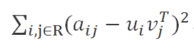
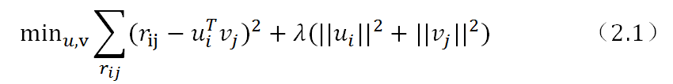
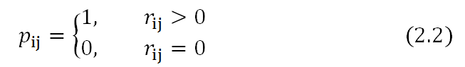

# 1 什么是ALS

&emsp;&emsp;ALS 是交替最小二乘（`alternating least squares`）的简称。在机器学习中，`ALS`特指使用交替最小二乘求解的一个协同推荐算法。它通过观察到的所有用户给商品的打分，来推断每个用户的喜好并向用户推荐适合的商品。举个例子，我们看下面一个`8*8`的用户打分矩阵。

&emsp;&emsp;&emsp;这个矩阵的每一行代表一个用户`（u1,u2,…,u8）`、每一列代表一个商品`（v1,v2,…,v8）`、用户的打分为`1-9`分。这个矩阵只显示了观察到的打分，我们需要推测没有观察到的打分。比如`（u6，v5）`打分多少？如果以数独的方式来解决这个问题，可以得到唯一的结果。
因为数独的规则很强，每添加一条规则，就让整个系统的自由度下降一个量级。当我们满足所有的规则时，整个系统的自由度就降为`1`了，也就得出了唯一的结果。对于上面的打分矩阵，如果我们不添加任何条件的话，也即打分之间是相互独立的，我们就没法得到`（u6，v5）`的打分。
所以在这个用户打分矩阵的基础上，我们需要提出一个限制其自由度的合理假设，使得我们可以通过观察已有打分来猜测未知打分。

&emsp;&emsp;`ALS`的核心就是这样一个假设：打分矩阵是近似低秩的。换句话说，就是一个`m*n`的打分矩阵可以由分解的两个小矩阵`U（m*k）`和`V（k*n）`的乘积来近似，即。这就是`ALS`的矩阵分解方法。这样我们把系统的自由度从`O(mn)`降到了`O((m+n)k)`。

&emsp;&emsp;那么`ALS`的低秩假设为什么是合理的呢？我们描述一个人的喜好经常是在一个抽象的低维空间上进行的，并不需要一一列出他喜好的事物。例如，我喜好看侦探影片，可能代表我喜欢《神探夏洛特》、《神探狄仁杰》等。这些影片都符合我对自己喜好的描述，也就是说他们在这个抽象的低维空间的投影和我的喜好相似。
再抽象一些来描述这个问题，我们把某个人的喜好映射到了低维向量`ui`上，同时将某个影片的特征映射到了维度相同的向量`vj`上，那么这个人和这个影片的相似度就可以表述成这两个向量之间的内积。
我们把打分理解成相似度，那么打分矩阵A就可以由用户喜好矩阵和产品特征矩阵的乘积来近似了。

&emsp;&emsp;低维空间的选取是一个问题。这个低维空间要能够很好的区分事物，那么就需要一个明确的可量化目标，这就是重构误差。在`ALS`中我们使用F范数来量化重构误差，就是每个元素重构误差的平方和。这里存在一个问题，我们只观察到部分打分，`A`中的大量未知元是我们想推断的，所以这个重构误差是包含未知数的。
解决方案很简单：只计算已知打分的重构误差，即

&emsp;&emsp;后面的章节我们将从原理上讲解spark中实现的ALS模型。

# 2 spark中ALS的实现原理

&emsp;&emsp;`Spark`利用交换最小二乘解决矩阵分解问题分两种情况：数据集是显式反馈和数据集是隐式反馈。由于隐式反馈算法的原理是在显示反馈算法原理的基础上作的修改，所以我们在此只会具体讲解数据集为隐式反馈的算法。
算法实现所依据的文献为:[Collaborative Filtering for Implicit Feedback Datasets](papers/Collaborative Filtering for Implicit Feedback Datasets.pdf)。

## 2.1 介绍

&emsp;&emsp;从广义上讲，推荐系统基于两种不同的策略：基于内容的方法和基于协同过滤的方法。`Spark`中使用协同过滤的方式。协同过滤分析用户以及用户相关的产品的相关性，用以识别新的用户-产品相关性。协同过滤系统需要的唯一信息是用户过去的行为信息，比如对产品的评价信息。协同过滤是领域无关的，所以它可以方便解决基于内容方法难以解决的许多问题。

&emsp;&emsp;推荐系统依赖不同类型的输入数据，最方便的是高质量的显式反馈数据，它们包含用户对感兴趣商品明确的评价。例如，`Netflix`收集的用户对电影评价的星星等级数据。但是显式反馈数据不一定总是找得到，因此推荐系统可以从更丰富的隐式反馈信息中推测用户的偏好。
隐式反馈类型包括购买历史、浏览历史、搜索模式甚至鼠标动作。例如，购买同一个作者许多书的用户可能喜欢这个作者。

&emsp;&emsp;许多研究都集中在处理显式反馈，然而在很多应用场景下，应用程序重点关注隐式反馈数据。因为可能用户不愿意评价商品或者系统性质我们不能收集显式反馈数据。在隐式模型中，一旦用户允许收集可用的数据，在客户端并不需要额外的显示数据。文献中的系统避免主动地向用户收集显式反馈信息，所以系统紧紧依靠隐式信息。

&emsp;&emsp;了解隐式反馈的特质非常重要，因为这些特质使我们避免了直接调用基于显示反馈的算法。最主要的特质有如下几种：

- （1）	没有负反馈。通过观察用户行为，我们可以推测那个商品他可能喜欢，然后购买，但是我们很难推测哪个商品用户不喜欢。这在显式反馈算法中并不存在，因为用户明确告诉了我们哪些他喜欢哪些他不喜欢。
- （2）	隐式反馈是内在的噪音。虽然我们拼命的追踪用户行为，但是我们仅仅只是猜测他们的偏好和真实动机。例如，我们可能知道一个人的购买行为，但是这并不能表明一个积极的观点，这个商品可能作为礼物被购买或者用户并不喜欢它。
- （3）	显示反馈的数值值表示偏好（`preference`），隐式回馈的数值值表示信任（`confidence`）。基于显示反馈的系统用星星等级让用户表达他们的喜好层度，例如一颗星表示很不喜欢，五颗星表示非常喜欢。基于隐式反馈的数值值描述的是动作的频率，例如用户购买特定商品的次数。一个较大的值并不能表明更多的偏爱。但是这个值是有用的，它描述了在一个特定观察中的信任度。
一个发生一次的事件可能对用户偏爱没有用，但是一个周期性事件更可能反映一个用户的选择。
- （4）	评价隐式反馈推荐系统需要合适的手段。

## 2.2 显式反馈模型

&emsp;&emsp;潜在因素模型由一个针对协同过滤的交替方法组成，它以一个更加全面的方式发现潜在特征来解释观察的`ratings`数据。我们关注的模型由奇异值分解（`SVD`）推演而来。一个典型的模型将每个用户`u`（包含一个用户-因素向量`ui`）和每个商品`v`（包含一个用户-因素向量`vj`）联系起来。
预测通过内积来实现。另一个需要关注的地方是参数估计。许多当前的工作都应用到了显式反馈数据集中，这些模型仅仅基于观察到的`rating`数据直接建模，同时通过一个适当的正则化来避免过拟合。公式如下：

&emsp;&emsp;在公式(2.1)中，λ是正则化的参数。就这样，我们用最小化重构误差来解决协同推荐问题。我们也成功将推荐问题转换为了最优化问题。

## 2.3 隐式反馈模型

&emsp;&emsp;在显式反馈的基础上，我们需要做一些改动得到我们的隐式反馈模型。首先，我们需要形式化由变量衡量的信任度的概念。我们引入了一组二元变量，它表示用户u对商品v的偏好。的公式如下：

