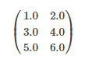

# 数据类型

&emsp;&emsp;`MLlib`既支持保存在单台机器上的本地向量和矩阵，也支持备份在一个或多个`RDD`中的分布式矩阵。本地向量和本地矩阵是简单的数据模型，作为公共接口提供。底层的线性代数操作通过[Breeze](http://www.scalanlp.org/)和[jblas](http://jblas.org/)提供。
在`MLlib`中，用于有监督学习的训练样本称为标注点(`labeled point`)。

# 1 本地向量(Local vector)

&emsp;&emsp;一个本地向量拥有从0开始的`integer`类型的索引以及`double`类型的值，它保存在单台机器上面。`MLlib`支持两种类型的本地向量：稠密(`dense`)向量和稀疏(`sparse`)向量。
一个稠密向量通过一个`double`类型的数组保存数据，这个数组表示向量的条目值(`entry values`)；一个稀疏向量通过两个并行的数组（`indices和values`）保存数据。例如，一个向量
`(1.0, 0.0, 3.0)`可以以稠密的格式保存为`[1.0, 0.0, 3.0] `或者以稀疏的格式保存为`(3, [0, 2], [1.0, 3.0])`，其中3表示数组的大小。

&emsp;&emsp;本地向量的基类是[Vector](https://spark.apache.org/docs/latest/api/scala/index.html#org.apache.spark.mllib.linalg.Vector)，`Spark`提供了两种实现：
[DenseVector](https://spark.apache.org/docs/latest/api/scala/index.html#org.apache.spark.mllib.linalg.DenseVector)和[SparseVector](https://spark.apache.org/docs/latest/api/scala/index.html#org.apache.spark.mllib.linalg.SparseVector)。
`Spark`官方推荐使用[Vectors](https://spark.apache.org/docs/latest/api/scala/index.html#org.apache.spark.mllib.linalg.Vectors$)中实现的工厂方法去创建本地向量。下面是创建本地向量的例子。

```scala
import org.apache.spark.mllib.linalg.{Vector, Vectors}
// 创建一个dense vector (1.0, 0.0, 3.0).
val dv: Vector = Vectors.dense(1.0, 0.0, 3.0)
// 创建一个sparse vector (1.0, 0.0, 3.0)并且指定它的索引和值
val sv1: Vector = Vectors.sparse(3, Array(0, 2), Array(1.0, 3.0))
// 创建一个sparse vector (1.0, 0.0, 3.0)并且指定它的索引和值
val sv2: Vector = Vectors.sparse(3, Seq((0, 1.0), (2, 3.0)))
```

&emsp;&emsp; 注意，`Scala`默认引入`scala.collection.immutable.Vector`，这里我们需要主动引入`MLLib`中的`org.apache.spark.mllib.linalg.Vector`来操作。我们可以看看`Vectors`对象的部分方法。

```scala
def dense(firstValue: Double, otherValues: Double*): Vector =
    new DenseVector((firstValue +: otherValues).toArray)
def dense(values: Array[Double]): Vector = new DenseVector(values)
def sparse(size: Int, indices: Array[Int], values: Array[Double]): Vector =
    new SparseVector(size, indices, values)
def sparse(size: Int, elements: Seq[(Int, Double)]): Vector = {
    require(size > 0, "The size of the requested sparse vector must be greater than 0.")
    val (indices, values) = elements.sortBy(_._1).unzip
    var prev = -1
    indices.foreach { i =>
      require(prev < i, s"Found duplicate indices: $i.")
      prev = i
    }
    require(prev < size, s"You may not write an element to index $prev because the declared " +
      s"size of your vector is $size")
    new SparseVector(size, indices.toArray, values.toArray)
  }
```

# 2 标注点(Labeled point)

&emsp;&emsp;一个标注点就是一个本地向量（或者是稠密的或者是稀疏的），这个向量和一个标签或者响应相关联。在`MLlib`中，标注点用于有监督学习算法。我们用一个`double`存储标签，这样我们就可以在回归和分类中使用标注点。
对于二分类，一个标签可能是0或者是1；对于多分类，一个标签可能代表从0开始的类别索引。

&emsp;&emsp;在`MLlib`中，一个标注点通过样本类[LabeledPoint](https://spark.apache.org/docs/latest/api/scala/index.html#org.apache.spark.mllib.regression.LabeledPoint)表示。

```scala
@Since("0.8.0")
@BeanInfo
case class LabeledPoint @Since("1.0.0") (
    @Since("0.8.0") label: Double,
    @Since("1.0.0") features: Vector) {
  override def toString: String = {
    s"($label,$features)"
  }
}
```
&emsp;&emsp;下面是使用`LabeledPoint`的一个例子。

```scala
import org.apache.spark.mllib.linalg.Vectors
import org.apache.spark.mllib.regression.LabeledPoint
// Create a labeled point with a positive label and a dense feature vector.
val pos = LabeledPoint(1.0, Vectors.dense(1.0, 0.0, 3.0))
// Create a labeled point with a negative label and a sparse feature vector.
val neg = LabeledPoint(0.0, Vectors.sparse(3, Array(0, 2), Array(1.0, 3.0)))
```

&emsp;&emsp;在现实的应用中，训练数据是稀疏的情况非常常见，`MLlib`支持读取训练数据存储为`LIBSVM`格式。它是[LIBSVM](http://www.csie.ntu.edu.tw/~cjlin/libsvm/)和[LIBLINEAR](http://www.csie.ntu.edu.tw/~cjlin/liblinear/)默认的格式。
它是一种文本格式，每一行表示一个标注的稀疏特征向量，如下所示：

```scala
label index1:value1 index2:value2 ...
```

# 3 本地矩阵（Local matrix）

&emsp;&emsp;一个本地矩阵拥有`Integer`类型的行和列索引以及`Double`类型的值。`MLlib`支持稠密矩阵和稀疏矩阵两种。稠密矩阵将条目(`entry`)值保存为单个`double`数组，这个数组根据列的顺序存储。
稀疏矩阵的非零条目值保存为压缩稀疏列（`Compressed Sparse Column ，CSC`）格式，这种格式也是以列顺序存储。例如下面的稠密矩阵：

<div  align="center"></div><br>

&emsp;&emsp;这个稠密矩阵保存为一维数组`[1.0, 3.0, 5.0, 2.0, 4.0, 6.0]`，数组大小为`(3,2)`。

&emsp;&emsp;本地矩阵的基类是[Matrix](https://spark.apache.org/docs/latest/api/scala/index.html#org.apache.spark.mllib.linalg.Matrix)，它提供了两种实现：[DenseMatrix](https://spark.apache.org/docs/latest/api/scala/index.html#org.apache.spark.mllib.linalg.DenseMatrix)和[SparseMatrix](https://spark.apache.org/docs/latest/api/scala/index.html#org.apache.spark.mllib.linalg.SparseMatrix)。
推荐使用[Matrices](https://spark.apache.org/docs/latest/api/scala/index.html#org.apache.spark.mllib.linalg.Matrices$)的工厂方法来创建本地矩阵。下面是一个实现的例子：

```scala
import org.apache.spark.mllib.linalg.{Matrix, Matrices}
// Create a dense matrix ((1.0, 2.0), (3.0, 4.0), (5.0, 6.0))
val dm: Matrix = Matrices.dense(3, 2, Array(1.0, 3.0, 5.0, 2.0, 4.0, 6.0))
// Create a sparse matrix ((9.0, 0.0), (0.0, 8.0), (0.0, 6.0))
val sm: Matrix = Matrices.sparse(3, 2, Array(0, 1, 3), Array(0, 2, 1), Array(9, 6, 8))
```
&emsp;&emsp;稠密矩阵的存储很简单，不赘述。稀疏矩阵的存储使用`CSC`。关于压缩矩阵的介绍，请参看文献【1】。

# 4 分布式矩阵(Distributed matrix)

&emsp;&emsp;一个分布式矩阵拥有`long`类型的行和列索引，以及`double`类型的值，分布式的存储在一个或多个`RDD`中。选择正确的格式存储大型分布式矩阵是非常重要的。将一个分布式矩阵转换为另外一个格式可能需要一个全局的`shuffle`，这是非常昂贵的。
到目前为止，已经实现了三种类型的分布式矩阵。

&emsp;&emsp;基本的类型是`RowMatrix`，`RowMatrix`是一个面向行的分布式矩阵，它没有有意义的行索引。它的行保存为一个`RDD`,每一行都是一个本地向量。我们假设一个`RowMatrix`的列的数量不是很巨大，这样单个本地向量可以方便的和`driver`通信，也可以被单个节点保存和操作。
`IndexedRowMatrix`和`RowMatrix`很像，但是它拥有行索引，行索引可以用于识别行和进行`join`操作。`CoordinateMatrix`是一个分布式矩阵，它使用`COO`格式存储。请参看文献【1】了解`COO`格式。

## 4.1 RowMatrix

&emsp;&emsp;`RowMatrix`是一个面向行的分布式矩阵，它没有有意义的行索引。它的行保存为一个`RDD`,每一行都是一个本地向量。因为每一行保存为一个本地向量，所以列数限制在了整数范围。

&emsp;&emsp;一个`RowMatrix`可以通过`RDD[Vector]`实例创建。创建完之后，我们可以计算它的列的统计和分解。[QR分解](https://en.wikipedia.org/wiki/QR_decomposition)的形式为`A=QR`，其中`Q`是一个正交矩阵，
`R`是一个上三角矩阵。下面是一个`RowMatrix`的例子。

```scala
import org.apache.spark.mllib.linalg.Vector
import org.apache.spark.mllib.linalg.distributed.RowMatrix
val rows: RDD[Vector] = ... // an RDD of local vectors
// Create a RowMatrix from an RDD[Vector].
val mat: RowMatrix = new RowMatrix(rows)
// Get its size.
val m = mat.numRows()
val n = mat.numCols()
// QR decomposition 
val qrResult = mat.tallSkinnyQR(true)
```

## 4.2 IndexedRowMatrix

&emsp;&emsp;`IndexedRowMatrix`和`RowMatrix`很像，但是它拥有行索引。索引的行保存为一个`RDD[IndexedRow]`，其中`IndexedRow`是一个参数为`(Long, Vector)`的样本类，所以每一行通过它的索引以及一个本地向量表示。

&emsp;&emsp;一个`IndexedRowMatrix`可以通过`RDD[IndexedRow]`实例创建，并且一个`IndexedRowMatrix`可以通过去掉它的行索引，转换成`RowMatrix`。下面是一个例子：

```scala
import org.apache.spark.mllib.linalg.distributed.{IndexedRow, IndexedRowMatrix, RowMatrix}
val rows: RDD[IndexedRow] = ... // an RDD of indexed rows
// Create an IndexedRowMatrix from an RDD[IndexedRow].
val mat: IndexedRowMatrix = new IndexedRowMatrix(rows)
// Get its size.
val m = mat.numRows()
val n = mat.numCols()
// Drop its row indices.
val rowMat: RowMatrix = mat.toRowMatrix()
```
&emsp;&emsp; `IndexedRow`这个样本类的代码如下：

```scala
case class IndexedRow(index: Long, vector: Vector)
```

## 4.3 CoordinateMatrix

&emsp;&emsp;`CoordinateMatrix`是一个分布式矩阵，它的条目保存为一个`RDD`。每一个条目是一个`(i: Long, j: Long, value: Double)`格式的元组，其中`i`表示行索引，`j`表示列索引，`value`表示条目值。
`CoordinateMatrix`应该仅仅在矩阵维度很大并且矩阵非常稀疏的情况下使用。

&emsp;&emsp;`CoordinateMatrix`可以通过`RDD[MatrixEntry]`实例创建，其中`MatrixEntry`是`(Long, Long, Double)`的包装。`CoordinateMatrix`可以转换成`IndexedRowMatrix`。下面是一个例子：

```scala
import org.apache.spark.mllib.linalg.distributed.{CoordinateMatrix, MatrixEntry}
val entries: RDD[MatrixEntry] = ... // an RDD of matrix entries
// Create a CoordinateMatrix from an RDD[MatrixEntry].
val mat: CoordinateMatrix = new CoordinateMatrix(entries)
// Get its size.
val m = mat.numRows()
val n = mat.numCols()
// Convert it to an IndexRowMatrix whose rows are sparse vectors.
val indexedRowMatrix = mat.toIndexedRowMatrix()
```
&emsp;&emsp; `MatrixEntry`这个样本类的代码如下：

```scala
case class MatrixEntry(i: Long, j: Long, value: Double)
```

## 4.4 BlockMatrix

&emsp;&emsp;`BlockMatrix`是一个分布式矩阵，它的保存为一个`MatrixBlocks`的`RDD`。`MatrixBlock`是一个`((Int, Int), Matrix)`类型的元组，其中`(Int, Int)`代表块的索引，`Matrix`代表子矩阵。
`BlockMatrix`支持诸如`add`和`multiply`等方法。`BlockMatrix`还有一个帮助方法`validate`，用来判断一个`BlockMatrix`是否正确的创建。

&emsp;&emsp;可以轻松的通过调用`toBlockMatrix`从一个`IndexedRowMatrix`或者`CoordinateMatrix`创建一个`BlockMatrix`。`toBlockMatrix`默认创建`1024 * 1024`大小的块，用户可以手动修个块的大小。
下面是一个例子：

```scala
import org.apache.spark.mllib.linalg.distributed.{BlockMatrix, CoordinateMatrix, MatrixEntry}
val entries: RDD[MatrixEntry] = ... // an RDD of (i, j, v) matrix entries
// Create a CoordinateMatrix from an RDD[MatrixEntry].
val coordMat: CoordinateMatrix = new CoordinateMatrix(entries)
// Transform the CoordinateMatrix to a BlockMatrix
val matA: BlockMatrix = coordMat.toBlockMatrix().cache()
// Validate whether the BlockMatrix is set up properly. Throws an Exception when it is not valid.
// Nothing happens if it is valid.
matA.validate()
// Calculate A^T A.
val ata = matA.transpose.multiply(matA)
```

# 5 参考文献

【1】[稀疏矩阵存储格式总结+存储效率对比:COO,CSR,DIA,ELL,HYB](http://www.cnblogs.com/xbinworld/p/4273506.html?utm_source=tuicool&utm_medium=referral)


