# L-BFGS

# 1 牛顿法

&emsp;&emsp;设`f(x)`是二次可微实函数，又设$x^{(k)}$是`f(x)`一个极小点的估计，我们把`f(x)`在$x^{(k)}$处展开成`Taylor`级数，
并取二阶近似。

<div  align="center">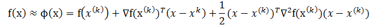</div><br>

&emsp;&emsp;上式中最后一项的中间部分表示`f(x)`在$x^{(k)}$处的`Hesse`矩阵。对上式求导并令其等于0，可以的到下式：

<div  align="center">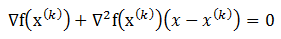</div><br>

&emsp;&emsp;设`Hesse`矩阵可逆，由上式可以得到牛顿法的迭代公式如下 **(1.1)**

<div  align="center">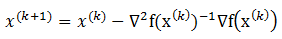</div><br>

&emsp;&emsp;值得注意 ， 当初始点远离极小点时，牛顿法可能不收敛。原因之一是牛顿方向不一定是下降方向，经迭代，目标函数可能上升。此外，即使目标函数下降，得到的点也不一定是沿牛顿方向最好的点或极小点。
因此，我们在牛顿方向上增加一维搜索，提出阻尼牛顿法。其迭代公式是 **(1.2)**：

<div  align="center">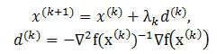</div><br>

&emsp;&emsp;其中，`lambda`是由一维搜索（参考文献【1】了解一维搜索）得到的步长，即满足

<div  align="center">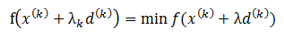</div><br>


# 2 拟牛顿法

## 2.1 拟牛顿条件

&emsp;&emsp;前面介绍了牛顿法，它的突出优点是收敛很快，但是运用牛顿法需要计算二阶偏导数，而且目标函数的`Hesse`矩阵可能非正定。为了克服牛顿法的缺点，人们提出了拟牛顿法，它的基本思想是用不包含二阶导数的矩阵近似牛顿法中的`Hesse`矩阵的逆矩阵。
由于构造近似矩阵的方法不同，因而出现不同的拟牛顿法。

&emsp;&emsp;下面分析怎样构造近似矩阵并用它取代牛顿法中的`Hesse`矩阵的逆。上文 **(1.2)** 已经给出了牛顿法的迭代公式，为了构造`Hesse`矩阵逆矩阵的近似矩阵$H_{(k)}$ ，需要先分析该逆矩阵与一阶导数的关系。

&emsp;&emsp;设在第`k`次迭代之后，得到$x^{(k+1)}$ ，我们将目标函数`f(x)`在点$x^{(k+1)}$展开成`Taylor`级数，
并取二阶近似，得到

<div  align="center">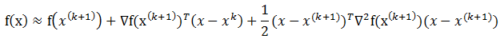</div><br>

&emsp;&emsp;由此可知，在$x^{(k+1)}$附近有，

<div  align="center">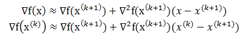</div><br>

&emsp;&emsp;记

<div  align="center"></div><br>

&emsp;&emsp;则有

<div  align="center"></div><br>

&emsp;&emsp;又设`Hesse`矩阵可逆，那么上式可以写为如下形式。

<div  align="center">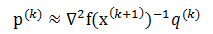</div><br>

&emsp;&emsp;这样，计算出`p`和`q`之后，就可以通过上面的式子估计`Hesse`矩阵的逆矩阵。因此，为了用不包含二阶导数的矩阵$H_{(k+1)}$取代牛顿法中`Hesse`矩阵的逆矩阵，有理由令$H_{(k+1)}$满足公式 **(2.1)** ：

<div  align="center">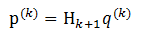</div><br>

&emsp;&emsp;公式**(2.1)**称为拟牛顿条件。

## 2.2 秩1校正

&emsp;&emsp;当`Hesse`矩阵的逆矩阵是对称正定矩阵时，满足拟牛顿条件的矩阵$H_{(k)}$也应该是对称正定矩阵。构造这样近似矩阵的一般策略是，$H_{(1)}$取为任意一个`n`阶对称正定矩阵，通常选择`n`阶单位矩阵`I`，然后通过修正$H_{(k)}$给定$H_{(k+1)}$。
令，

<div  align="center">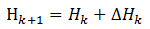</div><br>

&emsp;&emsp;秩1校正公式写为如下公式**(2.2)**形式。

<div  align="center">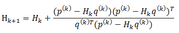</div><br>

## 2.3 DFP算法

&emsp;&emsp;著名的`DFP`方法是`Davidon`首先提出，后来又被`Feltcher`和`Powell`改进的算法，又称为变尺度法。在这种方法中，定义校正矩阵为公式 **(2.3)**

<div  align="center">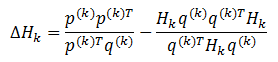</div><br>

&emsp;&emsp;那么得到的满足拟牛顿条件的`DFP`公式如下 **(2.4)**

<div  align="center">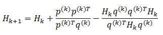</div><br>

&emsp;&emsp;查看文献【1】，了解`DFP`算法的计算步骤。

## 2.4 BFGS算法

&emsp;&emsp;前面利用拟牛顿条件 **(2.1)** 推导出了`DFP`公式 **(2.4)** 。下面我们用不含二阶导数的矩阵$B_{(k+1)}$近似`Hesse`矩阵，从而给出另一种形式的拟牛顿条件 **(2.5)** :

<div  align="center">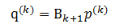</div><br>

&emsp;&emsp;将公式 **(2.1)** 的`H`换为`B`，`p`和`q`互换正好可以得到公式 **(2.5)** 。所以我们可以得到`B`的修正公式 **(2.6)** :

<div  align="center">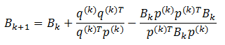</div><br>

&emsp;&emsp;这个公式称关于矩阵`B`的`BFGS`修正公式，也称为`DFP`公式的对偶公式。设$B_{(k+1)}$可逆，由公式 **(2.1)** 以及 **(2.5)** 可以推出：

<div  align="center">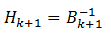</div><br>

&emsp;&emsp;这样可以得到关于`H`的`BFGS`公式为下面的公式 **(2.7)**:

<div  align="center">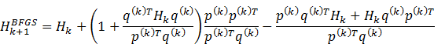</div><br>

&emsp;&emsp;这个重要公式是由`Broyden`,`Fletcher`,`Goldfard`和`Shanno`于1970年提出的，所以简称为`BFGS`。数值计算经验表明，它比`DFP`公式还好，因此目前得到广泛应用。

## 2.5 L-BFGS（限制内存BFGS）算法

&emsp;&emsp;在`BFGS`算法中，仍然有缺陷，比如当优化问题规模很大时，矩阵的存储和计算将变得不可行。为了解决这个问题，就有了`L-BFGS`算法。`L-BFGS`即`Limited-memory BFGS`。
`L-BFGS`的基本思想是只保存最近的`m`次迭代信息，从而大大减少数据的存储空间。对照`BFGS`，重新整理一下公式：

<div  align="center">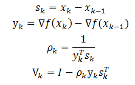</div><br>

&emsp;&emsp;之前的`BFGS`算法有如下公式**(2.8)**

<div  align="center"></div><br>

&emsp;&emsp;那么同样有

<div  align="center">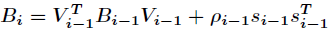</div><br>

&emsp;&emsp;将该式子带入到公式**(2.8)**中，可以推导出如下公式

<div  align="center">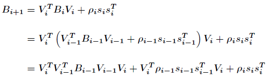</div><br>

&emsp;&emsp;假设当前迭代为`k`，只保存最近的`m`次迭代信息，按照上面的方式迭代`m`次，可以得到如下的公式**(2.9)**

<div  align="center">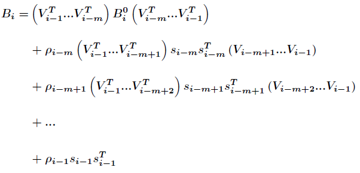</div><br>

&emsp;&emsp;上面迭代的最终目的就是找到`k`次迭代的可行方向，即

<div  align="center">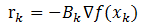</div><br>

&emsp;&emsp;为了求可行方向`r`，可以使用`two-loop recursion`算法来求。该算法的计算过程如下，算法中出现的`y`即上文中提到的`t`：

<div  align="center">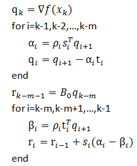</div><br>

&emsp;&emsp;算法`L-BFGS`的步骤如下所示。

<div  align="center">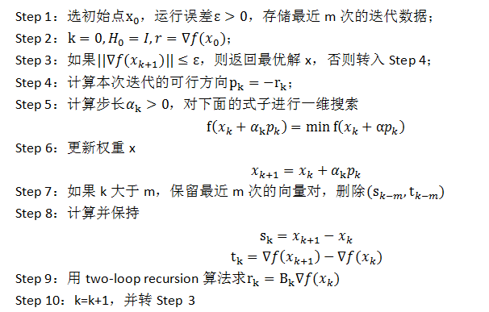</div><br>

## 2.6 OWL-QN算法

### 2.6.1 L1 正则化

&emsp;&emsp;在机器学习算法中，使用损失函数作为最小化误差，而最小化误差是为了让我们的模型拟合我们的训练数据，此时，
若参数过分拟合我们的训练数据就会有过拟合的问题。正则化参数的目的就是为了防止我们的模型过分拟合训练数据。此时，我们会在损失项之后加上正则化项以约束模型中的参数：

$$J(x) = l(x) + r(x)$$

&emsp;&emsp;公式右边的第一项是损失函数，用来衡量当训练出现偏差时的损失，可以是任意可微凸函数（如果是非凸函数该算法只保证找到局部最优解）。
第二项是正则化项。用来对模型空间进行限制，从而得到一个更“简单”的模型。

&emsp;&emsp;根据对模型参数所服从的概率分布的假设的不同，常用的正则化一般有`L2`正则化（模型参数服从`Gaussian`分布）、`L1`正则化（模型参数服从`Laplace`分布）以及它们的组合形式。

&emsp;&emsp;`L1`正则化的形式如下

$$J(x) = l(x) + C ||x||_{1}$$ 

&emsp;&emsp;`L2`正则化的形式如下

$$J(x) = l(x) + C ||x||_{2}$$ 

&emsp;&emsp;`L1`正则化和`L2`正则化之间的一个最大区别在于前者可以产生稀疏解，这使它同时具有了特征选择的能力，此外，稀疏的特征权重更具有解释意义。如下图：

<div  align="center">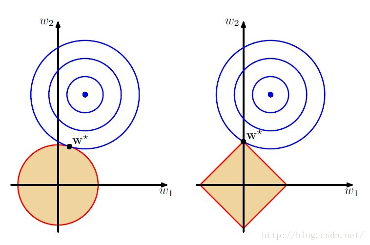</div><br>

&emsp;&emsp;图左侧是`L2`正则，右侧为`L1`正则。当模型中只有两个参数，即$w_1$和$w_2$时，`L2`正则的约束空间是一个圆，而`L1`正则的约束空间为一个正方形，这样，基于`L1`正则的约束会产生稀疏解，即图中某一维($w_2$)为0。
而`L2`正则只是将参数约束在接近0的很小的区间里，而不会正好为0(不排除有0的情况)。对于`L1`正则产生的稀疏解有很多的好处，如可以起到特征选择的作用，因为有些维的系数为0，说明这些维对于模型的作用很小。

&emsp;&emsp;这里有一个问题是，`L1`正则化项不可微，所以无法像求`L-BFGS`那样去求。微软提出了`OWL-QN`(`Orthant-Wise Limited-Memory Quasi-Newton`)算法，该算法是基于`L-BFGS`算法的可用于求解`L1`正则的算法。
简单来讲，`OWL-QN`算法是指假定变量的象限确定的条件下使用`L-BFGS`算法来更新，同时，使得更新前后变量在同一个象限中(使用映射来满足条件)。

### 2.6.2 OWL-QN算法的具体过程

- <b>1 次微分</b>

&emsp;&emsp;设$f:I\rightarrow R$是一个实变量凸函数，定义在实数轴上的开区间内。这种函数不一定是处处可导的，例如绝对值函数$f(x)=|x|$。但是，从下面的图中可以看出（也可以严格地证明），对于定义域中的任何$x_0$，我们总可以作出一条直线，它通过点($x_0$, $f(x_0)$)，并且要么接触f的图像，要么在它的下方。
这条直线的斜率称为函数的次导数。推广到多元函数就叫做次梯度。

<div  align="center">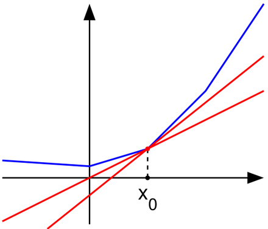</div><br>

&emsp;&emsp;凸函数$f:I\rightarrow R$在点$x_0$的次导数，是实数`c`使得：

<div  align="center">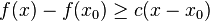</div><br>

&emsp;&emsp;对于所有`I`内的`x`。我们可以证明，在点$x_0$的次导数的集合是一个非空闭区间$[a, b]$，其中`a`和`b`是单侧极限。

<div  align="center">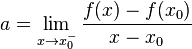</div><br>

<div  align="center">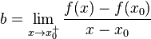</div><br>

&emsp;&emsp;它们一定存在，且满足$a \leqslant b$。所有次导数的集合$[a, b]$称为函数`f`在$x_0$的次微分。

- <b>2 伪梯度</b>

&emsp;&emsp;利用次梯度的概念推广了梯度，定义了一个符合上述原则的伪梯度，求一维搜索的可行方向时用伪梯度来代替`L-BFGS`中的梯度。

<div  align="center">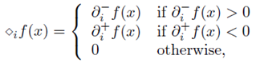</div><br>

&emsp;&emsp;其中

<div  align="center">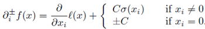</div><br>

<div  align="center">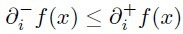</div><br>

&emsp;&emsp;我们要如何理解这个伪梯度呢？对于不是处处可导的凸函数，可以分为下图所示的三种情况。

&emsp;&emsp;左侧极限小于0：

<div  align="center">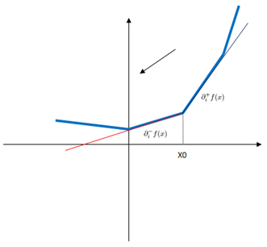</div><br>

&emsp;&emsp;右侧极限大于0：

<div  align="center">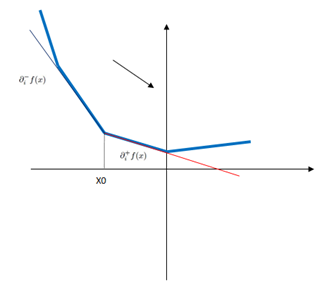</div><br>

&emsp;&emsp;其它情况：

<div  align="center">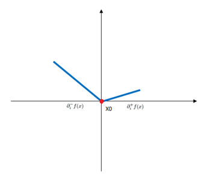</div><br>

&emsp;&emsp;结合上面的三幅图表示的三种情况以及伪梯度函数公式，我们可以知道，伪梯度函数保证了在$x_0$处取得的方向导数是最小的。

- <b>3 映射</b>

&emsp;&emsp;有了函数的下降的方向，接下来必须对变量的所属象限进行限制，目的是使得更新前后变量在同一个象限中，定义函数：$\pi: \mathbb{R}^{n} \rightarrow \mathbb{R}^{n}$

<div  align="center">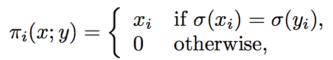</div><br>

&emsp;&emsp;上述函数$\pi$直观的解释是若$x$和$y$在同一象限则取$x$，若两者不在同一象限中，则取0。

- <b>4 线搜索</b>

&emsp;&emsp;上述的映射是防止更新后的变量的坐标超出象限，而对坐标进行的一个约束，具体的约束的形式如下：

<div  align="center">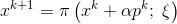</div><br>

&emsp;&emsp;其中$x^{k} + \alpha p _{k}$是更新公式，$\zeta$表示$x^k$所在的象限，$p^k$表示伪梯度下降的方向，它们具体的形式如下：

<div  align="center">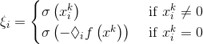</div><br>

<div  align="center"></div><br>

&emsp;&emsp;上面的公式中，$v^k$为负伪梯度方向，$d^k = H_{k}v^{k}$。

&emsp;&emsp;选择$\alpha$的方式有很多种，在`OWL-QN`中，使用了`backtracking line search`的一种变种。选择常数$\beta, \gamma \subset (0,1)$，对于$n=0,1,2,...$，使得
$\alpha = \beta^{n}$满足：

<div  align="center"></div><br>

- <b>5 算法流程</b>

<div  align="center">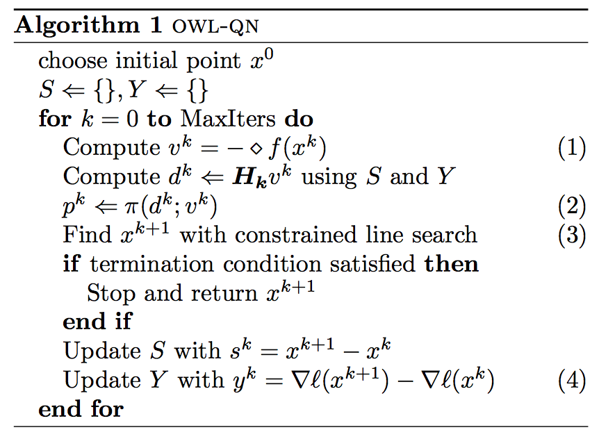</div><br>

&emsp;&emsp;与`L-BFGS`相比，第一步用伪梯度代替梯度，第二、三步要求一维搜索不跨象限，也就是迭代前的点与迭代后的点处于同一象限，第四步要求估计`Hessian`矩阵时依然使用损失函数的梯度。

# 3 源码解析

## 3.1 BreezeLBFGS

&emsp;&emsp;`spark Ml`调用`breeze`中实现的`BreezeLBFGS`来解最优化问题。

```scala
val optimizer = new BreezeLBFGS[BDV[Double]]($(maxIter), 10, $(tol))
val states =
      optimizer.iterations(new CachedDiffFunction(costFun), initialWeights.toBreeze.toDenseVector)
```
&emsp;&emsp;下面重点分析`lbfgs.iterations`的实现。

```scala
def iterations(f: DF, init: T): Iterator[State] = {
    val adjustedFun = adjustFunction(f)
    infiniteIterations(f, initialState(adjustedFun, init)).takeUpToWhere(_.converged)
}
//调用infiniteIterations，其中State是一个样本类
def infiniteIterations(f: DF, state: State): Iterator[State] = {
    var failedOnce = false
    val adjustedFun = adjustFunction(f)
    //无限迭代
    Iterator.iterate(state) { state => try {
        //1 选择梯度下降方向
        val dir = chooseDescentDirection(state, adjustedFun)
        //2 计算步长
        val stepSize = determineStepSize(state, adjustedFun, dir)
        //3 更新权重
        val x = takeStep(state,dir,stepSize)
        //4 利用CostFun.calculate计算损失值和梯度
        val (value,grad) = calculateObjective(adjustedFun, x, state.history)
        val (adjValue,adjGrad) = adjust(x,grad,value)
        val oneOffImprovement = (state.adjustedValue - adjValue)/(state.adjustedValue.abs max adjValue.abs max 1E-6 * state.initialAdjVal.abs)
        //5 计算s和t
        val history = updateHistory(x,grad,value, adjustedFun, state)
        //6 只保存m个需要的s和t
        val newAverage = updateFValWindow(state, adjValue)
        failedOnce = false
        var s = State(x,value,grad,adjValue,adjGrad,state.iter + 1, state.initialAdjVal, history, newAverage, 0)
        val improvementFailure = (state.fVals.length >= minImprovementWindow && state.fVals.nonEmpty && state.fVals.last > state.fVals.head * (1-improvementTol))
        if(improvementFailure)
          s = s.copy(fVals = IndexedSeq.empty, numImprovementFailures = state.numImprovementFailures + 1)
        s
      } catch {
        case x: FirstOrderException if !failedOnce =>
          failedOnce = true
          logger.error("Failure! Resetting history: " + x)
          state.copy(history = initialHistory(adjustedFun, state.x))
        case x: FirstOrderException =>
          logger.error("Failure again! Giving up and returning. Maybe the objective is just poorly behaved?")
          state.copy(searchFailed = true)
      }
    }
  }
```
&emsp;&emsp;看上面的代码注释，它的流程可以分五步来分析。

### 3.1.1 选择梯度下降方向

```scala
protected def chooseDescentDirection(state: State, fn: DiffFunction[T]):T = {
    state.history * state.grad
}
```
&emsp;&emsp;这里的`*`是重写的方法，它的实现如下：

```scala
def *(grad: T) = {
     val diag = if(historyLength > 0) {
       val prevStep = memStep.head
       val prevGradStep = memGradDelta.head
       val sy = prevStep dot prevGradStep
       val yy = prevGradStep dot prevGradStep
       if(sy < 0 || sy.isNaN) throw new NaNHistory
       sy/yy
     } else {
       1.0
     }
     val dir = space.copy(grad)
     val as = new Array[Double](m)
     val rho = new Array[Double](m)
     //第一次递归
     for(i <- 0 until historyLength) {
       rho(i) = (memStep(i) dot memGradDelta(i))
       as(i) = (memStep(i) dot dir)/rho(i)
       if(as(i).isNaN) {
         throw new NaNHistory
       }
       axpy(-as(i), memGradDelta(i), dir)
     }
     dir *= diag
     //第二次递归
     for(i <- (historyLength - 1) to 0 by (-1)) {
       val beta = (memGradDelta(i) dot dir)/rho(i)
       axpy(as(i) - beta, memStep(i), dir)
     }
     dir *= -1.0
     dir
    }
  }
```
&emsp;&emsp;非常明显，该方法就是实现了上文提到的`two-loop recursion`算法。

### 3.1.2 计算步长

```scala
protected def determineStepSize(state: State, f: DiffFunction[T], dir: T) = {
    val x = state.x
    val grad = state.grad
    val ff = LineSearch.functionFromSearchDirection(f, x, dir)
    val search = new StrongWolfeLineSearch(maxZoomIter = 10, maxLineSearchIter = 10) // TODO: Need good default values here.
    val alpha = search.minimize(ff, if(state.iter == 0.0) 1.0/norm(dir) else 1.0)
    if(alpha * norm(grad) < 1E-10)
      throw new StepSizeUnderflow
    alpha
  }
```
&emsp;&emsp;这一步对应`L-BFGS`的步骤的`Step 5`，通过一维搜索计算步长。

### 3.1.3  更新权重

```scala
protected def takeStep(state: State, dir: T, stepSize: Double) = state.x + dir * stepSize
```
&emsp;&emsp;这一步对应`L-BFGS`的步骤的`Step 5`，更新权重。

### 3.1.4 计算损失值和梯度

```scala
 protected def calculateObjective(f: DF, x: T, history: History): (Double, T) = {
     f.calculate(x)
  }
```
&emsp;&emsp;这一步对应`L-BFGS`的步骤的`Step 7`，使用传人的`CostFun.calculate`方法计算梯度和损失值。并计算出`s`和`t`。

### 3.1.5 计算s和t，并更新history

```scala
//计算s和t
protected def updateHistory(newX: T, newGrad: T, newVal: Double,  f: DiffFunction[T], oldState: State): History = {
    oldState.history.updated(newX - oldState.x, newGrad :- oldState.grad)
}
//添加新的s和t，并删除过期的s和t
protected def updateFValWindow(oldState: State, newAdjVal: Double):IndexedSeq[Double] = {
    val interm = oldState.fVals :+ newAdjVal
    if(interm.length > minImprovementWindow) interm.drop(1)
    else interm
  }
```

## 3.2 BreezeOWLQN

&emsp;&emsp;`BreezeOWLQN`的实现与`BreezeLBFGS`的实现主要有下面一些不同点。

### 3.2.1 选择梯度下降方向

```scala
override protected def chooseDescentDirection(state: State, fn: DiffFunction[T]) = {
    val descentDir = super.chooseDescentDirection(state.copy(grad = state.adjustedGradient), fn)

    // The original paper requires that the descent direction be corrected to be
    // in the same directional (within the same hypercube) as the adjusted gradient for proof.
    // Although this doesn't seem to affect the outcome that much in most of cases, there are some cases
    // where the algorithm won't converge (confirmed with the author, Galen Andrew).
    val correctedDir = space.zipMapValues.map(descentDir, state.adjustedGradient, { case (d, g) => if (d * g < 0) d else 0.0 })

    correctedDir
  }
```
&emsp;&emsp;此处调用了`BreezeLBFGS`的`chooseDescentDirection`方法选择梯度下降的方向，然后调整该下降方向为正确的方向（方向必须一致）。

### 3.2.2 计算步长$\alpha$

```scala
override protected def determineStepSize(state: State, f: DiffFunction[T], dir: T) = {
    val iter = state.iter

    val normGradInDir = {
      val possibleNorm = dir dot state.grad
      possibleNorm
    }
    val ff = new DiffFunction[Double] {
       def calculate(alpha: Double) = {
         val newX = takeStep(state, dir, alpha)
         val (v, newG) =  f.calculate(newX)  // 计算梯度
         val (adjv, adjgrad) = adjust(newX, newG, v) // 调整梯度
         adjv -> (adjgrad dot dir)
       }
    }
    val search = new BacktrackingLineSearch(state.value, shrinkStep= if(iter < 1) 0.1 else 0.5)
    val alpha = search.minimize(ff, if(iter < 1) .5/norm(state.grad) else 1.0)

    alpha
  }
```
&emsp;&emsp;`takeStep`方法用于更新参数。

```scala
  // projects x to be on the same orthant as y
  // this basically requires that x'_i = x_i if sign(x_i) == sign(y_i), and 0 otherwise.

  override protected def takeStep(state: State, dir: T, stepSize: Double) = {
    val stepped = state.x + dir * stepSize
    val orthant = computeOrthant(state.x, state.adjustedGradient)
    space.zipMapValues.map(stepped, orthant, { case (v, ov) =>
      v * I(math.signum(v) == math.signum(ov))
    })
  }
```
&emsp;&emsp;`calculate`方法用于计算梯度，`adjust`方法用于调整梯度。

```scala
// Adds in the regularization stuff to the gradient
  override protected def adjust(newX: T, newGrad: T, newVal: Double): (Double, T) = {
    var adjValue = newVal
    val res = space.zipMapKeyValues.mapActive(newX, newGrad, {case (i, xv, v) =>
      val l1regValue = l1reg(i)
      require(l1regValue >= 0.0)

      if(l1regValue == 0.0) {
        v
      } else {
        adjValue += Math.abs(l1regValue * xv)
        xv match {
          case 0.0 => {
            val delta_+ = v + l1regValue   //计算左导数
            val delta_- = v - l1regValue   //计算右导数
            if (delta_- > 0) delta_- else if (delta_+ < 0) delta_+ else 0.0
          }
          case _ => v + math.signum(xv) * l1regValue
        }
      }
    })
    adjValue -> res
  }
```

# 参考文献

【1】陈宝林，最优化理论和算法

【2】[Updating Quasi-Newton Matrices with Limited Storage](docs/Updating  Quasi-Newton  Matrices  with  Limited  Storage.pdf)

【3】[On the Limited Memory BFGS Method for Large Scale Optimization](docs/On the Limited Memory BFGS Method for Large Scale Optimization.pdf)

【4】[L-BFGS算法](http://blog.csdn.net/acdreamers/article/details/44728041)

【5】[BFGS算法](http://wenku.baidu.com/link?url=xyN5e-LMR2Ztq90-J95oKHUFBLP8gkLzlbFI6ptbgXMWYt5xTZHgXexWcbjQUmGahQpr39AIc0AomDeFqyY7mn7VqLoQj6gcDHDOccJGln3)

【6】[逻辑回归模型及LBFGS的Sherman Morrison(SM) 公式推导](http://blog.csdn.net/zhirom/article/details/38332111)

【7】[Scalable Training of L1-Regularized Log-Linear Models](http://research.microsoft.com/en-us/um/people/jfgao/paper/icml07scalable.pdf)
