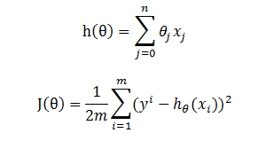
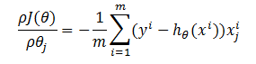
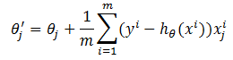
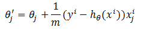
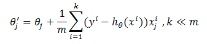

# 梯度下降算法

&emsp;&emsp;梯度下降（`GD`）是最小化风险函数、损失函数的一种常用方法，随机梯度下降和批量梯度下降是两种迭代求解思路。

## 1 批量梯度下降算法

&emsp;&emsp;假设`h(theta)`是要拟合的函数，`J(theta)`是损失函数，这里`theta`是要迭代求解的值。这两个函数的公式如下,其中`m`是训练集的记录条数，`j`是参数的个数：

<div  align="center"></div><br>

&emsp;&emsp;梯度下降法目的就是求出使损失函数最小时的`theta`。批量梯度下降的求解思路如下：

- 对损失函数求`theta`的偏导，得到每个`theta`对应的的梯度

<div  align="center"></div><br>

- 按每个参数`theta`的梯度负方向，来更新每个`theta`

<div  align="center"></div><br>

&emsp;&emsp;从上面公式可以看到，虽然它得到的是一个全局最优解，但是每迭代一步（即修改`j`个`theta`参数中的一个），都要用到训练集所有的数据，如果`m`很大，迭代速度会非常慢。

## 2 随机梯度下降算法

&emsp;&emsp;随机梯度下降是通过每个样本来迭代更新一次`theta`,它大大加快了迭代速度。更新`theta`的公式如下所示。

<div  align="center"></div><br>

&emsp;&emsp;批量梯度下降会最小化所有训练样本的损失函数，使得最终求解的是全局的最优解，即求解的参数是使得风险函数最小。随机梯度下降会最小化每条样本的损失函数，
虽然不是每次迭代得到的损失函数都向着全局最优方向， 但是大的整体的方向是向全局最优解的，最终的结果往往是在全局最优解附近。

## 3 批随机梯度下降算法

&emsp;&emsp;在`MLlib`中，并不是严格实现批量梯度下降算法和随机梯度下降算法，而是结合了这两种算法。即在每次迭代中，既不是使用所有的样本，也不是使用单个样本，而是抽样一小批样本用于计算。

<div  align="center"></div><br>

&emsp;&emsp;下面分析该算法的实现。首先我们看看`GradientDescent`的定义。

```scala
class GradientDescent private[spark] (private var gradient: Gradient, private var updater: Updater)
  extends Optimizer with Logging 
```
&emsp;&emsp;这里`Gradient`类用于计算给定数据点的损失函数的梯度。`Gradient`类用于实现参数的更新，即上文中的`theta`。梯度下降算法的具体实现在`runMiniBatchSGD`中。

```scala
def runMiniBatchSGD(
      data: RDD[(Double, Vector)],
      gradient: Gradient,
      updater: Updater,
      stepSize: Double,
      numIterations: Int,
      regParam: Double,
      miniBatchFraction: Double,
      initialWeights: Vector,
      convergenceTol: Double): (Vector, Array[Double])
```
&emsp;&emsp;这里`stepSize`是更新时的步长，`regParam`表示归一化参数，`miniBatchFraction`表示采样比例。迭代内部的处理分为两步。

- 1 采样并计算梯度

```scala
val (gradientSum, lossSum, miniBatchSize) = data.sample(false, miniBatchFraction, 42 + i)
        .treeAggregate((BDV.zeros[Double](n), 0.0, 0L))(
          seqOp = (c, v) => {
            // c: (grad, loss, count), v: (label, features)
            val l = gradient.compute(v._2, v._1, bcWeights.value, Vectors.fromBreeze(c._1))
            (c._1, c._2 + l, c._3 + 1)
          },
          combOp = (c1, c2) => {
            // c: (grad, loss, count)
            (c1._1 += c2._1, c1._2 + c2._2, c1._3 + c2._3)
          })
```

&emsp;&emsp;这里`treeAggregate`类似于`aggregate`方法，不同的是在每个分区，该函数会做两次（默认两次）或两次以上的`merge`聚合操作，避免将所有的局部值传回`driver`端。

&emsp;&emsp;该步按照上文提到的偏导公式求参数的梯度，但是根据提供的`h`函数的不同，计算结果会有所不同。`MLlib`现在提供的求导方法分别有`HingeGradient`、`LeastSquaresGradient`、`LogisticGradient`以及
`ANNGradient`。这些类的实现会在具体的算法中介绍。

- 2 更新权重参数

```scala
val update = updater.compute(
          weights, Vectors.fromBreeze(gradientSum / miniBatchSize.toDouble),
          stepSize, i, regParam)
weights = update._1
regVal = update._2
```
&emsp;&emsp;求出梯度之后，我们就可以根据梯度的值更新现有的权重参数。`MLlib`现在提供的`Updater`主要有`SquaredL2Updater`、`L1Updater`、`SimpleUpdater`等。这些类的实现会在具体的算法中介绍。


# 参考文献

【1】[随机梯度下降和批量梯度下降的公式对比、实现对比](http://blog.csdn.net/lilyth_lilyth/article/details/8973972)

