# 非负最小二乘

&emsp;&emsp;`spark`中的非负正则化最小二乘法并不是`wiki`中介绍的[NNLS](https://en.wikipedia.org/wiki/Non-negative_least_squares)的实现，而是做了相应的优化。它使用改进投影梯度法结合共轭梯度法来求解非负最小二乘。
在介绍`spark`的源码之前，我们要先了解什么是最小二乘法以及共轭梯度法。

## 1 最小二乘法

### 1.1 最小二乘问题

&emsp;&emsp;在某些最优化问题中，目标函数由若干个函数的平方和构成，它的一般形式如下所示：

<div  align="center">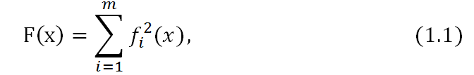</div><br />

&emsp;&emsp;其中`x=（x1,x2,…,xn）`，一般假设`m>=n`。把极小化这类函数的问题称为最小二乘问题。

<div  align="center"></div><br />

&emsp;&emsp;当$f_{i}(x)$为`x`的线性函数时，称（1.2）为线性最小二乘问题，当$f_{i}(x)$为`x`的非线性函数时，称（1.2）为非线性最小二乘问题。

### 1.2 线性最小二乘问题

&emsp;&emsp;在公式（1.1）中，假设

<div  align="center">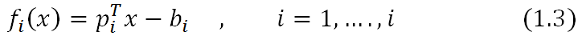</div><br />

&emsp;&emsp;其中，`p`是n维列向量，`bi`是实数，这样我们可以用矩阵的形式表示（1.1）式。令

<div  align="center"></div><br />

&emsp;&emsp;A是`m * n`矩阵，`b`是`m`维列向量。则

<div  align="center">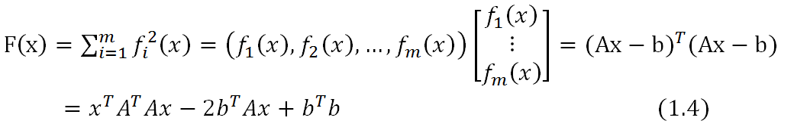</div><br />

&emsp;&emsp;因为`F(x)`是凸的，所以对（1.4）求导可以得到全局极小值，令其导数为0，我们可以得到这个极小值。

<div  align="center"></div><br />

&emsp;&emsp;假设`A`为满秩，$A^{T}A$为`n`阶对称正定矩阵，我们可以求得`x`的值为以下的形式：

<div  align="center"></div><br />

### 1.3 非线性最小二乘问题

&emsp;&emsp;假设在（1.1）中，$f_{i}(x)$为非线性函数，且`F(x)`有连续偏导数。由于$f_{i}(x)$为非线性函数，所以（1.2）中的非线性最小二乘无法套用（1.6）中的公式求得。
解这类问题的基本思想是，通过解一系列线性最小二乘问题求非线性最小二乘问题的解。设$x^{(k)}$是解的第`k`次近似。在$x^{(k)}$时，将函数$f_{i}(x)$线性化，从而将非线性最小二乘转换为线性最小二乘问题，
用（1.6）中的公式求解极小点$x^{(k+1)}$ ，把它作为非线性最小二乘问题解的第`k+1`次近似。然后再从$x^{(k+1)}$出发，继续迭代。下面将来推导迭代公式。令

<div  align="center"></div><br />

&emsp;&emsp;上式右端是$f_{i}(x)$在$x^{(k)}$处展开的一阶泰勒级数多项式。令

<div  align="center"></div><br />

&emsp;&emsp;用`∅(x)`近似`F(x)`，从而用`∅(x)`的极小点作为目标函数`F(x)`的极小点的估计。现在求解线性最小二乘问题

<div  align="center">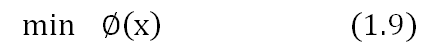</div><br />

&emsp;&emsp;把（1.9）写成

<div  align="center">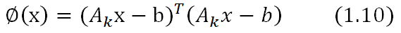</div><br />

&emsp;&emsp;在公式（1.10）中，

<div  align="center">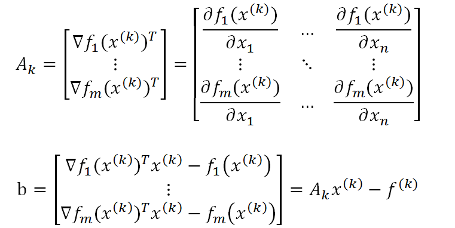</div><br />

&emsp;&emsp;将$A_{k}$和`b`带入公式（1.5）中，可以得到，

<div  align="center"></div><br />

&emsp;&emsp;如果$A_{k}$为列满秩，且$A_{k}^{T}A_{k}$是对称正定矩阵，那么由（1.11）可以得到`x`的极小值。

<div  align="center"></div><br />

&emsp;&emsp;可以推导出$2A_{k}^{T}f_{k}$是目标函数`F(x)`在$x^{(k)}$处的梯度，$2A_{k}^{T}A_{k}$是函数`∅(x)`的海森矩阵。所以（1.12）又可以写为如下形式。

<div  align="center"></div><br />

&emsp;&emsp;公式（1.13）称为`Gauss-Newton`公式。向量
<br />
<div  align="center">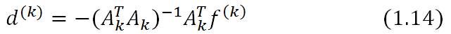</div><br />

&emsp;&emsp;称为点$x^{(k)}$处的`Gauss-Newton`方向。为保证每次迭代能使目标函数值下降（至少不能上升），在求出$d^{(k)}$后，不直接使用$x^{(k)}+d^{(k)}$作为k+1次近似，而是从$x^{(k)}$出发，沿$d^{(k)}$方向进行一维搜索。

<div  align="center"></div><br />

&emsp;&emsp;求出步长$\lambda ^{(k)}$后，令

<div  align="center"></div><br />

**&emsp;&emsp;最小二乘的计算步骤如下:**

- （1）	给定初始点$x^{(1)}$，允许误差`ε>0，k=1`

- （2）	计算函数值$f_{i}(x)$，得到向量$f^{(k)}$，再计算一阶偏导，得到`m*n`矩阵$A_{(k)}$

- （3）	解方程组（1.14）求得`Gauss-Newton`方向$d^{(k)}$

- （4）从$x^{(k)}$出发，沿着$d^{(k)}$作一维搜索，求出步长$\lambda ^{(k)}$ ，并令$x^{(k+1)}=x^{(k)}-\lambda d^{(k)}$

- （5）若$||x^{(k+1)}-x^{(k)}||<=\epsilon$停止迭代，求出`x`，否则，`k=k+1`，返回步骤（2）

&emsp;&emsp;在某些情况下，矩阵$A^{T}A$是奇异的，这种情况下，我们无法求出它的逆矩阵，因此我们需要对其进行修改。用到的基本技巧是将一个正定对角矩阵添加到$A^{T}A$上，改变原来矩阵的特征值结构，使其变成条件较好的对称正定矩阵。
典型的算法是`Marquardt`。

<div  align="center"></div><br />

&emsp;&emsp;其中，`I`是`n`阶单位矩阵，`alpha`是一个正实数。当`alpha`为0时，$d^{(k)}$就是`Gauss-Newton`方向，当`alpha`充分大时，这时$d^{(k)}$接近`F(x)`在$x^{(k)}$处的最速下降方向。算法的具体过程见参考文献【1】。

## 2 共轭梯度法

### 2.1 共轭方向

&emsp;&emsp;在讲解共轭梯度法之前，我们需要先知道什么是共轭方向，下面的定义给出了答案。

**&emsp;&emsp;定义2.1** 设`A`是`n*n`对称正定矩阵，若两个方向$d^{(1)}$ 和$d^{(2)}$满足

<div  align="center"></div><br />

则称这两个方向关于`A`共轭。若$d^{(1)},d^{(2)},...,d^{(k)}$是`k`个方向，它们两两关于`A`共轭，则称这组方向是关于`A`共轭的。即

<div  align="center"></div><br />

在上述定义中，如果`A`是单位矩阵，那么两个方向关于`A`共轭等价于两个方向正交。如果`A`是一般的对称正定矩阵，$d^{(i)}$与$d^{(j)}$共轭，就是$d^{(i)}$与$Ad^{(j)}$正交。共轭方向有一些重要的性质。

**&emsp;&emsp;定理2.1** 设`A`是`n`阶对称正定矩阵，$d^{(1)},d^{(2)},...,d^{(k)}$是`k`个`A`的共轭的非零向量，则这个向量组线性无关。

**&emsp;&emsp;定理2.2 (扩张子空间定理）** 设有函数

<div  align="center">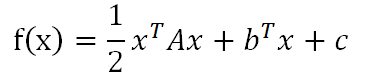</div><br />

&emsp;&emsp;其中，`A`是`n`阶对称正定矩阵，$d^{(1)},d^{(2)},...,d^{(k)}$是`k`个`A`的共轭的非零向量，以任意的$x^{(1)}$为初始点，
沿$d^{(1)},d^{(2)},...,d^{(k)}$进行一维搜索，得到$x^{(2)},x^{(3)},...,x^{(k+1)}$，则$d^{(k+1)}$是线性流型
$x^{(1)}+H_{k}$上的唯一极小点，特别的，当k=n时，$x^{(n+1)}$是函数`f(x)`的唯一极小点。其中，

<div  align="center">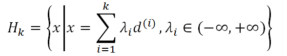</div><br />

是$d^{(1)},d^{(2)},...,d^{(k)}$生成的子空间。

&emsp;&emsp;这两个定理在文献【1】中有详细证明。

### 2.2 共轭梯度法

&emsp;&emsp;共轭梯度法的基本思想是把共轭性与最速下降方法相结合，利用已知点处的梯度构造一组共轭方向，并沿这组方向进行搜索，求出目标函数的极小点。这里我们仅仅讨论二次凸函数的共轭梯度法。

&emsp;&emsp;考虑问题

<div  align="center">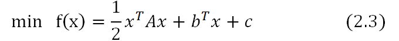</div><br />

&emsp;&emsp;其中`A`是对称正定矩阵，`c`是常数。

&emsp;&emsp;具体求解方式如下：

&emsp;&emsp;首先给定任何一个初始点$x^{(1)}$ ，计算目标函数`f(x)`在这点的梯度$g_{(1)}$ ，若$||g_{(1)}||=0$ ，则停止计算；否则令

<div  align="center">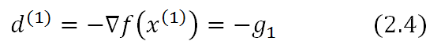</div><br />

&emsp;&emsp;沿方向$d^{(1)}$搜索，得到点$x^{(2)}$ 。计算$x^{(2)}$处的梯度，若$||g_{(2)}||!=0$，则利用$g_{(2)}$和$d^{(1)}$构造第二个搜索方向$d^{(2)}$，再沿$d^{(2)}$搜索。

&emsp;&emsp;一般的，若已知$x^{(k)}$和搜索方向$d^{(k)}$，则从$x^{(k))}$出发，沿方向$d^{(k)}$搜索，得到

<div  align="center">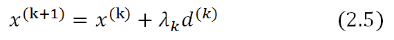</div><br />

&emsp;&emsp;其中步长`lambda`满足

<div  align="center">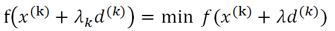</div><br />

&emsp;&emsp;此时可以求得`lambda`的显式表达。令

<div  align="center">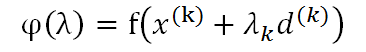</div><br />

&emsp;&emsp;通过求导可以求上面公式的极小值，即

<div  align="center"></div><br />

&emsp;&emsp;根据二次函数梯度表达式，（2.6）式可以推出如下方程

<div  align="center">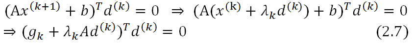</div><br />

&emsp;&emsp;由（2.7）式可以得到

<div  align="center">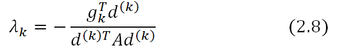</div><br />

&emsp;&emsp;计算`f(x)`在$x^{(k+1)}$处的梯度，若$||g_{k+1}||=0$ ，则停止计算，
否则用$g_{(k+1)}$和$d^{(k)}$构造下一个搜索方向$d^{(k+1)}$ ，并使$d^{(k)}$与$d^{(k+1)}$共轭。按照这种设想，令

<div  align="center"></div><br />

&emsp;&emsp;在公式（2.9）两端同时乘以$d^{(k)T}A$，并令

<div  align="center"></div><br />

&emsp;&emsp;可以求得

<div  align="center"></div><br />

&emsp;&emsp;再从$x^{(k+1)}$出发，沿$d^{(k+1)}$方向搜索。综上分析 ，在第1个搜索方向取负梯度的前提下，重复使用公式（2.5）、（2.8）、（2.9）、（2.11），我们就能够构造一组搜索方向。当然，前提是这组方向是关于`A`共轭的。
定理2.3说明了这组方向是共轭的。

**&emsp;&emsp;定理2.3** 对于正定二次函数（2.3），具有精确一维搜索的的共轭梯度法在`m<=n`次一维搜索后终止，并且对于所有`i(1<=i<=m)`，下列关系成立：

<div  align="center"></div><br />

&emsp;&emsp;还可以证明，对于正定二次函数，运用共轭梯度法时，不做矩阵运算也可以计算变量`beta_k`。

**&emsp;&emsp;定理2.4** 对于正定二次函数，共轭梯度法中因子`beta_k`具有下列表达式

<div  align="center">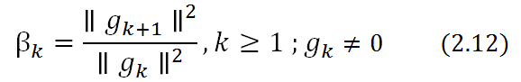</div><br />

&emsp;&emsp;对于二次凸函数，共轭梯度法的计算步骤如下：

<div  align="center"></div><br />

## 3 最小二乘法在spark中的具体实现

&emsp;&emsp;`Spark ml`中解决最小二乘可以选择两种方式，一种是非负正则化最小二乘，一种是乔里斯基分解（`Cholesky`）。

&emsp;&emsp;乔里斯基分解分解是把一个对称正定的矩阵表示成一个上三角矩阵`U`的转置和其本身的乘积的分解。在`ml`代码中，直接调用[netlib-java](https://github.com/fommil/netlib-java)封装的`dppsv`方法实现。

```scala
lapack.dppsv(“u”, k, 1, ne.ata, ne.atb, k, info)
```

&emsp;&emsp;可以深入`dppsv`代码（`Fortran`代码）了解更深的细节。我们分析的重点是非负正则化最小二乘的实现，因为在某些情况下，方程组的解为负数是没有意义的。虽然方程组可以得到精确解，但却不能取负值解。在这种情况下，其非负最小二乘解比方程的精确解更有意义。非负最小二乘问题要求解的问题如下公式

<div  align="center">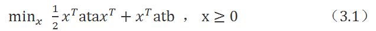</div><br />

其中ata是半正定矩阵。

&emsp;&emsp;在`ml`代码中，`org.apache.spark.mllib.optimization.NNLS`对象实现了非负最小二乘算法。该算法结合了投影梯度算法和共轭梯度算法来求解。

&emsp;&emsp;首先介绍`NNLS`对象中的`Workspace`类。

```scala
class Workspace(val n: Int) {
  val scratch = new Array[Double](n)
  val grad = new Array[Double](n)  //投影梯度
  val x = new Array[Double](n)
  val dir = new Array[Double](n)   //搜索方向
  val lastDir = new Array[Double](n)
  val res = new Array[Double](n)  //梯度
}
```

&emsp;&emsp;在`Workspace`中，`res`表示梯度，`grad`表示梯度的投影，`dir`表示迭代过程中的搜索方向（共轭梯度中的搜索方向$d^{(k)}$），`scratch`代表公式（2.8）中的
$d^{(k)T}A$。

&emsp;&emsp;`NNLS`对象中，`sort`方法用来解最小二乘，它通过迭代求解极小值。我们将分步骤剖析该方法。

- **（1）确定迭代次数。**

```scala
val iterMax = math.max(400, 20 * n)
```
- **（2）求梯度。**

&emsp;&emsp;在每次迭代内部，第一步会求梯度`res`，代码如下

```scala
//y := alpha*A*x + beta*y 即  y:=1.0 * ata * x + 0.0 * res
blas.dgemv("N", n, n, 1.0, ata, n, x, 1, 0.0, res, 1)
// ata*x - atb
blas.daxpy(n, -1.0, atb, 1, res, 1)
```

&emsp;&emsp;`dgemv`方法的作用是得到`y := alpha*A*x + beta*y`，在本代码中表示`res=ata*x`。`daxpy`方法的作用是得到`y:=step*x +y`,在本代码中表示`res=ata*x-atb`，即梯度。

- **（3）求梯度的投影矩阵**

&emsp;&emsp;求梯度矩阵的投影矩阵的依据如下公式。

<div  align="center">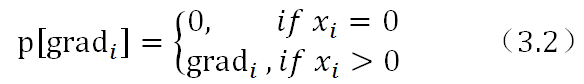</div><br />

&emsp;&emsp;详细代码如下所示：

```scala
//转换为投影矩阵
i = 0
while (i < n) {
   if (grad(i) > 0.0 && x(i) == 0.0) {
     grad(i) = 0.0
   }
   i = i + 1
}
```
- **（4）求搜索方向。**

&emsp;&emsp;在第一次迭代中，搜索方向即为梯度方向。如下面代码所示。

```scala
//在第一次迭代中，搜索方向dir即为梯度方向
blas.dcopy(n, grad, 1, dir, 1)
```
&emsp;&emsp;在第`k`次迭代中，搜索方向由梯度方向和前一步的搜索方向共同确定，计算依赖的公式是（2.9）。具体代码有两行

```scala
val alpha = ngrad / lastNorm
//alpha*lastDir + dir，此时dir为梯度方向 
blas.daxpy(n, alpha, lastDir, 1, dir, 1)
```
&emsp;&emsp;此处的`alpha`就是根据公式（2.12）计算的。

- **（5）计算步长。**

&emsp;&emsp;知道了搜索方向，我们就可以依据公式（2.8）来计算步长。

```scala
def steplen(dir: Array[Double], res: Array[Double]): Double = {
  //top = g * d
val top = blas.ddot(n, dir, 1, res, 1)
  // y := alpha*A*x + beta*y.
  // scratch = d * ata
blas.dgemv("N", n, n, 1.0, ata, n, dir, 1, 0.0, scratch, 1)
  //公式（2.8），添加1e-20是为了避免分母为0
//g*d/d*ata*d
  top / (blas.ddot(n, scratch, 1, dir, 1) + 1e-20)
}
```

- **（6）调整步长并修改迭代值。**

&emsp;&emsp;因为解是非负的，所以步长需要做一定的处理，如果步长与搜索方向的乘积大于`x`的值，那么重置步长。重置逻辑如下：

```scala
i = 0
while (i < n) {
   if (step * dir(i) > x(i)) {
     //如果步长过大，那么二者的商替代
     step = x(i) / dir(i)
   }
   i = i + 1
}
```
&emsp;&emsp;最后，修改`x`的值，完成该次迭代。

```scala
i = 0
while (i < n) {
// x(i)趋向为0
  if (step * dir(i) > x(i) * (1 - 1e-14)) {
    x(i) = 0
    lastWall = iterno
  } else {
    x(i) -= step * dir(i)
  }
  i = i + 1
}
```

## 4 参考文献

【1】陈宝林，最优化理论和算法

[【2】Boris T. Polyak，The conjugate gradient method in extreme problems](papers/The conjugate gradient method in extreme problems.pdf)

[【3】https://en.wikipedia.org/wiki/Non-negative_least_squares](https://en.wikipedia.org/wiki/Non-negative_least_squares)


