> &emsp;&emsp;`spark`中的非负正则化最小二乘法并不是`wiki`中介绍的[NNLS](https://en.wikipedia.org/wiki/Non-negative_least_squares)的实现，而是做了相应的优化。它使用改进投影梯度法结合共轭梯度法来求解非负最小二乘。
在介绍`spark`的源码之前，我们要先了解什么事最小二乘法以及共轭梯度法。

# 1 最小二乘法

## 1.1 最小二乘问题

&emsp;&emsp;在某些最优化问题中，目标函数由若干个函数的平方和构成，它的一般形式如下所示：

 

&emsp;&emsp;其中`x=（x1,x2,…,xn）`，一般假设`m>=n`。把极小化这类函数的问题称为最小二乘问题。

 

&emsp;&emsp;当为`x`的线性函数时，称（1.2）为线性最小二乘问题，当为`x`的非线性函数时，称（1.2）为非线性最小二乘问题。

## 1.2 线性最小二乘问题

&emsp;&emsp;在公式（1.1）中，假设

 

&emsp;&emsp;其中，`p`是维列向量，`bi`是实数，这样我们可以用矩阵的形式表示（1.1）式。令

 

&emsp;&emsp;A是`m * n`矩阵，`b`是`m`维列向量。则

 

&emsp;&emsp;因为`F(x)`是凸的，所以对（1.4）求导可以得到全局极小值，令其导数为0，我们可以得到这个极小值。

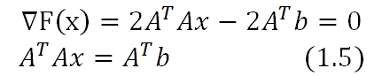
 

&emsp;&emsp;假设`A`为满秩，为`n`阶对称正定矩阵，我们可以求得`x`的值为以下的形式：

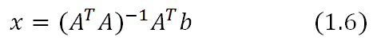
 

## 1.3 非线性最小二乘问题

&emsp;&emsp;假设在（1.1）中，为非线性函数，且`F(x)`有连续偏导数。由于为非线性函数，所以（1.2）中的非线性最小二乘无法套用（1.6）中的公式求得。
解这类问题的基本思想是，通过解一系列线性最小二乘问题求非线性最小二乘问题的解。设是解的第`k`次近似。在时，将函数线性化，从而将非线性最小二乘转换为线性最小二乘问题，
用（1.6）中的公式求解极小点，把它作为非线性最小二乘问题解的第`k+1`次近似。然后再从出发，继续迭代。下面将来推导迭代公式。令

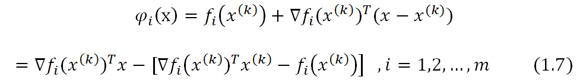
 

&emsp;&emsp;上式右端是在处展开的一阶泰勒级数多项式。令

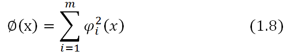
 

&emsp;&emsp;用`∅(x)`近似`F(x)`，从而用`∅(x)`的极小点作为目标函数`F(x)`的极小点的估计。现在求解线性最小二乘问题

 

&emsp;&emsp;把（1.9）写成

 

&emsp;&emsp;在公式（1.10）中，

 

&emsp;&emsp;将和`b`带入公式（1.5）中，可以得到，

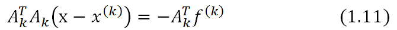
 

&emsp;&emsp;如果为列满秩，且是对称正定矩阵，那么由（1.11）可以得到`x`的极小值。

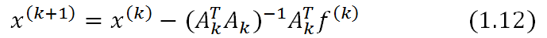
 

&emsp;&emsp;可以推导出是目标函数`F(x)`在处的梯度，是函数`∅(x)`的海森矩阵。所以（1.12）又可以写为如下形式。

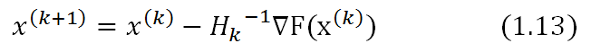
 

&emsp;&emsp;公式（1.13）称为`Gauss-Newton`公式。向量
 

 

&emsp;&emsp;称为点处的`Gauss-Newton`方向。为保证每次迭代能使目标函数值下降（至少不能上升），在求出后，不直接使用作为k+1次近似，而是从出发，沿方向进行一维搜索。

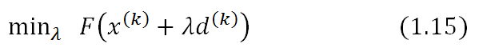
 

&emsp;&emsp;求出步长后，令

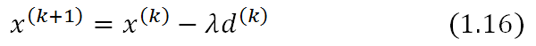
 

**&emsp;&emsp;最小二乘的计算步骤如下:**

- （1）	给定初始点，允许误差`ε>0，k=1`

- （2）	计算函数值，得到向量，再计算一阶偏导，得到`m*n`矩阵

- （3）	解方程组（1.14）求得`Gauss-Newton`方向

- （4）从出发，沿着作一维搜索，求出步长，并令

- （5）若 停止迭代，求出`x`，否则，`k=k+1`，返回步骤（2）

&emsp;&emsp;在某些情况下，矩阵是奇异的，这种情况下，我们无法求出它的逆矩阵，因此我们需要对其进行修改。用到的基本技巧是将一个正定对角矩阵添加到上，改变原来矩阵的特征值结构，使其变成条件较好的对称正定矩阵。
典型的算法是`Marquardt`。

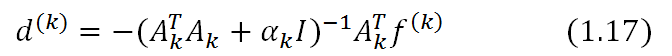
 

&emsp;&emsp;其中，`I`是n阶单位矩阵，`alpha`是一个正实数。当`alpha`为0时，就是`Gauss-Newton`方向，当`alpha`充分大时，这时接近`F(x)`在处的最速下降方向。算法的具体过程见参考文献【1】。

# 2 共轭梯度法

## 2.1 共轭方向

&emsp;&emsp;在讲解共轭梯度法之前，我们需要先知道什么事共轭方向，下面的定义给出了答案。

**定义2.1** 设`A`是`n*n`对称正定矩阵，若两个方向 和满足

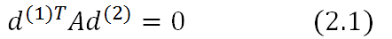
 

则称这两个方向关于`A`共轭。若是`k`个方向，它们两两关于`A`共轭，则称这组方向是关于`A`共轭的。即

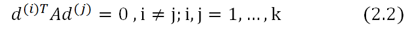
 

