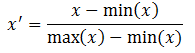

# 特征缩放

&emsp;&emsp;特征缩放是用来统一资料中的自变项或特征范围的方法，在资料处理中，通常会被使用在资料前处理这个步骤。

## 1 动机

&emsp;&emsp;因为在原始的数据中，各变量的范围大不相同。对于某些机器学习的算法，若没有做过标准化，目标函数会无法适当的运作。举例来说，多数的分类器利用两点间的距离计算两点的差异，
若其中一个特征具有非常广的范围，那两点间的差异就会被该特征左右，因此，所有的特征都该被标准化，这样才能大略的使各特征依比例影响距离。另外一个做特征缩放的理由是它能使加速梯度下降法的收敛。

## 2 方法

## 2.1 重新缩放

&emsp;&emsp;最简单的方式是重新缩放特征的范围到`[0, 1]`或`[-1, 1]`， 依据原始的资料选择目标范围，通式如下：

<div  align="center"></div><br>

## 2.2 标准化

&emsp;&emsp;在机器学习中，我们可能要处理不同种类的资料，例如，图片上的像素值，这些资料可能是高维度的，资料标准化后会使每个特征中的数值平均变为0(将每个特征的值都减掉原始资料中该特征的平均)、标准差变为1，这个方法被广泛的使用在许多机器学习算法中。

## 3 实例

```scala
import org.apache.spark.SparkContext._
import org.apache.spark.mllib.feature.StandardScaler
import org.apache.spark.mllib.linalg.Vectors
import org.apache.spark.mllib.util.MLUtils
val data = MLUtils.loadLibSVMFile(sc, "data/mllib/sample_libsvm_data.txt")

val scaler1 = new StandardScaler().fit(data.map(x => x.features))
val scaler2 = new StandardScaler(withMean = true, withStd = true).fit(data.map(x => x.features))
// scaler3 is an identical model to scaler2, and will produce identical transformations
val scaler3 = new StandardScalerModel(scaler2.std, scaler2.mean)
// data1 will be unit variance.
val data1 = data.map(x => (x.label, scaler1.transform(x.features)))
// Without converting the features into dense vectors, transformation with zero mean will raise
// exception on sparse vector.
// data2 will be unit variance and zero mean.
val data2 = data.map(x => (x.label, scaler2.transform(Vectors.dense(x.features.toArray))))
```

## 4 源代码实现

&emsp;&emsp;在`MLlib`中，`StandardScaler`类用于标准化特征。

```scala
class StandardScaler @Since("1.1.0") (withMean: Boolean, withStd: Boolean)
```
&emsp;&emsp;`StandardScaler`的实现中提供了两个参数`withMean`和`withStd`。在介绍这两个参数之前，我们先了解`fit`方法的实现。

```scala
def fit(data: RDD[Vector]): StandardScalerModel = {
    // TODO: skip computation if both withMean and withStd are false
    val summary = data.treeAggregate(new MultivariateOnlineSummarizer)(
      (aggregator, data) => aggregator.add(data),
      (aggregator1, aggregator2) => aggregator1.merge(aggregator2))
    new StandardScalerModel(
      Vectors.dense(summary.variance.toArray.map(v => math.sqrt(v))),
      summary.mean,
      withStd,
      withMean)
  }
```
&emsp;&emsp;该方法计算数据集的均值和方差（查看[概括统计](../基本统计/summary-statistics.md)以了解更多信息），并初始化`StandardScalerModel`。初始化`StandardScalerModel`之后，我们就可以调用`transform`方法转换特征了。

&emsp;&emsp;当`withMean`参数为`true`时，`transform`的实现如下。

```scala
private lazy val shift: Array[Double] = mean.toArray
val localShift = shift
      vector match {
        case DenseVector(vs) =>
          val values = vs.clone()
          val size = values.size
          if (withStd) {
            var i = 0
            while (i < size) {
              values(i) = if (std(i) != 0.0) (values(i) - localShift(i)) * (1.0 / std(i)) else 0.0
              i += 1
            }
          } else {
            var i = 0
            while (i < size) {
              values(i) -= localShift(i)
              i += 1
            }
          }
          Vectors.dense(values)
        case v => throw new IllegalArgumentException("Do not support vector type " + v.getClass)
}
```
&emsp;&emsp;以上代码显示，当`withMean`为`true`，`withStd`为`false`时，向量中的各元素均减去它相应的均值。当`withMean`和`withStd`均为`true`时，各元素在减去相应的均值之后，还要除以它们相应的方差。
当`withMean`为`true`，程序只能处理稠密的向量，不能处理稀疏向量。

&emsp;&emsp;当`withMean`为`false`时，`transform`的实现如下。

```scala
 vector match {
        case DenseVector(vs) =>
          val values = vs.clone()
          val size = values.size
          var i = 0
          while(i < size) {
            values(i) *= (if (std(i) != 0.0) 1.0 / std(i) else 0.0)
            i += 1
          }
          Vectors.dense(values)
        case SparseVector(size, indices, vs) =>
          // For sparse vector, the `index` array inside sparse vector object will not be changed,
          // so we can re-use it to save memory.
          val values = vs.clone()
          val nnz = values.size
          var i = 0
          while (i < nnz) {
            values(i) *= (if (std(indices(i)) != 0.0) 1.0 / std(indices(i)) else 0.0)
            i += 1
          }
          Vectors.sparse(size, indices, values)
        case v => throw new IllegalArgumentException("Do not support vector type " + v.getClass)
 }
```

&emsp;&emsp;这里的处理很简单，就是将数据集的列的标准差归一化为1。

# 参考文献

【1】[特征缩放](https://zh.wikipedia.org/wiki/%E7%89%B9%E5%BE%B5%E7%B8%AE%E6%94%BE)


