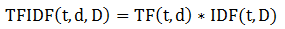

# TF-IDF

## 1 介绍

&emsp;&emsp;[词频-逆文档频率法](http://en.wikipedia.org/wiki/Tf%E2%80%93idf)(`Term frequency-inverse document frequency,TF-IDF`)是在文本挖掘中广泛使用的特征向量化方法。
它反映语料中词对文档的重要程度。假设用`t`表示词，`d`表示文档，`D`表示语料。词频`TF(t,d)`表示词`t`在文档`d`中出现的次数。文档频率`DF(t,D)`表示语料中出现词`t`的文档的个数。
如果我们仅仅用词频去衡量重要程度，这很容易过分强调出现频繁但携带较少文档信息的词，如`of`、`the`等。如果一个词在语料中出现很频繁，这意味着它不携带特定文档的特殊信息。逆文档频率数值衡量一个词提供多少信息。

<div  align="center"></div><br>

&emsp;&emsp;如果某个词出现在所有的文档中，它的`IDF`值为0。注意，上式有个平滑项，这是为了避免分母为0的情况发生。`TF-IDF`就是`TF`和`IDF`简单的相乘。

<div  align="center"></div><br>

&emsp;&emsp;词频和文档频率的定义有很多种不同的变种。在`Mllib`中，分别提供了`TF`和`IDF`的实现，以便有更好的灵活性。

&emsp;&emsp;`Mllib`使用`hashing trick`实现词频。元素的特征应用一个`hash`函数映射到一个索引（即词），通过这个索引计算词频。这个方法避免计算全局的词-索引映射，因为全局的词-索引映射在大规模语料中花费较大。
但是，它会出现哈希冲突，这是因为不同的元素特征可能得到相同的哈希值。为了减少碰撞冲突，我们可以增加目标特征的维度，例如哈希表的桶数量。默认的特征维度是1048576。

## 2 实例

- TF的计算

```scala
import org.apache.spark.rdd.RDD
import org.apache.spark.SparkContext
import org.apache.spark.mllib.feature.HashingTF
import org.apache.spark.mllib.linalg.Vector
val sc: SparkContext = ...
// Load documents (one per line).
val documents: RDD[Seq[String]] = sc.textFile("...").map(_.split(" ").toSeq)
val hashingTF = new HashingTF()
val tf: RDD[Vector] = hashingTF.transform(documents)
```
- IDF的计算

```scala
import org.apache.spark.mllib.feature.IDF
// ... continue from the previous example
tf.cache()
val idf = new IDF().fit(tf)
val tfidf: RDD[Vector] = idf.transform(tf)
//或者
val idf = new IDF(minDocFreq = 2).fit(tf)
val tfidf: RDD[Vector] = idf.transform(tf)
```

## 3 源码实现

&emsp;&emsp;下面分别分析`HashingTF`和`IDF`的实现。

### 3.1 HashingTF

```scala
def transform(document: Iterable[_]): Vector = {
    val termFrequencies = mutable.HashMap.empty[Int, Double]
    document.foreach { term =>
      val i = indexOf(term)
      termFrequencies.put(i, termFrequencies.getOrElse(i, 0.0) + 1.0)
    }
    Vectors.sparse(numFeatures, termFrequencies.toSeq)
  }
```
&emsp;&emsp;以上代码中，`indexOf`方法使用哈希获得索引。

```scala
//为了减少碰撞，将numFeatures设置为1048576
def indexOf(term: Any): Int = Utils.nonNegativeMod(term.##, numFeatures)
def nonNegativeMod(x: Int, mod: Int): Int = {
    val rawMod = x % mod
    rawMod + (if (rawMod < 0) mod else 0)
  }
```
&emsp;&emsp;这里的`term.##`等价于`term.hashCode`，得到哈希值之后，作取余操作得到相应的索引。

### 3.2 IDF

&emsp;&emsp;我们先看`IDF`的`fit`方法。

```scala
def fit(dataset: RDD[Vector]): IDFModel = {
    val idf = dataset.treeAggregate(new IDF.DocumentFrequencyAggregator(
          minDocFreq = minDocFreq))(
      seqOp = (df, v) => df.add(v),
      combOp = (df1, df2) => df1.merge(df2)
    ).idf()
    new IDFModel(idf)
  }
```
&emsp;&emsp;该函数使用`treeAggregate`处理数据集，生成一个`DocumentFrequencyAggregator`对象，它用于计算文档频率。重点看`add`和`merge`方法。

```scala
def add(doc: Vector): this.type = {
      if (isEmpty) {
        df = BDV.zeros(doc.size)
      }
      //计算
      doc match {
        case SparseVector(size, indices, values) =>
          val nnz = indices.size
          var k = 0
          while (k < nnz) {
            if (values(k) > 0) {
              df(indices(k)) += 1L
            }
            k += 1
          }
        case DenseVector(values) =>
          val n = values.size
          var j = 0
          while (j < n) {
            if (values(j) > 0.0) {
              df(j) += 1L
            }
            j += 1
          }
        case other =>
          throw new UnsupportedOperationException
      }
      m += 1L
      this
    }
```
&emsp;&emsp;`df`这个向量的每个元素都表示该索引对应的词出现的文档数。`m`表示文档总数。

```scala
def merge(other: DocumentFrequencyAggregator): this.type = {
      if (!other.isEmpty) {
        m += other.m
        if (df == null) {
          df = other.df.copy
        } else {
          //简单的向量相加
          df += other.df
        }
      }
      this
    }
```
&emsp;&emsp;`treeAggregate`方法处理完数据之后，调用`idf`方法将文档频率低于给定值的词的`idf`置为0，其它的按照上面的公式计算。

```scala
 def idf(): Vector = {
      val n = df.length
      val inv = new Array[Double](n)
      var j = 0
      while (j < n) {
        if (df(j) >= minDocFreq) {
          //计算得到idf
          inv(j) = math.log((m + 1.0) / (df(j) + 1.0))
        }
        j += 1
      }
      Vectors.dense(inv)
}
```
&emsp;&emsp;最后使用`transform`方法计算`tfidf`值。

```scala
 //这里的dataset指tf
 def transform(dataset: RDD[Vector]): RDD[Vector] = {
    val bcIdf = dataset.context.broadcast(idf)
    dataset.mapPartitions(iter => iter.map(v => IDFModel.transform(bcIdf.value, v)))
  }
 def transform(idf: Vector, v: Vector): Vector = {
     val n = v.size
     v match {
       case SparseVector(size, indices, values) =>
         val nnz = indices.size
         val newValues = new Array[Double](nnz)
         var k = 0
         while (k < nnz) {
           //tf-idf = tf * idf
           newValues(k) = values(k) * idf(indices(k))
           k += 1
         }
         Vectors.sparse(n, indices, newValues)
       case DenseVector(values) =>
         val newValues = new Array[Double](n)
         var j = 0
         while (j < n) {
           newValues(j) = values(j) * idf(j)
           j += 1
         }
         Vectors.dense(newValues)
       case other =>
         throw new UnsupportedOperationException
     }
   }
```