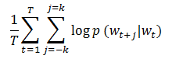
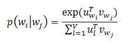

# Word2Vector

&emsp;&emsp;[Word2Vector](https://code.google.com/p/word2vec/)将词转换成分布式向量。分布式表示的主要优势是相似的词在向量空间距离较近，这使我们更容易泛化新的模式并且使模型估计更加健壮。
分布式的向量表示在许多自然语言处理应用（如命名实体识别、消歧、词法分析、机器翻译）中非常有用。

## 1 模型

&emsp;&emsp;在`MLlib`中，`Word2Vector`使用`skip-gram`模型来实现。`skip-gram`的训练目标是学习词向量表示，这个表示可以很好的预测它在相同句子中的上下文。数学上，给定训练词`w_1,w_2,...,w_T`，
`skip-gram`模型的目标是最大化下面的平均对数似然。

<div  align="center"></div><br>

&emsp;&emsp;其中`k`是训练窗口的大小。在`skip-gram`模型中，每个词`w`和两个向量`u_w`和`v_w`相关联，这两个向量分别表示词和上下文。正确地预测给定词`w_j`的条件下`w_i`的概率使用`softmax`模型。

<div  align="center"></div><br>

&emsp;&emsp;其中`V`表示词汇数量。在`skip-gram`模型中使用`softmax`是非常昂贵的，因为计算`log p(w_i|w_j)`与`V`是成比例的。为了加快`Word2Vec`的训练速度，`MLlib`使用了分层`softmax`,这样可以将计算的复杂度降低为`O(log(V))`。

## 2 实例

&emsp;&emsp;下面的例子展示了怎样加载文本数据、切分数据、构造`Word2Vec`实例、训练模型。最后，我们打印某个词的40个同义词。

```scala
import org.apache.spark._
import org.apache.spark.rdd._
import org.apache.spark.SparkContext._
import org.apache.spark.mllib.feature.{Word2Vec, Word2VecModel}
val input = sc.textFile("text8").map(line => line.split(" ").toSeq)
val word2vec = new Word2Vec()
val model = word2vec.fit(input)
val synonyms = model.findSynonyms("china", 40)
for((synonym, cosineSimilarity) <- synonyms) {
  println(s"$synonym $cosineSimilarity")
}
```

## 3 源码分析

&emsp;&emsp;由于涉及神经网络相关的知识，这里先不作分析，后续会补上。要更详细了解`Word2Vector`可以阅读文献【2】。

# 参考文献

【1】[哈夫曼树与哈夫曼编码](http://www.cnblogs.com/Jezze/archive/2011/12/23/2299884.html)

【2】[Deep Learning 实战之 word2vec](docs/word2vec.pdf)

【3】[Word2Vector谷歌实现](https://code.google.com/p/word2vec/)