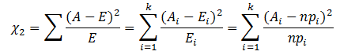

# 卡方选择器

&emsp;&emsp;[特征选择](http://en.wikipedia.org/wiki/Feature_selection)试图识别相关的特征用于模型构建。它改变特征空间的大小，它可以提高速度以及统计学习行为。`ChiSqSelector`实现卡方特征选择，它操作于带有类别特征的标注数据。
`ChiSqSelector`根据独立的卡方测试对特征进行排序，然后选择排序最高的特征。下面是一个使用的例子。

```scala
import org.apache.spark.SparkContext._
import org.apache.spark.mllib.linalg.Vectors
import org.apache.spark.mllib.regression.LabeledPoint
import org.apache.spark.mllib.util.MLUtils
import org.apache.spark.mllib.feature.ChiSqSelector
// 加载数据
val data = MLUtils.loadLibSVMFile(sc, "data/mllib/sample_libsvm_data.txt")
// 卡方分布需要类别特征，所以对特征除一个整数。虽然特征是double类型，
//但是ChiSqSelector将每个唯一的值当做一个类别
val discretizedData = data.map { lp =>
  LabeledPoint(lp.label, Vectors.dense(lp.features.toArray.map { x => (x / 16).floor } ) )
}
// Create ChiSqSelector that will select top 50 of 692 features
val selector = new ChiSqSelector(50)
// Create ChiSqSelector model (selecting features)
val transformer = selector.fit(discretizedData)
// Filter the top 50 features from each feature vector
val filteredData = discretizedData.map { lp => 
  LabeledPoint(lp.label, transformer.transform(lp.features)) 
}
```
&emsp;&emsp;下面看看选择特征的实现，入口函数是`fit`。

```scala
 def fit(data: RDD[LabeledPoint]): ChiSqSelectorModel = {
    //计算数据卡方值
    val indices = Statistics.chiSqTest(data)
      .zipWithIndex.sortBy { case (res, _) => -res.statistic }
      .take(numTopFeatures)
      .map { case (_, indices) => indices }
      .sorted
    new ChiSqSelectorModel(indices)
  }
```

&emsp;&emsp;这里通过`Statistics.chiSqTest`计算卡方检测的值。下面需要了解卡方检测的理论基础。

## 1 卡方检测

### 1.1 什么是卡方检测

&emsp;&emsp;卡方检验是一种用途很广的计数资料的假设检验方法。它属于非参数检验的范畴，主要是比较两个及两个以上样本率( 构成比）以及两个分类变量的关联性分析。
其根本思想就是在于比较理论频数和实际频数的吻合程度或拟合优度问题。

### 1.2 卡方检测的基本思想

&emsp;&emsp;卡方检验是以分布为基础的一种常用假设检验方法，它的无效假设`H0`是：观察频数与期望频数没有差别。

&emsp;&emsp;该检验的基本思想是：首先假设`H0`成立，基于此前提计算出值，它表示观察值与理论值之间的偏离程度。根据分布及自由度可以确定在`H0`假设成立的情况下获得当前统计量及更极端情况的概率`P`。
如果P值很小，说明观察值与理论值偏离程度太大，应当拒绝无效假设，表示比较资料之间有显著差异；否则就不能拒绝无效假设，尚不能认为样本所代表的实际情况和理论假设有差别。

### 1.3 卡方值的计算与意义

&emsp;&emsp;卡方值表示观察值与理论值之问的偏离程度。计算这种偏离程度的基本思路如下。

- 设`A`代表某个类别的观察频数，`E`代表基于`H0`计算出的期望频数，`A`与`E`之差称为残差。

- 残差可以表示某一个类别观察值和理论值的偏离程度，但如果将残差简单相加以表示各类别观察频数与期望频数的差别，则有一定的不足之处。
因为残差有正有负，相加后会彼此抵消，总和仍然为0，为此可以将残差平方后求和。

- 另一方面，残差大小是一个相对的概念，相对于期望频数为10时，期望频数为20的残差非常大，但相对于期望频数为1000时20的残差就很小了。
考虑到这一点，人们又将残差平方除以期望频数再求和，以估计观察频数与期望频数的差别。

&emsp;&emsp;进行上述操作之后，就得到了常用的统计量。其计算公式是：

<div  align="center"></div><br>

&emsp;&emsp;当`n`比较大时，卡方统计量近似服从`k-1`(计算`E_i`时用到的参数个数)个自由度的卡方分布。由卡方的计算公式可知，当观察频数与期望频数完全一致时，卡方值为0；观察频数与期望频数越接近，两者之间的差异越小，卡方值越小；
反之，观察频数与期望频数差别越大，两者之间的差异越大，卡方值越大。

## 2 卡方检测的源码实现


## 参考文献

【1】[卡方检验](http://wiki.mbalib.com/wiki/%E5%8D%A1%E6%96%B9%E6%A3%80%E9%AA%8C)