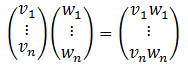

# 元素智能乘积

&emsp;&emsp;`ElementwiseProduct`对每一个输入向量乘以一个给定的“权重”向量。换句话说，就是通过一个乘子对数据集的每一列进行缩放。这个转换可以表示为如下的形式：

<div  align="center"></div><br>

&emsp;&emsp;下面是一个使用的实例。

```scala
import org.apache.spark.SparkContext._
import org.apache.spark.mllib.feature.ElementwiseProduct
import org.apache.spark.mllib.linalg.Vectors
// Create some vector data; also works for sparse vectors
val data = sc.parallelize(Array(Vectors.dense(1.0, 2.0, 3.0), Vectors.dense(4.0, 5.0, 6.0)))
val transformingVector = Vectors.dense(0.0, 1.0, 2.0)
val transformer = new ElementwiseProduct(transformingVector)

// Batch transform and per-row transform give the same results:
val transformedData = transformer.transform(data)
val transformedData2 = data.map(x => transformer.transform(x))
```

&emsp;&emsp;下面看`transform`的实现。

```scala
override def transform(vector: Vector): Vector = {
    vector match {
      case dv: DenseVector =>
        val values: Array[Double] = dv.values.clone()
        val dim = scalingVec.size
        var i = 0
        while (i < dim) {
          //相对应的值相乘
          values(i) *= scalingVec(i)
          i += 1
        }
        Vectors.dense(values)
      case SparseVector(size, indices, vs) =>
        val values = vs.clone()
        val dim = values.length
        var i = 0
        while (i < dim) {
          //相对应的值相乘
          values(i) *= scalingVec(indices(i))
          i += 1
        }
        Vectors.sparse(size, indices, values)
      case v => throw new IllegalArgumentException("Does not support vector type " + v.getClass)
    }
  }
```
