# 隐式狄利克雷分布

# 前言

&emsp;&emsp;`LDA`是一种概率主题模型：隐式狄利克雷分布（`Latent Dirichlet Allocation`，简称`LDA`）。`LDA`是2003年提出的一种[主题模型](http://zh.wikipedia.org/wiki/%E4%B8%BB%E9%A2%98%E6%A8%A1%E5%9E%8B)，它可以将文档集中每篇文档的主题以概率分布的形式给出。
通过分析一些文档，我们可以抽取出它们的主题（分布），根据主题（分布）进行主题聚类或文本分类。同时，它是一种典型的词袋模型，即一篇文档是由一组词构成，词与词之间没有先后顺序的关系。一篇文档可以包含多个主题，文档中每一个词都由其中的一个主题生成。

&emsp;&emsp;举一个简单的例子，比如假设事先给定了这几个主题：`Arts、Budgets、Children、Education`，然后通过学习的方式，获取每个主题`Topic`对应的词语，如下图所示：

<div  align="center">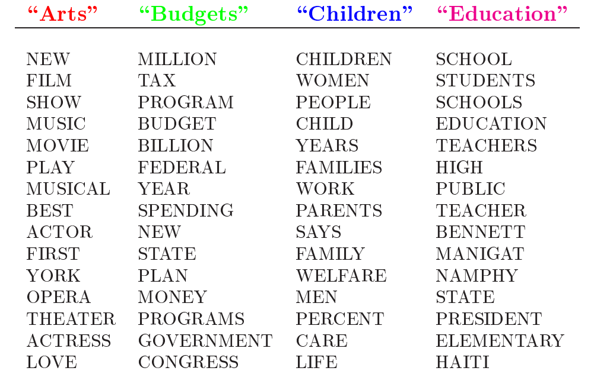</div><br>

&emsp;&emsp;然后以一定的概率选取上述某个主题，再以一定的概率选取那个主题下的某个单词，不断的重复这两步，最终生成如下图所示的一篇文章（不同颜色的词语分别表示不同主题）。

<div  align="center">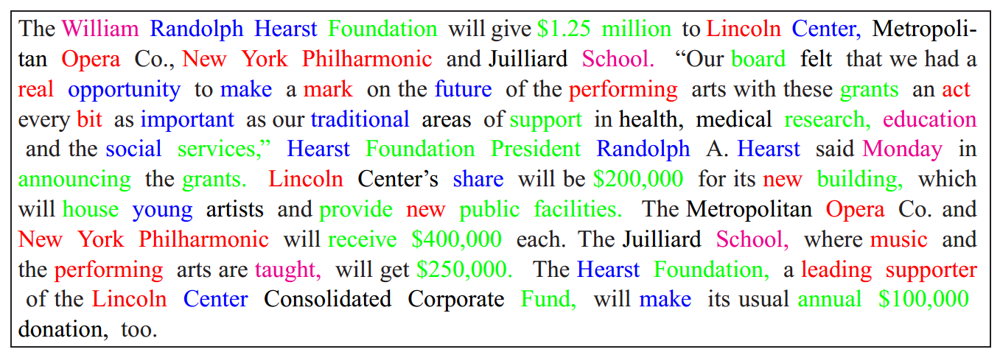</div><br>

&emsp;&emsp;我们看到一篇文章后，往往会推测这篇文章是如何生成的，我们通常认为作者会先确定几个主题，然后围绕这几个主题遣词造句写成全文。`LDA`要干的事情就是根据给定的文档，判断它的主题分布。在`LDA`模型中，生成文档的过程有如下几步：

- 从狄利克雷分布$\alpha$中生成文档i的主题分布$\theta_{i}$ ；

- 从主题的多项式分布$\theta_{i}$中取样生成文档i第j个词的主题$Z_{i,j}$ ；

- 从狄利克雷分布$\eta$中取样生成主题$Z_{i,j}$对应的词语分布$\beta_{i,j}$ ；

- 从词语的多项式分布$\beta_{i,j}$中采样最终生成词语$W_{i,j}$ .

&emsp;&emsp;`LDA`的图模型结构如下图所示：

<div  align="center">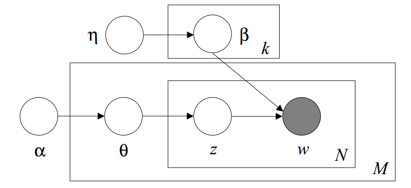</div><br>

&emsp;&emsp;`LDA`会涉及很多数学知识，后面的章节我会首先介绍`LDA`涉及的数学知识，然后在这些数学知识的基础上详细讲解`LDA`的原理。

# 1 数学预备

## 1.1 Gamma函数

&emsp;&emsp;在高等数学中，有一个长相奇特的`Gamma`函数

<div  align="center">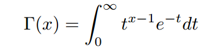</div><br>

&emsp;&emsp;通过分部积分，可以推导`gamma`函数有如下递归性质

<div  align="center">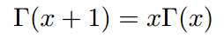</div><br>

&emsp;&emsp;通过该递归性质，我们可以很容易证明，`gamma`函数可以被当成阶乘在实数集上的延拓，具有如下性质

<div  align="center">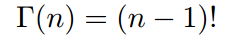</div><br>

## 1.2 Digamma函数

&emsp;&emsp;如下函数被称为`Digamma`函数，它是`Gamma`函数对数的一阶导数

<div  align="center">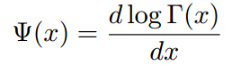</div><br>

&emsp;&emsp;这是一个很重要的函数，在涉及`Dirichlet`分布相关的参数的极大似然估计时，往往需要用到这个函数。`Digamma`函数具有如下一个漂亮的性质

<div  align="center">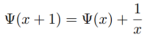</div><br>

## 1.3 二项分布（Binomial distribution）

&emsp;&emsp;二项分布是由伯努利分布推出的。伯努利分布，又称两点分布或`0-1`分布，是一个离散型的随机分布，其中的随机变量只有两类取值，即0或者1。二项分布是重复`n`次的伯努利试验。简言之，只做一次实验，是伯努利分布，重复做了n次，是二项分布。二项分布的概率密度函数为：

<div  align="center">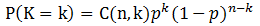</div><br>

&emsp;&emsp;对于k=1,2，...,n，其中`C(n,k)`是二项式系数（这就是二项分布的名称的由来）

<div  align="center">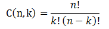</div><br>

## 1.4 多项分布

&emsp;&emsp;多项分布是二项分布扩展到多维的情况。多项分布是指单次试验中的随机变量的取值不再是`0-1`，而是有多种离散值可能`（1,2,3...,k）`。比如投掷6个面的骰子实验，`N`次实验结果服从`K=6`的多项分布。其中：

<div  align="center">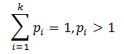</div><br>

&emsp;&emsp;多项分布的概率密度函数为：

<div  align="center">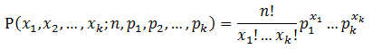</div><br>

## 1.5 Beta分布

### 1.5.1 Beta分布

&emsp;&emsp;首先看下面的问题1（问题1到问题4都取自于文献【1】）。

&emsp;&emsp;**问题1：**

<div  align="center">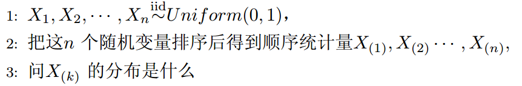</div><br>

&emsp;&emsp; 为解决这个问题，可以尝试计算$x_{(k)}$落在区间`[x,x+delta x]`的概率。首先，把`[0,1]`区间分成三段`[0,x)`,`[x,x+delta x]`，`(x+delta x,1]`，然后考虑下简单的情形：即假设n个数中只有1个落在了区间`[x,x+delta x]`内，由于这个区间内的数`X(k)`是第k大的，所以`[0,x)`中应该有k−1个数，`(x+delta x,1]`这个区间中应该有n−k个数。
如下图所示：

<div  align="center">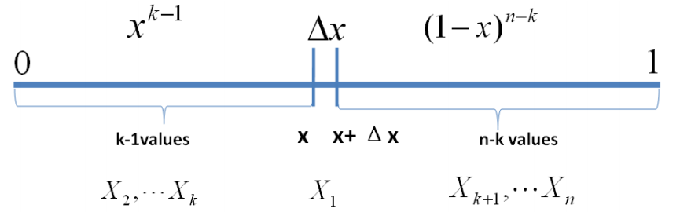</div><br>

&emsp;&emsp;上述问题可以转换为下述事件`E`：

<div  align="center">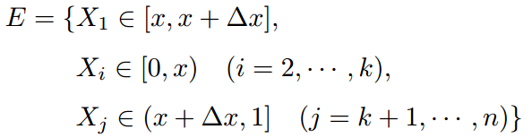</div><br>

&emsp;&emsp;对于上述事件`E`，有：

<div  align="center">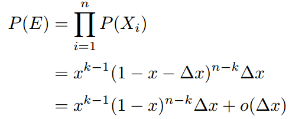</div><br>

&emsp;&emsp;其中，`o(delta x)`表示`delta x`的高阶无穷小。显然，由于不同的排列组合，即n个数中有一个落在`[x,x+delta x]`区间的有n种取法，余下n−1个数中有k−1个落在`[0,x)`的有`C(n-1,k-1)`种组合。所以和事件E等价的事件一共有`nC(n-1,k-1)`个。

&emsp;&emsp;文献【1】中证明，只要落在`[x,x+delta x]`内的数字超过一个，则对应的事件的概率就是`o(delta x)`。所以$x_{(k)}$的概率密度函数为：

<div  align="center">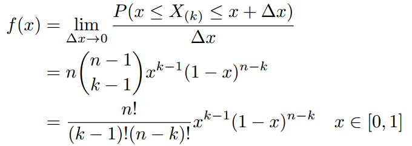</div><br>

&emsp;&emsp;利用`Gamma`函数，我们可以将`f(x)`表示成如下形式：

<div  align="center">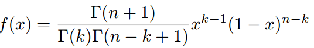</div><br>

&emsp;&emsp;在上式中，我们用`alpha=k`，`beta=n-k+1`替换，可以得到`beta`分布的概率密度函数

<div  align="center">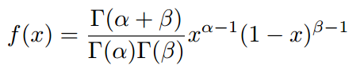</div><br>

### 1.5.2 共轭先验分布

&emsp;&emsp;什么是共轭呢？轭的意思是束缚、控制。共轭从字面上理解，则是共同约束，或互相约束。在贝叶斯概率理论中，如果后验概率`P(z|x)`和先验概率`p(z)`满足同样的分布，那么，先验分布和后验分布被叫做共轭分布，同时，先验分布叫做似然函数的共轭先验分布。

### 1.5.3 Beta-Binomial 共轭

&emsp;&emsp;我们在问题1的基础上增加一些观测数据，变成**问题2**：

<div  align="center">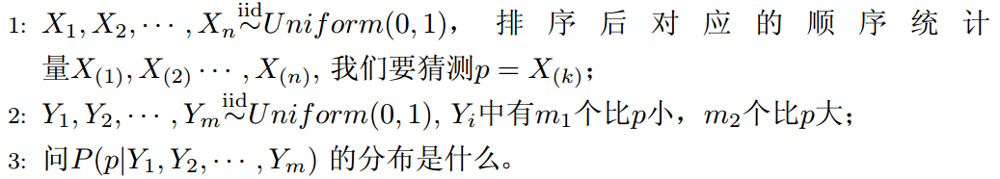</div><br>

&emsp;&emsp;第2步的条件可以用另外一句话来表述，即“`Yi`中有`m1`个比`X(k`)小，`m2`个比`X(k)`大”，所以`X(k)`是$X_{(1)},X_{(2)},...,X_{(n)};Y_{(1)},Y_{(2)},...,Y_{(m)}$中k+m1大的数。

&emsp;&emsp;根据1.5.1的介绍，我们知道事件p服从`beta`分布,它的概率密度函数为：

<div  align="center">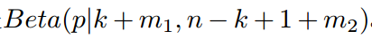</div><br>

&emsp;&emsp;按照贝叶斯推理的逻辑，把以上过程整理如下：

- 1、p是我们要猜测的参数，我们推导出`p`的分布为`f(p)=Beta(p|k,n-k+1)`,称为`p`的先验分布

- 2、根据`Yi`中有`m1`个比`p`小，有`m2`个比`p`大，`Yi`相当是做了`m`次伯努利实验，所以`m1`服从二项分布`B(m,p)`

- 3、在给定了来自数据提供`(m1,m2)`知识后，p的后验分布变为`f(p|m1,m2)=Beta(p|k+m1,n-k+1+m2)`

&emsp;&emsp;贝叶斯估计的基本过程是：

&emsp;&emsp;&emsp;&emsp; **先验分布 + 数据的知识 = 后验分布**

&emsp;&emsp;以上贝叶斯分析过程的简单直观的表示就是：

&emsp;&emsp;&emsp;&emsp; **Beta(p|k,n-k+1) + BinomCount(m1,m2) = Beta(p|k+m1,n-k+1+m2)**

&emsp;&emsp;更一般的，对于非负实数alpha和beta，我们有如下关系

&emsp;&emsp;&emsp;&emsp; **Beta(p|alpha,beta) + BinomCount(m1,m2) = Beta(p|alpha+m1,beta+m2)**

&emsp;&emsp;针对于这种观测到的数据符合二项分布，参数的先验分布和后验分布都是`Beta`分布的情况，就是`Beta-Binomial`共轭。换言之，`Beta`分布是二项式分布的共轭先验概率分布。二项分布和Beta分布是共轭分布意味着，如果我们为二项分布的参数p选取的先验分布是`Beta`分布，那么以p为参数的二项分布用贝叶斯估计得到的后验分布仍然服从`Beta`分布。

## 1.6 Dirichlet 分布

### 1.6.1 Dirichlet 分布

&emsp;&emsp;`Dirichlet`分布，是`beta`分布在高维度上的推广。`Dirichlet`分布的的密度函数形式跟`beta`分布的密度函数类似：

<div  align="center">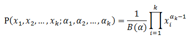</div><br>

&emsp;&emsp;其中

<div  align="center">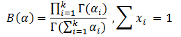</div><br>

&emsp;&emsp;至此，我们可以看到二项分布和多项分布很相似，`Beta`分布和`Dirichlet`分布很相似。并且`Beta`分布是二项式分布的共轭先验概率分布。那么`Dirichlet`分布呢？`Dirichlet`分布是多项式分布的共轭先验概率分布。下文来论证这点。

### 1.6.2 Dirichlet-Multinomial 共轭

&emsp;&emsp;在1.5.3章问题2的基础上，我们更进一步引入**问题3**：

<div  align="center">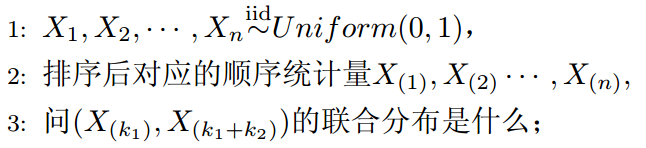</div><br>

&emsp;&emsp;类似于问题1的推导，我们可以容易推导联合分布。为了简化计算，我们取`x3`满足`x1+x2+x3=1`,`x1`和`x2`是变量。如下图所示。

<div  align="center">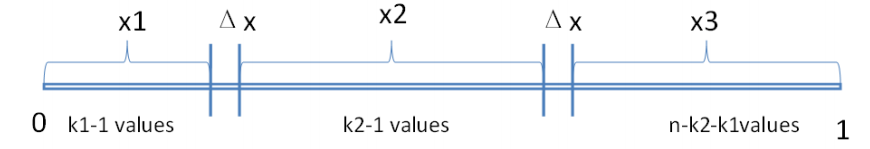</div><br>

&emsp;&emsp;概率计算如下：

<div  align="center">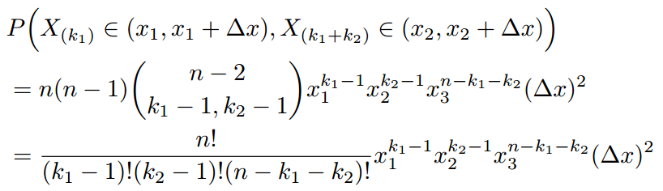</div><br>

&emsp;&emsp;于是我们得到联合分布为：

<div  align="center"></div><br>

&emsp;&emsp;观察上述式子的最终结果，可以看出上面这个分布其实就是3维形式的`Dirichlet`分布。令`alpha1=k1,alpha2=k2,alpha3=n-k1-k2+1`，分布密度函数可以写为：

<div  align="center">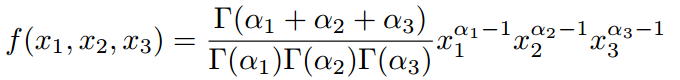</div><br>

&emsp;&emsp;为了论证`Dirichlet`分布是多项式分布的共轭先验概率分布，在上述问题3的基础上再进一步，提出**问题4**。

<div  align="center">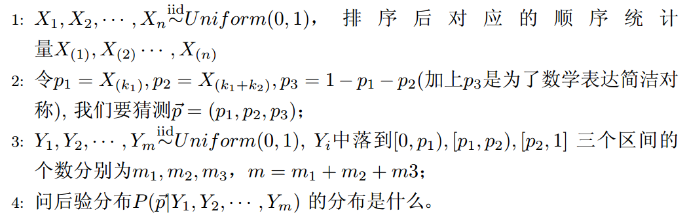</div><br>

&emsp;&emsp;为了方便计算，我们记

<div  align="center"></div><br>

&emsp;&emsp;根据问题中的信息，我们可以推理得到`p1,p2`在`X;Y`这`m+n`个数中分别成为了第`k1+m1,k1+k2+m1+m2`大的数。后验分布p应该为

<div  align="center">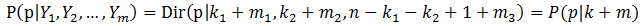</div><br>

&emsp;&emsp;同样的，按照贝叶斯推理的逻辑，可将上述过程整理如下：

- 1 我们要猜测参数`P=(p1,p2,p3)`，其先验分布为`Dir(p|k)`;

- 2 数据`Yi`落到三个区间`[0,p1)`,`[p1,p2]`,`(p2,1]`的个数分别是`m1,m2,m3`,所以`m=(m1,m2,m3)`服从多项分布`Mult(m|p)`;

- 3 在给定了来自数据提供的知识`m`后，`p`的后验分布变为`Dir(P|k+m)`

&emsp;&emsp;上述贝叶斯分析过程的直观表述为：

&emsp;&emsp;&emsp;&emsp; **Dir(p|k) + Multcount(m) = Dir(p|k+m)**

&emsp;&emsp;针对于这种观测到的数据符合多项分布，参数的先验分布和后验分布都是`Dirichlet`分布的情况，就是`Dirichlet-Multinomial`共轭。这意味着，如果我们为多项分布的参数p选取的先验分布是`Dirichlet`分布，那么以p为参数的多项分布用贝叶斯估计得到的后验分布仍然服从`Dirichlet`分布。

## 1.7 Beta和Dirichlet分布的一个性质

&emsp;&emsp;如果`p=Beta(t|alpha,beta)`，那么

<div  align="center">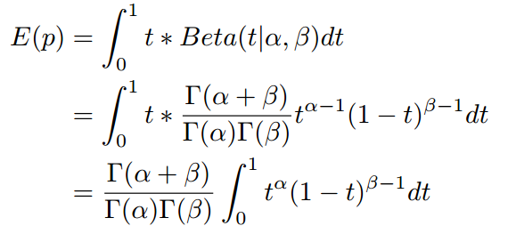</div><br>

&emsp;&emsp;上式右边的积分对应到概率分布`Beta(t|alpha+1,beta)`，对于这个分布，我们有

<div  align="center">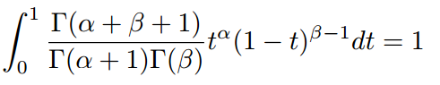</div><br>

&emsp;&emsp;把上式带人`E(p)`的计算式，可以得到：

<div  align="center">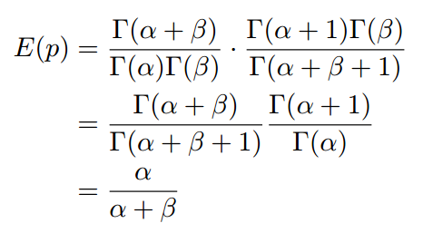</div><br>

&emsp;&emsp;这说明，对于`Beta`分布的随机变量，其期望可以用上式来估计。`Dirichlet`分布也有类似的结论。对于`p=Dir(t|alpha)`，有

<div  align="center">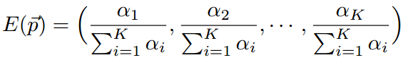</div><br>

&emsp;&emsp;这个结论在后文的推导中会用到。

## 1.8 总结

&emsp;&emsp;`LDA`涉及的数学知识较多，需要认真体会，以上大部分的知识来源于文献【1,2,3】,如有不清楚的地方，参见这些文献以了解更多。

# 2 主题模型LDA

&emsp;&emsp;在介绍LDA之前，我们先介绍几个基础模型：`Unigram model`、`mixture of unigrams model`、`pLSA model`。为了方便描述，首先定义一些变量：

- 1 `w`表示词，`V`表示所有词的个数
- 2 `z`表示主题，`k`表示主题的个数
- 3  $D=(W_{1},W_{2},...,W_{M})$表示语料库，`M`表示语料库中的文档数。
- 4  $W=(w_{1},w_{2},...,w_{N})$表示文档，`N`表示文档中词的个数。

## 2.1 一元模型(Unigram model)

&emsp;&emsp;对于文档$W=(w_{1},w_{2},...,w_{N})$ ,用$p(w_{n})$表示$w_{n}$的先验概率，生成文档W的概率为：

<div  align="center">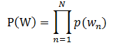</div><br>

&emsp;&emsp;其图模型为（图中被涂色的`w`表示可观测变量，`N`表示一篇文档中总共`N`个单词，`M`表示`M`篇文档）：

<div  align="center">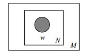</div><br>

## 2.2 混合一元模型(Mixture of unigrams model)

&emsp;&emsp;该模型的生成过程是：给某个文档先选择一个主题`Z`，再根据该主题生成文档，该文档中的所有词都来自一个主题。生成文档的概率为：

<div  align="center">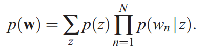</div><br>

&emsp;&emsp;其图模型为（图中被涂色的`w`表示可观测变量，未被涂色的`z`表示未知的隐变量，`N`表示一篇文档中总共`N`个单词，`M`表示`M`篇文档）：

<div  align="center">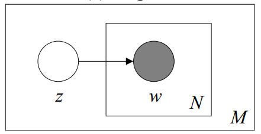</div><br>

## 2.3 pLSA模型

&emsp;&emsp;在混合一元模型中，假定一篇文档只由一个主题生成，可实际中，一篇文章往往有多个主题，只是这多个主题各自在文档中出现的概率大小不一样。在`pLSA`中，假设文档由多个主题生成。下面通过一个投色子的游戏（取自文献【2】的例子）说明`pLSA`生成文档的过程。

&emsp;&emsp;首先，假定你一共有`K`个可选的主题，有`V`个可选的词。假设你每写一篇文档会制作一颗`K`面的“文档-主题”骰子（扔此骰子能得到`K`个主题中的任意一个），和`K`个`V`面的“主题-词项”骰子（每个骰子对应一个主题，`K`个骰子对应之前的`K`个主题，且骰子的每一面对应要选择的词项，`V`个面对应着`V`个可选的词）。
比如可令`K=3`，即制作1个含有3个主题的“文档-主题”骰子，这3个主题可以是：教育、经济、交通。然后令`V = 3`，制作3个有着3面的“主题-词项”骰子，其中，教育主题骰子的3个面上的词可以是：**大学、老师、课程**，经济主题骰子的3个面上的词可以是：**市场、企业、金融**，交通主题骰子的3个面上的词可以是：**高铁、汽车、飞机**。

&emsp;&emsp;其次，每写一个词，先扔该“文档-主题”骰子选择主题，得到主题的结果后，使用和主题结果对应的那颗“主题-词项”骰子，扔该骰子选择要写的词。先扔“文档-主题”的骰子，假设以一定的概率得到的主题是：**教育**，所以下一步便是扔**教育**主题筛子，以一定的概率得到**教育**主题筛子对应的某个词**大学**。

- 上面这个投骰子产生词的过程简化一下便是：“先以一定的概率选取主题，再以一定的概率选取词”。事实上，一开始可供选择的主题有3个：教育、经济、交通，那为何偏偏选取教育这个主题呢？其实是随机选取的，只是这个随机遵循一定的概率分布。比如可能选取教育主题的概率是0.5，选取经济主题的概率是0.3，选取交通主题的概率是0.2，那么这3个主题的概率分布便是`{教育：0.5，经济：0.3，交通：0.2}`，我们把各个主题`z`在文档`d`中出现的概率分布称之为主题分布，且是一个多项分布。

- 同样的，从主题分布中随机抽取出教育主题后，依然面对着3个词：大学、老师、课程，这3个词都可能被选中，但它们被选中的概率也是不一样的。比如大学这个词被选中的概率是0.5，老师这个词被选中的概率是0.3，课程被选中的概率是0.2，那么这3个词的概率分布便是`{大学：0.5，老师：0.3，课程：0.2}`，我们把各个词语w在主题z下出现的概率分布称之为词分布，这个词分布也是一个多项分布。

- 所以，选主题和选词都是两个随机的过程，先从主题分布`{教育：0.5，经济：0.3，交通：0.2}`中抽取出主题：**教育**，然后从该主题对应的词分布`{大学：0.5，老师：0.3，课程：0.2}`中抽取出词：**大学**。

&emsp;&emsp;最后，你不停的重复扔“文档-主题”骰子和”主题-词项“骰子，重复`N`次（产生`N`个词），完成一篇文档，重复这产生一篇文档的方法`M`次，则完成`M`篇文档。

&emsp;&emsp;上述过程抽象出来即是`pLSA`的文档生成模型。在这个过程中，我们并未关注词和词之间的出现顺序，所以`pLSA`是一种词袋模型。定义如下变量:

- $(z_{1},z_{2},...,z_{k})$表示隐藏的主题；

- $P(d_{i})$表示海量文档中某篇文档被选中的概率；

- $P(w_{j}|d_{i})$表示词$w_{j}$在文档$d_{i}$中出现的概率；针对海量文档，对所有文档进行分词后，得到一个词汇列表，这样每篇文档就是一个词语的集合。对于每个词语，用它在文档中出现的次数除以文档中词语总的数目便是它在文档中出现的概率；

- $P(z_{k}|d_{i})$表示主题$z_{k}$在文档$d_{i}$中出现的概率；

- $P(w_{j}|z_{k})$表示词$w_{j}$在主题$z_{k}$中出现的概率。与主题关系越密切的词其条件概率越大。

&emsp;&emsp;我们可以按照如下的步骤得到“文档-词项”的生成模型：

- 1 按照$P(d_{i})$选择一篇文档$d_{i}$ ；

- 2 选定文档$d_{i}$之后，从主题分布中按照概率$P(z_{k}|d_{i})$选择主题；

- 3 选定主题后，从词分布中按照概率$P(w_{j}|z_{k})$选择一个词。

&emsp;&emsp;利用看到的文档推断其隐藏的主题（分布）的过程，就是主题建模的目的：自动地发现文档集中的主题（分布）。文档`d`和单词`w`是可被观察到的，但主题`z`却是隐藏的。如下图所示（图中被涂色的`d、w`表示可观测变量，未被涂色的`z`表示未知的隐变量，`N`表示一篇文档中总共`N`个单词，`M`表示`M`篇文档）。

<div  align="center">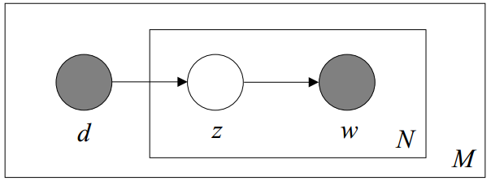</div><br>

&emsp;&emsp;上图中，文档`d`和词`w`是我们得到的样本，可观测得到，所以对于任意一篇文档，其$P(w_{j}|d_{i})$是已知的。根据这个概率可以训练得到`文档-主题`概率以及`主题-词项`概率。即：

<div  align="center">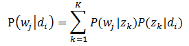</div><br>

&emsp;&emsp;故得到文档中每个词的生成概率为：

<div  align="center">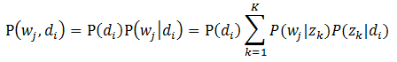</div><br>

&emsp;&emsp;$P(d_{i})$可以直接得出，而$P(z_{k}|d_{i})$和$P(w_{j}|z_{k})$未知，所以
$\theta=(P(z_{k}|d_{i}),P(w_{j}|z_{k}))$就是我们要估计的参数,我们要最大化这个参数。因为该待估计的参数中含有隐变量`z`，所以我们可以用`EM`算法来估计这个参数。

&emsp;&emsp;

## 2.4 LDA模型

&emsp;&emsp;`LDA`的不同之处在于，`pLSA`的主题的概率分布`P(z|d)`是一个确定的概率分布，也就是虽然主题`z`不确定，但是`z`符合的概率分布是确定的，比如符合某个多项分布，这个多项分布的各参数是确定的。
但是在`LDA`中，这个多项分布都是不确定的，这个多项式分布又服从一个狄利克雷先验分布`(Dirichlet prior)`。即`LDA`就是`pLSA`的贝叶斯版本,正因为`LDA`被贝叶斯化了，所以才会加两个先验参数。

&emsp;&emsp;`LDA`模型中一篇文档生成的方式如下所示:

- 1 按照$P(d_{i})$选择一篇文档$d_{i}$ ；

- 2 从狄利克雷分布$\alpha$中生成文档$d_{i}$的主题分布$\theta_{i}$ ；

- 3 从主题的多项式分布$\theta_{i}$中取样生成文档$d_{i}$第`j`个词的主题$Z_{i,j}$ ；

- 4 从狄利克雷分布$\eta$中取样生成主题$Z_{i,j}$对应的词语分布$\beta_{i,j}$ ；

- 5 从词语的多项式分布$\beta_{i,j}$中采样最终生成词语$W_{i,j}$

&emsp;&emsp;从上面的过程可以看出，`LDA`在`pLSA`的基础上，为主题分布和词分布分别加了两个`Dirichlet`先验。

&emsp;&emsp;拿之前讲解`pLSA`的例子进行具体说明。如前所述，在`pLSA`中，选主题和选词都是两个随机的过程，先从主题分布`{教育：0.5，经济：0.3，交通：0.2}`中抽取出主题：教育，然后从该主题对应的词分布`{大学：0.5，老师：0.3，课程：0.2}`中抽取出词：大学。
在`LDA`中，选主题和选词依然都是两个随机的过程。但在`LDA`中，主题分布和词分布不再唯一确定不变，即无法确切给出。例如主题分布可能是`{教育：0.5，经济：0.3，交通：0.2}`，也可能是`{教育：0.6，经济：0.2，交通：0.2}`，到底是哪个我们不能确定，因为它是随机的可变化的。
但再怎么变化，也依然服从一定的分布，主题分布和词分布由`Dirichlet`先验确定。

&emsp;&emsp;举个文档`d`产生主题`z`的例子。

&emsp;&emsp;在`pLSA`中，给定一篇文档`d`，主题分布是一定的，比如`{ P(zi|d), i = 1,2,3 }`可能就是`{0.4,0.5,0.1}`，表示`z1、z2、z3`这3个主题被文档`d`选中的概率都是个固定的值：`P(z1|d) = 0.4、P(z2|d) = 0.5、P(z3|d) = 0.1`，如下图所示:

<div  align="center">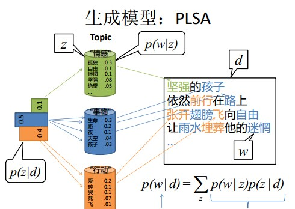</div><br>

&emsp;&emsp;在`pLSA`中，主题分布（各个主题在文档中出现的概率分布）和词分布（各个词语在某个主题下出现的概率分布）是唯一确定的，而`LDA`的主题分布和词分布是不固定的。`LDA`为提供了两个`Dirichlet`先验参数，`Dirichlet`先验为某篇文档随机抽取出主题分布和词分布。

&emsp;&emsp;给定一篇文档`d`，现在有多个主题`z1、z2、z3`，它们的主题分布`{ P(zi|d), i = 1,2,3 }`可能是`{0.4,0.5,0.1}`，也可能是`{0.2,0.2,0.6}`，即这些主题被`d`选中的概率都不再是确定的值，可能是`P(z1|d) = 0.4、P(z2|d) = 0.5、P(z3|d) = 0.1`，也有可能是`P(z1|d) = 0.2、P(z2|d) = 0.2、P(z3|d) = 0.6`，而主题分布到底是哪个取值集合我们不确定，但其先验分布是`dirichlet`分布，所以可以从无穷多个主题分布中按照`dirichlet`先验随机抽取出某个主题分布出来。如下图所示

<div  align="center">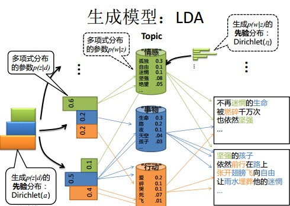</div><br>

&emsp;&emsp;`LDA`在`pLSA`的基础上给两参数$P(z_{k}|d_{i})$和$P(w_{j}|z_{k})$加了两个先验分布的参数。这两个分布都是`Dirichlet`分布。
下面是`LDA`的图模型结构：

<div  align="center"></div><br>


# 3 LDA 参数估计

&emsp;&emsp; `spark`实现了2个版本的`LDA`，这里分别叫做`Spark EM LDA`（见文献【3】【4】）和`Spark Online LDA`（见文献【5】）。它们使用同样的数据输入，但是内部的实现和依据的原理完全不同。`Spark EM LDA`使用`GraphX`实现的，通过对图的边和顶点数据的操作来训练模型。而`Spark Online LDA`采用抽样的方式，每次抽取一些文档训练模型，通过多次训练，得到最终模型。在参数估计上，`Spark EM LDA`使用`gibbs`采样原理估计模型参数，`Spark Online LDA`使用贝叶斯变分推断原理估计参数。在模型存储上，`Spark EM LDA`将训练的主题-词模型存储在`GraphX`图顶点上，属于分布式存储方式。`Spark Online`使用矩阵来存储主题-词模型，属于本地模型。通过这些差异，可以看出`Spark EM LDA`和`Spark Online LDA`的不同之处，同时他们各自也有各自的瓶颈。`Spark EM LDA`在训练时`shuffle`量相当大，严重拖慢速度。而`Spark Online LDA`使用矩阵存储模型，矩阵规模直接限制训练文档集的主题数和词的数目。另外，`Spark EM LDA`每轮迭代完毕后更新模型，`Spark Online LDA`每训练完抽样的文本更新模型，因而`Spark Online LDA`模型更新更及时，收敛速度更快。

## 3.1 变分EM算法

&emsp;&emsp;变分贝叶斯算法的详细信息可以参考文献【9】。

&emsp;&emsp;在上文中，我们知道`LDA`将变量`theta`和`phi`（为了方便起见，我们将上文`LDA`图模型中的`beta`改为了`phi`）看做随机变量，并且为`theta`添加一个超参数为`alpha`的`Dirichlet`先验，为`phi`添加一个超参数为`eta`的`Dirichlet`先验来估计`theta`和`phi`的最大后验（`MAP`）。
可以通过最优化最大后验估计来估计参数。我们首先来定义几个变量：

- 下式的`gamma`表示词为`w`，文档为`j`时，主题为`k`的概率，如公式 **（3.1.1）**

<div  align="center">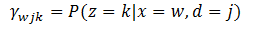</div><br>

- $N_{wj}$表示词`w`在文档`j`中出现的次数；

- $N_{wk}$表示词`w`在主题`k`中出现的次数，如公式 **（3.1.2）**

<div  align="center">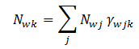</div><br>

- $N_{kj}$表示主题`k`在文档`j`中出现的次数，如公式 **（3.1.3）**

<div  align="center">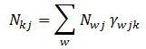</div><br>

- $N_{k}$表示主题`k`中包含的词出现的总次数，如公式 **（3.1.4）**

<div  align="center">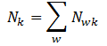</div><br>

- $N_{j}$表示文档`j`中包含的主题出现的总次数,如公式 **（3.1.5）**

<div  align="center">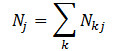</div><br>

&emsp;&emsp;根据文献【4】中`2.2`章节的介绍，我们可以推导出如下更新公式 **(3.1.6)** ，其中`alpha`和`eta`均大于1：

<div  align="center"></div><br>

&emsp;&emsp;收敛之后，最大后验估计可以得到公式 **(3.1.7)**：

<div  align="center">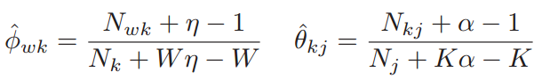</div><br>

&emsp;&emsp;变分`EM`算法的流程如下：

- **1 初始化状态**，即随机初始化$N_{wk}$和$N_{kj}$

- **2 E-步**，对每一个`（文档，词汇）`对`i`，计算$P(z_{i}|w_{i},d_{i})$，更新`gamma`值

- **3 M-步**，计算隐藏变量`phi`和`theta`。即计算$N_{wk}$和$N_{kj}$

- **4 重复以上2、3两步**，直到满足最大迭代数

&emsp;&emsp;第`4.2`章会从代码层面说明该算法的实现流程。

## 3.2 在线学习算法

### 3.2.1 批量变分贝叶斯

&emsp;&emsp;在变分贝叶斯推导(`VB`)中，根据文献【3】，使用一种更简单的分布`q(z,theta,beta)`来估计真正的后验分布，这个简单的分布使用一组自由变量(`free parameters`)来定义。
通过最大化对数似然的一个下界（`Evidence Lower Bound (ELBO)`）来最优化这些参数，如下公式 **(3.2.1)**

<div  align="center">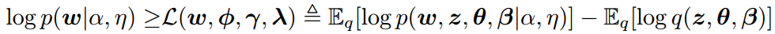</div><br>

&emsp;&emsp;最大化`ELBO`就是最小化`q(z,theta,beta)`和`p(z,theta,beta|w,alpha,eta)`的`KL`距离。根据文献【3】，我们将`q`因式分解为如下 **（3.2.2）** 的形式：

<div  align="center">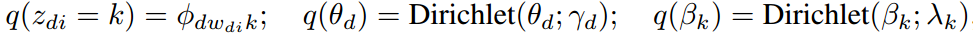</div><br>

&emsp;&emsp;后验`z`通过`phi`来参数化，后验`theta`通过`gamma`来参数化，后验`beta`通过`lambda`来参数化。为了简单描述，我们把`lambda`当作“主题”来看待。公式 **(3.2.2)** 分解为如下 **(3.2.3)** 形式：

<div  align="center"></div><br>

&emsp;&emsp;我们现在将上面的期望扩展为变分参数的函数形式。这反映了变分目标只依赖于$n_{dw}$ ，即词`w`出现在文档`d`中的次数。当使用`VB`算法时，文档可以通过它们的词频来汇总（`summarized`），如公式 **(3.2.4)**

<div  align="center"></div><br>

&emsp;&emsp;上面的公式中，`W`表示词的数量，`D`表示文档的数量。`l`表示文档`d`对`ELBO`所做的贡献。`L`可以通过坐标上升法来最优化，它的更新公式如 **(3.2.5)**:

<div  align="center"></div><br>

&emsp;&emsp;`log(theta)`和`log(beta)`的期望通过下面的公式 **(3.2.6)** 计算：

<div  align="center"></div><br>

&emsp;&emsp;通过`EM`算法，我们可以将这些更新分解成`E-步`和`M-步`。`E-步`固定`lambda`来更新`gamma`和`phi`；`M-步`通过给定`phi`来更新`lambda`。批`VB`算法的过程如下 **(算法1)** 所示：

<div  align="center"></div><br>

### 3.2.2 在线变分贝叶斯

&emsp;&emsp;批量变分贝叶斯算法需要固定的内存，并且比吉布斯采样更快。但是它仍然需要在每次迭代时处理所有的文档，这在处理大规模文档时，速度会很慢，并且也不适合流式数据的处理。
文献【5】提出了一种在线变分推导算法。设定`gamma(n_d,lambda)`和`phi(n_d,lambda)`分别表示`gamma_d`和`phi_d`的值，我们的目的就是设定`phi`来最大化下面的公式 **(3.2.7)**

<div  align="center"></div><br>

&emsp;&emsp;我们在 **算法2** 中介绍了在线`VB`算法。因为词频的第t个向量$n_{t}$是可观察的，我们在`E-步`通过固定`lambda`来找到`gamma_t`和`phi_t`的局部最优解。
然后，我们计算`lambda_cap`。如果整个语料库由单个文档重复`D`次组成，那么这样的`lambda_cap`设置是最优的。之后，我们通过`lambda`之前的值以及`lambda_cap`来更新`lambda`。我们给`lambda_cap`设置的权重如公式 **(3.2.8)** 所示：

<div  align="center"></div><br>

&emsp;&emsp;在线`VB`算法的实现流程如下 **算法2** 所示

<div  align="center"></div><br>

&emsp;&emsp;那么在在线`VB`算法中，`alpha`和`eta`是如何更新的呢？参考文献【8】提供了计算方法。给定数据集，`dirichlet`参数的可以通过最大化下面的对数似然来估计

<div  align="center"></div><br>

&emsp;&emsp;其中，

<div  align="center"></div><br>

&emsp;&emsp;有多种方法可以最大化这个目标函数，如梯度上升，`Newton-Raphson`等。`Spark`使用`Newton-Raphson`方法估计参数，更新`alpha`。`Newton-Raphson`提供了一种参数二次收敛的方法，
它一般的更新规则如下公式 **(3.3.3)** :

<div  align="center"></div><br>

&emsp;&emsp;其中，`H`表示海森矩阵。对于这个特别的对数似然函数，可以应用`Newton-Raphson`去解决高维数据，因为它可以在线性时间求出海森矩阵的逆矩阵。一般情况下，海森矩阵可以用一个对角矩阵和一个元素都一样的矩阵的和来表示。
如下公式 **(3.3.4)** ，`Q`是对角矩阵，`C11`是元素相同的一个矩阵。

<div  align="center"></div><br>

&emsp;&emsp;为了计算海森矩阵的逆矩阵，我们观察到，对任意的可逆矩阵`Q`和非负标量`c`，有下列式子 **(3.3.5)**:

<div  align="center"></div><br>

&emsp;&emsp;因为`Q`是对角矩阵，所以`Q`的逆矩阵可以很容易的计算出来。所以`Newton-Raphson`的更新规则可以重写为如下 **(3.3.6)** 的形式

<div  align="center"></div><br>

&emsp;&emsp;其中`b`如下公式 **(3.3.7)**，

<div  align="center"></div><br>

# 4 LDA代码实现

## 4.1 LDA使用实例

&emsp;&emsp;我们从官方文档【6】给出的使用代码为起始点来详细分析`LDA`的实现。

```scala
import org.apache.spark.mllib.clustering.{LDA, DistributedLDAModel}
import org.apache.spark.mllib.linalg.Vectors
// 加载和处理数据
val data = sc.textFile("data/mllib/sample_lda_data.txt")
val parsedData = data.map(s => Vectors.dense(s.trim.split(' ').map(_.toDouble)))
// 为文档编号，编号唯一。List（（id，vector）....）
val corpus = parsedData.zipWithIndex.map(_.swap).cache()
// 主题个数为3
val ldaModel = new LDA().setK(3).run(corpus)
val topics = ldaModel.topicsMatrix
for (topic <- Range(0, 3)) {
  print("Topic " + topic + ":")
  for (word <- Range(0, ldaModel.vocabSize)) { print(" " + topics(word, topic)); }
  println()
}
```
&emsp;&emsp;以上代码主要做了两件事：加载和切分数据、训练模型。在样本数据中，每一行代表一篇文档，经过处理后，`corpus`的类型为`List((id,vector)*)`，一个`(id,vector)`代表一篇文档。将处理后的数据传给`org.apache.spark.mllib.clustering.LDA`类的`run`方法，
就可以开始训练模型。`run`方法的代码如下所示：

```scala
def run(documents: RDD[(Long, Vector)]): LDAModel = {
    val state = ldaOptimizer.initialize(documents, this)
    var iter = 0
    val iterationTimes = Array.fill[Double](maxIterations)(0)
    while (iter < maxIterations) {
      val start = System.nanoTime()
      state.next()
      val elapsedSeconds = (System.nanoTime() - start) / 1e9
      iterationTimes(iter) = elapsedSeconds
      iter += 1
    }
    state.getLDAModel(iterationTimes)
  }
```
&emsp;&emsp;这段代码首先调用`initialize`方法初始化状态信息，然后循环迭代调用`next`方法直到满足最大的迭代次数。在我们没有指定的情况下，迭代次数默认为20。需要注意的是，
`ldaOptimizer`有两个具体的实现类`EMLDAOptimizer`和`OnlineLDAOptimizer`，它们分别表示使用`EM`算法和在线学习算法实现参数估计。在未指定的情况下，默认使用`EMLDAOptimizer`。

## 4.2 变分EM算法的实现

&emsp;&emsp;在`spark`中，使用`GraphX`来实现`EMLDAOptimizer`，这个图是有两种类型的顶点的二分图。这两类顶点分别是文档顶点（`Document vertices`）和词顶点（`Term vertices`）。

- 文档顶点文档顶点`ID`编号从0递增，保存长度为`k`（主题个数）的向量

- 词顶点使用`{-1, -2, ..., -vocabSize}`来索引，词顶点编号从-1递减，保存长度为`k`（主题个数）的向量

- 边（`edges`）对应词出现在文档中的词频。边的方向是`document -> term`，并且根据`document`进行分区

&emsp;&emsp;我们可以根据3.1节中介绍的算法流程来解析源代码。

### 4.2.1 初始化状态

&emsp;&emsp;`spark`在`EMLDAOptimizer`的`initialize`方法中实现初始化功能。包括初始化`Dirichlet`参数`alpha`和`eta`、初始化边、初始化顶点以及初始化图。

```scala
 //对应超参数alpha
 val docConcentration = lda.getDocConcentration
 //对应超参数eta
 val topicConcentration = lda.getTopicConcentration
 this.docConcentration = if (docConcentration == -1) (50.0 / k) + 1.0 else docConcentration
 this.topicConcentration = if (topicConcentration == -1) 1.1 else topicConcentration
```
&emsp;&emsp;上面的代码初始化了超参数`alpha`和`eta`，根据文献【4】，当`alpha`未指定时，初始化其为`(50.0 / k) + 1.0`，其中`k`表示主题个数。当`eta`未指定时，初始化其为1.1。

```scala
//对于每个文档，为每一个唯一的Term创建一个(Document->Term)的边
val edges: RDD[Edge[TokenCount]] = docs.flatMap { case (docID: Long, termCounts: Vector) =>
      // Add edges for terms with non-zero counts.
      termCounts.toBreeze.activeIterator.filter(_._2 != 0.0).map { case (term, cnt) =>
        //文档id，termindex，词频
        Edge(docID, term2index(term), cnt)
      }
}
//term2index将term转为{-1, -2, ..., -vocabSize}索引
 private[clustering] def term2index(term: Int): Long = -(1 + term.toLong)
```
&emsp;&emsp;上面的这段代码处理每个文档，对文档中每个唯一的`Term`（词）创建一个边，边的格式为`(文档id，词索引，词频)`。词索引为`{-1, -2, ..., -vocabSize}`。

```scala
//创建顶点
 val docTermVertices: RDD[(VertexId, TopicCounts)] = {
      val verticesTMP: RDD[(VertexId, TopicCounts)] =
        edges.mapPartitionsWithIndex { case (partIndex, partEdges) =>
          val random = new Random(partIndex + randomSeed)
          partEdges.flatMap { edge =>
            val gamma = normalize(BDV.fill[Double](k)(random.nextDouble()), 1.0)
            //此处的sum是DenseVector，gamma*N_wj
            val sum = gamma * edge.attr
            //srcId表示文献id，dstId表是词索引
            Seq((edge.srcId, sum), (edge.dstId, sum))
          }
        }
      verticesTMP.reduceByKey(_ + _)
 }
```
&emsp;&emsp;上面的代码创建顶点。我们为每个主题随机初始化一个值，即`gamma`是随机的。`sum`为`gamma * edge.attr`，这里的`edge.attr`即`N_wj`,所以`sum`用`gamma * N_wj`作为顶点的初始值。

```scala
this.graph = Graph(docTermVertices, edges).partitionBy(PartitionStrategy.EdgePartition1D)
```
&emsp;&emsp;上面的代码初始化`Graph`并通过文档分区。

### 4.2.2 E-步：更新gamma

```scala
    val eta = topicConcentration
    val W = vocabSize
    val alpha = docConcentration
    val N_k = globalTopicTotals
    val sendMsg: EdgeContext[TopicCounts, TokenCount, (Boolean, TopicCounts)] => Unit =
      (edgeContext) => {
        // 计算 N_{wj} gamma_{wjk}
        val N_wj = edgeContext.attr
        // E-STEP: 计算 gamma_{wjk} 通过N_{wj}来计算
        //此处的edgeContext.srcAttr为当前迭代的N_kj , edgeContext.dstAttr为当前迭代的N_wk,
        //后面通过M-步，会更新这两个值,作为下一次迭代的当前值
        val scaledTopicDistribution: TopicCounts = 
                    computePTopic(edgeContext.srcAttr, edgeContext.dstAttr, N_k, W, eta, alpha) *= N_wj
        edgeContext.sendToDst((false, scaledTopicDistribution))
        edgeContext.sendToSrc((false, scaledTopicDistribution))
      }
```
&emsp;&emsp;上述代码中，`W`表示词数，`N_k`表示所有文档中，出现在主题`k`中的词的词频总数，后续的实现会使用方法`computeGlobalTopicTotals`来更新这个值。`N_wj`表示词`w`出现在文档`j`中的词频数，为已知数。`E-步`就是利用公式 **(3.1.6)** 去更新`gamma`。
代码中使用`computePTopic`方法来实现这个更新。`edgeContext`通过方法`sendToDst`将`scaledTopicDistribution`发送到目标顶点，
通过方法`sendToSrc`发送到源顶点以便于后续的`M-步`更新的`N_kj`和`N_wk`。下面我们看看`computePTopic`方法。

```scala
private[clustering] def computePTopic(
      docTopicCounts: TopicCounts,
      termTopicCounts: TopicCounts,
      totalTopicCounts: TopicCounts,
      vocabSize: Int,
      eta: Double,
      alpha: Double): TopicCounts = {
    val K = docTopicCounts.length
    val N_j = docTopicCounts.data
    val N_w = termTopicCounts.data
    val N = totalTopicCounts.data
    val eta1 = eta - 1.0
    val alpha1 = alpha - 1.0
    val Weta1 = vocabSize * eta1
    var sum = 0.0
    val gamma_wj = new Array[Double](K)
    var k = 0
    while (k < K) {
      val gamma_wjk = (N_w(k) + eta1) * (N_j(k) + alpha1) / (N(k) + Weta1)
      gamma_wj(k) = gamma_wjk
      sum += gamma_wjk
      k += 1
    }
    // normalize
    BDV(gamma_wj) /= sum
  }
```
&emsp;&emsp;这段代码比较简单，完全按照公式 **(3.1.6)** 表示的样子来实现。`val gamma_wjk = (N_w(k) + eta1) * (N_j(k) + alpha1) / (N(k) + Weta1)`就是实现的更新逻辑。

### 4.2.3 M-步：更新phi和theta

```scala
// M-STEP: 聚合计算新的 N_{kj}, N_{wk} counts.
val docTopicDistributions: VertexRDD[TopicCounts] =
   graph.aggregateMessages[(Boolean, TopicCounts)](sendMsg, mergeMsg).mapValues(_._2)
```

&emsp;&emsp;我们由公式 **(3.1.7)** 可知，更新隐藏变量`phi`和`theta`就是更新相应的`N_kj`和`N_wk`。聚合更新使用`aggregateMessages`方法来实现。请参考文献【7】来了解该方法的作用。

## 4.3 在线变分算法的代码实现

### 4.3.1 初始化状态

&emsp;&emsp;在线学习算法首先使用方法`initialize`方法初始化参数值

```scala
override private[clustering] def initialize(
      docs: RDD[(Long, Vector)],
      lda: LDA): OnlineLDAOptimizer = {
    this.k = lda.getK
    this.corpusSize = docs.count()
    this.vocabSize = docs.first()._2.size
    this.alpha = if (lda.getAsymmetricDocConcentration.size == 1) {
      if (lda.getAsymmetricDocConcentration(0) == -1) Vectors.dense(Array.fill(k)(1.0 / k))
      else {
        require(lda.getAsymmetricDocConcentration(0) >= 0,
          s"all entries in alpha must be >=0, got: $alpha")
        Vectors.dense(Array.fill(k)(lda.getAsymmetricDocConcentration(0)))
      }
    } else {
      require(lda.getAsymmetricDocConcentration.size == k,
        s"alpha must have length k, got: $alpha")
      lda.getAsymmetricDocConcentration.foreachActive { case (_, x) =>
        require(x >= 0, s"all entries in alpha must be >= 0, got: $alpha")
      }
      lda.getAsymmetricDocConcentration
    }
    this.eta = if (lda.getTopicConcentration == -1) 1.0 / k else lda.getTopicConcentration
    this.randomGenerator = new Random(lda.getSeed)
    this.docs = docs
    // 初始化变分分布 q(beta|lambda)
    this.lambda = getGammaMatrix(k, vocabSize)
    this.iteration = 0
    this
  }
```
&emsp;&emsp;根据文献【5】，`alpha`和`eta`的值大于等于0，并且默认为`1.0/k`。上文使用`getGammaMatrix`方法来初始化变分分布`q(beta|lambda)`。

```scala
private def getGammaMatrix(row: Int, col: Int): BDM[Double] = {
    val randBasis = new RandBasis(new org.apache.commons.math3.random.MersenneTwister(
      randomGenerator.nextLong()))
    //初始化一个gamma分布
    val gammaRandomGenerator = new Gamma(gammaShape, 1.0 / gammaShape)(randBasis)
    val temp = gammaRandomGenerator.sample(row * col).toArray
    new BDM[Double](col, row, temp).t
  }
```
&emsp;&emsp;`getGammaMatrix`方法使用`gamma`分布初始化一个随机矩阵。

### 4.3.2 更新参数

```scala
override private[clustering] def next(): OnlineLDAOptimizer = {
    //返回文档集中采样的子集
    //默认情况下，文档可以被采样多次，且采样比例是0.05
    val batch = docs.sample(withReplacement = sampleWithReplacement, miniBatchFraction,
      randomGenerator.nextLong())
    if (batch.isEmpty()) return this
    submitMiniBatch(batch)
  }
```
&emsp;&emsp;以上的`next`方法首先对文档进行采样，然后调用`submitMiniBatch`对采样的文档子集进行处理。下面我们详细分解`submitMiniBatch`方法。

- **1** 计算`log(beta)`的期望，并将其作为广播变量广播到集群中

```scala
val expElogbeta = exp(LDAUtils.dirichletExpectation(lambda)).t
//广播变量
val expElogbetaBc = batch.sparkContext.broadcast(expElogbeta)
//参数alpha是dirichlet参数
private[clustering] def dirichletExpectation(alpha: BDM[Double]): BDM[Double] = {
    val rowSum = sum(alpha(breeze.linalg.*, ::))
    val digAlpha = digamma(alpha)
    val digRowSum = digamma(rowSum)
    val result = digAlpha(::, breeze.linalg.*) - digRowSum
    result
  }
```
&emsp;&emsp;上述代码调用`exp(LDAUtils.dirichletExpectation(lambda))`方法实现参数为`lambda`的`log beta`的期望。实现原理参见公式 **(3.2.6)**。

- **2** 计算`phi`以及`gamma`，即 **算法2** 中的`E-步`

```scala
//对采样文档进行分区处理
val stats: RDD[(BDM[Double], List[BDV[Double]])] = batch.mapPartitions { docs =>
      //
      val nonEmptyDocs = docs.filter(_._2.numNonzeros > 0)
      val stat = BDM.zeros[Double](k, vocabSize)
      var gammaPart = List[BDV[Double]]()
      nonEmptyDocs.foreach { case (_, termCounts: Vector) =>
        val ids: List[Int] = termCounts match {
          case v: DenseVector => (0 until v.size).toList
          case v: SparseVector => v.indices.toList
        }
        val (gammad, sstats) = OnlineLDAOptimizer.variationalTopicInference(
          termCounts, expElogbetaBc.value, alpha, gammaShape, k)
        stat(::, ids) := stat(::, ids).toDenseMatrix + sstats
        gammaPart = gammad :: gammaPart
      }
      Iterator((stat, gammaPart))
    }
```
&emsp;&emsp;上面的代码调用`OnlineLDAOptimizer.variationalTopicInference`实现 **算法2** 中的`E-步`,迭代计算`phi`和`gamma`。

```scala
private[clustering] def variationalTopicInference(
      termCounts: Vector,
      expElogbeta: BDM[Double],
      alpha: breeze.linalg.Vector[Double],
      gammaShape: Double,
      k: Int): (BDV[Double], BDM[Double]) = {
    val (ids: List[Int], cts: Array[Double]) = termCounts match {
      case v: DenseVector => ((0 until v.size).toList, v.values)
      case v: SparseVector => (v.indices.toList, v.values)
    }
    // 初始化变分分布 q(theta|gamma) 
    val gammad: BDV[Double] = new Gamma(gammaShape, 1.0 / gammaShape).samplesVector(k)   // K
    //根据公式（3.2.6）计算 E(log theta)
    val expElogthetad: BDV[Double] = exp(LDAUtils.dirichletExpectation(gammad))  // K
    val expElogbetad = expElogbeta(ids, ::).toDenseMatrix                        // ids * K
    //根据公式（3.2.5）计算phi，这里加1e-100表示并非严格等于
    val phiNorm: BDV[Double] = expElogbetad * expElogthetad :+ 1e-100            // ids
    var meanGammaChange = 1D
    val ctsVector = new BDV[Double](cts)                                         // ids
    // 迭代直至收敛
    while (meanGammaChange > 1e-3) {
      val lastgamma = gammad.copy
      //依据公式(3.2.5)计算gamma
      gammad := (expElogthetad :* (expElogbetad.t * (ctsVector :/ phiNorm))) :+ alpha
      //根据更新的gamma，计算E(log theta)
      expElogthetad := exp(LDAUtils.dirichletExpectation(gammad))
      // 更新phi
      phiNorm := expElogbetad * expElogthetad :+ 1e-100
      //计算两次gamma的差值
      meanGammaChange = sum(abs(gammad - lastgamma)) / k
    }
    val sstatsd = expElogthetad.asDenseMatrix.t * (ctsVector :/ phiNorm).asDenseMatrix
    (gammad, sstatsd)
  }
```
- **3** 更新`lambda`

```scala
    val statsSum: BDM[Double] = stats.map(_._1).reduce(_ += _)
    val gammat: BDM[Double] = breeze.linalg.DenseMatrix.vertcat(
      stats.map(_._2).reduce(_ ++ _).map(_.toDenseMatrix): _*)
    val batchResult = statsSum :* expElogbeta.t
    // 更新lambda和alpha
    updateLambda(batchResult, (miniBatchFraction * corpusSize).ceil.toInt)
```
&emsp;&emsp;`updateLambda`方法实现 **算法2** 中的`M-步`,更新`lambda`。实现代码如下：

```scala
private def updateLambda(stat: BDM[Double], batchSize: Int): Unit = {
    // 根据公式（3.2.8）计算权重
    val weight = rho()
    // 更新lambda，其中stat * (corpusSize.toDouble / batchSize.toDouble)+eta表示rho_cap
    lambda := (1 - weight) * lambda +
      weight * (stat * (corpusSize.toDouble / batchSize.toDouble) + eta)
  }
// 根据公式（3.2.8）计算rho
private def rho(): Double = {
    math.pow(getTau0 + this.iteration, -getKappa)
  }
```

- **4** 更新`alpha`

```scala
private def updateAlpha(gammat: BDM[Double]): Unit = {
    //计算rho
    val weight = rho()
    val N = gammat.rows.toDouble
    val alpha = this.alpha.toBreeze.toDenseVector
    //计算log p_hat
    val logphat: BDM[Double] = sum(LDAUtils.dirichletExpectation(gammat)(::, breeze.linalg.*)) / N
    //计算梯度为N（-phi(alpha)+log p_hat）
    val gradf = N * (-LDAUtils.dirichletExpectation(alpha) + logphat.toDenseVector)
    //计算公式（3.3.4）中的c，trigamma表示gamma函数的二阶导数
    val c = N * trigamma(sum(alpha))
    //计算公式（3.3.4）中的q
    val q = -N * trigamma(alpha)
    //根据公式(3.3.7)计算b
    val b = sum(gradf / q) / (1D / c + sum(1D / q))
    val dalpha = -(gradf - b) / q
    if (all((weight * dalpha + alpha) :> 0D)) {
      alpha :+= weight * dalpha
      this.alpha = Vectors.dense(alpha.toArray)
    }
  }
```


# 5 参考文献

【1】[LDA数学八卦](http://www.52nlp.cn/lda-math-%E6%B1%87%E6%80%BB-lda%E6%95%B0%E5%AD%A6%E5%85%AB%E5%8D%A6)

【2】[通俗理解LDA主题模型](http://blog.csdn.net/v_july_v/article/details/41209515)

【3】[Latent Dirichlet Allocation](docs/Latent Dirichlet Allocation.pdf)

【4】[On Smoothing and Inference for Topic Models](docs/On Smoothing and Inference for Topic Models.pdf)

【5】[Online Learning for Latent Dirichlet Allocation](docs/Online Learning for Latent Dirichlet Allocation.pdf)

【6】[Spark官方文档](https://spark.apache.org/docs/latest/mllib-clustering.html#latent-dirichlet-allocation-lda)

【7】[Spark GraphX介绍](https://github.com/endymecy/spark-graphx-source-analysis)

【8】[Maximum Likelihood Estimation of Dirichlet Distribution Parameters](docs/dirichlet.pdf)

【9】[Variational Bayes](http://www.blog.huajh7.com/variational-bayes/)


