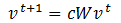
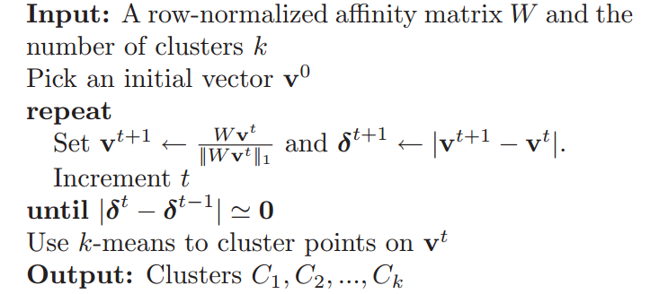
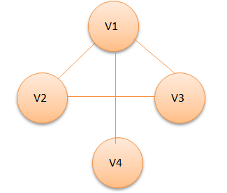
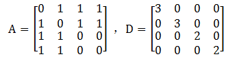
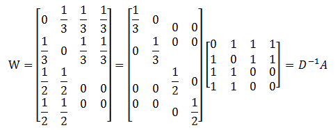
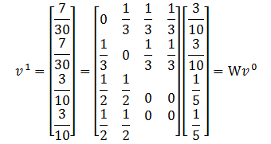

# 快速迭代聚类

## 1 谱聚类算法的原理

&emsp;&emsp;在分析快速迭代聚类之前，我们先来了解一下谱聚类算法。谱聚类算法是建立在谱图理论的基础上的算法，与传统的聚类算法相比，它能在任意形状的样本空间上聚类且能够收敛到全局最优解。
谱聚类算法的主要思想是将聚类问题转换为无向图的划分问题。

- 首先，数据点被看做一个图的顶点`v`，两数据的相似度看做图的边，边的集合由$E=A_{ij}$表示，由此构造样本数据集的相似度矩阵`A`，并求出拉普拉斯矩阵`L`。
- 其次，根据划分准则使子图内部相似度尽量大，子图之间的相似度尽量小，计算出L的特征值和特征向量
- 最后，选择k个不同的特征向量对数据点聚类

&emsp;&emsp;那么如何求拉普拉斯矩阵呢？

&emsp;&emsp;将相似度矩阵`A`的每行元素相加就可以得到该顶点的度，我们定义以度为对角元素的对角矩阵称为度矩阵`D`。可以通过`A`和`D`来确定拉普拉斯矩阵。拉普拉斯矩阵分为规范和非规范两种，规范的拉普拉斯矩阵
表示为`L=D-A`，非规范的拉普拉斯矩阵表示为$L=I-D^{-1}A$ 。

&emsp;&emsp;谱聚类算法的一般过程如下：

- （1）输入待聚类的数据点集以及聚类数`k`；
- （2）根据相似性度量构造数据点集的拉普拉斯矩阵`L`；
- （3）选取L的前`k`个（默认从小到大,这里的`k`和聚类数可以不一样）特征值和特征向量，构造特征向量空间（这实际上是一个降维的过程）；
- （4）使用传统方法对特征向量聚类，并对应于原始数据的聚类。

&emsp;&emsp;谱聚类算法和传统的聚类方法（例如`K-means`）比起来有不少优点：

- 和`K-medoids`类似，谱聚类只需要数据之间的相似度矩阵就可以了，而不必像`K-means`那样要求数据必须是`N`维欧氏空间中的向量。

- 由于抓住了主要矛盾，忽略了次要的东西，因此比传统的聚类算法更加健壮一些，对于不规则的误差数据不是那么敏感，而且性能也要好一些。

- 计算复杂度比`K-means`要小，特别是在像文本数据或者平凡的图像数据这样维度非常高的数据上运行的时候。

&emsp;&emsp;快速迭代算法和谱聚类算法都是将数据点嵌入到由相似矩阵推导出来的低维子空间中，然后直接或者通过`k-means`算法产生聚类结果，但是快速迭代算法有不同的地方。下面重点了解快速迭代算法的原理。

## 2 快速迭代算法的原理

&emsp;&emsp;在快速迭代算法中，我们构造另外一个矩阵$W=D^{-1}A$ ,同第一章做比对，我们可以知道`W`的最大特征向量就是拉普拉斯矩阵`L`的最小特征向量。
我们知道拉普拉斯矩阵有一个特性：第二小特征向量（即第二小特征值对应的特征向量）定义了图最佳划分的一个解，它可以近似最大化划分准则。更一般的，`k`个最小的特征向量所定义的子空间很适合去划分图。
因此拉普拉斯矩阵第二小、第三小直到第`k`小的特征向量可以很好的将图`W`划分为`k`个部分。

&emsp;&emsp;注意，矩阵`L`的`k`个最小特征向量也是矩阵`W`的`k`个最大特征向量。计算一个矩阵最大的特征向量可以通过一个简单的方法来求得，那就是快速迭代（即`PI`）。
`PI`是一个迭代方法，它以任意的向量$v^{0}$作为起始，依照下面的公式循环进行更新。

<div  align="center"></div><br />

&emsp;&emsp;在上面的公式中，`c`是标准化常量，是为了避免$v^{t}$产生过大的值，这里$c=||Wv^{t}||_{1}$ 。在大多数情况下，我们只关心第`k`（k不为1）大的特征向量，而不关注最大的特征向量。
这是因为最大的特征向量是一个常向量：因为`W`每一行的和都为1。

&emsp;&emsp;快速迭代的收敛性在文献【1】中有详细的证明，这里不再推导。

&emsp;&emsp;快速迭代算法的一般步骤如下：

<div  align="center"></div><br />

&emsp;&emsp;在上面的公式中，输入矩阵`W`根据$W=D^{-1}A$来计算。

## 3 快速迭代算法的源码实现

&emsp;&emsp;在`spark`中，文件`org.apache.spark.mllib.clustering.PowerIterationClustering`实现了快速迭代算法。我们从官方给出的例子出发来分析快速迭代算法的实现。

```scala
import org.apache.spark.mllib.clustering.{PowerIterationClustering, PowerIterationClusteringModel}
import org.apache.spark.mllib.linalg.Vectors
// 加载和切分数据
val data = sc.textFile("data/mllib/pic_data.txt")
val similarities = data.map { line =>
  val parts = line.split(' ')
  (parts(0).toLong, parts(1).toLong, parts(2).toDouble)
}
// 使用快速迭代算法将数据分为两类
val pic = new PowerIterationClustering()
  .setK(2)
  .setMaxIterations(10)
val model = pic.run(similarities)
//打印出所有的簇
model.assignments.foreach { a =>
  println(s"${a.id} -> ${a.cluster}")
}
```
&emsp;&emsp;在上面的例子中，我们知道数据分为三列，分别是起始id，目标id，以及两者的相似度，这里的`similarities`代表前面章节提到的矩阵`A`。有了数据之后，我们通过`PowerIterationClustering`的`run`方法来训练模型。
`PowerIterationClustering`类有三个参数：

- `k`：聚类数
- `maxIterations`：最大迭代数
- `initMode`：初始化模式。初始化模式分为`Random`和`Degree`两种，针对不同的模式对数据做不同的初始化操作

&emsp;&emsp;下面分步骤介绍`run`方法的实现。

- **（1）标准化相似度矩阵`A`到矩阵`W`**

```scala
def normalize(similarities: RDD[(Long, Long, Double)]): Graph[Double, Double] = {
    //获得所有的边
    val edges = similarities.flatMap { case (i, j, s) =>
      //相似度值必须非负
      if (s < 0.0) {
        throw new SparkException("Similarity must be nonnegative but found s($i, $j) = $s.")
      }
      if (i != j) {
        Seq(Edge(i, j, s), Edge(j, i, s))
      } else {
        None
      }
    }
    //根据edges信息构造图，顶点的特征值默认为0
    val gA = Graph.fromEdges(edges, 0.0)
    //计算从顶点的出发的边的相似度之和，在这里称为度
    val vD = gA.aggregateMessages[Double](
      sendMsg = ctx => {
        ctx.sendToSrc(ctx.attr)
      },
      mergeMsg = _ + _,
      TripletFields.EdgeOnly)
    //计算得到W , W=A/D
    GraphImpl.fromExistingRDDs(vD, gA.edges)
      .mapTriplets(
        //gAi/vDi
        //使用边的权重除以起始点的度
        e => e.attr / math.max(e.srcAttr, MLUtils.EPSILON),
        TripletFields.Src)
  }
```
&emsp;&emsp;上面的代码首先通过边集合构造图`gA`,然后使用`aggregateMessages`计算每个顶点的度（即所有从该顶点出发的边的相似度之和），构造出`VertexRDD`。最后使用现有的`VertexRDD`和`EdgeRDD`，
相继通过`fromExistingRDDs`和`mapTriplets`方法计算得到最终的图`W`。在`mapTriplets`方法中，对每一个`EdgeTriplet`，使用相似度除以出发顶点的度（为什么相除？对角矩阵的逆矩阵是各元素取倒数，$W=D^{-1}A$就可以通过元素相除得到）。

&emsp;&emsp;下面举个例子来说明这个步骤。假设有`v1,v2,v3,v4`四个点，它们之间的关系如下图所示，并且假设点与点之间的相似度均设为1。

<div  align="center"></div><br />

&emsp;&emsp;通过该图，我们可以得到相似度矩阵`A`和度矩阵`D`，他们分别如下所示。

<div  align="center"></div><br />

&emsp;&emsp;通过`mapTriplets`的计算，我们可以得到从点`v1`到`v2,v3,v4`的边的权重分别为`1/3,1/3,1/3`;从点`v2`到`v1,v3,v4`的权重分别为`1/3,1/3,1/3`;从点`v3`到`v1,v2`的权重分别为`1/2,1/2`;从点`v4`到`v1,v2`的权重分别为`1/2,1/2`。
将这个图转换为矩阵的形式，可以得到如下矩阵`W`。

<div  align="center"></div><br />

&emsp;&emsp;通过代码计算的结果和通过矩阵运算得到的结果一致。因此该代码实现了$W=D^{-1}A$ 。

- **（2）初始化$v^{0}$**

&emsp;&emsp;根据选择的初始化模式的不同，我们可以使用不同的方法初始化$v^{0}$ 。一种方式是随机初始化，一种方式是度（`degree`）初始化，下面分别来介绍这两种方式。

- 随机初始化

```scala
 def randomInit(g: Graph[Double, Double]): Graph[Double, Double] = {
    //给每个顶点指定一个随机数
    val r = g.vertices.mapPartitionsWithIndex(
      (part, iter) => {
        val random = new XORShiftRandom(part)
        iter.map { case (id, _) =>
          (id, random.nextGaussian())
        }
      }, preservesPartitioning = true).cache()
    //所有顶点的随机值的绝对值之和
    val sum = r.values.map(math.abs).sum()
    //取平均值
    val v0 = r.mapValues(x => x / sum)
    GraphImpl.fromExistingRDDs(VertexRDD(v0), g.edges)
  }
```
- 度初始化

```scala
 def initDegreeVector(g: Graph[Double, Double]): Graph[Double, Double] = {
    //所有顶点的度之和
    val sum = g.vertices.values.sum()
    //取度的平均值
    val v0 = g.vertices.mapValues(_ / sum)
    GraphImpl.fromExistingRDDs(VertexRDD(v0), g.edges)
  }
```
&emsp;&emsp;通过初始化之后，我们获得了向量$v^{0}$ 。它包含所有的顶点，但是顶点特征值发生了改变。随机初始化后，特征值为随机值；度初始化后，特征为度的平均值。

&emsp;&emsp;在这里，度初始化的向量我们称为“度向量”。度向量会给图中度大的节点分配更多的初始化权重，使其值可以更平均和快速的分布，从而更快的局部收敛。详细情况请参考文献【1】。

- **（3）快速迭代求最终的v**

```scala
for (iter <- 0 until maxIterations if math.abs(diffDelta) > tol) {
      val msgPrefix = s"Iteration $iter"
      // 计算w*vt
      val v = curG.aggregateMessages[Double](
        //相似度与目标点的度相乘
        sendMsg = ctx => ctx.sendToSrc(ctx.attr * ctx.dstAttr),
        mergeMsg = _ + _,
        TripletFields.Dst).cache()
      // 计算||Wvt||_1，即第二章公式中的c
      val norm = v.values.map(math.abs).sum()
      val v1 = v.mapValues(x => x / norm)
      // 计算v_t+1和v_t的不同
      val delta = curG.joinVertices(v1) { case (_, x, y) =>
        math.abs(x - y)
      }.vertices.values.sum()
      diffDelta = math.abs(delta - prevDelta)
      // 更新v
      curG = GraphImpl.fromExistingRDDs(VertexRDD(v1), g.edges)
      prevDelta = delta
    }
```
&emsp;&emsp;在上述代码中，我们通过`aggregateMessages`方法计算$Wv^{t}$ 。我们仍然以第（1）步的举例来说明这个方法。假设我们以度来初始化$v^{0}$ ，
在第一次迭代中，我们可以得到`v1`（注意这里的`v1`是上面举例的顶点）的特征值为`(1/3)*(3/10)+(1/3)*(1/5)+(1/3)*(1/5)=7/30`，`v2`的特征值为`7/30`，`v3`的特征值为`3/10`,`v4`的特征值为`3/10`。即满足下面的公式。

<div  align="center"></div><br />

- **（4）使用`k-means`算法对v进行聚类**

```scala
def kMeans(v: VertexRDD[Double], k: Int): VertexRDD[Int] = {
    val points = v.mapValues(x => Vectors.dense(x)).cache()
    val model = new KMeans()
      .setK(k)
      .setRuns(5)
      .setSeed(0L)
      .run(points.values)
    points.mapValues(p => model.predict(p)).cache()
  }
```

&emsp;&emsp;如果对`graphX`不太了解，可以阅读[spark graph使用和源码解析](https://github.com/endymecy/spark-graphx-source-analysis)

## 4 参考文献

[【1】Frank Lin,William W. Cohen.Power Iteration Clustering](papers/Power Iteration Clustering.pdf)

[【2】漫谈 Clustering (4): Spectral Clustering](http://blog.pluskid.org/?p=287)


