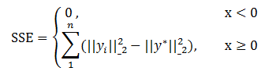

# 二分`k-means`算法

&emsp;&emsp;二分`k-means`算法是层次聚类（[Hierarchical clustering](https://en.wikipedia.org/wiki/Hierarchical_clustering)）的一种，层次聚类是聚类分析中常用的方法。
层次聚类的策略一般有两种：

- 聚合。这是一种`自底向上`的方法，每一个观察者初始化本身为一类，然后两两结合
- 分裂。这是一种`自顶向下`的方法，所有观察者初始化为一类，然后递归地分裂它们

&emsp;&emsp;二分`k-means`算法是分裂法的一种。

## 1 二分`k-means`的步骤

&emsp;&emsp;二分`k-means`算法是`k-means`算法的改进算法，相比`k-means`算法，它有如下优点：

- 二分`k-means`算法可以加速`k-means`算法的执行速度，因为它的相似度计算少了
- 能够克服`k-means`收敛于局部最小的缺点

&emsp;&emsp;二分`k-means`算法的一般流程如下所示：

- （1）把所有数据初始化为一个簇，将这个簇分为两个簇。

- （2）选择满足条件的可以分解的簇。选择条件综合考虑簇的元素个数以及聚类代价（也就是误差平方和`SSE`），误差平方和的公式如下所示，其中$w_{(i)}$表示权重值，$y^{*}$表示该簇所有点的平均值。

<div  align="center"></div><br />

- （3）使用`k-means`算法将可分裂的簇分为两簇。

- （4）一直重复（2）（3）步，直到满足迭代结束条件。

&emsp;&emsp;以上过程隐含着一个原则是：因为聚类的误差平方和能够衡量聚类性能，该值越小表示数据点越接近于它们的质心，聚类效果就越好。
所以我们就需要对误差平方和最大的簇进行再一次的划分，因为误差平方和越大，表示该簇聚类越不好，越有可能是多个簇被当成一个簇了，所以我们首先需要对这个簇进行划分。

## 2 二分`k-means`的源码分析

&emsp;&emsp;`spark`在文件`org.apache.spark.mllib.clustering.BisectingKMeans`中实现了二分`k-means`算法。在分步骤分析算法实现之前，我们先来了解`BisectingKMeans`类中参数代表的含义。

```scala
class BisectingKMeans private (
    private var k: Int,
    private var maxIterations: Int,
    private var minDivisibleClusterSize: Double,
    private var seed: Long)
```

&emsp;&emsp;上面代码中，`k`表示叶子簇的期望数，默认情况下为4。如果没有可被切分的叶子簇，实际值会更小。`maxIterations`表示切分簇的`k-means`算法的最大迭代次数，默认为20。
`minDivisibleClusterSize`的值如果大于等于1，它表示一个可切分簇的最小点数量；如果值小于1，它表示可切分簇的点数量占总数的最小比例，该值默认为1。

&emsp;&emsp;`BisectingKMeans`的`run`方法实现了二分`k-means`算法，下面将一步步分析该方法的实现过程。

- **（1）初始化数据**

```scala
//计算输入数据的二范式并转化为VectorWithNorm
val norms = input.map(v => Vectors.norm(v, 2.0)).persist(StorageLevel.MEMORY_AND_DISK)
val vectors = input.zip(norms).map { case (x, norm) => new VectorWithNorm(x, norm) }
```
- **（2）将所有数据初始化为一个簇，并计算代价**

```scala
var assignments = vectors.map(v => (ROOT_INDEX, v))
var activeClusters = summarize(d, assignments) //格式为Map[index,ClusterSummary]
val rootSummary = activeClusters(ROOT_INDEX)
```
&emsp;&emsp;在上述代码中，第一行给每个向量加上一个索引，用以标明簇在最终生成的树上的深度，`ROOT_INDEX`的值为1。`summarize`方法计算误差平方和，我们来看看它的实现。

```scala
private def summarize(
      d: Int,
      assignments: RDD[(Long, VectorWithNorm)]): Map[Long, ClusterSummary] = {
    assignments.aggregateByKey(new ClusterSummaryAggregator(d))(
        //分区内循环添加
        seqOp = (agg, v) => agg.add(v),
        //分区间合并
        combOp = (agg1, agg2) => agg1.merge(agg2)
      ).mapValues(_.summary)
      .collect().toMap
}
```

&emsp;&emsp;这里的`d`表示特征维度，代码对`assignments`使用`aggregateByKey`操作，根据`key`值在分区内循环添加（`add`）数据，在分区间合并（`merge`）数据集，转换成最终`ClusterSummaryAggregator`对象，然后针对每个`key`，调用`summary`方法，计算。
`ClusterSummaryAggregator`包含三个很简单的方法，分别是`add`，`merge`以及`summary`。

```scala
private class ClusterSummaryAggregator(val d: Int) extends Serializable {
    private var n: Long = 0L
    private val sum: Vector = Vectors.zeros(d) //向量和
    private var sumSq: Double = 0.0  //向量的范数平方和
    //添加一个VectorWithNorm对象到ClusterSummaryAggregator对象中
    def add(v: VectorWithNorm): this.type = {
      n += 1L
      sumSq += v.norm * v.norm
      BLAS.axpy(1.0, v.vector, sum)
      this
    }
    //合并两个ClusterSummaryAggregator对象
    def merge(other: ClusterSummaryAggregator): this.type = {
      n += other.n
      sumSq += other.sumSq
      //y += a * x
      BLAS.axpy(1.0, other.sum, sum)
      this
    }
    def summary: ClusterSummary = {
      //求平均值
      val mean = sum.copy
      if (n > 0L) {
        //x = a * x
        BLAS.scal(1.0 / n, mean)
      }
      val center = new VectorWithNorm(mean)
      //所有点的范数平方和减去n乘以中心点范数平方，得到误差平方和
      val cost = math.max(sumSq - n * center.norm * center.norm, 0.0)
      new ClusterSummary(n, center, cost)
    }
  }
```
&emsp;&emsp;这里计算误差平方和与第一章的公式有所不同，但是效果一致。这里计算聚类代价函数的公式如下所示：

<div  align="center"></div><br />

&emsp;&emsp;获取第一个簇之后，我们需要做的就是迭代分裂可分裂的簇，直到满足我们的要求。迭代停止的条件是`activeClusters`为空，或者`numLeafClustersNeeded`为0（即没有分裂的叶子簇）,或者迭代深度大于`LEVEL_LIMIT`。

```scala
while (activeClusters.nonEmpty && numLeafClustersNeeded > 0 && level < LEVEL_LIMIT)
```
&emsp;&emsp;这里，`LEVEL_LIMIT`是一个较大的值，计算方法如下。

```scala
private val LEVEL_LIMIT = math.log10(Long.MaxValue) / math.log10(2)
```

- **（3）获取需要分裂的簇**

&emsp;&emsp;在每一次迭代中，我们首先要做的是获取满足条件的可以分裂的簇。

```scala
 //选择需要分裂的簇
 var divisibleClusters = activeClusters.filter { case (_, summary) =>
    (summary.size >= minSize) && (summary.cost > MLUtils.EPSILON * summary.size)
 }
 // If we don't need all divisible clusters, take the larger ones.
 if (divisibleClusters.size > numLeafClustersNeeded) {
    divisibleClusters = divisibleClusters.toSeq.sortBy { case (_, summary) =>
        -summary.size
    }.take(numLeafClustersNeeded)
     .toMap
 }
```
&emsp;&emsp;这里选择分裂的簇用到了两个条件，即数据点的数量大于规定的最小数量以及代价小于等于`MLUtils.EPSILON * summary.size`。并且如果可分解的簇的个数多余我们规定的个数`numLeafClustersNeeded`即`(k-1)`，
那么我们取包含数量最多的`numLeafClustersNeeded`个簇用于分裂。

- **（4）使用`k-means`算法将可分裂的簇分解为两簇**

&emsp;&emsp;我们知道，`k-means`算法分为两步，第一步是初始化中心点，第二步是迭代更新中心点直至满足最大迭代数或者收敛。下面就分两步来说明。

- 第一步，随机的选择中心点，将可分裂簇分为两簇

```scala
 //切分簇
var newClusterCenters = divisibleClusters.flatMap { case (index, summary) =>
    //随机切分簇为两簇，找到这两个簇的中心点
    val (left, right) = splitCenter(summary.center, random)
    Iterator((leftChildIndex(index), left), (rightChildIndex(index), right))
}.map(identity)
```
&emsp;&emsp;在上面的代码中，用`splitCenter`方法将簇随机地分为了两簇，并返回相应的中心点，它的实现如下所示。

```scala
private def splitCenter(
      center: VectorWithNorm,
      random: Random): (VectorWithNorm, VectorWithNorm) = {
    val d = center.vector.size
    val norm = center.norm
    val level = 1e-4 * norm
    //随机的初始化一个点，并用这个点得到两个初始中心点
    val noise = Vectors.dense(Array.fill(d)(random.nextDouble()))
    val left = center.vector.copy
    //y += a * x,left=left-level*noise
    BLAS.axpy(-level, noise, left)
    val right = center.vector.copy
    //right=right+level*noise
    BLAS.axpy(level, noise, right)
    //返回中心点
    (new VectorWithNorm(left), new VectorWithNorm(right))
  }
```
- 第二步，迭代更新中心点

```scala
 var newClusters: Map[Long, ClusterSummary] = null
 var newAssignments: RDD[(Long, VectorWithNorm)] = null
 //迭代获得中心点，默认迭代次数为20
 for (iter <- 0 until maxIterations) {
    //根据更新的中心点，将数据点重新分类
    newAssignments = updateAssignments(assignments, divisibleIndices, newClusterCenters)
        .filter { case (index, _) =>
            divisibleIndices.contains(parentIndex(index))
    }
    //计算中心点以及代价值
    newClusters = summarize(d, newAssignments)
    newClusterCenters = newClusters.mapValues(_.center).map(identity)
 }
 val indices = updateAssignments(assignments, divisibleIndices, newClusterCenters).keys
     .persist(StorageLevel.MEMORY_AND_DISK)
```
&emsp;&emsp;这段代码中，`updateAssignments`会根据更新的中心点将数据分配给距离其最短的中心点所在的簇，即重新分配簇。代码如下

```scala
private def updateAssignments(assignments: RDD[(Long, VectorWithNorm)],divisibleIndices: Set[Long],
      newClusterCenters: Map[Long, VectorWithNorm]): RDD[(Long, VectorWithNorm)] = {
    assignments.map { case (index, v) =>
      if (divisibleIndices.contains(index)) {
        //leftChildIndex=2*index , rightChildIndex=2*index+1
        val children = Seq(leftChildIndex(index), rightChildIndex(index))
        //返回序列中第一个符合条件的最小的元素
        val selected = children.minBy { child =>
          KMeans.fastSquaredDistance(newClusterCenters(child), v)
        }
        //将v分配给中心点距离其最短的簇
        (selected, v)
      } else {
        (index, v)
      }
    }
  }
```
&emsp;&emsp;重新分配簇之后，利用`summarize`方法重新计算中心点以及代价值。

- **（5）处理变量值为下次迭代作准备**

```scala
//数节点中簇的index以及包含的数据点
 assignments = indices.zip(vectors)
 inactiveClusters ++= activeClusters
 activeClusters = newClusters
 //调整所需簇的数量
 numLeafClustersNeeded -= divisibleClusters.size
```
