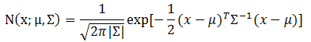
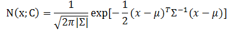
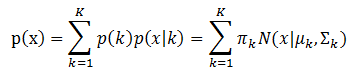
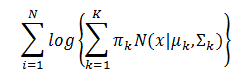
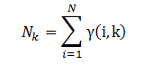
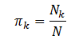
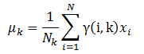
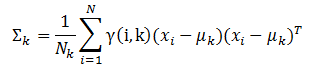

# 高斯混合模型

>&emsp;&emsp;现有的高斯模型有单高斯模型（`SGM`）和高斯混合模型（`GMM`）两种。从几何上讲，单高斯分布模型在二维空间上近似于椭圆，在三维空间上近似于椭球。
在很多情况下，属于同一类别的样本点并不满足“椭圆”分布的特性，所以我们需要引入混合高斯模型来解决这种情况。

# 1 单高斯模型

&emsp;&emsp;多维变量`X`服从高斯分布时，它的概率密度函数`PDF`定义如下：

<div  align="center"></div><br />

&emsp;&emsp;在上述定义中,`x`是维数为`D`的样本向量，`mu`是模型期望，`sigma`是模型协方差。对于单高斯模型，可以明确训练样本是否属于该高斯模型，所以我们经常将`mu`用训练样本的均值代替，将`sigma`用训练样本的协方差代替。
假设训练样本属于类别`C`，那么上面的定义可以修改为下面的形式：

<div  align="center"></div><br />

&emsp;&emsp;这个公式表示样本属于类别`C`的概率。我们可以根据定义的概率阈值来判断样本是否属于某个类别。

# 2 高斯混合模型

&emsp;&emsp;高斯混合模型，顾名思义，就是数据可以看作是从多个高斯分布中生成出来的。从[中心极限定理](https://en.wikipedia.org/wiki/Central_limit_theorem)可以看出，高斯分布这个假设其实是比较合理的。
为什么我们要假设数据是由若干个高斯分布组合而成的，而不假设是其他分布呢？实际上不管是什么分布，只`K`取得足够大，这个`XX Mixture Model`就会变得足够复杂，就可以用来逼近任意连续的概率密度分布。只是因为高斯函数具有良好的计算性能，所`GMM`被广泛地应用。

&emsp;&emsp;每个`GMM`由`K`个高斯分布组成，每个高斯分布称为一个组件（`Component`），这些组件线性加成在一起就组成了`GMM`的概率密度函数 **（1）**:

<div  align="center"></div><br />

&emsp;&emsp;根据上面的式子，如果我们要从`GMM`分布中随机地取一个点，需要两步：

- 随机地在这`K`个组件之中选一个，每个组件被选中的概率实际上就是它的系数`pi_k`；

- 选中了组件之后，再单独地考虑从这个组件的分布中选取一个点。

&emsp;&emsp;怎样用`GMM`来做聚类呢？其实很简单，现在我们有了数据，假定它们是由`GMM`生成出来的，那么我们只要根据数据推出`GMM`的概率分布来就可以了，然后`GMM`的`K`个组件实际上就对应了`K`个聚类了。
在已知概率密度函数的情况下，要估计其中的参数的过程被称作“参数估计”。

&emsp;&emsp;我们可以利用最大似然估计来确定这些参数，`GMM`的似然函数 **（2）** 如下(此处公式有误，括号中的x应该为x_i)：

<div  align="center"></div><br />

&emsp;&emsp;可以用`EM`算法来求解这些参数。`EM`算法求解的过程如下：

- 1 **E-步**。求数据点由各个组件生成的概率（并不是每个组件被选中的概率）。对于每个数据$x_{i}$来说，它由第`k`个组件生成的概率为公式 **（3）** ：

<div  align="center"></div><br />

&emsp;&emsp;在上面的概率公式中，我们假定`mu`和`sigma`均是已知的，它们的值来自于初始化值或者上一次迭代。

- 2 **M-步**。估计每个组件的参数。由于每个组件都是一个标准的高斯分布，可以很容易分布求出最大似然所对应的参数值，分别如下公式 **（4）**, **（5）**, **（6）**, **（7）** ：

<div  align="center"></div><br />

<div  align="center"></div><br />

<div  align="center"></div><br />

<div  align="center"></div><br />

# 3 源码分析

## 3.1 实例

&emsp;&emsp;在分析源码前，我们还是先看看高斯混合模型如何使用。

```scala
import org.apache.spark.mllib.clustering.GaussianMixture
import org.apache.spark.mllib.clustering.GaussianMixtureModel
import org.apache.spark.mllib.linalg.Vectors
// 加载数据
val data = sc.textFile("data/mllib/gmm_data.txt")
val parsedData = data.map(s => Vectors.dense(s.trim.split(' ').map(_.toDouble))).cache()
// 使用高斯混合模型聚类
val gmm = new GaussianMixture().setK(2).run(parsedData)
// 保存和加载模型
gmm.save(sc, "myGMMModel")
val sameModel = GaussianMixtureModel.load(sc, "myGMMModel")
// 打印参数
for (i <- 0 until gmm.k) {
  println("weight=%f\nmu=%s\nsigma=\n%s\n" format
    (gmm.weights(i), gmm.gaussians(i).mu, gmm.gaussians(i).sigma))
}
```
&emsp;&emsp;由上面的代码我们可以知道，使用高斯混合模型聚类使用到了`GaussianMixture`类中的`run`方法。下面我们直接进入`run`方法，分析它的实现。

## 3.2 高斯混合模型的实现

### 3.2.1 初始化

&emsp;&emsp;在`run`方法中，程序所做的第一步就是初始化权重（上文中介绍的`pi`）及其相对应的高斯分布。

```scala
val (weights, gaussians) = initialModel match {
      case Some(gmm) => (gmm.weights, gmm.gaussians)
      case None => {
        val samples = breezeData.takeSample(withReplacement = true, k * nSamples, seed)
        (Array.fill(k)(1.0 / k), Array.tabulate(k) { i =>
          val slice = samples.view(i * nSamples, (i + 1) * nSamples)
          new MultivariateGaussian(vectorMean(slice), initCovariance(slice))
        })
      }
    }
```
&emsp;&emsp;在上面的代码中，当`initialModel`为空时，用所有值均为`1.0/k`的数组初始化权重，用值为`MultivariateGaussian`对象的数组初始化所有的高斯分布（即上文中提到的组件）。
每一个`MultivariateGaussian`对象都由从数据集中抽样的子集计算而来。这里用样本数据的均值和方差初始化`MultivariateGaussian`的`mu`和`sigma`。

```scala
//计算均值
private def vectorMean(x: IndexedSeq[BV[Double]]): BDV[Double] = {
    val v = BDV.zeros[Double](x(0).length)
    x.foreach(xi => v += xi)
    v / x.length.toDouble
  }
//计算方差
private def initCovariance(x: IndexedSeq[BV[Double]]): BreezeMatrix[Double] = {
    val mu = vectorMean(x)
    val ss = BDV.zeros[Double](x(0).length)
    x.foreach(xi => ss += (xi - mu) :^ 2.0)
    diag(ss / x.length.toDouble)
  }
```

### 3.2.2 EM算法求参数

&emsp;&emsp;初始化后，就可以使用`EM`算法迭代求似然函数中的参数。迭代结束的条件是迭代次数达到了我们设置的次数或者两次迭代计算的对数似然值之差小于阈值。

```scala
 while (iter < maxIterations && math.abs(llh-llhp) > convergenceTol)
```
&emsp;&emsp;在迭代内部，就可以按照`E-步`和`M-步`来更新参数了。

- **E-步**：更新参数`gamma`

```scala
 val compute = sc.broadcast(ExpectationSum.add(weights, gaussians)_)
 val sums = breezeData.aggregate(ExpectationSum.zero(k, d))(compute.value, _ += _)
```
&emsp;&emsp;我们先要了解`ExpectationSum`以及`add`方法的实现。

```scala
private class ExpectationSum(
    var logLikelihood: Double,
    val weights: Array[Double],
    val means: Array[BDV[Double]],
    val sigmas: Array[BreezeMatrix[Double]]) extends Serializable
```
&emsp;&emsp;`ExpectationSum`是一个聚合类，它表示部分期望结果：主要包含对数似然值，权重值（第二章中介绍的`pi`），均值，方差。`add`方法的实现如下：

```scala
def add( weights: Array[Double],dists: Array[MultivariateGaussian])
      (sums: ExpectationSum, x: BV[Double]): ExpectationSum = {
    val p = weights.zip(dists).map {
      //计算pi_i * N(x)
      case (weight, dist) => MLUtils.EPSILON + weight * dist.pdf(x)
    }
    val pSum = p.sum
    sums.logLikelihood += math.log(pSum)
    var i = 0
    while (i < sums.k) {
      p(i) /= pSum  
      sums.weights(i) += p(i)  
      sums.means(i) += x * p(i)  
      //A := alpha * x * x^T^ + A
      BLAS.syr(p(i), Vectors.fromBreeze(x),
        Matrices.fromBreeze(sums.sigmas(i)).asInstanceOf[DenseMatrix])
      i = i + 1
    }
    sums
  }
```
&emsp;&emsp;从上面的实现我们可以看出，最终，`logLikelihood`表示公式 **(2)** 中的对数似然。`p`和`weights`分别表示公式 **(3)** 中的`gamma`和`pi`，`means`表示公式 **(6)** 中的求和部分，`sigmas`表示公式 **(7)** 中的求和部分。

&emsp;&emsp;调用`RDD`的`aggregate`方法，我们可以基于所有给定数据计算上面的值。利用计算的这些新值，我们可以在`M-步`中更新`mu`和`sigma`。

- **M-步**：更新参数`mu`和`sigma`

```scala
 var i = 0
 while (i < k) {
    val (weight, gaussian) =
       updateWeightsAndGaussians(sums.means(i), sums.sigmas(i), sums.weights(i), sumWeights)
    weights(i) = weight
    gaussians(i) = gaussian
    i = i + 1
 }
 private def updateWeightsAndGaussians(
      mean: BDV[Double],
      sigma: BreezeMatrix[Double],
      weight: Double,
      sumWeights: Double): (Double, MultivariateGaussian) = {
    //  mean/weight
    val mu = (mean /= weight)
    // -weight * mu * mut +sigma
    BLAS.syr(-weight, Vectors.fromBreeze(mu),
      Matrices.fromBreeze(sigma).asInstanceOf[DenseMatrix])
    val newWeight = weight / sumWeights
    val newGaussian = new MultivariateGaussian(mu, sigma / weight)
    (newWeight, newGaussian)
  } 
```
&emsp;&emsp;基于 **E-步** 计算出来的值，根据公式 **(6)** ，我们可以通过`(mean /= weight)`来更新`mu`；根据公式 **(7)** ，我们可以通过`BLAS.syr()`来更新`sigma`；同时，根据公式 **(5)**，
我们可以通过`weight / sumWeights`来计算`pi`。

&emsp;&emsp;迭代执行以上的 **E-步**和 **M-步**，到达一定的迭代数或者对数似然值变化较小后，我们停止迭代。这时就可以获得聚类后的参数了。

## 3.3 多元高斯模型中相关方法介绍

&emsp;&emsp;在上面的求参代码中，我们用到了`MultivariateGaussian`以及`MultivariateGaussian`中的部分方法，如`pdf`。`MultivariateGaussian`定义如下：

```scala
class MultivariateGaussian @Since("1.3.0") (
    @Since("1.3.0") val mu: Vector,
    @Since("1.3.0") val sigma: Matrix) extends Serializable
```
&emsp;&emsp;`MultivariateGaussian`包含一个向量`mu`和一个矩阵`sigma`，分别表示期望和协方差。`MultivariateGaussian`最重要的方法是`pdf`，顾名思义就是计算给定数据的概率密度函数。它的实现如下：

```scala
private[mllib] def pdf(x: BV[Double]): Double = {
    math.exp(logpdf(x))
}
private[mllib] def logpdf(x: BV[Double]): Double = {
    val delta = x - breezeMu
    val v = rootSigmaInv * delta
    u + v.t * v * -0.5
 }
```
&emsp;&emsp;上面的`rootSigmaInv`和`u`通过方法`calculateCovarianceConstants`计算。根据公式 **(1)** ，这个概率密度函数的计算需要计算`sigma`的行列式以及逆。

```scala
sigma = U * D * U.t
inv(Sigma) = U * inv(D) * U.t = (D^{-1/2}^ * U.t).t * (D^{-1/2}^ * U.t)
-0.5 * (x-mu).t * inv(Sigma) * (x-mu) = -0.5 * norm(D^{-1/2}^ * U.t  * (x-mu))^2^
```
&emsp;&emsp;这里，`U`和`D`是奇异值分解得到的子矩阵。`calculateCovarianceConstants`具体的实现代码如下：

```scala
private def calculateCovarianceConstants: (DBM[Double], Double) = {
    val eigSym.EigSym(d, u) = eigSym(sigma.toBreeze.toDenseMatrix) // sigma = u * diag(d) * u.t
    val tol = MLUtils.EPSILON * max(d) * d.length
    try {
      //所有非0奇异值的对数和
      val logPseudoDetSigma = d.activeValuesIterator.filter(_ > tol).map(math.log).sum
      //通过求非负值的倒数平方根，计算奇异值对角矩阵的根伪逆矩阵
      val pinvS = diag(new DBV(d.map(v => if (v > tol) math.sqrt(1.0 / v) else 0.0).toArray))
      (pinvS * u.t, -0.5 * (mu.size * math.log(2.0 * math.Pi) + logPseudoDetSigma))
    } catch {
      case uex: UnsupportedOperationException =>
        throw new IllegalArgumentException("Covariance matrix has no non-zero singular values")
    }
  }
```
&emsp;&emsp;上面的代码中，`eigSym`用于分解`sigma`矩阵。

# 4 参考文献

【1】[漫谈 Clustering (3): Gaussian Mixture Model](http://blog.pluskid.org/?p=39)
