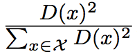

# `k-means`、`k-means++`以及`k-means||`算法分析

&emsp;&emsp;本文会介绍一般的`k-means`算法、`k-means++`算法以及基于`k-means++`算法的`k-means||`算法。在`spark ml`，已经实现了`k-means`算法以及`k-means||`算法。
本文首先会介绍这三个算法的原理，然后在了解原理的基础上分析`spark`中的实现代码。

## 1 `k-means`算法原理分析

&emsp;&emsp;`k-means`算法是聚类分析中使用最广泛的算法之一。它把`n`个对象根据它们的属性分为`k`个聚类以便使得所获得的聚类满足：同一聚类中的对象相似度较高；而不同聚类中的对象相似度较小。

&emsp;&emsp;`k-means`算法的基本过程如下所示：

- （1）任意选择`k`个初始中心。

- （2）计算`X`中的每个对象与这些中心对象的距离；并根据最小距离重新对相应对象进行划分；

- （3）重新计算每个中心对象的值

    

 

- （4）计算标准测度函数，当满足一定条件，如函数收敛时，则算法终止；如果条件不满足则重复步骤（2），（3）。

### 1.1 `k-means`算法的缺点

&emsp;&emsp;`k-means`算法虽然简单快速，但是存在下面的缺点：

- 聚类中心的个数`K`需要事先给定，但在实际中`K`值的选定是非常困难的，很多时候我们并不知道给定的数据集应该分成多少个类别才最合适。

- `k-means`算法需要随机地确定初始聚类中心，不同的初始聚类中心可能导致完全不同的聚类结果。

&emsp;&emsp;第一个缺陷我们很难在`k-means`算法以及其改进算法中解决，但是我们可以通过`k-means++`算法来解决第二个缺陷。

## 2 `k-means++`算法原理分析

&emsp;&emsp;`k-means++`算法选择初始聚类中心的基本原则是：初始的聚类中心之间的相互距离要尽可能的远。它选择初始聚类中心的步骤是：

- （1）从输入的数据点集合中随机选择一个点作为第一个聚类中心；

- （2）对于数据集中的每一个点`x`，计算它与最近聚类中心(指已选择的聚类中心)的距离`D(x)`，并根据概率选择新的聚类中心。概率的计算公式如下所示：

    

 

- （3）重复过程（2）直到找到k个聚类中心。

### 2.1 `k-means++`算法的缺点

&emsp;&emsp;虽然`k-means++`算法可以确定地初始化聚类中心，但是从可扩展性来看，它存在一个缺点，那就是它内在的有序性特性：下一个中心点的选择依赖于已经选择的中心点。
针对这种缺陷，`k-means||`算法提供了解决方法。

## 3 `k-means||`算法原理分析

&emsp;&emsp;`k-means||`算法是在`k-means++`算法的基础上做的改进，和`k-means++`算法不同的是，它采用了一个采样因子`l`，并且`l=A(k)`。这个算法首先如`k-means++`算法一样，随机选择一个初始中心，
然后计算选定初始中心确定之后的初始花费（`cost`）`phi`。之后处理`log(phi)`次迭代，在每次迭代中，给定当前中心集，通过概率来
抽样`x`，将选定的`x`添加到初始化中心集中，并且更新。该算法的步骤如下图所示：

 

&emsp;&emsp;通过`1-6`步产生出的中心点集`C`的元素个数一般情况下大于`k`，所以第7步给`C`中所有点赋予一个权重值，它表示距离`x`点最近的点得个数。
第8步根据权重值选择最终的`k`个点。

