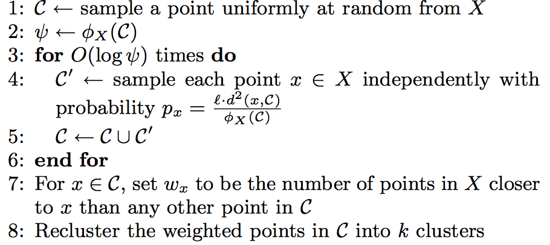
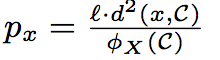

# `k-means`、`k-means++`以及`k-means||`算法分析

&emsp;&emsp;本文会介绍一般的`k-means`算法、`k-means++`算法以及基于`k-means++`算法的`k-means||`算法。在`spark ml`，已经实现了`k-means`算法以及`k-means||`算法。
本文首先会介绍这三个算法的原理，然后在了解原理的基础上分析`spark`中的实现代码。

## 1 `k-means`算法原理分析

&emsp;&emsp;`k-means`算法是聚类分析中使用最广泛的算法之一。它把`n`个对象根据它们的属性分为`k`个聚类以便使得所获得的聚类满足：同一聚类中的对象相似度较高；而不同聚类中的对象相似度较小。

&emsp;&emsp;`k-means`算法的基本过程如下所示：

- （1）任意选择`k`个初始中心$c_{1},c_{2},...,c_{k}$ 。

- （2）计算`X`中的每个对象与这些中心对象的距离；并根据最小距离重新对相应对象进行划分；

- （3）重新计算每个中心对象$C_{i}$的值

    <div  align="center"></div><br />

- （4）计算标准测度函数，当满足一定条件，如函数收敛时，则算法终止；如果条件不满足则重复步骤（2），（3）。


### 1.1 `k-means`算法的缺点

&emsp;&emsp;`k-means`算法虽然简单快速，但是存在下面的缺点：

- 聚类中心的个数`K`需要事先给定，但在实际中`K`值的选定是非常困难的，很多时候我们并不知道给定的数据集应该分成多少个类别才最合适。

- `k-means`算法需要随机地确定初始聚类中心，不同的初始聚类中心可能导致完全不同的聚类结果。

&emsp;&emsp;第一个缺陷我们很难在`k-means`算法以及其改进算法中解决，但是我们可以通过`k-means++`算法来解决第二个缺陷。

## 2 `k-means++`算法原理分析

&emsp;&emsp;`k-means++`算法选择初始聚类中心的基本原则是：初始的聚类中心之间的相互距离要尽可能的远。它选择初始聚类中心的步骤是：

- （1）从输入的数据点集合中随机选择一个点作为第一个聚类中心$c_{1}$ ；

- （2）对于数据集中的每一个点`x`，计算它与最近聚类中心(指已选择的聚类中心)的距离`D(x)`，并根据概率选择新的聚类中心$c_{i}$ 。

- （3）重复过程（2）直到找到k个聚类中心。

&emsp;&emsp;第(2)步中，依次计算每个数据点与最近的种子点（聚类中心）的距离，依次得到`D(1)、D(2)、...、D(n)`构成的集合`D`，其中`n`表示数据集的大小。在`D`中，为了避免噪声，不能直接选取值最大的元素，应该选择值较大的元素，然后将其对应的数据点作为种子点。
如何选择值较大的元素呢，下面是`spark`中实现的思路。

- 求所有的距离和`Sum(D(x))`

- 取一个随机值，用权重的方式来取计算下一个“种子点”。这个算法的实现是，先用`Sum(D(x))`乘以随机值`Random`得到值`r`，然后用`currSum += D(x)`，直到其`currSum > r`，此时的点就是下一个“种子点”。

&emsp;&emsp;为什么用这样的方式呢？我们换一种比较好理解的方式来说明。把集合`D`中的每个元素`D(x)`想象为一根线`L(x)`，线的长度就是元素的值。将这些线依次按照`L(1)、L(2)、...、L(n)`的顺序连接起来，组成长线`L`。`L(1)、L(2)、…、L(n)`称为`L`的子线。
根据概率的相关知识，如果我们在`L`上随机选择一个点，那么这个点所在的子线很有可能是比较长的子线，而这个子线对应的数据点就可以作为种子点。

### 2.1 `k-means++`算法的缺点

&emsp;&emsp;虽然`k-means++`算法可以确定地初始化聚类中心，但是从可扩展性来看，它存在一个缺点，那就是它内在的有序性特性：下一个中心点的选择依赖于已经选择的中心点。
针对这种缺陷，`k-means||`算法提供了解决方法。

## 3 `k-means||`算法原理分析

&emsp;&emsp;`k-means||`算法是在`k-means++`算法的基础上做的改进，和`k-means++`算法不同的是，它采用了一个采样因子`l`，并且`l=A(k)`，在`spark`的实现中`l=2k`，。这个算法首先如`k-means++`算法一样，随机选择一个初始中心，
然后计算选定初始中心确定之后的初始花费$\psi$(指与最近中心点的距离)。之后处理$log(\psi )$次迭代，在每次迭代中，给定当前中心集，通过概率$ld^{2}(x,C)/\phi_{X}(C)$来
抽样`x`，将选定的`x`添加到初始化中心集中，并且更新$\phi_{X}(C)$。该算法的步骤如下图所示：

<div  align="center"></div><br />

&emsp;&emsp;第1步随机初始化一个中心点，第2-6步计算出满足概率条件的多个候选中心点`C`，候选中心点的个数可能大于`k`个，所以通过第7-8步来处理。第7步给`C`中所有点赋予一个权重值$w_{x}$ ，这个权重值表示距离`x`点最近的点的个数。
第8步使用本地`k-means++`算法聚类出这些候选点的`k`个聚类中心。在`spark`的源码中，迭代次数是人为设定的，默认是5。

&emsp;&emsp;该算法与`k-means++`算法不同的地方是它每次迭代都会抽样出多个中心点而不是一个中心点，且每次迭代不互相依赖，这样我们可以并行的处理这个迭代过程。由于该过程产生出来的中心点的数量远远小于输入数据点的数量，
所以第8步可以通过本地`k-means++`算法很快的找出`k`个初始化中心点。何为本地`k-means++`算法？就是运行在单个机器节点上的`k-means++`。

&emsp;&emsp;下面我们详细分析上述三个算法的代码实现。

## 4 源代码分析

&emsp;&emsp;在`spark`中，`org.apache.spark.mllib.clustering.KMeans`文件实现了`k-means`算法以及`k-means||`算法，`org.apache.spark.mllib.clustering.LocalKMeans`文件实现了`k-means++`算法。
在分步骤分析`spark`中的源码之前我们先来了解`KMeans`类中参数的含义。

```scala
class KMeans private (
    private var k: Int,//聚类个数
    private var maxIterations: Int,//迭代次数
    private var runs: Int,//运行kmeans算法的次数
    private var initializationMode: String,//初始化模式
    private var initializationSteps: Int,//初始化步数
    private var epsilon: Double,//判断kmeans算法是否收敛的阈值
    private var seed: Long)
```

&emsp;&emsp;在上面的定义中，`k`表示聚类的个数，`maxIterations`表示最大的迭代次数，`runs`表示运行`KMeans`算法的次数，在`spark 2.0。0`开始，该参数已经不起作用了。为了更清楚的理解算法我们可以认为它为1。
`initializationMode`表示初始化模式，有两种选择：随机初始化和通过`k-means||`初始化，默认是通过`k-means||`初始化。`initializationSteps`表示通过`k-means||`初始化时的迭代步骤，默认是5，这是`spark`实现与第三章的算法步骤不一样的地方，这里迭代次数人为指定，
而第三章的算法是根据距离得到的迭代次数，为`log(phi)`。`epsilon`是判断算法是否已经收敛的阈值。

&emsp;&emsp;下面将分步骤分析`k-means`算法、`k-means||`算法的实现过程。

### 4.1 处理数据，转换为`VectorWithNorm`集。

```scala
//求向量的二范式，返回double值
val norms = data.map(Vectors.norm(_, 2.0))
norms.persist()
val zippedData = data.zip(norms).map { case (v, norm) =>
   new VectorWithNorm(v, norm)
}
```

### 4.2 初始化中心点。

&emsp;&emsp;初始化中心点根据`initializationMode`的值来判断，如果`initializationMode`等于`KMeans.RANDOM`，那么随机初始化`k`个中心点，否则使用`k-means||`初始化`k`个中心点。

```scala
val centers = initialModel match {
      case Some(kMeansCenters) => {
        Array(kMeansCenters.clusterCenters.map(s => new VectorWithNorm(s)))
      }
      case None => {
        if (initializationMode == KMeans.RANDOM) {
          initRandom(data)
        } else {
          initKMeansParallel(data)
        }
      }
    }
```

- **（1）随机初始化中心点。**

&emsp;&emsp;随机初始化`k`个中心点很简单，具体代码如下：

```scala
private def initRandom(data: RDD[VectorWithNorm])
  : Array[Array[VectorWithNorm]] = {
    //采样固定大小为k的子集
    //这里run表示我们运行的KMeans算法的次数，默认为1，以后将停止提供该参数
    val sample = data.takeSample(true, runs * k, new XORShiftRandom(this.seed).nextInt()).toSeq
    //选取k个初始化中心点
    Array.tabulate(runs)(r => sample.slice(r * k, (r + 1) * k).map { v =>
      new VectorWithNorm(Vectors.dense(v.vector.toArray), v.norm)
    }.toArray)
  }
```

- **（2）通过`k-means||`初始化中心点。**

&emsp;&emsp;相比于随机初始化中心点，通过`k-means||`初始化`k`个中心点会麻烦很多，它需要依赖第三章的原理来实现。它的实现方法是`initKMeansParallel`。
下面按照第三章的实现步骤来分析。

- 第一步，我们要随机初始化第一个中心点。

```scala
//初始化第一个中心点
val seed = new XORShiftRandom(this.seed).nextInt()
val sample = data.takeSample(true, runs, seed).toSeq
val newCenters = Array.tabulate(runs)(r => ArrayBuffer(sample(r).toDense))
```

- 第二步，通过已知的中心点，循环迭代求得其它的中心点。

```scala
var step = 0
while (step < initializationSteps) {
    val bcNewCenters = data.context.broadcast(newCenters)
    val preCosts = costs
    //每个点距离最近中心的代价
    costs = data.zip(preCosts).map { case (point, cost) =>
          Array.tabulate(runs) { r =>
            //pointCost获得与最近中心点的距离
            //并与前一次迭代的距离对比取更小的那个
            math.min(KMeans.pointCost(bcNewCenters.value(r), point), cost(r))
          }
        }.persist(StorageLevel.MEMORY_AND_DISK)
    //所有点的代价和
    val sumCosts = costs.aggregate(new Array[Double](runs))(
          //分区内迭代
          seqOp = (s, v) => {
            // s += v
            var r = 0
            while (r < runs) {
              s(r) += v(r)
              r += 1
            }
            s
          },
          //分区间合并
          combOp = (s0, s1) => {
            // s0 += s1
            var r = 0
            while (r < runs) {
              s0(r) += s1(r)
              r += 1
            }
            s0
          }
        )
    //选择满足概率条件的点
    val chosen = data.zip(costs).mapPartitionsWithIndex { (index, pointsWithCosts) =>
        val rand = new XORShiftRandom(seed ^ (step << 16) ^ index)
        pointsWithCosts.flatMap { case (p, c) =>
          val rs = (0 until runs).filter { r =>
            //此处设置l=2k
            rand.nextDouble() < 2.0 * c(r) * k / sumCosts(r)
          }
          if (rs.length > 0) Some(p, rs) else None
        }
      }.collect()
      mergeNewCenters()
      chosen.foreach { case (p, rs) =>
        rs.foreach(newCenters(_) += p.toDense)
      }
      step += 1
}
```

&emsp;&emsp;在这段代码中，我们并没有选择使用`log(pha)`的大小作为迭代的次数，而是直接使用了人为确定的`initializationSteps`，这是与论文中不一致的地方。
在迭代内部我们使用概率公式

<div  align="center"></div><br />

来计算满足要求的点，其中，`l=2k`。公式的实现如代码`rand.nextDouble() < 2.0 * c(r) * k / sumCosts(r)`。`sumCosts`表示所有点距离它所属类别的中心点的欧式距离之和。
上述代码通过`aggregate`方法并行计算获得该值。

- 第三步，求最终的k个点。

&emsp;&emsp;通过以上步骤求得的候选中心点的个数可能会多于`k`个，这样怎么办呢？我们给每个中心点赋一个权重，权重值是数据集中属于该中心点所在类别的数据点的个数。
然后我们使用本地`k-means++`来得到这`k`个初始化点。具体的实现代码如下：

```scala
val bcCenters = data.context.broadcast(centers)
    //计算权重值，即各中心点所在类别的个数
    val weightMap = data.flatMap { p =>
      Iterator.tabulate(runs) { r =>
        ((r, KMeans.findClosest(bcCenters.value(r), p)._1), 1.0)
      }
    }.reduceByKey(_ + _).collectAsMap()
    //最终的初始化中心
    val finalCenters = (0 until runs).par.map { r =>
      val myCenters = centers(r).toArray
      val myWeights = (0 until myCenters.length).map(i => weightMap.getOrElse((r, i), 0.0)).toArray
      LocalKMeans.kMeansPlusPlus(r, myCenters, myWeights, k, 30)
    }
```

&emsp;&emsp;上述代码的关键点时通过本地`k-means++`算法求最终的初始化点。它是通过`LocalKMeans.kMeansPlusPlus`来实现的。它使用`k-means++`来处理。

```scala
// 初始化一个中心点
centers(0) = pickWeighted(rand, points, weights).toDense
//
for (i <- 1 until k) {
      // 根据概率比例选择下一个中心点
      val curCenters = centers.view.take(i)
      //每个点的权重与距离的乘积和
      val sum = points.view.zip(weights).map { case (p, w) =>
        w * KMeans.pointCost(curCenters, p)
      }.sum
      //取随机值
      val r = rand.nextDouble() * sum
      var cumulativeScore = 0.0
      var j = 0
      //寻找概率最大的点
      while (j < points.length && cumulativeScore < r) {
        cumulativeScore += weights(j) * KMeans.pointCost(curCenters, points(j))
        j += 1
      }
      if (j == 0) {
        centers(i) = points(0).toDense
      } else {
        centers(i) = points(j - 1).toDense
      }
}
```

&emsp;&emsp;上述代码中，`points`指的是候选的中心点，`weights`指这些点相应地权重。寻找概率最大的点的方式就是第二章提到的方式。初始化`k`个中心点后，
就可以通过一般的`k-means`流程来求最终的`k`个中心点了。具体的过程4.3会讲到。

### 4.3 确定数据点所属类别

&emsp;&emsp;找到中心点后，我们就需要根据距离确定数据点的聚类，即数据点和哪个中心点最近。具体代码如下：

```scala
      // 找到每个聚类中包含的点距离中心点的距离和以及这些点的个数
      val totalContribs = data.mapPartitions { points =>
        val thisActiveCenters = bcActiveCenters.value
        val runs = thisActiveCenters.length
        val k = thisActiveCenters(0).length
        val dims = thisActiveCenters(0)(0).vector.size

        val sums = Array.fill(runs, k)(Vectors.zeros(dims))
        val counts = Array.fill(runs, k)(0L)

        points.foreach { point =>
          (0 until runs).foreach { i =>
            //找到离给定点最近的中心以及相应的欧几里得距离
            val (bestCenter, cost) = KMeans.findClosest(thisActiveCenters(i), point)
            costAccums(i) += cost
            //距离和
            val sum = sums(i)(bestCenter)
            //y += a * x
            axpy(1.0, point.vector, sum)
            //点数量
            counts(i)(bestCenter) += 1
          }
        }

        val contribs = for (i <- 0 until runs; j <- 0 until k) yield {
          ((i, j), (sums(i)(j), counts(i)(j)))
        }
        contribs.iterator
      }.reduceByKey(mergeContribs).collectAsMap()
```

### 4.4 重新确定中心点

&emsp;&emsp;找到类别中包含的数据点以及它们距离中心点的距离，我们可以重新计算中心点。代码如下：

```scala
//更新中心点
for ((run, i) <- activeRuns.zipWithIndex) {
    var changed = false
    var j = 0
    while (j < k) {
        val (sum, count) = totalContribs((i, j))
        if (count != 0) {
        
            //x = a * x，求平均距离即sum/count
            scal(1.0 / count, sum)
            
            val newCenter = new VectorWithNorm(sum)
            //如果新旧两个中心点的欧式距离大于阈值
            if (KMeans.fastSquaredDistance(newCenter, centers(run)(j)) > epsilon * epsilon) {
              changed = true
            }
            centers(run)(j) = newCenter
        }
        j += 1
    }
    if (!changed) {
        active(run) = false
        logInfo("Run " + run + " finished in " + (iteration + 1) + " iterations")
    }
    costs(run) = costAccums(i).value
}
```

## 5 参考文献

* [【1】Bahman Bahmani,Benjamin Moseley,Andrea Vattani.Scalable K-Means++](papers/Scalable K-Means++.pdf)

* [【2】David Arthur and Sergei Vassilvitskii.k-means++: The Advantages of Careful Seeding](papers/k-means++: The Advantages of Careful Seeding.pdf)


