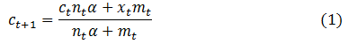
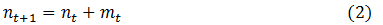

# 流式`k-means`算法

&emsp;&emsp;当数据是以流的方式到达的时候，我们可能想动态的估计（`estimate `）聚类的簇，通过新的到达的数据来更新聚类。`spark.mllib`支持流式`k-means`聚类，并且可以通过参数控制估计衰减（`decay`）(或“健忘”(`forgetfulness`))。
这个算法使用一般地小批量更新规则来更新簇。

## 1 流式`k-means`算法原理

&emsp;&emsp;对每批新到的数据，我们首先将点分配给距离它们最近的簇，然后计算新的数据中心，最后更新每一个簇。使用的公式如下所示：

<div  align="center"></div><br />

<div  align="center"></div><br />

&emsp;&emsp;在上面的公式中，$c_{t}$表示前一个簇中心，$n_{t}$表示分配给这个簇的点的数量，
$x_{t}$表示从当前批数据的簇中心，$m_{t}$表示当前批数据的点数量。
当评价新的数据时，把衰减因子`alpha`当做折扣加权应用到当前的点上，用以衡量当前预测的簇的贡献度量。当`alpha`等于1时，所有的批数据赋予相同的权重，当`alpha`等于0时，数据中心点完全通过当前数据确定。

&emsp;&emsp;衰减因子`alpha`也可以通过`halfLife`参数联合时间单元（`time unit`）来确定，时间单元可以是一批数据也可以是一个数据点。假如数据从`t`时刻到来并定义了`halfLife`为`h`，
在`t+h`时刻，应用到`t`时刻的数据的折扣（`discount`）为0.5。

&emsp;&emsp;流式`k-means`算法的步骤如下所示：

- （1）分配新的数据点到离其最近的簇；

- （2）根据时间单元（`time unit`）计算折扣（`discount`）值，并更新簇权重；

- （3）应用更新规则；

- （4）应用更新规则后，有些簇可能消失了，那么切分最大的簇为两个簇。

## 2 流式`k-means`算法源码分析

&emsp;&emsp;在分步骤分析源码之前，我们先了解一下`StreamingKMeans`参数表达的含义。

```scala
class StreamingKMeans(
    var k: Int, //簇个数
    var decayFactor: Double,//衰减因子
    var timeUnit: String //时间单元
)
```
&emsp;&emsp;在上述定义中，`k`表示我们要聚类的个数，`decayFactor`表示衰减因子，用于计算折扣，`timeUnit`表示时间单元，时间单元既可以是一批数据（`StreamingKMeans.BATCHES`）也可以是单条数据（`StreamingKMeans.POINTS`）。

&emsp;&emsp;由于我们处理的是流式数据，所以我们在流式数据来之前要先初始化模型。有两种初始化模型的方法，一种是直接指定初始化中心点及簇权重，一种是随机初始化中心点以及簇权重。

```scala
 //直接初始化中心点及簇权重
 def setInitialCenters(centers: Array[Vector], weights: Array[Double]): this.type = {
    model = new StreamingKMeansModel(centers, weights)
    this
 }
 //随机初始化中心点以及簇权重
 def setRandomCenters(dim: Int, weight: Double, seed: Long = Utils.random.nextLong): this.type = {
     val random = new XORShiftRandom(seed)
     val centers = Array.fill(k)(Vectors.dense(Array.fill(dim)(random.nextGaussian())))
     val weights = Array.fill(k)(weight)
     model = new StreamingKMeansModel(centers, weights)
     this
 } 
```
&emsp;&emsp;初始化中心点以及簇权重之后，对于新到的流数据，我们使用更新规则修改中心点和权重，调整聚类情况。更新过程在`update`方法中实现，下面我们分步骤分析该方法。

- （1）分配新到的数据到离其最近的簇，并计算更新后的簇的向量和以及点数量

```scala
 //选择离数据点最近的簇
 val closest = data.map(point => (this.predict(point), (point, 1L)))
 def predict(point: Vector): Int = {
     //返回和给定点相隔最近的中心
     KMeans.findClosest(clusterCentersWithNorm, new VectorWithNorm(point))._1
 }
 // 获得更新的簇的向量和以及点数量
 val mergeContribs: ((Vector, Long), (Vector, Long)) => (Vector, Long) = (p1, p2) => {
   // y += a * x,向量相加
   BLAS.axpy(1.0, p2._1, p1._1)
   (p1._1, p1._2 + p2._2)
 }
 val pointStats: Array[(Int, (Vector, Long))] = closest
    .aggregateByKey((Vectors.zeros(dim), 0L))(mergeContribs, mergeContribs)
    .collect()
```

- （2）获取折扣值，并用折扣值作用到权重上

```scala
 // 折扣
 val discount = timeUnit match {
    case StreamingKMeans.BATCHES => decayFactor
    case StreamingKMeans.POINTS =>
      //所有新增点的数量和
      val numNewPoints = pointStats.view.map { case (_, (_, n)) =>
          n
      }.sum
    // x^y
    math.pow(decayFactor, numNewPoints)
 }
 //将折扣应用到权重上
 //x = a * x
 BLAS.scal(discount, Vectors.dense(clusterWeights))
```
&emsp;&emsp;上面的代码更加时间单元的不同获得不同的折扣值。当时间单元为`StreamingKMeans.BATCHES`时，折扣就为衰减因子；当时间单元为`StreamingKMeans.POINTS`时，折扣由新增数据点的个数`n`和衰减因子`decay`共同决定。
折扣值为`n`个`decay`相乘。

- （3）实现更新规则

```scala
// 实现更新规则
pointStats.foreach { case (label, (sum, count)) =>
   //获取中心点
   val centroid = clusterCenters(label)
   //更新权重
   val updatedWeight = clusterWeights(label) + count
   val lambda = count / math.max(updatedWeight, 1e-16)
   clusterWeights(label) = updatedWeight
   //x = a * x,即（1-lambda）*centroid
   BLAS.scal(1.0 - lambda, centroid)
   // y += a * x，即centroid +=sum*lambda/count
   BLAS.axpy(lambda / count, sum, centroid)
}
```
&emsp;&emsp;上面的代码对每一个簇，首先更新簇的权重，权重值为原有的权重加上新增数据点的个数。然后计算`lambda`，通过`lambda`更新中心点。`lambda`为新增数据的个数和更新权重的商。
假设更新之前的中心点为`c1`，更新之后的中心点为`c2`，那么`c2=(1-lambda)*c1+sum/count`，其中`sum/count`为所有点的平均值。

- （4）调整权重最小和最大的簇

```scala
 val weightsWithIndex = clusterWeights.view.zipWithIndex
 //获取权重值最大的簇
 val (maxWeight, largest) = weightsWithIndex.maxBy(_._1)
 //获取权重值最小的簇
 val (minWeight, smallest) = weightsWithIndex.minBy(_._1)
 //判断权重最小的簇是否过小，如果过小，就将这两个簇重新划分为两个新的簇，权重为两者的均值
 if (minWeight < 1e-8 * maxWeight) {
      logInfo(s"Cluster $smallest is dying. Split the largest cluster $largest into two.")
      val weight = (maxWeight + minWeight) / 2.0
      clusterWeights(largest) = weight
      clusterWeights(smallest) = weight
      val largestClusterCenter = clusterCenters(largest)
      val smallestClusterCenter = clusterCenters(smallest)
      var j = 0
      while (j < dim) {
        val x = largestClusterCenter(j)
        val p = 1e-14 * math.max(math.abs(x), 1.0)
        largestClusterCenter.toBreeze(j) = x + p
        smallestClusterCenter.toBreeze(j) = x - p
        j += 1
      }
    }
```