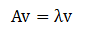
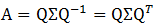

# 特征值分解

&emsp;&emsp;假设向量`v`是方阵`A`的特征向量，可以表示成下面的形式：

<div  align="center"></div><br>

&emsp;&emsp;这里`lambda`表示特征向量`v`所对应的特征值。并且一个矩阵的一组特征向量是一组正交向量。特征值分解是将一个矩阵分解为下面的形式：

<div  align="center"></div><br>

&emsp;&emsp;其中`Q`是这个矩阵`A`的特征向量组成的矩阵。`sigma`是一个对角矩阵，每个对角线上的元素就是一个特征值。

&emsp;&emsp;特征值分解是一个提取矩阵特征很不错的方法，但是它只适合于方阵，对于非方阵，它不适合。这就需要用到奇异值分解。

## 1 源码分析

&emsp;&emsp;`MLlib`使用`ARPACK`来求解特征值分解。它的实现代码如下

```scala
def symmetricEigs(
      mul: BDV[Double] => BDV[Double],
      n: Int,
      k: Int,
      tol: Double,
      maxIterations: Int): (BDV[Double], BDM[Double]) = {
    val arpack = ARPACK.getInstance()
    // tolerance used in stopping criterion
    val tolW = new doubleW(tol)
    // number of desired eigenvalues, 0 < nev < n
    val nev = new intW(k)
    // nev Lanczos vectors are generated in the first iteration
    // ncv-nev Lanczos vectors are generated in each subsequent iteration
    // ncv must be smaller than n
    val ncv = math.min(2 * k, n)
    // "I" for standard eigenvalue problem, "G" for generalized eigenvalue problem
    val bmat = "I"
    // "LM" : compute the NEV largest (in magnitude) eigenvalues
    val which = "LM"
    var iparam = new Array[Int](11)
    // use exact shift in each iteration
    iparam(0) = 1
    // maximum number of Arnoldi update iterations, or the actual number of iterations on output
    iparam(2) = maxIterations
    // Mode 1: A*x = lambda*x, A symmetric
    iparam(6) = 1

    var ido = new intW(0)
    var info = new intW(0)
    var resid = new Array[Double](n)
    var v = new Array[Double](n * ncv)
    var workd = new Array[Double](n * 3)
    var workl = new Array[Double](ncv * (ncv + 8))
    var ipntr = new Array[Int](11)

    // call ARPACK's reverse communication, first iteration with ido = 0
    arpack.dsaupd(ido, bmat, n, which, nev.`val`, tolW, resid, ncv, v, n, iparam, ipntr, workd,
      workl, workl.length, info)
    val w = BDV(workd)
    // ido = 99 : done flag in reverse communication
    while (ido.`val` != 99) {
      if (ido.`val` != -1 && ido.`val` != 1) {
        throw new IllegalStateException("ARPACK returns ido = " + ido.`val` +
            " This flag is not compatible with Mode 1: A*x = lambda*x, A symmetric.")
      }
      // multiply working vector with the matrix
      val inputOffset = ipntr(0) - 1
      val outputOffset = ipntr(1) - 1
      val x = w.slice(inputOffset, inputOffset + n)
      val y = w.slice(outputOffset, outputOffset + n)
      y := mul(x)
      // call ARPACK's reverse communication
      arpack.dsaupd(ido, bmat, n, which, nev.`val`, tolW, resid, ncv, v, n, iparam, ipntr,
        workd, workl, workl.length, info)
    }

    val d = new Array[Double](nev.`val`)
    val select = new Array[Boolean](ncv)
    // copy the Ritz vectors
    val z = java.util.Arrays.copyOfRange(v, 0, nev.`val` * n)

    // call ARPACK's post-processing for eigenvectors
    arpack.dseupd(true, "A", select, d, z, n, 0.0, bmat, n, which, nev, tol, resid, ncv, v, n,
      iparam, ipntr, workd, workl, workl.length, info)

    // number of computed eigenvalues, might be smaller than k
    val computed = iparam(4)

    val eigenPairs = java.util.Arrays.copyOfRange(d, 0, computed).zipWithIndex.map { r =>
      (r._1, java.util.Arrays.copyOfRange(z, r._2 * n, r._2 * n + n))
    }

    // sort the eigen-pairs in descending order
    val sortedEigenPairs = eigenPairs.sortBy(- _._1)

    // copy eigenvectors in descending order of eigenvalues
    val sortedU = BDM.zeros[Double](n, computed)
    sortedEigenPairs.zipWithIndex.foreach { r =>
      val b = r._2 * n
      var i = 0
      while (i < n) {
        sortedU.data(b + i) = r._1._2(i)
        i += 1
      }
    }
    (BDV[Double](sortedEigenPairs.map(_._1)), sortedU)
  }
```
&emsp;&emsp;我们可以查看`ARPACK`的注释详细了解`dsaupd`和`dseupd`方法的作用。