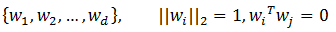
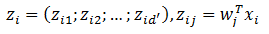
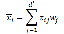
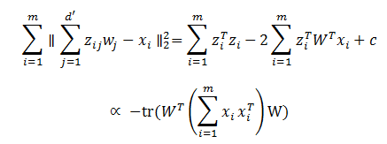
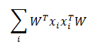
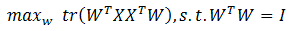
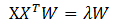

# 主成分分析

## 1 主成分分析原理

&emsp;&emsp;主成分分析是最常用的一种降维方法。我们首先考虑一个问题：对于正交矩阵空间中的样本点，如何用一个超平面对所有样本进行恰当的表达。容易想到，如果这样的超平面存在，那么他大概应该具有下面的性质。

- 最近重构性：样本点到超平面的距离都足够近

- 最大可分性：样本点在这个超平面上的投影尽可能分开

&emsp;&emsp;基于最近重构性和最大可分性，能分别得到主成分分析的两种等价推导。

### 1.1 最近重构性

&emsp;&emsp;假设我们对样本点进行了中心化，即所有样本的和为0。再假设投影变换后得到的新坐标系为：

<div  align="center"></div><br>

&emsp;&emsp;若丢弃新坐标系中的部分坐标，将维度降到`d'`，则样本点$x_{i}$在低位坐标系中的投影是$z_{i}$ ：

<div  align="center"></div><br>

&emsp;&emsp;这里$z_{ij}$是$x_{i}$在低维坐标系下第`j`维的坐标。若基于$z_{i}$来重构$x_{i}$ ，那么可以得到

<div  align="center"></div><br>

&emsp;&emsp;考虑整个训练集，原样本点和基于投影重构的样本点之间的距离为

<div  align="center"></div><br>

&emsp;&emsp;根据最近重构性，最小化上面的式子，就可以得到主成分分析的优化目标

<div  align="center"></div><br>

### 1.2 最大可分性

&emsp;&emsp;从最大可分性出发，我们可以得到主成分分析的另一种解释。我们知道，样本点$x_{i}$在新空间中超平面上的投影是$W^{T}x_{i}$ ，
若所有样本点的投影能尽可能分开，则应该使投影后样本点的方差最大化。投影后样本点的方差是

<div  align="center"></div><br>

&emsp;&emsp;于是优化目标可以写为

<div  align="center"></div><br>

&emsp;&emsp;这个优化目标和上文的优化目标是等价的。对优化目标使用拉格朗日乘子法可得

<div  align="center"></div><br>

&emsp;&emsp;于是，只需要对协方差矩阵进行特征值分解，将得到的特征值排序，在取前`d'`个特征值对应的特征向量，即得到主成分分析的解。

## 2 源码分析

### 2.1 实例

```scala
import org.apache.spark.mllib.linalg.Matrix
import org.apache.spark.mllib.linalg.distributed.RowMatrix
val mat: RowMatrix = ...
// Compute the top 10 principal components.
val pc: Matrix = mat.computePrincipalComponents(10) // Principal components are stored in a local dense matrix.
// Project the rows to the linear space spanned by the top 10 principal components.
val projected: RowMatrix = mat.multiply(pc)
```

### 2.2 实现代码

&emsp;&emsp;主成分分析的实现代码在`RowMatrix`中实现。源码如下：

```scala
def computePrincipalComponents(k: Int): Matrix = {
    val n = numCols().toInt
    //计算协方差矩阵
    val Cov = computeCovariance().toBreeze.asInstanceOf[BDM[Double]]
    //特征值分解
    val brzSvd.SVD(u: BDM[Double], _, _) = brzSvd(Cov)
    if (k == n) {
      Matrices.dense(n, k, u.data)
    } else {
      Matrices.dense(n, k, Arrays.copyOfRange(u.data, 0, n * k))
    }
  }
```
&emsp;&emsp;这段代码首先会计算样本的协方差矩阵，然后在通过`breeze`的`svd`方法进行奇异值分解。这里由于协方差矩阵是方阵，所以奇异值分解等价于特征值分解。下面是计算协方差的代码

```scala
 def computeCovariance(): Matrix = {
    val n = numCols().toInt
    checkNumColumns(n)
    val (m, mean) = rows.treeAggregate[(Long, BDV[Double])]((0L, BDV.zeros[Double](n)))(
      seqOp = (s: (Long, BDV[Double]), v: Vector) => (s._1 + 1L, s._2 += v.toBreeze),
      combOp = (s1: (Long, BDV[Double]), s2: (Long, BDV[Double])) =>
        (s1._1 + s2._1, s1._2 += s2._2)
    )
    updateNumRows(m)
    mean :/= m.toDouble
    // We use the formula Cov(X, Y) = E[X * Y] - E[X] E[Y], which is not accurate if E[X * Y] is
    // large but Cov(X, Y) is small, but it is good for sparse computation.
    // TODO: find a fast and stable way for sparse data.
    val G = computeGramianMatrix().toBreeze.asInstanceOf[BDM[Double]]
    var i = 0
    var j = 0
    val m1 = m - 1.0
    var alpha = 0.0
    while (i < n) {
      alpha = m / m1 * mean(i)
      j = i
      while (j < n) {
        val Gij = G(i, j) / m1 - alpha * mean(j)
        G(i, j) = Gij
        G(j, i) = Gij
        j += 1
      }
      i += 1
    }
    Matrices.fromBreeze(G)
  }
```

# 参考文献

【1】 机器学习.周志华

