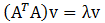
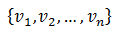
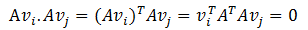
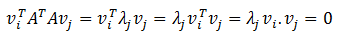
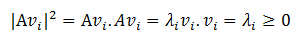
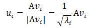
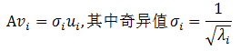
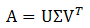

# 奇异值分解

## 1 奇异值分解

&emsp;&emsp;在了解[特征值分解](../EVD/evd.md)之后，我们知道，矩阵`A`不一定是方阵。为了得到方阵，可以将矩阵`A`的转置乘以该矩阵。从而可以得到公式：

<div  align="center"></div><br>

&emsp;&emsp;现在假设存在`M*N`矩阵`A`，我们的目标是在`n`维空间中找一组正交基，使得经过`A`变换后还是正交的。假设已经找到这样一组正交基：

<div  align="center"></div><br>

&emsp;&emsp;`A`矩阵可以将这组正交基映射为如下的形式。

<div  align="center"></div><br>

&emsp;&emsp;要使上面的基也为正交基，即使它们两两正交，那么需要满足下面的条件。

<div  align="center"></div><br>

&emsp;&emsp;如果正交基`v`选择为$A^{T}A$的特征向量的话，由于$A^{T}A$是对称阵，`v`之间两两正交，那么

<div  align="center"></div><br>

&emsp;&emsp;由于下面的公式成立

<div  align="center"></div><br>

&emsp;&emsp;所以取单位向量

<div  align="center"></div><br>

&emsp;&emsp;可以得到(下面的公式有误，delta_i 应该等于sqrt(lamda_i))

<div  align="center"></div><br>

&emsp;&emsp;奇异值分解是一个能适用于任意的矩阵的一种分解的方法，它的形式如下：

<div  align="center"></div><br>

&emsp;&emsp;其中，`U`是一个`M*M`的方阵，它包含的向量是正交的，称为左奇异向量（即上文的`u`）。`sigma`是一个`M*N`的对角矩阵，每个对角线上的元素就是一个奇异值。`V`是一个`N*N`的矩阵，它包含的向量是正交的，称为右奇异向量（即上文的`v`）。


## 2 源码分析

&emsp;&emsp;`MLlib`在`RowMatrix`类中实现了奇异值分解。下面是一个使用奇异值分解的例子。

```scala
import org.apache.spark.mllib.linalg.Matrix
import org.apache.spark.mllib.linalg.distributed.RowMatrix
import org.apache.spark.mllib.linalg.SingularValueDecomposition
val mat: RowMatrix = ...
// Compute the top 20 singular values and corresponding singular vectors.
val svd: SingularValueDecomposition[RowMatrix, Matrix] = mat.computeSVD(20, computeU = true)
val U: RowMatrix = svd.U // The U factor is a RowMatrix.
val s: Vector = svd.s // The singular values are stored in a local dense vector.
val V: Matrix = svd.V // The V factor is a local dense matrix.
```

### 2.1 性能

&emsp;&emsp;我们假设`n`比`m`小。奇异值和右奇异值向量可以通过方阵$A^{T}A$的特征值和特征向量得到。左奇异向量通过$AVS^{-1}$求得。
`ml`实际使用的方法方法依赖计算花费。

- 当`n`很小（`n<100`）或者`k`比`n`大(`k>n/2`)，我们会首先计算方阵$A^{T}A$ ，然后在`driver`本地计算它的`top`特征值和特征向量。它的空间复杂度是`O(n*n)`，时间复杂度是`O(n*n*k)`。

- 否则，我们用分布式的方式先计算$A^{T}Av$,然后把它传给[ARPACK](http://www.caam.rice.edu/software/ARPACK/)在`driver`上计算`top`特征值和特征向量。它需要传递`O(k)`的数据，每个`executor`的空间复杂度是`O(n)`,`driver`的空间复杂度是`O(nk)`

### 2.2 代码实现

```scala
def computeSVD(
      k: Int,
      computeU: Boolean = false,
      rCond: Double = 1e-9): SingularValueDecomposition[RowMatrix, Matrix] = {
    // 迭代次数
    val maxIter = math.max(300, k * 3)
    // 阈值
    val tol = 1e-10
    computeSVD(k, computeU, rCond, maxIter, tol, "auto")
}
```
&emsp;&emsp;`computeSVD(k, computeU, rCond, maxIter, tol, "auto")`的实现分为三步。分别是选择计算模式，$A^{T}A$的特征值分解，计算`V`,`U`,`Sigma`。
下面分别介绍这三步。

- **1** 选择计算模式

```scala
 val computeMode = mode match {
      case "auto" =>
        if (k > 5000) {
          logWarning(s"computing svd with k=$k and n=$n, please check necessity")
        }
        if (n < 100 || (k > n / 2 && n <= 15000)) {
          // 满足上述条件，首先计算方阵，然后本地计算特征值，避免数据传递
          if (k < n / 3) {
            SVDMode.LocalARPACK
          } else {
            SVDMode.LocalLAPACK
          }
        } else {
          // 分布式实现
          SVDMode.DistARPACK
        }
      case "local-svd" => SVDMode.LocalLAPACK
      case "local-eigs" => SVDMode.LocalARPACK
      case "dist-eigs" => SVDMode.DistARPACK
 }
```

- **2** 特征值分解

```scala
 val (sigmaSquares: BDV[Double], u: BDM[Double]) = computeMode match {
      case SVDMode.LocalARPACK =>
        val G = computeGramianMatrix().toBreeze.asInstanceOf[BDM[Double]]
        EigenValueDecomposition.symmetricEigs(v => G * v, n, k, tol, maxIter)
      case SVDMode.LocalLAPACK =>
        // breeze (v0.10) svd latent constraint, 7 * n * n + 4 * n < Int.MaxValue
        val G = computeGramianMatrix().toBreeze.asInstanceOf[BDM[Double]]
        val brzSvd.SVD(uFull: BDM[Double], sigmaSquaresFull: BDV[Double], _) = brzSvd(G)
        (sigmaSquaresFull, uFull)
      case SVDMode.DistARPACK =>
        if (rows.getStorageLevel == StorageLevel.NONE) {
          logWarning("The input data is not directly cached, which may hurt performance if its"
            + " parent RDDs are also uncached.")
        }
        EigenValueDecomposition.symmetricEigs(multiplyGramianMatrixBy, n, k, tol, maxIter)
    }
```
&emsp;&emsp;当计算模式是`SVDMode.LocalARPACK`和`SVDMode.LocalLAPACK`时，程序实现的步骤是先获取方阵$A^{T}A$ ，在计算其特征值和特征向量。
获取方阵无需赘述，我们只需要注意它无法处理列大于65535的矩阵。我们分别看这两种模式下，如何获取特征值和特征向量。

&emsp;&emsp;在`SVDMode.LocalARPACK`模式下，使用`EigenValueDecomposition.symmetricEigs(v => G * v, n, k, tol, maxIter)`计算特征值和特征向量。在`SVDMode.LocalLAPACK`模式下，直接使用`breeze`的方法计算。

&emsp;&emsp;在`SVDMode.DistARPACK`模式下，不需要先计算方阵，但是传入`EigenValueDecomposition.symmetricEigs`方法的函数不同。

```scala
 private[mllib] def multiplyGramianMatrixBy(v: BDV[Double]): BDV[Double] = {
    val n = numCols().toInt
    //v作为广播变量
    val vbr = rows.context.broadcast(v)
    rows.treeAggregate(BDV.zeros[Double](n))(
      seqOp = (U, r) => {
        val rBrz = r.toBreeze
        val a = rBrz.dot(vbr.value)
        rBrz match {
          //计算y += x * a
          case _: BDV[_] => brzAxpy(a, rBrz.asInstanceOf[BDV[Double]], U)
          case _: BSV[_] => brzAxpy(a, rBrz.asInstanceOf[BSV[Double]], U)
          case _ => throw new UnsupportedOperationException
        }
        U
      }, combOp = (U1, U2) => U1 += U2)
  }
```
&emsp;&emsp;特征值分解的具体分析在[特征值分解](../EVD/evd.md)中有详细分析，请参考该文了解详情。

- **3** 计算`U`,`V`以及`Sigma`

```scala
    //获取特征值向量
    val sigmas: BDV[Double] = brzSqrt(sigmaSquares)
    val sigma0 = sigmas(0)
    val threshold = rCond * sigma0
    var i = 0
    // sigmas的长度可能会小于k
    // 所以使用 i < min(k, sigmas.length) 代替 i < k.
    if (sigmas.length < k) {
      logWarning(s"Requested $k singular values but only found ${sigmas.length} converged.")
    }
    while (i < math.min(k, sigmas.length) && sigmas(i) >= threshold) {
      i += 1
    }
    val sk = i
    if (sk < k) {
      logWarning(s"Requested $k singular values but only found $sk nonzeros.")
    }
    //计算s，也即sigma
    val s = Vectors.dense(Arrays.copyOfRange(sigmas.data, 0, sk))
    //计算V
    val V = Matrices.dense(n, sk, Arrays.copyOfRange(u.data, 0, n * sk))
    //计算U
    // N = Vk * Sk^{-1}
    val N = new BDM[Double](n, sk, Arrays.copyOfRange(u.data, 0, n * sk))
    var i = 0
    var j = 0
    while (j < sk) {
        i = 0
        val sigma = sigmas(j)
        while (i < n) {
          //对角矩阵的逆即为倒数
          N(i, j) /= sigma
          i += 1
        }
        j += 1
    }
    //U=A * N
    val U = this.multiply(Matrices.fromBreeze(N))  
```

## 参考文献

【1】[强大的矩阵奇异值分解(SVD)及其应用](http://www.cnblogs.com/LeftNotEasy/archive/2011/01/19/svd-and-applications.html)

【2】[奇异值分解(SVD)原理详解及推导](http://blog.csdn.net/zhongkejingwang/article/details/43053513)

【3】[A Singularly Valuable Decomposition: The SVD of a Matrix](http://www-users.math.umn.edu/~lerman/math5467/svd.pdf)


